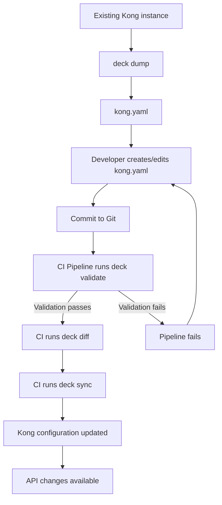

# Kong Deck

## Introduction

**Kong Deck** is a command-line tool that implements the "Infrastructure as Code" paradigm for [Kong API Gateway](https://konghq.com/products/kong-gateway). It allows you to define your entire Kong configuration in declarative YAML files, then synchronize that configuration with your Kong instances. With Kong Deck, you can version-control your API gateway configuration, automate deployments, and maintain consistency across environments.

Think of Kong Deck as "Git for Kong" - it helps you track changes, roll back when needed, and collaborate with team members on gateway configuration in a structured way.

## Why Use Kong Deck?

Managing Kong configurations through manual admin API calls or the Kong Manager UI can become unwieldy as your API ecosystem grows. Kong Deck addresses these challenges by providing:

- **Version Control**: Store your Kong configurations in git alongside your application code
- **CI/CD Integration**: Automate Kong configuration updates as part of your deployment pipeline
- **Consistency**: Ensure identical configurations across development, staging, and production environments
- **Disaster Recovery**: Quickly restore your Kong configuration if something goes wrong
- **Collaboration**: Enable team members to review changes before they're applied

## Installation

You can install Kong Deck on macOS, Linux, or Windows. Here are the most common installation methods:

### Using Homebrew (macOS)

```bash
brew tap kong/deck
brew install deck
```

### Using a Binary Release (Linux/Windows)

Download the appropriate package for your operating system from the [releases page](https://github.com/kong/deck/releases).

For Linux:

```bash
curl -sL https://github.com/kong/deck/releases/latest/download/deck_Linux_x86_64.tar.gz | tar -xz -C /tmp
sudo cp /tmp/deck /usr/local/bin/
```

### Verify Installation

To verify your installation, run:

```bash
deck version
```

You should see output similar to:

```
deck version v1.11.0
```

## Core Concepts

Before diving into Kong Deck, let's understand its core concepts:

1. **State File**: A YAML representation of your Kong configuration
2. **Dump**: The process of exporting configuration from Kong to a state file
3. **Sync**: The process of applying configuration from a state file to Kong
4. **Diff**: Showing differences between configurations
5. **Reset**: Removing all configuration from Kong

## Getting Started

### Exporting Existing Configuration

If you already have a Kong instance configured, you can export its configuration using the `dump` command:

```bash
deck dump --kong-addr http://localhost:8001 -o kong.yaml
```

This creates a `kong.yaml` file containing your current Kong configuration.

Here's what the output might look like for a simple configuration:

```yaml
_format_version: "3.0"
services:
- name: example-service
  url: http://example.com
  routes:
  - name: example-route
    paths:
    - /example
    protocols:
    - http
    - https
  plugins:
  - name: rate-limiting
    config:
      second: 5
      hour: 1000
```

### Creating a Configuration from Scratch

You can also create a Kong configuration file manually. Here's a basic template:

```yaml
_format_version: "3.0"
services:
  - name: my-service
    url: http://my-api.example.com
    routes:
      - name: my-route
        paths:
          - /my-path
        protocols:
          - http
          - https
```

### Applying Configuration

To apply your configuration to Kong:

```bash
deck sync --kong-addr http://localhost:8001 -s kong.yaml
```

Kong Deck will analyze your configuration and make the necessary API calls to configure Kong accordingly.

### Checking for Differences

Before applying changes, you might want to see what changes will be made:

```bash
deck diff --kong-addr http://localhost:8001 -s kong.yaml
```

This will output something like:

```
creating service my-service
creating route my-route
```

## Practical Examples

Let's explore some common use cases for Kong Deck.

### Example 1: Setting Up a New API

Suppose you want to create a new API endpoint with authentication. Create a file named `new-api.yaml`:

```yaml
_format_version: "3.0"
services:
  - name: user-service
    url: http://internal-user-service:8080
    routes:
      - name: user-api
        paths:
          - /users
        strip_path: false
    plugins:
      - name: key-auth
        config:
          key_names:
            - apikey
consumers:
  - username: frontend-app
    keyauth_credentials:
      - key: my-secret-key
```

Apply this configuration:

```bash
deck sync --kong-addr http://localhost:8001 -s new-api.yaml
```

### Example 2: Managing Multiple Environments

For a more complex scenario, you might have different configurations for development, staging, and production.

Create a base configuration:

```yaml
# base.yaml
_format_version: "3.0"
services:
  - name: payment-service
    url: http://payment-service
    routes:
      - name: payment-route
        paths:
          - /payments
```

Create environment-specific overlays:

```yaml
# dev.yaml
_format_version: "3.0"
services:
  - name: payment-service
    plugins:
      - name: rate-limiting
        config:
          second: 20
          hour: 5000
```

```yaml
# prod.yaml
_format_version: "3.0"
services:
  - name: payment-service
    plugins:
      - name: rate-limiting
        config:
          second: 5
          hour: 1000
      - name: prometheus
        config:
          status_code_metrics: true
```

You can use Kong Deck's merge functionality:

```bash
deck sync --kong-addr http://dev-kong:8001 -s base.yaml -s dev.yaml
```

```bash
deck sync --kong-addr http://prod-kong:8001 -s base.yaml -s prod.yaml
```

### Example 3: CI/CD Integration

Here's an example of how to integrate Kong Deck into a GitHub Actions workflow:

```yaml
# .github/workflows/deploy-kong.yml
name: Deploy Kong Configuration

on:
  push:
    branches: [ main ]
    paths:
      - 'kong/**'

jobs:
  deploy:
    runs-on: ubuntu-latest
    
    steps:
    - uses: actions/checkout@v2
    
    - name: Install Kong Deck
      run: |
        curl -sL https://github.com/kong/deck/releases/latest/download/deck_Linux_x86_64.tar.gz | tar -xz
        sudo mv deck /usr/local/bin/
    
    - name: Validate Kong configuration
      run: deck validate -s kong/kong.yaml
    
    - name: Deploy to staging
      if: success()
      run: |
        deck diff --kong-addr ${{ secrets.KONG_STAGING_ADDR }} -s kong/kong.yaml
        deck sync --kong-addr ${{ secrets.KONG_STAGING_ADDR }} -s kong/kong.yaml
    
    - name: Deploy to production
      if: success()
      run: |
        deck sync --kong-addr ${{ secrets.KONG_PROD_ADDR }} -s kong/kong.yaml
```

## Advanced Features

### Workspace Support (Kong Enterprise)

If you're using Kong Enterprise with workspaces, you can target a specific workspace:

```bash
deck sync --kong-addr http://localhost:8001 --workspace finance -s finance-apis.yaml
```

### Selective Sync

You can choose to sync only specific entities:

```bash
deck sync --kong-addr http://localhost:8001 -s kong.yaml --select-tag internal-apis
```

### State File Validation

Before applying changes, validate your state file:

```bash
deck validate -s kong.yaml
```

### Kong Deck and Kong Plugins

Kong Deck supports all standard Kong plugins and can be extended to work with custom plugins. Here's an example configuration with multiple plugins:

```yaml
_format_version: "3.0"
services:
  - name: analytics-service
    url: http://analytics-api:3000
    routes:
      - name: analytics-route
        paths:
          - /analytics
    plugins:
      - name: cors
        config:
          origins:
            - https://example.com
          methods:
            - GET
            - POST
          headers:
            - Authorization
            - Content-Type
          exposed_headers:
            - X-Auth-Token
          credentials: true
          max_age: 3600
      - name: rate-limiting
        config:
          second: 10
          hour: 1000
      - name: proxy-cache
        config:
          content_type:
            - application/json
          cache_ttl: 300
          strategy: memory
```

## Kong Deck Workflow Diagram

Here's a visualization of a typical Kong Deck workflow:



## Best Practices

1. **Version Control**: Always store your Kong configuration files in a version control system like Git.

2. **Modular Configuration**: Split large configurations into multiple files for better organization.

3. **Environment Variables**: Use environment variables for sensitive information:

   ```yaml
   services:
     - name: auth-service
       url: ${AUTH_SERVICE_URL}
   ```

4. **Tagging**: Use tags to organize and selectively sync your Kong entities:

   ```yaml
   services:
     - name: user-service
       tags:
         - internal-api
         - user-management
   ```

5. **Regular Backups**: Regularly run `deck dump` to back up your Kong configuration.

6. **Review Changes**: Always use `deck diff` before `deck sync` to review changes.

7. **Integration Testing**: Set up tests to verify your APIs work correctly after configuration changes.

## Troubleshooting

### Common Issues and Solutions

1. **Authentication Errors**:

   If you're getting authentication errors, ensure you're specifying the correct admin API address and credentials:

   ```bash
   deck sync --kong-addr http://localhost:8001 --headers "apikey:my-admin-key" -s kong.yaml
   ```

2. **Conflicts**:

   If you encounter conflicts during sync, you can use the `--force` flag (use with caution):

   ```bash
   deck sync --kong-addr http://localhost:8001 -s kong.yaml --force
   ```

3. **Invalid Configuration**:

   If validation fails, check your YAML syntax and ensure your configuration follows Kong's schema:

   ```bash
   deck validate -s kong.yaml
   ```

4. **Workspace Issues**:

   For Kong Enterprise, make sure to specify the correct workspace:

   ```bash
   deck sync --kong-addr http://localhost:8001 --workspace default -s kong.yaml
   ```

## Summary

Kong Deck is a powerful tool that brings infrastructure-as-code principles to Kong API Gateway management. By using Kong Deck, you can:

- Version control your Kong configuration
- Automate deployments through CI/CD pipelines
- Maintain consistency across environments
- Collaborate effectively with team members
- Recover quickly from configuration issues

The declarative approach to API gateway management offered by Kong Deck aligns with modern DevOps practices and can significantly streamline your API operations.

## Additional Resources

- [Kong Deck GitHub Repository](https://github.com/kong/deck)
- [Kong Deck Documentation](https://docs.konghq.com/deck/)
- [Kong Gateway Documentation](https://docs.konghq.com/gateway/)

## Exercises

1. **Basic Setup**: Install Kong and Kong Deck locally, then create a basic configuration with one service and route.

2. **Plugin Configuration**: Extend your configuration to include rate limiting and key authentication plugins.

3. **Multi-environment Setup**: Create separate configuration files for development and production environments.

4. **CI/CD Integration**: Set up a basic CI/CD pipeline that validates and applies Kong configuration changes.

5. **Migration Exercise**: Export configuration from an existing Kong instance, modify it to add a new service, and apply the changes.