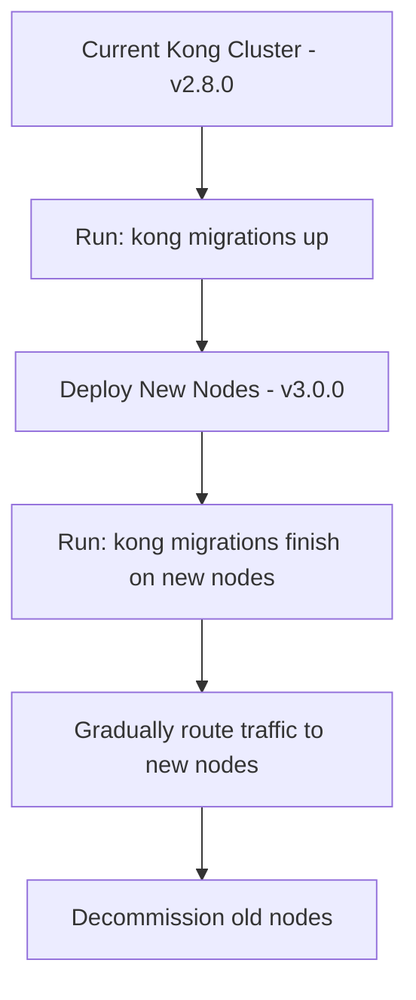

# Kong Migrations

## Introduction

Kong Gateway, like many database-backed applications, evolves over time. As new versions are released, the underlying database schema often needs to change to support new features or improve performance. Kong Migrations provide a standardized way to manage these database changes, ensuring a smooth transition between different Kong versions without data loss or service disruption.

In this guide, we'll explore how Kong handles database migrations, when and how to run them, and best practices to ensure your Kong deployment remains stable during upgrades.

## Understanding Kong Migrations

### What are Migrations?

Migrations are sets of instructions that modify your database schema from one version to another. They handle tasks like:

- Creating new tables
- Adding columns to existing tables
- Modifying data types
- Converting existing data to new formats
- Removing deprecated database objects

Kong supports two database backends: PostgreSQL and Cassandra. The migration process is similar for both, with some platform-specific differences.

### Migration States

When running migrations, Kong tracks the state of your database using the following terminology:

| State | Description |
|-------|-------------|
| `up-to-date` | Database schema matches the current Kong version |
| `pending` | New migrations need to be applied |
| `executed` | Migrations have been run, but aren't yet finalized |
| `missing` | Some migrations appear to be missing (indicates an error) |

## Migration Workflows

Kong provides two approaches to database migrations:

### 1. Standard Migration (Default)

The standard workflow runs migrations in a single step, completing all changes at once:

```bash
kong migrations up
kong migrations finish
```

### 2. Iterative Migration (For Zero-Downtime)

For production environments where downtime must be minimized, Kong supports an iterative approach:

```bash
# On old nodes (current version)
kong migrations up

# On new nodes (upgraded version)
kong migrations finish
```

This allows for a gradual rollout where old and new Kong nodes can coexist during the migration process.

## Migration Commands

Kong provides several CLI commands to manage migrations:

| Command | Description |
|---------|-------------|
| `kong migrations list` | Check current migration status |
| `kong migrations up` | Run new migrations |
| `kong migrations finish` | Finalize pending migrations |
| `kong migrations reset` | Drop all data and re-run migrations (⚠️ Destructive) |

Let's look at each command in more detail:

### Checking Migration Status

To see the current state of your database migrations:

```bash
kong migrations list
```

Example output:
```
Migrations available for running:
  - plus (pending)
  - hmac-auth (pending)
  - rate-limiting (pending)

Run migrations with: kong migrations up
```

### Running Migrations

To apply pending migrations:

```bash
kong migrations up
```

Example output:
```
migrating plus up
migrating hmac-auth up
migrating rate-limiting up

3 migrations processed
3 executed
```

### Finalizing Migrations

After running migrations, especially in a multi-node environment, you need to finalize them:

```bash
kong migrations finish
```

Example output:
```
3 migrations finalized
```

## Practical Migration Scenarios

Let's explore some common migration scenarios you might encounter:

### Scenario 1: Simple Kong Version Upgrade

When upgrading Kong to a newer version (e.g., from 2.8.0 to 3.0.0):

```bash
# Stop Kong
kong stop

# Install new Kong version
# (package manager commands vary by OS)

# Run migrations
kong migrations up
kong migrations finish

# Start Kong
kong start
```

### Scenario 2: Zero-Downtime Production Upgrade

For high-availability environments:



Implementation steps:

1. On your existing Kong nodes:
   ```bash
   kong migrations up
   ```

2. Deploy new nodes with the updated Kong version, but don't route traffic to them yet.

3. On the new nodes:
   ```bash
   kong migrations finish
   ```

4. Start the new Kong nodes:
   ```bash
   kong start
   ```

5. Gradually shift traffic from old nodes to new nodes using your load balancer.

6. Once all traffic is on the new nodes, decommission the old nodes.

### Scenario 3: Emergency Rollback

If problems occur after migration:

```bash
# Restore database from backup
# (PostgreSQL example)
pg_restore -d kong kong_backup.dump

# Start previous Kong version
kong start
```

## Best Practices

To ensure smooth migrations, follow these best practices:

1. **Always backup your database** before migrations
   ```bash
   # PostgreSQL example
   pg_dump -d kong > kong_before_migration.sql
   ```

2. **Test migrations in a staging environment** first

3. **Review release notes** for breaking changes before upgrading

4. **Plan for downtime** or use the iterative migration approach

5. **Monitor your Kong nodes** closely after migration

6. **Keep your Kong version current** to avoid having to skip multiple versions

## Troubleshooting Common Migration Issues

### Problem: Migration Failed - Database Error

```
Error: POSTGRESQL error: relation "routes" already exists
```

**Solution**: The database may be in an inconsistent state. Restore from backup and try again, or contact Kong support.

### Problem: Missing Migrations

```
Error: Missing migrations: acl, basic-auth
```

**Solution**: Ensure you're not skipping Kong versions. Migrations must be run sequentially.

### Problem: Schema Bootstrap Issues

```
Error: POSTGRESQL error: could not connect to database
```

**Solution**: Verify database connectivity and permissions:

```bash
# Check PostgreSQL connection
psql -U kong -d kong -h localhost
```

## Summary

Kong Migrations provide a robust mechanism for managing database schema changes during Kong upgrades. By understanding the migration commands and following best practices, you can maintain a stable Kong environment while adopting new features and improvements.

Remember these key points:

- Always backup your database before migrations
- Use `kong migrations list` to check status
- For production, consider the iterative `up` then `finish` approach
- Test migrations in staging before production
- Monitor your Kong instance after migrations

## Additional Resources

- [Kong Upgrade Path](https://docs.konghq.com/gateway/latest/install/upgrade-path/)
- [Kong Changelog](https://github.com/Kong/kong/blob/master/CHANGELOG.md)
- [Kong Database Configuration](https://docs.konghq.com/gateway/latest/install/configuration/)

## Exercises

1. Set up a test Kong environment with PostgreSQL and practice running migrations between two Kong versions.
2. Write a shell script that automates the database backup and migration process.
3. Create a migration strategy document for your organization that outlines the steps for both regular and emergency scenarios.