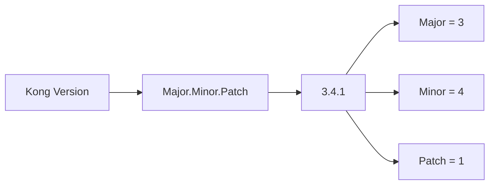

# Kong Upgrades

## Introduction

Upgrading Kong Gateway is a critical maintenance task that ensures your API management infrastructure remains secure, performant, and equipped with the latest features. This guide explains the upgrade process for Kong Gateway, covering preparation steps, upgrade strategies, common challenges, and best practices to ensure smooth transitions between versions.

Kong Gateway follows semantic versioning (SemVer), which makes understanding the scope and impact of upgrades more predictable. Whether you're moving between patch versions, minor releases, or major versions, this guide will help you navigate the process with confidence.

## Understanding Kong Version Numbers

Kong follows semantic versioning in the format `X.Y.Z`:

- **X**: Major version (potentially breaking changes)
- **Y**: Minor version (backward-compatible feature additions)
- **Z**: Patch version (backward-compatible bug fixes)



Understanding this versioning scheme is crucial as it indicates the level of changes between versions and helps you plan your upgrade strategy appropriately.

## Pre-Upgrade Checklist

Before upgrading your Kong installation, complete these essential preparation steps:

1. **Read the Release Notes**: Always review the changelog for your target version to understand new features, bug fixes, and potential breaking changes.

2. **Check Dependencies**: Verify that your database version, operating system, and other dependencies meet the requirements of the target Kong version.

3. **Backup Your Data**: Create a backup of your Kong configuration database.

   ```bash
   # For PostgreSQL
   pg_dump -U kong kong > kong_backup.sql
   
   # For Cassandra
   nodetool snapshot kong
   ```

4. **Review Custom Plugins**: If you've developed custom plugins, review their compatibility with the new version.

5. **Plan Maintenance Window**: Schedule downtime if necessary, especially for major version upgrades.

6. **Set Up Testing Environment**: Create a staging environment that mirrors your production setup to test the upgrade.

## Upgrade Strategies

### Method 1: In-place Upgrade

The simplest approach for minor or patch upgrades:

```bash
# Stop Kong
sudo kong stop

# Install the new version
# For Debian/Ubuntu
sudo apt-get update
sudo apt-get install -y kong=2.8.1

# For RHEL/CentOS
sudo yum update -y kong-2.8.1

# Run migrations
kong migrations up

# Restart Kong
sudo kong start
```

### Method 2: Blue-Green Deployment

For zero-downtime upgrades, especially in production environments:

1. Set up a new Kong environment with the target version
2. Run migrations in "up" mode
3. Gradually redirect traffic from the old installation to the new one
4. Monitor for issues
5. Once fully migrated, decommission the old environment

```bash
# On new environment
kong migrations up
kong migrations finish
```

### Method 3: Canary Upgrades

For cautious production upgrades:

1. Deploy the new Kong version to a small subset of nodes
2. Direct a small percentage of traffic to these nodes
3. Monitor for issues
4. Gradually increase traffic to the upgraded nodes
5. Complete the upgrade across all nodes

## Database Migrations

Kong's database migrations are an essential part of the upgrade process:

```bash
# Check current migrations status
kong migrations list

# Run pending migrations
kong migrations up

# After successfully testing the new version
kong migrations finish
```

If you encounter issues, you can roll back to a previous version:

```bash
# For minor version rollbacks (if supported)
kong migrations down
```

:::caution
Major version upgrades (e.g., from 2.x to 3.x) may not support direct downgrade paths. Always verify the rollback strategy before proceeding.
:::

## Handling Configuration Changes

Kong configuration can change between versions. Here's how to adapt:

1. **Export current configuration**:
   ```bash
   kong config db_export > kong.yaml
   ```

2. **Review differences** in the new version's documentation

3. **Update configuration**:
   ```bash
   # Validate configuration
   kong config parse kong.yaml
   
   # Apply configuration to the new instance
   kong config db_import kong.yaml
   ```

## Plugin Compatibility

Plugins may behave differently between versions. Here's how to ensure compatibility:

1. **Check plugin versions** against your Kong target version
2. **Review plugin-specific release notes**
3. **Test extensively** in your staging environment

For custom plugins, ensure they're compatible with the new Kong version:

```lua
-- Example plugin compatibility check
local plugin = {
  PRIORITY = 1000,
  VERSION = "1.0.0",
  KONG_VERSION_COMPATIBILITY = {
    minimum = "2.8.0",
    maximum = "3.x"
  }
}
```

## Real-World Upgrade Example

Let's walk through a real-world example of upgrading Kong from version 2.8.0 to 3.0.0 in a production environment:

### Scenario
A company uses Kong Gateway to manage APIs for their e-commerce platform. They need to upgrade from Kong 2.8.0 to 3.0.0 to utilize new features and security improvements.

### Step 1: Preparation

```bash
# Create a staging environment mirroring production
# (DB schema, plugins, routes, services, consumers)

# Backup production database
pg_dump -U kong kong > kong_prod_backup.sql

# Load backup into staging
psql -U kong kong_staging < kong_prod_backup.sql
```

### Step 2: Testing in Staging

```bash
# Stop staging Kong
kong stop

# Install new version in staging
sudo apt-get update
sudo apt-get install -y kong=3.0.0

# Run migrations
kong migrations up
kong migrations finish

# Start Kong
kong start

# Run functional tests against staging
curl -i http://localhost:8001/status
```

### Step 3: Production Upgrade (Blue-Green Approach)

1. Deploy new Kong 3.0.0 cluster alongside existing 2.8.0 cluster
2. Run migrations against production database:
   ```bash
   kong migrations up
   kong migrations finish
   ```
3. Configure load balancer to send 10% of traffic to new cluster
4. Monitor metrics and logs for issues
5. Gradually increase traffic to new cluster
6. When 100% of traffic is on the new cluster, decommission old cluster

## Troubleshooting Common Upgrade Issues

### Migration Failures

If migrations fail:

```bash
# Check migration errors
kong migrations list

# If needed, restore from backup
psql -U kong kong < kong_backup.sql
```

### Plugin Errors

If plugins fail after upgrading:

1. Check Kong error logs:
   ```bash
   tail -f /usr/local/kong/logs/error.log
   ```
2. Disable problematic plugins temporarily:
   ```bash
   curl -X PATCH http://localhost:8001/plugins/{plugin-id} \
       --data "enabled=false"
   ```
3. Update plugin configuration based on new requirements

### Performance Issues

If you encounter performance degradation:

1. Check Kong metrics:
   ```bash
   curl http://localhost:8001/status
   ```
2. Review resource usage and adjust as needed
3. Ensure database is properly sized for the new version

## Best Practices

1. **Maintain Version Control**: Keep Kong configuration in version control
2. **Automate Testing**: Create automated tests for Kong configurations and custom plugins
3. **Document Procedures**: Maintain detailed upgrade procedures for your specific environment
4. **Monitoring**: Set up alerts and monitoring for Kong to detect issues quickly
5. **Regular Upgrades**: Upgrade regularly to avoid having to make big jumps between versions

## Summary

Kong upgrades are a necessary maintenance task that keeps your API gateway secure and up-to-date. By following proper preparation steps, choosing an appropriate upgrade strategy, and testing thoroughly, you can minimize risks and ensure smooth transitions between versions.

Remember these key points:
- Always back up your database before upgrading
- Test upgrades in a staging environment first
- Consider blue-green deployments for zero-downtime upgrades
- Keep an eye on plugin compatibility
- Follow Kong's official documentation for specific version upgrade notes

## Additional Resources

- [Kong's Official Upgrade Documentation](https://docs.konghq.com/gateway/latest/install/upgrade/)
- [Kong Forum](https://discuss.konghq.com/) - Community support for upgrade questions
- [Kong Enterprise Support](https://konghq.com/support/) - For paid technical assistance

## Exercises

1. Create a rollback plan for a Kong upgrade in your environment
2. Design a blue-green deployment strategy for your Kong infrastructure
3. Develop a script to automate Kong configuration backups
4. Set up monitoring to validate services are responding correctly after an upgrade
5. Practice an upgrade in a sandbox environment using the guide above