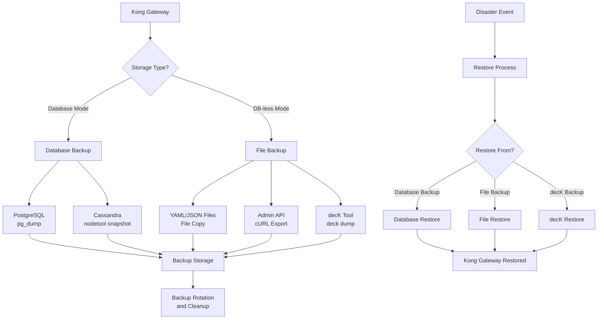

# Kong Backups

## Introduction

Kong Gateway is a popular API gateway that manages API traffic between clients and your services. As your API infrastructure grows, protecting your Kong configuration becomes increasingly important. This guide explains how to implement proper backup strategies for Kong, helping you avoid data loss and minimize downtime in case of system failures.

Backing up Kong configurations is an essential administrative task that safeguards your API gateway setup against unexpected failures, facilitates disaster recovery, and enables smooth migrations between environments.

## Why You Need Kong Backups

Before diving into the backup process, let's understand why backing up Kong is crucial:

1. **Disaster Recovery**: Quickly restore services after hardware failures or other catastrophes
2. **Configuration Management**: Track changes and roll back to previous versions if needed
3. **Migration Support**: Easily move configurations between different environments
4. **Compliance Requirements**: Meet organizational data protection policies

## Understanding Kong's Data Storage

To effectively back up Kong, you need to understand how and where it stores configuration data. Kong primarily uses two storage mechanisms:

1. **Database Mode**: Kong stores its configuration in a database (PostgreSQL, Cassandra)
2. **DB-less Mode**: Kong stores configurations in YAML or JSON files (declarative configuration)

Let's explore backup strategies for both approaches.

## Backing Up Database-Mode Kong

When Kong uses a database (PostgreSQL or Cassandra), you need to back up the database itself.

### PostgreSQL Backups

If you're using PostgreSQL with Kong, here's how to create a backup:

```bash
# Basic PostgreSQL backup using pg_dump
pg_dump -U kong -d kong > kong_backup_$(date +%Y%m%d).sql

# Creating a compressed backup
pg_dump -U kong -d kong | gzip > kong_backup_$(date +%Y%m%d).sql.gz
```

The output will be a SQL file containing all your Kong configuration, including:
- Services
- Routes
- Plugins
- Consumers
- Custom entities

### Restoring from PostgreSQL Backup

To restore Kong from a PostgreSQL backup:

```bash
# Basic restore
psql -U kong -d kong < kong_backup_20230615.sql

# If using a compressed backup
gunzip -c kong_backup_20230615.sql.gz | psql -U kong -d kong
```

### Cassandra Backups

If Kong uses Cassandra, you can use the `nodetool snapshot` command:

```bash
# Create a snapshot of the Kong keyspace
nodetool snapshot kong

# The snapshot will be stored in the Cassandra data directory
# Typically: /var/lib/cassandra/data/kong/*/snapshots/[snapshot-name]
```

### Automating Database Backups

Here's a simple script to automate daily Kong PostgreSQL backups:

```bash
#!/bin/bash
# kong_backup.sh

BACKUP_DIR="/var/backups/kong"
TIMESTAMP=$(date +%Y%m%d_%H%M%S)
BACKUP_FILE="$BACKUP_DIR/kong_backup_$TIMESTAMP.sql.gz"

# Ensure backup directory exists
mkdir -p $BACKUP_DIR

# Create compressed backup
echo "Creating Kong database backup: $BACKUP_FILE"
pg_dump -U kong -d kong | gzip > $BACKUP_FILE

# Delete backups older than 30 days
find $BACKUP_DIR -name "kong_backup_*.sql.gz" -mtime +30 -delete

echo "Backup completed successfully."
```

Make this script executable and add it to your crontab:

```bash
# Make script executable
chmod +x kong_backup.sh

# Add to crontab to run daily at 2 AM
crontab -e
# Add this line:
0 2 * * * /path/to/kong_backup.sh
```

## Backing Up DB-less Mode Kong

If you're running Kong in DB-less mode, your configuration is stored in declarative format (YAML or JSON files). Backing up is simpler in this case.

### Backing Up Declarative Configuration Files

```bash
# Simple file backup with timestamp
cp kong.yml kong_backup_$(date +%Y%m%d).yml

# Create compressed archive of configuration files
tar -czf kong_config_backup_$(date +%Y%m%d).tar.gz kong.yml
```

### Exporting Current Configuration

You can also export the current configuration from a running Kong instance:

```bash
# Using Kong's Admin API
curl -X GET http://localhost:8001/config | jq > kong_config_backup_$(date +%Y%m%d).json

# Alternative approach using the deck CLI tool
deck dump --kong-addr http://localhost:8001 --output-file kong_backup_$(date +%Y%m%d).yaml
```

## Using decK for Kong Backups

[decK](https://github.com/Kong/deck) is an official tool from Kong Inc. that helps manage Kong configurations. It's particularly useful for backup and restoration.

### Installing decK

```bash
# For macOS
brew install kong/tap/deck

# For Linux (using a pre-built binary)
curl -sL https://github.com/Kong/deck/releases/download/v1.16.0/deck_1.16.0_linux_amd64.tar.gz | tar -xz -C /tmp
sudo cp /tmp/deck /usr/local/bin/
```

### Backing Up with decK

```bash
# Export all Kong configuration
deck dump --kong-addr http://localhost:8001 --output-file kong_backup.yaml

# Export only specific workspaces
deck dump --kong-addr http://localhost:8001 --workspace production --output-file prod_backup.yaml
```

### Restoring with decK

```bash
# Restore Kong configuration
deck sync --kong-addr http://localhost:8001 --state kong_backup.yaml

# Perform a dry-run to see what changes would be made without applying them
deck diff --kong-addr http://localhost:8001 --state kong_backup.yaml
```

## Backup Strategy Best Practices

To ensure effective Kong backups, follow these best practices:

1. **Regular Scheduling**: Set up automatic backups on a regular schedule.
2. **Versioning**: Maintain multiple backup versions to enable point-in-time recovery.
3. **Off-site Storage**: Store backups in a different location than your production systems.
4. **Encryption**: Protect sensitive backup data with encryption.
5. **Testing**: Regularly test your backup and restore procedures to ensure they work.
6. **Documentation**: Document your backup and recovery procedures clearly.

## Visual Backup Workflow

Here's a diagram showing the Kong backup workflow:



## Implementing Regular Backups

Let's create a more comprehensive backup script that handles both database-backed and DB-less Kong:

```bash
#!/bin/bash
# comprehensive_kong_backup.sh

# Configuration
KONG_ADMIN_URL="http://localhost:8001"
BACKUP_DIR="/var/backups/kong"
RETENTION_DAYS=30
TIMESTAMP=$(date +%Y%m%d_%H%M%S)
DB_TYPE="postgres"  # Options: postgres, cassandra, dbless

# Create backup directory
mkdir -p $BACKUP_DIR

# Function to log messages
log() {
    echo "[$(date +'%Y-%m-%d %H:%M:%S')] $1"
}

# Backup based on database type
case $DB_TYPE in
    postgres)
        BACKUP_FILE="$BACKUP_DIR/kong_pg_backup_$TIMESTAMP.sql.gz"
        log "Creating PostgreSQL backup: $BACKUP_FILE"
        pg_dump -U kong -d kong | gzip > $BACKUP_FILE
        if [ $? -eq 0 ]; then
            log "PostgreSQL backup completed successfully."
        else
            log "ERROR: PostgreSQL backup failed!"
            exit 1
        fi
        ;;
        
    cassandra)
        log "Creating Cassandra snapshot for Kong keyspace"
        nodetool snapshot kong
        if [ $? -eq 0 ]; then
            log "Cassandra snapshot created successfully."
        else
            log "ERROR: Cassandra snapshot failed!"
            exit 1
        fi
        ;;
        
    dbless)
        BACKUP_FILE="$BACKUP_DIR/kong_config_$TIMESTAMP.json"
        log "Exporting Kong configuration via Admin API to: $BACKUP_FILE"
        curl -s -X GET $KONG_ADMIN_URL/config > $BACKUP_FILE
        if [ $? -eq 0 ] && [ -s "$BACKUP_FILE" ]; then
            log "Kong configuration export completed successfully."
        else
            log "ERROR: Kong configuration export failed!"
            exit 1
        fi
        
        # Also backup with decK if available
        if command -v deck &> /dev/null; then
            DECK_BACKUP="$BACKUP_DIR/kong_deck_$TIMESTAMP.yaml"
            log "Creating backup using decK: $DECK_BACKUP"
            deck dump --kong-addr $KONG_ADMIN_URL --output-file $DECK_BACKUP
            if [ $? -eq 0 ]; then
                log "decK backup completed successfully."
            else
                log "ERROR: decK backup failed!"
            fi
        fi
        ;;
        
    *)
        log "ERROR: Unknown database type: $DB_TYPE"
        exit 1
        ;;
esac

# Clean up old backups
log "Cleaning up backups older than $RETENTION_DAYS days"
find $BACKUP_DIR -name "kong_*" -mtime +$RETENTION_DAYS -delete

log "Backup process completed."
```

## Testing Backup Restoration

It's essential to regularly test your backup restoration process. Here's how:

1. Spin up a test Kong environment
2. Restore a recent backup to this test environment
3. Verify that all services, routes, and plugins work as expected
4. Document any issues encountered and improve your backup/restore procedures

## Kong Backup and Restore Cheat Sheet

Here's a quick reference for common Kong backup and restore commands:

| Operation | Database Mode | DB-less Mode |
|-----------|---------------|--------------|
| Backup | `pg_dump -U kong -d kong > backup.sql` | `curl -X GET http://localhost:8001/config > backup.json` |
| Compressed Backup | `pg_dump -U kong -d kong \| gzip > backup.sql.gz` | `curl -X GET http://localhost:8001/config \| gzip > backup.json.gz` |
| Restore | `psql -U kong -d kong < backup.sql` | `curl -X POST http://localhost:8001/config --data @backup.json` |
| Restore Compressed | `gunzip -c backup.sql.gz \| psql -U kong -d kong` | `gunzip -c backup.json.gz \| curl -X POST http://localhost:8001/config --data @-` |
| Backup with decK | `deck dump --kong-addr http://localhost:8001 --output-file backup.yaml` | Same |
| Restore with decK | `deck sync --kong-addr http://localhost:8001 --state backup.yaml` | Same |

## Integrating Backups with Your CI/CD Pipeline

For advanced Kong administration, integrate backups into your CI/CD pipeline:

1. Create backups before deploying new configurations
2. Version-control your Kong configurations using tools like Git
3. Use decK to manage Kong configurations as code
4. Automate testing of restored backups in staging environments

## Summary

Implementing a robust backup strategy for your Kong Gateway is essential for maintaining reliable API services. In this guide, we've covered:

- The importance of Kong backups
- How to back up database-backed Kong (PostgreSQL, Cassandra)
- How to back up DB-less Kong configurations
- Using decK for simplified Kong configuration management
- Best practices for backup strategies
- Testing restoration procedures

By following these practices, you can ensure your Kong Gateway remains resilient against failures and minimize downtime during recovery operations.

## Additional Resources

- [Kong Documentation on Database Export and Import](https://docs.konghq.com/gateway/latest/admin-api/#database-export)
- [decK GitHub Repository](https://github.com/Kong/deck)
- [PostgreSQL Backup and Restore Documentation](https://www.postgresql.org/docs/current/backup.html)
- [Kong Admin API Reference](https://docs.konghq.com/gateway/latest/admin-api/)

## Exercises

1. Set up a daily automated backup for your Kong database using the provided script.
2. Create a test environment and practice restoring your Kong configuration from a backup.
3. Compare the database backup approach with the decK approach for your specific use case.
4. Implement a version control strategy for your Kong configurations using Git.
5. Design a disaster recovery plan for your Kong Gateway that includes backup restoration steps.