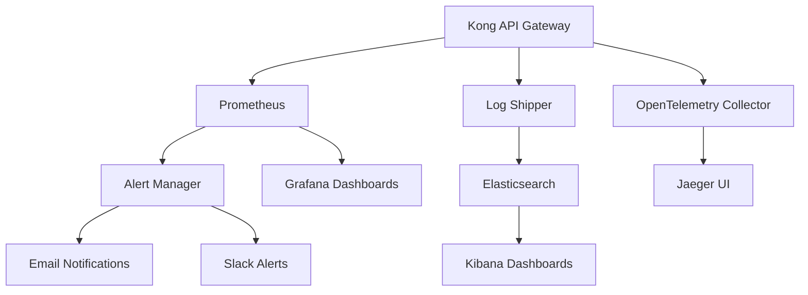

# Kong Monitoring

## Introduction

Monitoring is a critical aspect of maintaining a healthy Kong API Gateway deployment. As Kong handles your API traffic, having visibility into its performance, health, and usage patterns allows you to:

- Detect and troubleshoot issues before they impact users
- Optimize resource allocation based on traffic patterns
- Make data-driven decisions for scaling and maintenance
- Ensure service level agreements (SLAs) are being met

In this guide, we'll explore the various monitoring capabilities available in Kong, how to set them up, and best practices for implementing a comprehensive monitoring strategy.

## Kong Monitoring Fundamentals

Kong provides several ways to monitor its performance and health:

1. **Status API** - Basic health and configuration information
2. **Metrics** - Detailed performance and usage statistics
3. **Logs** - Detailed records of requests, responses, and internal events
4. **Tracing** - Request path tracking through your services

Let's look at each of these in detail.

## Status API

The Kong Status API provides basic information about your Kong instance's health and configuration. It's the simplest form of monitoring available out of the box.

### Accessing the Status API

You can access the Status API at the `/status` endpoint of your Kong Admin API:

```bash
curl -i http://localhost:8001/status
```

The output will look something like this:

```json
HTTP/1.1 200 OK
Access-Control-Allow-Origin: *
Connection: keep-alive
Content-Type: application/json; charset=utf-8
Date: Mon, 09 Mar 2025 12:00:00 GMT
Server: kong/3.5.0
Content-Length: 725

{
  "database": {
    "reachable": true
  },
  "memory": {
    "workers_lua_vms": [
      {
        "http_allocated_gc": "2.30 MiB",
        "pid": 1234
      }
    ],
    "lua_shared_dicts": {
      "kong": {
        "allocated_slabs": "0.04 MiB",
        "capacity": "5.00 MiB"
      },
      "kong_db_cache": {
        "allocated_slabs": "0.80 MiB",
        "capacity": "128.00 MiB"
      }
    }
  },
  "server": {
    "total_requests": 452,
    "connections_active": 2,
    "connections_accepted": 452,
    "connections_handled": 452,
    "connections_reading": 0,
    "connections_writing": 1,
    "connections_waiting": 1
  }
}
```

### What to Monitor in the Status API

Key metrics to watch include:

- `database.reachable`: Indicates if Kong can connect to its database
- `server.connections_active`: Number of active connections
- `server.total_requests`: Total number of requests processed
- `memory.lua_shared_dicts`: Memory usage by Kong's internal caches

## Metrics with Prometheus

For more comprehensive monitoring, Kong can expose metrics in Prometheus format using the Prometheus plugin.

### Setting Up the Prometheus Plugin

First, install the Prometheus plugin:

```bash
kong config -c kong.conf plugins prometheus
```

Enable the plugin globally:

```bash
curl -X POST http://localhost:8001/plugins/ \
  --data "name=prometheus"
```

Or for a specific service:

```bash
curl -X POST http://localhost:8001/services/{service_name}/plugins/ \
  --data "name=prometheus"
```

### Accessing Prometheus Metrics

Once enabled, Kong will expose metrics at the `/metrics` endpoint:

```bash
curl http://localhost:8001/metrics
```

Example output:

```
# HELP kong_datastore_reachable whether the datastore is reachable
# TYPE kong_datastore_reachable gauge
kong_datastore_reachable 1

# HELP kong_nginx_http_current_connections Number of HTTP connections
# TYPE kong_nginx_http_current_connections gauge
kong_nginx_http_current_connections{state="accepted"} 1
kong_nginx_http_current_connections{state="active"} 1
kong_nginx_http_current_connections{state="handled"} 1
kong_nginx_http_current_connections{state="reading"} 0
kong_nginx_http_current_connections{state="waiting"} 0
kong_nginx_http_current_connections{state="writing"} 1

# HELP kong_http_status HTTP status codes
# TYPE kong_http_status counter
kong_http_status{code="200",service="example-service"} 5
kong_http_status{code="404",service="example-service"} 2
```

### Configuring Prometheus to Scrape Kong Metrics

Add the following to your `prometheus.yml` configuration:

```yaml
scrape_configs:
  - job_name: 'kong'
    scrape_interval: 5s
    static_configs:
      - targets: ['kong-admin:8001']
```

### Key Metrics to Monitor

Some of the most important Kong metrics include:

1. **HTTP Status Codes** (`kong_http_status`): Track success and error rates
2. **Latency** (`kong_latency`): Monitor request processing times
3. **Connections** (`kong_nginx_http_current_connections`): Watch connection states
4. **Database Health** (`kong_datastore_reachable`): Ensure database connectivity

## Setting Up a Grafana Dashboard

Grafana provides excellent visualization for Prometheus metrics. Here's how to set up a basic Kong dashboard:

1. Add Prometheus as a data source in Grafana
2. Create a new dashboard with panels for:
   - Request rate by service
   - Error rate by service
   - Latency percentiles
   - Active connections
   - Database health

### Example Dashboard Query

Here's an example Grafana PromQL query to show request rate by service:

```
sum(rate(kong_http_status{service=~"$service"}[1m])) by (service)
```

## Log Monitoring

Kong logs provide detailed information about requests and internal events. By default, Kong logs to the standard output, but you can configure it to log to a file or a logging service.

### Configuring Kong Logs

Edit your `kong.conf` file to set the log level and destination:

```
log_level = info        # [debug, info, notice, warn, error, crit]
proxy_access_log = /var/log/kong/access.log
proxy_error_log = /var/log/kong/error.log
admin_access_log = /var/log/kong/admin_access.log
admin_error_log = /var/log/kong/admin_error.log
```

### Using the HTTP Log Plugin

You can send logs to external services using the HTTP Log plugin:

```bash
curl -X POST http://localhost:8001/services/{service_name}/plugins \
  --data "name=http-log" \
  --data "config.http_endpoint=http://your-log-server.com/logs" \
  --data "config.method=POST" \
  --data "config.timeout=10000" \
  --data "config.keepalive=60000"
```

### Integrating with ELK Stack

For advanced log analysis, you can integrate Kong with the ELK (Elasticsearch, Logstash, Kibana) stack:

1. Configure Kong to log to a file
2. Use Filebeat to ship logs to Logstash
3. Process logs in Logstash and send to Elasticsearch
4. Create Kibana dashboards for visualization

Here's a sample Logstash configuration for Kong logs:

```
input {
  beats {
    port => 5044
  }
}

filter {
  if [fields][type] == "kong-access" {
    json {
      source => "message"
    }
    date {
      match => [ "started_at", "ISO8601" ]
    }
  }
}

output {
  elasticsearch {
    hosts => ["elasticsearch:9200"]
    index => "kong-logs-%{+YYYY.MM.dd}"
  }
}
```

## Distributed Tracing

Distributed tracing allows you to track requests as they flow through your services. Kong supports tracing through the OpenTelemetry and Zipkin plugins.

### Setting Up OpenTelemetry

To enable OpenTelemetry tracing:

```bash
curl -X POST http://localhost:8001/plugins/ \
  --data "name=opentelemetry" \
  --data "config.endpoint=http://otel-collector:4318/v1/traces" \
  --data "config.headers.Content-Type=application/json"
```

### Key Tracing Metrics

When reviewing traces, pay attention to:

1. End-to-end latency
2. Service-to-service communication patterns
3. Error paths and bottlenecks
4. Request volume between services

## Setting Up Health Checks

Kong can actively check the health of your upstream services and route traffic accordingly.

### Configuring Health Checks

Add health checks to an upstream:

```bash
curl -X POST http://localhost:8001/upstreams/my-upstream/targets \
  --data "target=service1:80" \
  --data "weight=100" \
  --data "health_checks.active.healthy.interval=5" \
  --data "health_checks.active.healthy.successes=2" \
  --data "health_checks.active.unhealthy.interval=5" \
  --data "health_checks.active.unhealthy.http_failures=2"
```

### Monitoring Health Check Status

Check the health of your targets:

```bash
curl http://localhost:8001/upstreams/my-upstream/health
```

Example response:

```json
{
  "total": 2,
  "data": [
    {
      "created_at": 1615377600,
      "id": "a1b2c3d4-e5f6-7890-abcd-1234567890ab",
      "health": "HEALTHY",
      "target": "service1:80",
      "weight": 100
    },
    {
      "created_at": 1615377601,
      "id": "b2c3d4e5-f6g7-8901-bcde-2345678901cd",
      "health": "UNHEALTHY",
      "target": "service2:80",
      "weight": 100
    }
  ]
}
```

## Kong Vitals (Enterprise)

Kong Vitals is a feature in Kong Enterprise that provides real-time monitoring and analytics dashboard built into the Kong Manager UI.

### Key Features of Kong Vitals

- Real-time traffic visualization
- Consumer-specific analytics
- Error spotting and troubleshooting
- API usage patterns and trends
- Automatic anomaly detection

## Monitoring Best Practices

### Alert Configuration

Set up alerts for critical conditions:

1. **High Error Rate**: Alert when error rate exceeds 5% over 5 minutes
2. **Latency Spikes**: Alert when p95 latency exceeds threshold
3. **Database Connectivity**: Immediate alert on database unreachable
4. **High Load**: Alert when connections or CPU usage exceeds capacity

### Dashboard Organization

Organize your monitoring dashboards by:

1. **Overview**: High-level health of the entire Kong deployment
2. **Services**: Detailed metrics for each service
3. **Consumers**: Usage patterns by consumer
4. **Infrastructure**: Node-level metrics (CPU, memory, network)

### Sample Monitoring Architecture



## Performance Benchmarking

Regular benchmarking helps you understand your Kong deployment's limits and plan for scaling.

### Using `kong-bench`

The `kong-bench` tool can help benchmark your Kong instance:

```bash
kong-bench -c 100 -r 10000 http://kong-proxy:8000/your-api
```

Track these metrics over time to identify performance trends.

## Troubleshooting Common Issues

### High Latency

If you observe high latency:

1. Check upstream service health
2. Review Kong logs for plugin execution times
3. Monitor Kong node resource usage
4. Check database performance
5. Analyze traffic patterns for spikes

### High Error Rates

For elevated error rates:

1. Review status code distribution
2. Check upstream service health
3. Inspect error logs for specific issues
4. Verify rate limiting configurations
5. Check authentication plugin configurations

## Summary

Effective monitoring is essential for maintaining a reliable Kong API Gateway deployment. By implementing the strategies outlined in this guide, you can:

- Gain visibility into Kong's performance and health
- Quickly identify and resolve issues
- Make data-driven decisions for scaling and optimization
- Ensure your API infrastructure meets your service level objectives

Remember that monitoring should be an ongoing process. Regularly review your monitoring setup to ensure it captures all necessary metrics and provides actionable insights as your API ecosystem evolves.

## Additional Resources

- [Kong Prometheus Plugin Documentation](https://docs.konghq.com/hub/kong-inc/prometheus/)
- [OpenTelemetry Integration Guide](https://docs.konghq.com/hub/kong-inc/opentelemetry/)
- [Kong Health Checks Documentation](https://docs.konghq.com/latest/health-checks-circuit-breakers/)
- [ELK Stack Integration Tutorial](https://konghq.com/blog/observability-with-kong-and-elastic-stack)

## Exercises

1. Set up the Prometheus plugin and create a basic Grafana dashboard showing request rate and error rate.
2. Configure health checks for an upstream service and monitor its status.
3. Implement log forwarding to an ELK stack and create a Kibana dashboard for visualizing error patterns.
4. Use the OpenTelemetry plugin to trace requests through multiple services.
5. Set up alerting for critical conditions like high error rates or latency spikes.