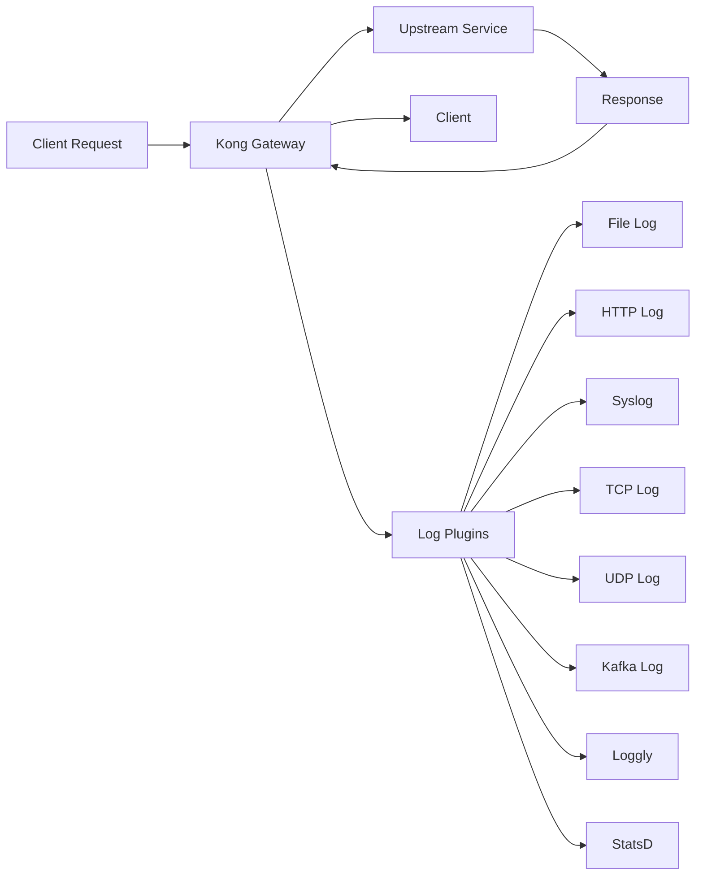

# Kong Logging

## Introduction

Kong API Gateway provides powerful logging capabilities that allow administrators to monitor API traffic, troubleshoot issues, and gain insights into system performance. Logging is an essential aspect of API management, helping you track requests, responses, errors, and various events within your Kong environment.

In this guide, we'll explore how to configure, customize, and manage logs in Kong, making it easier for you to monitor your API infrastructure effectively.

## Why Logging Matters in API Gateways

Before diving into the technical details, let's understand why logging is crucial for your API infrastructure:

- **Troubleshooting**: Quickly identify and resolve issues in your API requests and responses
- **Security**: Monitor for suspicious activities and potential attacks
- **Performance Analysis**: Track response times and identify bottlenecks
- **Usage Patterns**: Understand how your APIs are being used
- **Compliance**: Maintain audit trails for regulatory requirements

## Kong's Logging Architecture

Kong uses a plugin-based architecture for logging, offering flexibility in how and where logs are stored. By default, Kong writes logs to the following files:

- **Error Logs**: System-level errors and Kong process information
- **Access Logs**: Detailed information about each request processed by Kong



## Basic Log Configuration

### Configuring Kong's Error Log

You can configure the error log level in your `kong.conf` file. The log levels, from least to most verbose, are:

- `error`
- `warn`
- `info`
- `debug`

To set the error log level, modify your `kong.conf`:

```
log_level = info
```

For production environments, `error` or `warn` levels are recommended, while development environments may benefit from `debug` level for detailed information.

### Viewing Kong Logs

Depending on your installation method, Kong logs can be found in different locations:

**For Linux installations**:
```bash
# Error logs
sudo tail -f /usr/local/kong/logs/error.log

# Access logs (if enabled)
sudo tail -f /usr/local/kong/logs/access.log
```

**For Docker installations**:
```bash
# View logs from Kong container
docker logs -f kong-container-name
```

## Logging Plugins

Kong provides several logging plugins that send request and response data to different destinations:

### File Log Plugin

The File Log plugin writes request and response data to a local file.

To enable the File Log plugin globally:

```bash
curl -X POST http://localhost:8001/plugins/ \
  --data "name=file-log" \
  --data "config.path=/usr/local/kong/logs/requests.log"
```

To enable it for a specific service:

```bash
curl -X POST http://localhost:8001/services/my-service/plugins/ \
  --data "name=file-log" \
  --data "config.path=/usr/local/kong/logs/my-service-requests.log"
```

### HTTP Log Plugin

The HTTP Log plugin sends log data to an HTTP server.

```bash
curl -X POST http://localhost:8001/plugins/ \
  --data "name=http-log" \
  --data "config.http_endpoint=http://log-server.com/kong-logs" \
  --data "config.method=POST" \
  --data "config.timeout=10000" \
  --data "config.keepalive=60000"
```

### Syslog Plugin

The Syslog plugin sends logs to a syslog server:

```bash
curl -X POST http://localhost:8001/plugins/ \
  --data "name=syslog" \
  --data "config.server=syslog-server.com" \
  --data "config.port=514" \
  --data "config.facility=user"
```

## Customizing Log Format

Kong allows you to customize the format of your logs. For HTTP Log, File Log, and other plugins, you can specify a custom format using the `config.custom_fields_by_lua` parameter:

```bash
curl -X POST http://localhost:8001/plugins/ \
  --data "name=file-log" \
  --data "config.path=/usr/local/kong/logs/custom.log" \
  --data 'config.custom_fields_by_lua.my_new_field=return "this is a custom value"' \
  --data 'config.custom_fields_by_lua.request_path=return kong.request.get_path()'
```

This adds two custom fields to your logs:
- `my_new_field`: Contains the static text "this is a custom value"
- `request_path`: Contains the request path extracted using Kong's Lua API

## Log Rotation

For production environments, it's essential to implement log rotation to prevent logs from consuming too much disk space. Kong doesn't handle log rotation internally, so you'll need to use external tools.

### Using logrotate on Linux

Create a logrotate configuration file for Kong:

```bash
sudo nano /etc/logrotate.d/kong
```

Add the following configuration:

```
/usr/local/kong/logs/*.log {
    daily
    rotate 10
    missingok
    notifempty
    compress
    delaycompress
    create 0640 kong kong
    sharedscripts
    postrotate
        [ -f /usr/local/kong/pids/nginx.pid ] && kill -USR1 $(cat /usr/local/kong/pids/nginx.pid)
    endscript
}
```

This configuration:
- Rotates logs daily
- Keeps 10 days of logs
- Compresses old logs to save space
- Signals Kong to reopen log files after rotation

## Advanced Logging Setups

### Integration with ELK Stack

For enterprise environments, you might want to integrate Kong with the ELK (Elasticsearch, Logstash, Kibana) stack:

1. Configure the HTTP Log plugin to send logs to Logstash:

```bash
curl -X POST http://localhost:8001/plugins/ \
  --data "name=http-log" \
  --data "config.http_endpoint=http://logstash:8080" \
  --data "config.method=POST" \
  --data "config.timeout=10000" \
  --data "config.keepalive=60000"
```

2. Configure Logstash to parse Kong logs and send them to Elasticsearch
3. Use Kibana to create dashboards for visualization

### Logging to Prometheus for Metrics

For metrics-focused logging, you can use the Prometheus plugin:

```bash
curl -X POST http://localhost:8001/plugins/ \
  --data "name=prometheus"
```

This exposes metrics at the `/metrics` endpoint, which Prometheus can scrape.

## Best Practices for Kong Logging

Here are some best practices to follow when configuring logging in Kong:

1. **Use appropriate log levels**: Use `error` or `warn` in production to avoid excessive logs
2. **Implement log rotation**: Prevent logs from filling up your disk space
3. **Centralize logs**: In multi-node Kong clusters, centralize logs for easier analysis
4. **Structure your logs**: Use JSON formatting for easier parsing and analysis
5. **Add request IDs**: Configure Kong to add unique request IDs for tracing requests across services
6. **Monitor log file sizes**: Set up alerts for unexpected log growth
7. **Regular log analysis**: Review logs periodically to identify trends and issues

## Troubleshooting Common Logging Issues

### Problem: Missing Logs

**Possible causes**:
- Incorrect file permissions
- Disk space issues
- Log level set too high

**Solution**:
```bash
# Check file permissions
sudo ls -la /usr/local/kong/logs/

# Check disk space
df -h

# Check log level in kong.conf
grep log_level /etc/kong/kong.conf
```

### Problem: High Disk Usage from Logs

**Solution**:
- Implement log rotation
- Adjust log level to be less verbose
- Consider using a centralized logging system

## Real-World Example: Complete Logging Setup

Here's a comprehensive example of setting up logging for a production Kong environment:

1. Configure basic logging in `kong.conf`:

```
log_level = warn
```

2. Set up the HTTP Log plugin to send logs to an external logging service:

```bash
curl -X POST http://localhost:8001/plugins/ \
  --data "name=http-log" \
  --data "config.http_endpoint=https://logging-service.example.com/ingest" \
  --data "config.method=POST" \
  --data "config.timeout=10000" \
  --data "config.keepalive=60000" \
  --data "config.headers.apikey=your-logging-service-api-key" \
  --data "config.headers.content-type=application/json"
```

3. Configure custom fields to capture additional information:

```bash
curl -X PATCH http://localhost:8001/plugins/http-log-plugin-id \
  --data 'config.custom_fields_by_lua.request_id=return kong.request.get_header("x-request-id") or uuid()' \
  --data 'config.custom_fields_by_lua.consumer_id=return kong.client.get_consumer() and kong.client.get_consumer().id or "anonymous"' \
  --data 'config.custom_fields_by_lua.service_name=return kong.router.get_service() and kong.router.get_service().name or "unknown"'
```

4. Set up the File Log plugin as a backup:

```bash
curl -X POST http://localhost:8001/plugins/ \
  --data "name=file-log" \
  --data "config.path=/usr/local/kong/logs/api-requests.log" \
  --data "config.reopen=true"
```

5. Configure log rotation using logrotate as shown in the previous section

## Summary

Kong's logging capabilities provide essential visibility into your API gateway's operations. By properly configuring logging, you can monitor performance, troubleshoot issues, and gain valuable insights into API usage patterns.

Key takeaways from this guide:

- Kong supports multiple logging plugins for different destinations
- You can customize log formats to capture the information you need
- Implementing log rotation is crucial for production environments
- Centralized logging solutions like ELK stack can enhance log analysis
- Best practices include appropriate log levels and regular log analysis

## Additional Resources

- [Kong's Official Documentation on Logging Plugins](https://docs.konghq.com/hub/kong-inc/file-log/)
- [ELK Stack Documentation](https://www.elastic.co/guide/index.html)
- [Kong Plugin Development Guide](https://docs.konghq.com/latest/plugin-development/)

## Practice Exercises

1. Set up the File Log plugin to log only requests with a specific header
2. Configure log rotation for Kong logs using logrotate
3. Create a custom log format that includes the request processing time
4. Set up integration with the ELK stack to visualize Kong logs
5. Implement a monitoring solution that alerts on errors in Kong logs