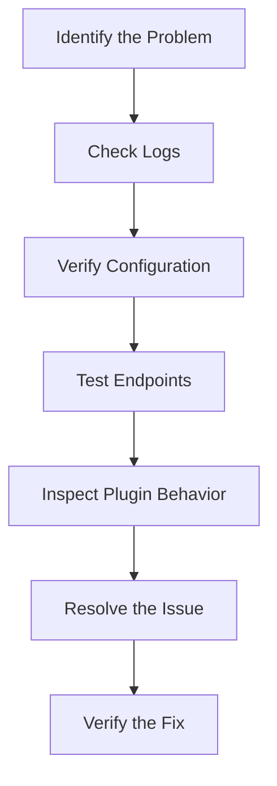

# Kong Debugging

## Introduction

Debugging is an essential skill for any Kong administrator. When working with Kong Gateway, you might encounter various issues related to configuration, plugins, services, or routes that require troubleshooting. This guide will walk you through the process of effectively debugging Kong installations and configurations, helping you identify and resolve problems efficiently.

Kong Gateway, as a robust API gateway, has several components that might need debugging:
- Core Kong server
- Admin API
- Data store (PostgreSQL or Cassandra)
- Plugins
- Routes and Services configuration

Let's dive into how to properly debug these components when issues arise.

## Prerequisites

Before we begin, make sure you have:

- Access to your Kong Gateway installation
- Basic understanding of Kong concepts (Services, Routes, Plugins)
- Access to logs (both Kong and system logs)
- Administrative permissions to the Kong Admin API
- Basic command-line skills

## Basic Debugging Process

The general process for debugging Kong issues follows these steps:



Let's explore each of these steps in detail.

## Checking Kong Logs

Kong logs are your first stop when troubleshooting issues. They provide valuable information about errors, request processing, and plugin execution.

### Accessing Logs

Depending on your deployment, Kong logs can be found in different locations:

```bash
# For systemd-based installations
sudo journalctl -u kong

# For Docker deployments
docker logs kong-container-name

# Traditional log file (common locations)
tail -f /usr/local/kong/logs/error.log
tail -f /var/log/kong/error.log
```

### Setting Log Level

To get more detailed logs for debugging, you can increase the log level in your Kong configuration file (`kong.conf`):

```
log_level = debug  # Options: debug, info, notice, warn, error, crit, alert, emerg
```

After changing the log level, restart Kong:

```bash
kong restart
```

### Common Log Patterns to Look For

When reviewing logs, pay attention to:

- Error messages starting with `[error]`
- Plugin-related errors
- Database connection issues
- Configuration parsing problems
- Request/response processing errors

## Verifying Kong Configuration

Incorrectly configured entities are a common source of problems in Kong.

### Check Kong Status

First, verify that Kong is running properly:

```bash
kong health
```

This should return information about your Kong instance's health.

### Inspect Kong Configuration

To review your current Kong configuration:

```bash
kong config init -c /etc/kong/kong.conf
```

This will dump the current configuration, which you can inspect for errors.

### Validating the Configuration

To check if your configuration file is valid:

```bash
kong check /etc/kong/kong.conf
```

### Listing Kong Entities

Use the Admin API to list and inspect entities:

```bash
# List all services
curl -s http://localhost:8001/services | jq

# List all routes
curl -s http://localhost:8001/routes | jq

# List all plugins
curl -s http://localhost:8001/plugins | jq
```

## Testing Kong Endpoints

When a specific route or service is having issues, test it directly.

### Using curl for Testing

```bash
# Test a route directly
curl -i -X GET http://kong:8000/your-route-path

# Test with specific headers
curl -i -X GET -H "Content-Type: application/json" http://kong:8000/your-route-path
```

### Debugging the Request Flow

To see how Kong processes a request, enable request debugging:

```bash
curl -i -X GET http://kong:8000/your-route-path?kong-debug=1
```

This will include debug headers in the response that show how Kong processed the request.

## Troubleshooting Common Issues

### 1. Connection Refused Errors

If you're getting "Connection refused" errors:

1. Verify Kong is running:
   ```bash
   ps aux | grep kong
   ```

2. Check the listening ports:
   ```bash
   netstat -tuln | grep -E '8000|8001'
   ```

3. Verify firewall settings:
   ```bash
   sudo iptables -L | grep -E '8000|8001'
   ```

### 2. Plugin Configuration Issues

When plugins aren't behaving as expected:

1. Check if the plugin is properly configured:
   ```bash
   curl -s http://localhost:8001/plugins | jq '.data[] | select(.name=="plugin-name")'
   ```

2. Verify plugin order (execution sequence matters):
   ```bash
   curl -s http://localhost:8001/plugins | jq '.data[] | [.name, .created_at]'
   ```

3. Test with a minimal configuration to isolate the issue.

### 3. Database Connectivity Problems

If Kong can't connect to its database:

1. Check database connection settings in `kong.conf`
2. Verify the database is running and accessible
3. For PostgreSQL, test the connection:
   ```bash
   psql -h your-db-host -p 5432 -U kong -d kong
   ```

### 4. Routing Issues

When requests are not being routed correctly:

1. Check route configurations:
   ```bash
   curl -s http://localhost:8001/routes | jq
   ```

2. Verify path patterns and host matching rules
3. Check for conflicting routes with overlapping paths

## Debugging Kong Plugins

Plugins extend Kong's functionality but can introduce errors if misconfigured.

### Plugin-Specific Debugging

For specific plugins, you can enable debug logs by modifying the plugin configuration:

```bash
curl -X PATCH http://localhost:8001/plugins/{plugin-id} \
  --data "config.log_level=debug"
```

### Debugging Custom Plugins

For custom Lua plugins:

1. Add print statements to your plugin code:
   ```lua
   print("DEBUG: " .. require("inspect")(some_variable))
   ngx.log(ngx.DEBUG, "Variable value: ", require("inspect")(some_variable))
   ```

2. Reload Kong to apply changes:
   ```bash
   kong reload
   ```

### Testing Plugin Functionality in Isolation

You can test a plugin's configuration without actually applying it:

```bash
curl -i -X POST http://localhost:8001/plugins/validate \
  --data "name=rate-limiting" \
  --data "config.minute=5" \
  --data "config.policy=local"
```

## Debugging Kong Performance Issues

If you're experiencing performance problems:

### Check Kong Resource Usage

```bash
# CPU and memory usage
top -p $(pgrep -f 'nginx: master process')

# Number of connections
netstat -an | grep -E '8000|8001' | wc -l
```

### Database Performance

Kong heavily relies on its database. Check database performance:

```bash
# For PostgreSQL
psql -c "SELECT count(*) FROM pg_stat_activity WHERE datname = 'kong'"
```

### Identifying Slow Plugins

Some plugins can impact performance. Test with and without specific plugins to identify bottlenecks.

## Real-World Example: Debugging a Rate Limiting Issue

Let's walk through a real-world example of debugging a rate limiting plugin that's not working as expected.

### Problem Description

Users report they can make unlimited requests despite having the rate-limiting plugin configured.

### Step 1: Verify the Plugin Configuration

First, let's check if the plugin is correctly configured:

```bash
curl -s http://localhost:8001/plugins | jq '.data[] | select(.name=="rate-limiting")'
```

Output:
```json
{
  "id": "a4c1e1a9-92f0-4b82-9d73-2d0a2d559e14",
  "name": "rate-limiting",
  "enabled": true,
  "config": {
    "minute": 5,
    "policy": "local",
    "fault_tolerant": true
  },
  "route_id": "e46c29f3-4b67-4f98-b1a4-218fdf5b0cf8"
}
```

### Step 2: Check the Logs

Let's examine the logs for any rate-limiting related messages:

```bash
grep -i "rate-limiting" /usr/local/kong/logs/error.log
```

We notice there are no entries for rate-limiting in the logs, which suggests the plugin might not be executing.

### Step 3: Test the Endpoint

Now let's test the endpoint while observing the debug headers:

```bash
for i in {1..10}; do
  curl -i http://kong:8000/api/test?kong-debug=1
  sleep 1
done
```

In the response headers, we don't see the expected `X-RateLimit-Remaining` header.

### Step 4: Identify the Issue

After investigation, we discover the route the plugin is attached to doesn't match the path we're testing. Let's check the route:

```bash
curl -s http://localhost:8001/routes/e46c29f3-4b67-4f98-b1a4-218fdf5b0cf8 | jq
```

Output:
```json
{
  "id": "e46c29f3-4b67-4f98-b1a4-218fdf5b0cf8",
  "paths": ["/api/test-old"],
  "service": {
    "id": "72a1f7e1-42d9-493b-8d4c-129d1f256c2a"
  }
}
```

We see the issue: the plugin is attached to a route with path `/api/test-old`, but we're testing `/api/test`.

### Step 5: Fix the Issue

Let's update the route path:

```bash
curl -X PATCH http://localhost:8001/routes/e46c29f3-4b67-4f98-b1a4-218fdf5b0cf8 \
  --data 'paths[]=/api/test'
```

### Step 6: Verify the Fix

Now let's test again:

```bash
for i in {1..10}; do
  curl -i http://kong:8000/api/test
  sleep 1
done
```

After 5 requests, we see the rate limit being applied with HTTP 429 responses, confirming the fix worked.

## Helpful Debugging Tools

Several tools can assist in debugging Kong:

### 1. HTTPie

A user-friendly command-line HTTP client:

```bash
http GET :8001/services
```

### 2. jq

Process JSON on the command line:

```bash
curl -s http://localhost:8001/routes | jq '.data[] | .id, .paths'
```

### 3. Kong Deck

For comparing Kong configurations:

```bash
deck diff --kong-addr http://localhost:8001
```

### 4. Insomnia or Postman

GUI tools for testing API endpoints and inspecting responses.

## Advanced Debugging Techniques

### Using Proxy Servers for Inspection

Tools like mitmproxy can help inspect traffic:

```bash
# Set up mitmproxy
mitmproxy -p 8080

# Configure Kong to use the proxy
curl -X PATCH http://localhost:8001/services/my-service \
  --data "url=http://localhost:8080/my-upstream-service"
```

### Kong Admin GUI

For visualized debugging, consider using Kong Manager or Konga.

## Summary

Debugging Kong Gateway requires a systematic approach:

1. Check logs for error messages
2. Verify configurations through the Admin API
3. Test endpoints directly with tools like curl
4. Isolate issues by testing components individually
5. Use debugging headers to understand request processing
6. Fix the identified issues and verify the solutions

With these techniques, you'll be able to diagnose and resolve most Kong-related issues efficiently.

## Additional Resources

- [Kong Documentation](https://docs.konghq.com/)
- [Kong Forums](https://discuss.konghq.com/)
- [Kong GitHub Issues](https://github.com/Kong/kong/issues)

## Practice Exercises

1. Set up a test Kong environment and intentionally misconfigure a plugin. Practice using the debugging techniques to identify the issue.
2. Create a custom plugin with intentional bugs, then debug and fix it using the logging techniques described in this guide.
3. Set up a scenario where two routes have conflicting paths, and debug the routing logic to understand how Kong prioritizes routes.