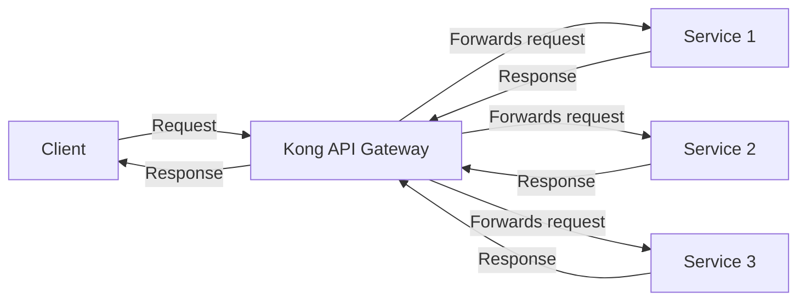

# Kong Services

## Introduction

A Kong Service is a fundamental abstraction within the Kong API Gateway ecosystem that represents a backend service or API that Kong proxies requests to. In simple terms, when a client makes a request to Kong, Kong needs to know where to send that request - and that destination is defined by a Service.

Services are one of the core building blocks of Kong's architecture, allowing developers to organize and manage the connections to upstream APIs in a structured and scalable way. Understanding Kong Services is essential for anyone who wants to effectively use Kong as an API Gateway or service mesh.

## What is a Kong Service?

A Kong Service represents an external upstream API or microservice to which Kong forwards requests. Each Service in Kong is defined by:

- A name (for identification purposes)
- A protocol (http or https)
- A host (domain name or IP address)
- A port
- A path (optional)

Here's a diagram showing how Services fit into Kong's architecture:



## Creating a Kong Service

Kong provides multiple ways to create and manage Services, including:

1. Using the Admin API
2. Using Kong Manager (GUI)
3. Using declarative configuration (YAML/JSON)

Let's look at how to create a Service using the Kong Admin API:

```bash
# Create a Service pointing to a JSON placeholder API
curl -i -X POST \
  --url http://localhost:8001/services/ \
  --data 'name=example-service' \
  --data 'url=https://jsonplaceholder.typicode.com'
```

The response will be a JSON object containing the Service details:

```json
{
  "host": "jsonplaceholder.typicode.com",
  "created_at": 1638364525,
  "connect_timeout": 60000,
  "id": "a5fb8d9b-a99d-40e9-9d35-72d42a37d7b4",
  "protocol": "https",
  "name": "example-service",
  "read_timeout": 60000,
  "port": 443,
  "path": null,
  "updated_at": 1638364525,
  "retries": 5,
  "write_timeout": 60000,
  "tags": null,
  "client_certificate": null
}
```

Alternatively, you can specify the individual components of the URL:

```bash
curl -i -X POST \
  --url http://localhost:8001/services/ \
  --data 'name=example-service' \
  --data 'protocol=https' \
  --data 'host=jsonplaceholder.typicode.com' \
  --data 'port=443' \
  --data 'path=/posts'
```

## Service Configuration Options

Kong Services support a variety of configuration options:

| Option | Description | Default |
|--------|-------------|---------|
| `name` | The Service name | None |
| `protocol` | The protocol used to communicate with the upstream | `http` |
| `host` | The host of the upstream server | None |
| `port` | The upstream server port | `80` |
| `path` | The path to be used in requests to the upstream server | None |
| `retries` | Number of retries to perform if upstream connection fails | `5` |
| `connect_timeout` | Timeout in milliseconds for establishing a connection | `60000` |
| `write_timeout` | Timeout in milliseconds between two writes to the upstream server | `60000` |
| `read_timeout` | Timeout in milliseconds between two reads of the upstream server | `60000` |

## Connecting Routes to Services

A Service by itself doesn't determine how clients access it. For that, you need to create a Route and associate it with the Service. Routes define how clients can reach your Services.

Here's how to create a Route and associate it with a Service:

```bash
# Create a Route for our example-service
curl -i -X POST \
  --url http://localhost:8001/services/example-service/routes \
  --data 'name=example-route' \
  --data 'paths[]=/example'
```

Response:

```json
{
  "id": "d35165e2-d03e-461a-bdeb-dad0a112abfe",
  "path_handling": "v0",
  "paths": ["/example"],
  "destinations": null,
  "headers": null,
  "protocols": ["http", "https"],
  "methods": null,
  "snis": null,
  "service": { "id": "a5fb8d9b-a99d-40e9-9d35-72d42a37d7b4" },
  "name": "example-route",
  "strip_path": true,
  "preserve_host": false,
  "regex_priority": 0,
  "updated_at": 1638365025,
  "sources": null,
  "https_redirect_status_code": 426,
  "hosts": null,
  "tags": null,
  "created_at": 1638365025
}
```

This means that when someone makes a request to `/example` on your Kong server, Kong will:
1. Match the request to the Route
2. Use the Route to find the associated Service
3. Forward the request to the Service's upstream URL (https://jsonplaceholder.typicode.com)

## Testing the Service and Route

Once you have set up a Service and Route, you can test it like this:

```bash
# Make a request to Kong that will be forwarded to the Service
curl -i http://localhost:8000/example/posts/1
```

Assuming Kong is running locally on port 8000, this should return:

```json
{
  "userId": 1,
  "id": 1,
  "title": "sunt aut facere repellat provident occaecati excepturi optio reprehenderit",
  "body": "quia et suscipit
suscipit recusandae consequuntur expedita et cum
reprehenderit molestiae ut ut quas totam
nostrum rerum est autem sunt rem eveniet architecto"
}
```

## Service Health Checks

Kong provides health checking capabilities to ensure that requests are only sent to healthy upstream services. This is important for maintaining system reliability.

Here's how to enable health checks for a Service using the Admin API:

```bash
curl -i -X POST \
  --url http://localhost:8001/upstreams/my-upstream/targets \
  --data 'target=service.example.com:80' \
  --data 'healthchecks.active.healthy.interval=5' \
  --data 'healthchecks.active.unhealthy.interval=5'
```

## Real-World Example: Creating a Microservices API Gateway

Let's walk through a simple but practical example of how to use Kong Services to create an API gateway for a microservices architecture.

Imagine you have three microservices:
- User Service (handles user registration, authentication)
- Product Service (manages product catalog)
- Order Service (processes orders)

Here's how you would set up Kong to route traffic to these services:

```bash
# Create Services for each microservice
curl -i -X POST \
  --url http://localhost:8001/services/ \
  --data 'name=user-service' \
  --data 'url=http://user-service.internal:3000'

curl -i -X POST \
  --url http://localhost:8001/services/ \
  --data 'name=product-service' \
  --data 'url=http://product-service.internal:3001'

curl -i -X POST \
  --url http://localhost:8001/services/ \
  --data 'name=order-service' \
  --data 'url=http://order-service.internal:3002'

# Create Routes to map endpoints to Services
curl -i -X POST \
  --url http://localhost:8001/services/user-service/routes \
  --data 'name=user-route' \
  --data 'paths[]=/users'

curl -i -X POST \
  --url http://localhost:8001/services/product-service/routes \
  --data 'name=product-route' \
  --data 'paths[]=/products'

curl -i -X POST \
  --url http://localhost:8001/services/order-service/routes \
  --data 'name=order-route' \
  --data 'paths[]=/orders'
```

This setup means:
- Requests to `/users` go to the User Service
- Requests to `/products` go to the Product Service
- Requests to `/orders` go to the Order Service

Now clients only need to know a single endpoint (the Kong gateway), and Kong handles the routing to the appropriate microservice based on the path.

## Managing Services with Declarative Configuration

Kong allows you to define your Services (and other entities) using declarative configuration in YAML or JSON. This approach is recommended for production environments as it enables version control and CI/CD integration.

Here's an example of a declarative configuration file (`kong.yml`):

```yaml
_format_version: "2.1"
_transform: true

services:
  - name: user-service
    url: http://user-service.internal:3000
    routes:
      - name: user-route
        paths:
          - /users
        strip_path: true

  - name: product-service
    url: http://product-service.internal:3001
    routes:
      - name: product-route
        paths:
          - /products
        strip_path: true

  - name: order-service
    url: http://order-service.internal:3002
    routes:
      - name: order-route
        paths:
          - /orders
        strip_path: true
```

To apply this configuration:

```bash
# Apply the configuration to Kong
kong config db_import kong.yml
```

## Adding Plugins to Services

One of Kong's most powerful features is the ability to add plugins to Services. Plugins can add features like authentication, rate limiting, logging, and more.

Here's how to add a rate limiting plugin to a Service:

```bash
curl -i -X POST \
  --url http://localhost:8001/services/product-service/plugins \
  --data 'name=rate-limiting' \
  --data 'config.minute=5' \
  --data 'config.hour=100'
```

This will limit requests to the Product Service to 5 per minute and 100 per hour per client IP.

## Summary

Kong Services are a core component of Kong API Gateway, allowing you to define and manage upstream APIs and microservices. In this guide, we've covered:

- What Kong Services are and how they work
- How to create and configure Services
- How to connect Routes to Services
- How to test Service and Route configurations
- How to use health checks to ensure service reliability
- A real-world example of using Kong Services for microservices
- How to use declarative configuration for Services
- How to enhance Services with plugins

By mastering Kong Services, you have taken a significant step toward effectively managing APIs using Kong's powerful gateway capabilities.

## Additional Resources

- Practice by setting up Kong locally and creating different Services and Routes
- Experiment with different Service configuration options
- Try adding various plugins to your Services to add functionality
- Explore Kong's documentation for more advanced Service features
- Consider learning about Kong's other core concepts like Plugins, Consumers, and Upstreams