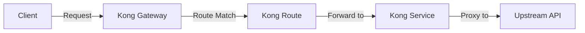

# Kong Routes

## Introduction

Routes are a fundamental component of Kong API Gateway that determine how client requests are sent to your upstream services. In essence, a route defines rules for matching client requests and forwarding them to the appropriate service.

When you're building an API infrastructure with Kong, routes work in tandem with services to create a complete request path. Think of routes as the entry points to your API ecosystem - they receive client requests based on specific rules and direct those requests to the configured services.

## Understanding Routes in Kong

In Kong's architecture, routes are always associated with a service. While a service represents your upstream API or microservice, a route defines the way clients can access that service.



Let's break down the key components of a Kong route:

### Route Properties

Routes in Kong are configured using several properties:

1. **Protocols**: Defines which protocols the route should allow (http, https, tcp, tls, udp, grpc, grpcs)
2. **Methods**: HTTP methods that the route should match (GET, POST, PUT, etc.)
3. **Hosts**: Host domains that the route should match
4. **Paths**: URL paths that the route should match
5. **Headers**: HTTP headers that the route should match
6. **Tags**: Metadata for organizing and filtering routes

## Creating and Managing Routes

Let's explore how to create and manage routes in Kong using both the Admin API and declarative configuration.

### Using the Admin API

#### Creating a Route

To create a route associated with a service:

```bash
# First, create a service if you don't have one
curl -i -X POST http://localhost:8001/services \
  --data "name=example-service" \
  --data "url=http://example.com"

# Then create a route for that service
curl -i -X POST http://localhost:8001/services/example-service/routes \
  --data "name=example-route" \
  --data "paths[]=/api" \
  --data "methods[]=GET" \
  --data "methods[]=POST"
```

The response will contain the created route details:

```json
{
  "id": "a1b2c3d4-5678-90ab-cdef-ghijklmnopqr",
  "name": "example-route",
  "paths": ["/api"],
  "methods": ["GET", "POST"],
  "protocols": ["http", "https"],
  "service": {
    "id": "e5f6g7h8-9012-34ij-klmn-opqrstuvwxyz"
  },
  "created_at": 1613146536
}
```

#### Listing Routes

To list all routes:

```bash
curl -i http://localhost:8001/routes
```

To list routes associated with a specific service:

```bash
curl -i http://localhost:8001/services/example-service/routes
```

#### Updating a Route

To update a route:

```bash
curl -i -X PATCH http://localhost:8001/routes/example-route \
  --data "paths[]=/api/v2" \
  --data "paths[]=/api/v1"
```

#### Deleting a Route

To delete a route:

```bash
curl -i -X DELETE http://localhost:8001/routes/example-route
```

### Using Declarative Configuration (YAML)

Kong also supports declarative configuration using YAML files:

```yaml
_format_version: "2.1"
services:
  - name: example-service
    url: http://example.com
    routes:
      - name: example-route
        paths:
          - /api
        methods:
          - GET
          - POST
        protocols:
          - http
          - https
```

To apply this configuration:

```bash
kong config db_import kong.yml
```

## Route Matching Rules

Kong routes match incoming requests based on specific criteria. Let's look at how each matching rule works:

### Path Matching

Routes can match requests based on the request path. For example, if you define a route with the path `/api/users`, it will match requests to `http://example.com/api/users`.

Kong supports both exact and prefix matching:

```yaml
routes:
  - paths:
      - /api/users  # Matches /api/users and /api/users/123
```

To make the route match only the exact path, use the `strip_path` parameter:

```yaml
routes:
  - paths:
      - /api/users
    strip_path: true  # Will only match exactly /api/users
```

### Host Matching

Routes can match based on the host header:

```yaml
routes:
  - hosts:
      - api.example.com
      - service.example.org
```

### Method Matching

Match specific HTTP methods:

```yaml
routes:
  - methods:
      - GET
      - POST
```

### Header Matching

Match based on request headers:

```yaml
routes:
  - headers:
      x-api-version:
        - "v1"
        - "v2"
```

## Practical Examples

Let's look at some real-world examples of Kong routes.

### Example 1: API Versioning

```yaml
_format_version: "2.1"
services:
  - name: user-service-v1
    url: http://user-service-v1.internal:8000
    routes:
      - name: user-api-v1
        paths:
          - /api/v1/users
  
  - name: user-service-v2
    url: http://user-service-v2.internal:8000
    routes:
      - name: user-api-v2
        paths:
          - /api/v2/users
```

This configuration creates two services with different versions, each with its own route. Requests to `/api/v1/users` go to the v1 service, while requests to `/api/v2/users` go to the v2 service.

### Example 2: Multi-Domain Routing

```yaml
_format_version: "2.1"
services:
  - name: main-website
    url: http://main-website.internal:8000
    routes:
      - name: website-route
        hosts:
          - example.com
          - www.example.com
  
  - name: api-service
    url: http://api-backend.internal:8000
    routes:
      - name: api-route
        hosts:
          - api.example.com
```

This example routes traffic to different services based on the domain name.

### Example 3: Microservices Architecture

Here's an example of how Kong routes can be used in a microservices architecture:

```yaml
_format_version: "2.1"
services:
  - name: user-service
    url: http://user-service:8000
    routes:
      - name: user-routes
        paths:
          - /users
          - /profiles
  
  - name: order-service
    url: http://order-service:8000
    routes:
      - name: order-routes
        paths:
          - /orders
          - /cart
  
  - name: payment-service
    url: http://payment-service:8000
    routes:
      - name: payment-routes
        paths:
          - /payments
          - /transactions
```

In this example, Kong acts as an API Gateway, routing different API endpoints to their respective microservices.

## Advanced Route Configuration

### Using Regular Expressions in Paths

Kong supports regular expressions in route paths using the `~` prefix:

```yaml
routes:
  - paths:
      - ~/users/\d+  # Matches /users/123, /users/456, etc.
```

### Route Priorities

When multiple routes might match a request, Kong uses a priority system:

```yaml
routes:
  - name: specific-route
    paths:
      - /api/users/premium
    priority: 20  # Higher priority route
  
  - name: general-route
    paths:
      - /api/users
    priority: 10  # Lower priority route
```

In this example, a request to `/api/users/premium` will match the `specific-route` because it has a higher priority.

## Troubleshooting Routes

If your routes aren't matching as expected:

1. **Check for conflicts**: Multiple routes might match the same request
2. **Verify protocols**: Ensure you've specified the correct protocols
3. **Check strip_path behavior**: Be aware of how `strip_path` affects your routing
4. **Examine priority**: Routes with higher priority are matched first
5. **Use the debug plugin**: Add the debug plugin to see detailed routing information

```bash
curl -i -X POST http://localhost:8001/routes/problem-route/plugins \
  --data "name=request-transformer" \
  --data "config.add.headers=X-Debug-Route:true"
```

## Kong Routes and Plugins

Routes can have plugins applied to them, allowing for functionality like authentication, rate limiting, and more:

```yaml
_format_version: "2.1"
services:
  - name: api-service
    url: http://api.internal:8000
    routes:
      - name: secure-api
        paths:
          - /secure
        plugins:
          - name: key-auth
            config:
              key_names: ["apikey"]
```

This example applies the key authentication plugin specifically to the `/secure` route.

## Summary

Kong routes are a powerful mechanism for directing traffic in your API infrastructure. They:

- Connect client requests to your services
- Provide flexible matching based on paths, hosts, methods, and headers
- Support advanced features like regex matching and priorities
- Can be configured via Admin API or declarative configuration
- Work seamlessly with Kong plugins for enhanced functionality

By mastering Kong routes, you can create sophisticated API architectures that direct traffic efficiently and apply different policies to different endpoints.

## Further Learning

To deepen your understanding of Kong routes:

1. Experiment with different matching rules
2. Try combining routes with various Kong plugins
3. Explore route transformations with the request-transformer plugin
4. Practice creating a microservices architecture with appropriate routes

**Exercise**: Create a Kong configuration for a blog application with separate services for posts, comments, and user authentication, each with appropriate routes.