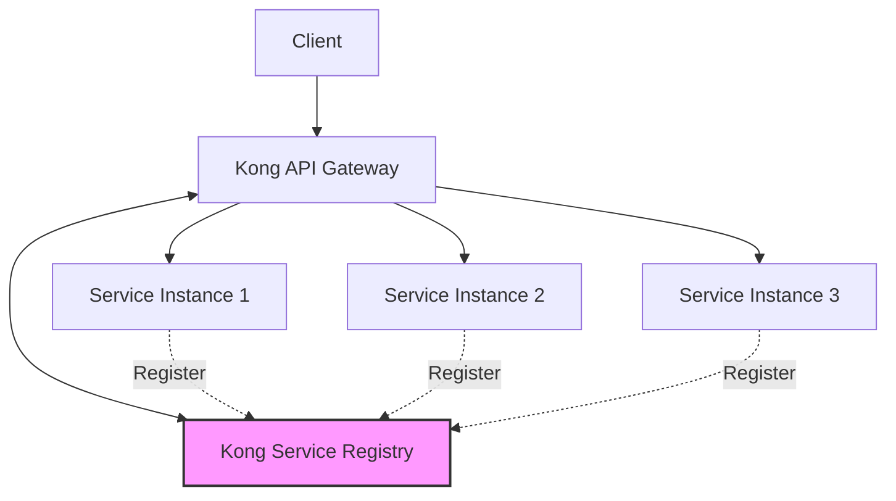

# Kong Service Registry

## Introduction

Kong Service Registry is a powerful component of the Kong API Gateway ecosystem that helps you register, discover, and manage services within your microservice architecture. For beginners diving into the world of microservices, understanding service registry is crucial as it solves one of the fundamental challenges in distributed systems: how do services find and communicate with each other?

In traditional monolithic applications, components can easily call each other through function calls within the same codebase. However, in a microservices architecture, services are distributed across multiple servers and environments. Kong Service Registry provides a centralized directory where all your services can register themselves and discover other services they need to communicate with.

## What is Service Registry?

At its core, a service registry is a database that contains information about available service instances. When services start up, they register themselves in the registry, providing details like:

- Service name
- IP address/hostname
- Port
- Health status
- Metadata (version, environment, etc.)

When Service A needs to call Service B, instead of hardcoding the destination address, Service A queries the registry to find available instances of Service B.

## Why Kong Service Registry?

Kong Service Registry integrates seamlessly with the Kong API Gateway, providing several benefits:

- **Centralized Service Management**: Maintain a single source of truth for all services
- **Dynamic Service Discovery**: Automatically discover new service instances
- **Load Balancing**: Distribute traffic across multiple instances of the same service
- **Health Checking**: Monitor service health and availability
- **Service Abstraction**: Decouple service consumers from service providers

## Architecture

Kong Service Registry fits into the broader Kong ecosystem as follows:



## Setting Up Kong Service Registry

### Prerequisites

Before you begin, make sure you have:

- Kong Gateway installed and running
- Admin access to Kong
- Basic understanding of HTTP and RESTful APIs

### Installation

Kong Service Registry comes bundled with Kong Enterprise. If you're using Kong Community Edition, you can use plugins like `service-registry` that provide similar functionality.

### Basic Configuration

Let's configure Kong Service Registry using the Admin API:

```bash
# Enable the service registry plugin globally
curl -X POST http://localhost:8001/plugins/ \
    --data "name=service-registry" \
    --data "config.registry=kong"
```

## Registering Services

You can register services in Kong Service Registry using the Kong Admin API:

```bash
# Register a new service
curl -X POST http://localhost:8001/services/ \
    --data "name=user-service" \
    --data "url=http://user-service.internal:3000" \
    --data "tags=v1,user,core"
```

Let's break down the response you'll receive:

```json
{
  "id": "a5fb8d4e-7c2b-4e1d-a493-8fc9e7356d01",
  "name": "user-service",
  "host": "user-service.internal",
  "port": 3000,
  "path": "/",
  "protocol": "http",
  "tags": ["v1", "user", "core"],
  "created_at": 1635789042,
  "updated_at": 1635789042
}
```

This confirms your service has been registered successfully.

## Discovering Services

Once services are registered, other services can discover them through the Kong Admin API:

```bash
# Discover service by name
curl -X GET http://localhost:8001/services/user-service
```

Or you can find services by tags:

```bash
# Find all services with a specific tag
curl -X GET "http://localhost:8001/services?tags=core"
```

## Service Health Checks

Kong can perform health checks on your registered services to ensure they're available and functioning correctly:

```bash
# Configure health checks for a service
curl -X PATCH http://localhost:8001/services/user-service \
    --data "healthchecks.active.healthy.interval=5" \
    --data "healthchecks.active.healthy.successes=2" \
    --data "healthchecks.active.unhealthy.interval=5" \
    --data "healthchecks.active.unhealthy.http_failures=2"
```

This configures Kong to:
- Check the service every 5 seconds
- Consider it healthy after 2 successful checks
- Mark it as unhealthy after 2 failed checks

## Practical Example: Building a Resilient Microservice Architecture

Let's walk through a practical example of how Kong Service Registry enables resilient microservice communication.

### Scenario

Imagine you're building an e-commerce platform with these services:
- Product Service
- User Service
- Order Service
- Payment Service

### Step 1: Register all services

```bash
# Register Product Service
curl -X POST http://localhost:8001/services/ \
    --data "name=product-service" \
    --data "url=http://product-service:3001"

# Register User Service
curl -X POST http://localhost:8001/services/ \
    --data "name=user-service" \
    --data "url=http://user-service:3002"

# Register Order Service
curl -X POST http://localhost:8001/services/ \
    --data "name=order-service" \
    --data "url=http://order-service:3003"

# Register Payment Service
curl -X POST http://localhost:8001/services/ \
    --data "name=payment-service" \
    --data "url=http://payment-service:3004"
```

### Step 2: Create routes for each service

```bash
# Create route for Product Service
curl -X POST http://localhost:8001/services/product-service/routes \
    --data "name=products" \
    --data "paths[]=/api/products"

# Create route for User Service
curl -X POST http://localhost:8001/services/user-service/routes \
    --data "name=users" \
    --data "paths[]=/api/users"

# Create similar routes for other services...
```

### Step 3: Configure health checks

```bash
# Configure health checks for Product Service
curl -X PATCH http://localhost:8001/services/product-service \
    --data "healthchecks.active.healthy.interval=5" \
    --data "healthchecks.active.healthy.http_path=/health"
```

### Step 4: Scale a service horizontally

Now let's say you need to scale your Product Service. You can add more instances:

```bash
# Add another Product Service instance
curl -X POST http://localhost:8001/upstreams/ \
    --data "name=product-service"

curl -X POST http://localhost:8001/upstreams/product-service/targets \
    --data "target=product-service-1:3001" \
    --data "weight=100"

curl -X POST http://localhost:8001/upstreams/product-service/targets \
    --data "target=product-service-2:3001" \
    --data "weight=100"
```

Kong will now automatically load balance requests between these instances.

## Advanced Features

### Service Versioning

Kong Service Registry allows you to manage different versions of the same service:

```bash
# Register v1 of a service
curl -X POST http://localhost:8001/services/ \
    --data "name=product-service-v1" \
    --data "url=http://product-service-v1:3001" \
    --data "tags=v1,product"

# Register v2 of a service
curl -X POST http://localhost:8001/services/ \
    --data "name=product-service-v2" \
    --data "url=http://product-service-v2:3001" \
    --data "tags=v2,product"
```

You can then route traffic to specific versions:

```bash
# Route /api/v1/products to v1
curl -X POST http://localhost:8001/services/product-service-v1/routes \
    --data "paths[]=/api/v1/products"

# Route /api/v2/products to v2
curl -X POST http://localhost:8001/services/product-service-v2/routes \
    --data "paths[]=/api/v2/products"
```

### Blue-Green Deployments

Kong Service Registry can facilitate blue-green deployments:

```bash
# Start with all traffic going to "blue" deployment
curl -X POST http://localhost:8001/upstreams/ \
    --data "name=product-service"

curl -X POST http://localhost:8001/upstreams/product-service/targets \
    --data "target=product-blue:3001" \
    --data "weight=100"

# Add "green" deployment with 0 weight initially
curl -X POST http://localhost:8001/upstreams/product-service/targets \
    --data "target=product-green:3001" \
    --data "weight=0"

# Gradually shift traffic to "green"
curl -X PATCH http://localhost:8001/upstreams/product-service/targets/product-blue:3001 \
    --data "weight=80"

curl -X PATCH http://localhost:8001/upstreams/product-service/targets/product-green:3001 \
    --data "weight=20"

# Continue shifting until complete migration
```

## Best Practices

When using Kong Service Registry, consider these best practices:

1. **Use Meaningful Names**: Choose descriptive service names that reflect their purpose
2. **Implement Health Checks**: Configure health checks for all services
3. **Add Tags**: Tag services for better organization and discovery
4. **Version Your Services**: Use versioning to manage service evolution
5. **Document Services**: Keep documentation of each service's purpose and endpoints
6. **Secure Your Registry**: Apply appropriate security measures to the Admin API
7. **Monitor Registry Activity**: Set up logging and monitoring for registry operations

## Troubleshooting

Here are some common issues and solutions:

### Services Not Appearing in Registry

If your services aren't appearing in the registry:

1. Verify the service registration API call succeeded
2. Check if the Kong admin API is accessible
3. Ensure the service-registry plugin is enabled

### Health Checks Failing

If health checks are failing:

1. Verify the health check endpoint exists on your service
2. Check if the service is actually healthy
3. Adjust the health check parameters if needed

```bash
# Check the health status of a service
curl -X GET http://localhost:8001/services/user-service/health
```

### Load Balancing Issues

If load balancing doesn't work as expected:

1. Verify all targets are registered correctly
2. Check the weight distribution
3. Ensure health checks are passing for all targets

## Summary

Kong Service Registry is a vital component for modern microservice architectures, providing a centralized system for service registration and discovery. In this guide, we've covered:

- The fundamentals of service registry and its importance
- How to set up and configure Kong Service Registry
- Registering and discovering services
- Implementing health checks
- Practical examples of service management
- Advanced features like versioning and blue-green deployments
- Best practices and troubleshooting

By leveraging Kong Service Registry, you can build a robust, scalable, and resilient microservice architecture that can evolve with your business needs.

## Additional Resources

To deepen your understanding of Kong Service Registry, consider exploring:

1. Kong's official documentation
2. Service mesh patterns and how they complement service registry
3. Infrastructure as code tools to automate service registration
4. Distributed tracing to visualize service communications

## Exercises

1. Set up a local Kong instance and register at least two services
2. Implement health checks for your services
3. Create a blue-green deployment scenario
4. Try registering multiple versions of the same service
5. Build a small microservice application that uses Kong Service Registry for service discovery