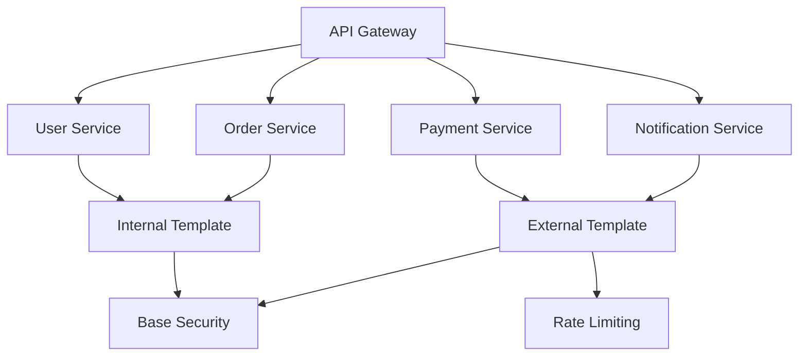

# Kong Service Templates

## Introduction

Kong Service Templates provide a powerful way to standardize and reuse configurations across multiple services in your Kong API Gateway. They allow you to define common patterns, settings, and behaviors once, and then apply them consistently across your API infrastructure. This approach not only saves time but also ensures consistency and reduces configuration errors.

For beginners working with Kong, service templates are particularly valuable as they simplify the management of multiple services and help enforce best practices across your organization.

## What Are Kong Service Templates?

Service templates in Kong are predefined configuration patterns that can be applied to one or more services. Instead of configuring each service from scratch with similar settings, you can create a template once and apply it wherever needed.

<div className="info-box">
  <strong>Key Benefits:</strong>
  <ul>
    <li>Reduce duplication and maintenance overhead</li>
    <li>Enforce consistency across services</li>
    <li>Simplify onboarding of new services</li>
    <li>Enable standardization of policies and plugins</li>
  </ul>
</div>

Let's explore how service templates work and how to implement them in your Kong environment.

## Creating Your First Service Template

### Basic Template Structure

A Kong service template is essentially a configuration object that defines various aspects of a service. Here's a basic example:

```yaml
name: basic-http-template
protocol: http
connect_timeout: 5000
read_timeout: 60000
write_timeout: 60000
retries: 5
```

This template defines a basic HTTP service with specific timeout settings and retry logic.

### Template with Plugins

You can also include plugins in your templates to apply consistent security, logging, or other features:

```yaml
name: secure-api-template
protocol: https
connect_timeout: 5000
plugins:
  - name: rate-limiting
    config:
      minute: 60
      policy: local
  - name: key-auth
    config:
      key_names: ["apikey"]
  - name: cors
    config:
      origins: ["*"]
      methods: ["GET", "POST", "PUT", "DELETE"]
      headers: ["Content-Type", "Authorization"]
      exposed_headers: ["X-Request-ID"]
      max_age: 3600
```

## Implementing Service Templates with Kong's Admin API

### Creating a Template

To create a service template using Kong's Admin API:

```bash
# Create a basic HTTP template
curl -X POST http://kong:8001/templates \
  --data "name=basic-http-template" \
  --data "protocol=http" \
  --data "connect_timeout=5000" \
  --data "read_timeout=60000" \
  --data "write_timeout=60000" \
  --data "retries=5"
```

The response will confirm the template creation:

```json
{
  "id": "a1b2c3d4-5678-90ab-cdef-ghijklmnopqr",
  "name": "basic-http-template",
  "protocol": "http",
  "connect_timeout": 5000,
  "read_timeout": 60000,
  "write_timeout": 60000,
  "retries": 5,
  "created_at": 1635789012
}
```

### Applying a Template to a Service

When creating a new service, you can apply the template:

```bash
# Create a service using a template
curl -X POST http://kong:8001/services \
  --data "name=my-api" \
  --data "host=my-api.example.com" \
  --data "template.id=a1b2c3d4-5678-90ab-cdef-ghijklmnopqr"
```

## Working with Templates Using declarative configuration (YAML)

Kong also supports defining and using templates in declarative configuration files:

```yaml
_format_version: "2.1"
_transform: true

templates:
  - name: basic-http-template
    protocol: http
    connect_timeout: 5000
    read_timeout: 60000
    write_timeout: 60000
    retries: 5
    
  - name: secure-api-template
    protocol: https
    connect_timeout: 5000
    plugins:
      - name: rate-limiting
        config:
          minute: 60
          policy: local
      - name: key-auth

services:
  - name: user-service
    host: user-api.internal
    port: 8080
    template: basic-http-template
    
  - name: payment-service
    host: payment.internal
    port: 9000
    template: secure-api-template
    routes:
      - name: payment-route
        paths:
          - /payments
```

## Template Inheritance and Overrides

One powerful feature of Kong service templates is the ability to override specific settings when applying a template to a service.

### Overriding Template Settings

```yaml
services:
  - name: special-service
    host: special-api.internal
    port: 8080
    template: basic-http-template
    connect_timeout: 10000  # Override the template's connect_timeout
    retries: 3              # Override the template's retries
```

In this example, `special-service` uses the `basic-http-template` but overrides two specific settings.

### Inheritance Chain

Templates can build upon other templates, creating an inheritance chain:

```yaml
templates:
  - name: base-template
    protocol: http
    connect_timeout: 5000
  
  - name: extended-template
    template: base-template
    retries: 5
    plugins:
      - name: cors
```

Services using `extended-template` will inherit settings from both templates.

## Real-World Examples

Let's look at some practical applications of service templates:

### Example 1: Microservices Architecture



In this microservices architecture:

```yaml
templates:
  - name: base-security
    plugins:
      - name: jwt
      - name: cors
      - name: request-transformer
  
  - name: internal-template
    template: base-security
    protocol: http
    connect_timeout: 2000
    
  - name: external-template
    template: base-security
    protocol: https
    connect_timeout: 5000
    plugins:
      - name: rate-limiting
        config:
          minute: 60
      - name: response-transformer

services:
  - name: user-service
    host: user.internal
    port: 8001
    template: internal-template
    
  - name: payment-service
    host: payment.api.example.com
    port: 443
    template: external-template
```

### Example 2: Multi-Environment Setup

```yaml
templates:
  - name: dev-template
    connect_timeout: 10000
    read_timeout: 60000
    retries: 10
    plugins:
      - name: http-log
        config:
          http_endpoint: http://logger:8080/dev-logs
          
  - name: prod-template
    connect_timeout: 5000
    read_timeout: 30000
    retries: 3
    plugins:
      - name: http-log
        config:
          http_endpoint: http://logger:8080/prod-logs
      - name: rate-limiting
      - name: proxy-cache

services:
  - name: auth-service-dev
    host: auth-dev.internal
    template: dev-template
    
  - name: auth-service-prod
    host: auth-prod.internal
    template: prod-template
```

## Best Practices for Kong Service Templates

1. **Start with base templates**: Create foundational templates with common settings, then extend them for specific use cases.

2. **Use descriptive names**: Name your templates clearly to indicate their purpose or the type of services they're designed for.

3. **Document your templates**: Add comments or documentation explaining what each template is for and when to use it.

4. **Version control your templates**: Store your template definitions in version control to track changes over time.

5. **Limit template depth**: While templates can inherit from other templates, try to limit the depth to avoid complexity.

6. **Regular audits**: Periodically review your templates to ensure they still align with your organization's standards and requirements.

7. **Template governance**: Establish a process for creating and modifying templates, especially in larger organizations.

## Advanced Template Techniques

### Conditional Templates

You can create templates for different conditions or requirements:

```yaml
templates:
  - name: high-traffic-template
    connect_timeout: 3000
    read_timeout: 20000
    write_timeout: 20000
    retries: 2
    plugins:
      - name: proxy-cache
      - name: rate-limiting
        config:
          minute: 1000
          hour: 10000
          
  - name: low-traffic-template
    connect_timeout: 5000
    read_timeout: 60000
    write_timeout: 60000
    retries: 5
```

### Function-Specific Templates

Create templates tailored to specific API functions:

```yaml
templates:
  - name: auth-service-template
    connect_timeout: 3000
    plugins:
      - name: jwt
      - name: cors
      - name: response-transformer
        config:
          remove:
            headers: ["Server", "X-Powered-By"]
            
  - name: data-service-template
    read_timeout: 60000
    write_timeout: 60000
    plugins:
      - name: response-caching
      - name: request-size-limiting
        config:
          allowed_payload_size: 10
```

## Troubleshooting Common Issues

### Template Not Applying

If a template isn't applying correctly:

1. Verify the template ID or name is correct
2. Check if service-specific settings are overriding template settings
3. Ensure the template exists in your Kong configuration

### Plugin Configuration Issues

When plugins from templates aren't working:

```bash
# Check template configuration
curl -X GET http://kong:8001/templates/{template-id}

# Check service configuration
curl -X GET http://kong:8001/services/{service-name}

# Check plugins applied to the service
curl -X GET http://kong:8001/services/{service-name}/plugins
```

## Summary

Kong Service Templates provide a powerful way to standardize your API gateway configuration, reduce duplication, and enforce consistency across your services. By creating well-designed templates, you can:

- Simplify service configuration and management
- Apply consistent policies and settings
- Reduce configuration errors
- Speed up the deployment of new services

As your API infrastructure grows, service templates become increasingly valuable for maintaining control and consistency. They allow you to codify best practices and ensure all services adhere to your organization's standards.

## Additional Resources

- Practice creating templates for different types of APIs (authentication services, data services, etc.)
- Experiment with template inheritance to create specialized templates
- Create a template governance process for your organization

## Exercises

1. Create a basic service template with rate limiting and key authentication plugins.
2. Apply your template to a new service and verify the plugins are correctly configured.
3. Create a template hierarchy with a base template and two specialized templates that inherit from it.
4. Implement environment-specific templates (development, staging, production) with appropriate settings for each environment.
5. Design a template strategy for a microservices architecture with at least five different services.