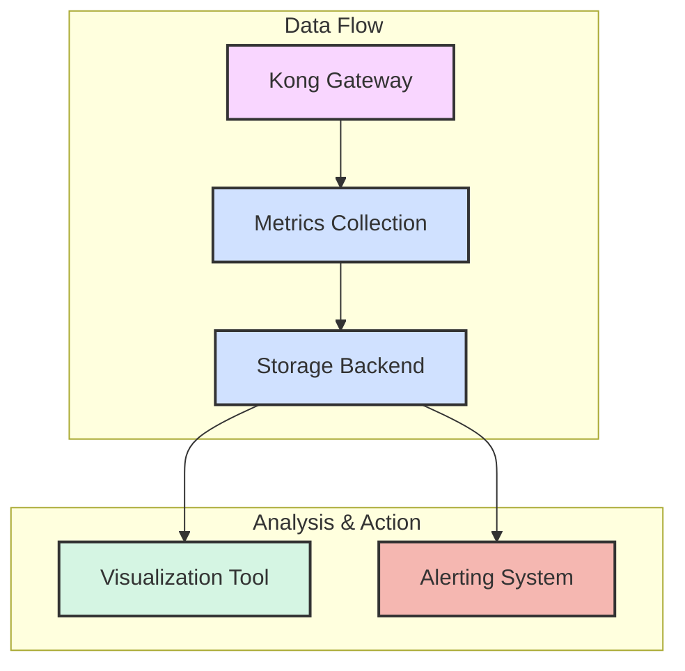

# Kong Service Monitoring

## Introduction

Monitoring your Kong API Gateway is crucial for maintaining service reliability, troubleshooting issues, and optimizing performance. Kong Service Monitoring provides insights into the health and performance of your API services, allowing you to proactively identify and resolve potential problems before they impact your users.

In this guide, we'll explore how to set up comprehensive monitoring for Kong services, interpret metrics, and use this data to maintain a robust API infrastructure.

## Why Monitor Kong Services?

Before diving into implementation, let's understand why monitoring is essential:

1. **Service Reliability** - Detect and address failures quickly
2. **Performance Optimization** - Identify bottlenecks and optimization opportunities
3. **Capacity Planning** - Make informed scaling decisions based on usage patterns
4. **Security Insights** - Spot unusual traffic patterns that might indicate security issues
5. **Compliance & SLAs** - Ensure your services meet required availability standards

## Monitoring Architecture

Kong's monitoring architecture consists of several components working together:



## Setting Up Basic Monitoring

Let's start with the basics. Kong offers built-in monitoring capabilities through its status API.

### Step 1: Enable the Status API

First, ensure the Status API is enabled in your Kong configuration:

```yaml
status_listen: 0.0.0.0:8100
status_access_log: logs/status_access.log
status_error_log: logs/status_error.log
```

### Step 2: Access Status Endpoints

Once enabled, you can access various status endpoints:

```bash
# Get basic node information
curl http://localhost:8100/status

# Response example
{
  "server": {
    "total_requests": 3242,
    "connections_active": 32,
    "connections_accepted": 3298,
    "connections_handled": 3298,
    "connections_reading": 0,
    "connections_writing": 12,
    "connections_waiting": 20
  },
  "database": {
    "reachable": true
  },
  "memory": {
    "lua_shared_dicts": {
      "kong": {
        "allocated_slabs": "3.46 MiB",
        "capacity": "5.00 MiB"
      },
      "kong_db_cache": {
        "allocated_slabs": "11.87 MiB",
        "capacity": "128.00 MiB"
      }
    }
  }
}
```

## Advanced Monitoring with Prometheus and Grafana

For production environments, using Prometheus and Grafana provides more robust monitoring.

### Step 1: Install the Prometheus Plugin

```bash
# Using Kong's plugin installation
kong config -c kong.conf --plugin prometheus
```

### Step 2: Configure the Plugin

Add the following to your Kong configuration:

```yaml
# In your Kong declarative configuration file
_format_version: "2.1"
plugins:
- name: prometheus
  config:
    status_code_metrics: true
    latency_metrics: true
    upstream_health_metrics: true
    bandwidth_metrics: true
```

Or if you're using the Admin API:

```bash
curl -X POST http://localhost:8001/plugins/ \
  --data "name=prometheus" \
  --data "config.status_code_metrics=true" \
  --data "config.latency_metrics=true" \
  --data "config.upstream_health_metrics=true" \
  --data "config.bandwidth_metrics=true"
```

### Step 3: Access Prometheus Metrics

Once configured, Kong exposes metrics at the `/metrics` endpoint:

```bash
curl http://localhost:8001/metrics
```

This returns Prometheus-formatted metrics:

```
# HELP kong_bandwidth Total bandwidth in bytes consumed per service in Kong
# TYPE kong_bandwidth counter
kong_bandwidth{type="egress",service="users-service"} 1277
kong_bandwidth{type="ingress",service="users-service"} 726

# HELP kong_http_status HTTP status codes per service in Kong
# TYPE kong_http_status counter
kong_http_status{service="users-service",code="200"} 15
kong_http_status{service="auth-service",code="401"} 3
```

### Step 4: Set Up Prometheus

Create a `prometheus.yml` file to scrape Kong metrics:

```yaml
global:
  scrape_interval: 15s

scrape_configs:
  - job_name: 'kong'
    scrape_interval: 5s
    static_configs:
      - targets: ['kong:8001']
```

### Step 5: Set Up Grafana Dashboard

Create a Grafana dashboard to visualize Kong metrics. Here's a simple example of JSON configuration for a dashboard panel:

```json
{
  "datasource": "Prometheus",
  "fieldConfig": {
    "defaults": {
      "color": {"mode": "palette-classic"},
      "custom": {
        "axisLabel": "",
        "axisPlacement": "auto",
        "barAlignment": 0,
        "drawStyle": "line",
        "fillOpacity": 10,
        "gradientMode": "none",
        "hideFrom": {"legend": false, "tooltip": false, "viz": false},
        "lineInterpolation": "smooth",
        "lineWidth": 2,
        "pointSize": 5,
        "scaleDistribution": {"type": "linear"},
        "showPoints": "never",
        "spanNulls": true,
        "stacking": {"group": "A", "mode": "none"},
        "thresholdsStyle": {"mode": "off"}
      },
      "mappings": [],
      "thresholds": {
        "mode": "absolute",
        "steps": [
          {"color": "green", "value": null},
          {"color": "red", "value": 80}
        ]
      },
      "unit": "short"
    },
    "overrides": []
  },
  "targets": [
    {
      "expr": "sum(increase(kong_http_status{code=~\"5..\"}[5m])) by (service)",
      "legendFormat": "{{service}}",
      "refId": "A"
    }
  ],
  "title": "5xx Errors by Service"
}
```

## Key Metrics to Monitor

Focus on these critical metrics for effective Kong service monitoring:

### 1. Request Rate

Track the number of requests per service:

```
sum(rate(kong_http_status[1m])) by (service)
```

### 2. Error Rate

Monitor the percentage of requests resulting in errors:

```
sum(rate(kong_http_status{code=~"5.."}[1m])) by (service) / sum(rate(kong_http_status[1m])) by (service) * 100
```

### 3. Latency

Track request processing time:

```
histogram_quantile(0.95, sum(rate(kong_latency_bucket{type="request"}[5m])) by (service, le))
```

### 4. Upstream Health

Monitor the health of your backend services:

```
kong_upstream_target_health{state="healthy"} == 1
```

## Setting Up Alerts

Proactive monitoring requires alerts. Here's how to set up basic alerts in Prometheus:

```yaml
# In prometheus/alerts.yml
groups:
- name: kong_alerts
  rules:
  - alert: KongHighErrorRate
    expr: sum(rate(kong_http_status{code=~"5.."}[5m])) by (service) / sum(rate(kong_http_status[5m])) by (service) * 100 > 5
    for: 1m
    labels:
      severity: warning
    annotations:
      summary: "High error rate on {{ $labels.service }}"
      description: "Service {{ $labels.service }} has a 5xx error rate above 5% (current value: {{ $value }}%)"
      
  - alert: KongHighLatency
    expr: histogram_quantile(0.95, sum(rate(kong_latency_bucket{type="request"}[5m])) by (service, le)) > 500
    for: 5m
    labels:
      severity: warning
    annotations:
      summary: "High latency on {{ $labels.service }}"
      description: "Service {{ $labels.service }} has a 95th percentile latency above 500ms (current value: {{ $value }}ms)"
```

## Real-world Example: Monitoring Service Degradation

Let's walk through a real-world scenario:

1. **Symptom**: Users report intermittent slowness in the authentication service
2. **Investigation**: Looking at the monitoring dashboard, you notice:
   - Increased latency in the auth service
   - Normal request volume
   - No increase in error rates
   - High CPU usage on the upstream service

3. **Diagnosis**: By correlating these metrics, you determine that the auth service database is under-provisioned

4. **Resolution**: 
   - Scale up the database resources
   - Monitor the metrics to confirm improvement
   - Set up better alerting thresholds to catch this issue earlier next time

### Code Example: Creating a Health Check Probe

Here's an example of setting up a custom health check for deeper monitoring:

```lua
-- custom-health-check.lua
local _M = {}

function _M.execute()
  local health = {
    status = "ok",
    details = {}
  }
  
  -- Check database connectivity
  local ok, err = kong.db.connector:connect()
  if not ok then
    health.status = "unhealthy"
    health.details.database = {
      status = "unhealthy",
      message = err
    }
  else
    health.details.database = {
      status = "ok"
    }
  end
  
  -- Check memory usage
  local memory_stats = collectgarbage("count") * 1024 -- in bytes
  health.details.memory = {
    status = "ok",
    current_usage = memory_stats
  }
  
  if memory_stats > 500000000 then -- 500MB threshold
    health.status = "degraded"
    health.details.memory.status = "warning"
  end
  
  return health
end

return _M
```

## Monitoring Best Practices

1. **Start Simple**: Begin with basic metrics before adding complexity
2. **Focus on the Four Golden Signals**:
   - Latency
   - Traffic
   - Errors
   - Saturation
3. **Layer Your Monitoring**:
   - Infrastructure metrics (CPU, memory)
   - Kong internal metrics
   - Business metrics (transactions, users)
4. **Set Meaningful Thresholds**: Based on normal operation patterns
5. **Document Runbooks**: Create clear procedures for responding to alerts
6. **Regularly Review**: Adjust monitoring based on new services and requirements

## Troubleshooting Common Issues

### Problem: High Latency Spikes

**Possible Causes**:
- Database connection issues
- Upstream service degradation
- Kong plugin overhead

**Investigation Steps**:
```bash
# Check plugin execution times
curl http://localhost:8001/metrics | grep kong_http_latency

# Check DB health
curl http://localhost:8001/status | jq .database

# Check upstream health
curl http://localhost:8001/upstreams/{upstream_id}/health
```

### Problem: High Error Rates

**Possible Causes**:
- Upstream service failures
- Route configuration issues
- Rate limiting triggering

**Investigation Steps**:
```bash
# Check error codes by service
curl http://localhost:8001/metrics | grep kong_http_status

# Check specific service configuration
curl http://localhost:8001/services/{service_name} | jq .
```

## Summary

Effective Kong service monitoring combines:

1. **Proper Setup**: Configuring Kong, Prometheus, and visualization tools
2. **Key Metrics**: Tracking the right indicators for your services
3. **Alerting**: Setting up proactive notifications for issues
4. **Troubleshooting Workflows**: Having clear procedures when problems arise
5. **Continuous Improvement**: Regularly refining your monitoring strategy

By implementing the practices in this guide, you'll gain visibility into your Kong API Gateway, ensuring reliable service for your users and peace of mind for your team.

## Additional Resources

- [Kong Official Documentation](https://docs.konghq.com/)
- [Prometheus Documentation](https://prometheus.io/docs/)
- [Grafana Dashboards](https://grafana.com/grafana/dashboards/)

## Exercises

1. Set up basic Kong monitoring with the Status API and fetch service metrics
2. Install and configure the Prometheus plugin for Kong
3. Create a simple Grafana dashboard showing request rates and error percentages
4. Set up an alert for when latency exceeds acceptable thresholds
5. Simulate a service degradation and use monitoring to diagnose the issue