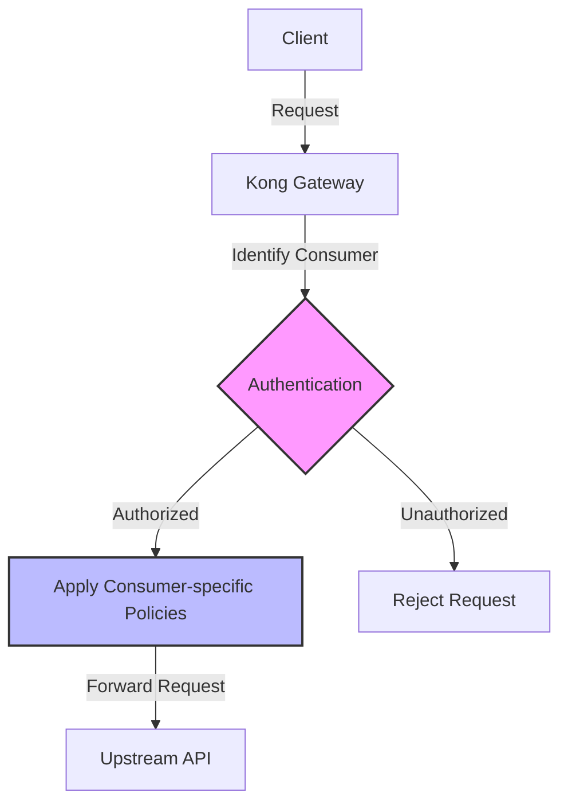

# Kong Consumers

## Introduction

In the Kong API Gateway ecosystem, **Consumers** represent the users or services that consume your APIs. Understanding how to manage consumers is crucial for implementing proper authentication, authorization, and rate limiting in your API infrastructure.

Think of consumers as accounts that can be granted specific permissions and configured with various credentials. This concept allows you to identify and track who is accessing your APIs, apply different policies based on the consumer, and manage access controls effectively.

## What Are Kong Consumers?

Consumers in Kong are entities that make requests to your upstream services through Kong. A consumer can be:

- An individual end-user
- A service or application
- An organization or team

Each consumer is identified by a unique username or custom ID, and can have multiple credentials and plugins associated with it.



## Creating and Managing Consumers

### Creating a Consumer

You can create consumers through Kong's Admin API or using declarative configuration files. Let's explore both approaches:

#### Using the Admin API

```bash
# Create a consumer using curl
curl -X POST http://localhost:8001/consumers/ \
  --data "username=john_doe" \
  --data "custom_id=user-123"
```

The response will be something like:

```json
{
  "username": "john_doe",
  "custom_id": "user-123",
  "created_at": 1621459558,
  "id": "a28a0f7f-4425-4caa-81f5-18a2a3600b"
}
```

#### Using Declarative Configuration (YAML)

```yaml
_format_version: "2.1"
consumers:
  - username: john_doe
    custom_id: user-123
```

### Retrieving Consumer Information

```bash
# Get a specific consumer
curl -X GET http://localhost:8001/consumers/john_doe

# List all consumers
curl -X GET http://localhost:8001/consumers
```

### Updating a Consumer

```bash
# Update a consumer
curl -X PATCH http://localhost:8001/consumers/john_doe \
  --data "custom_id=user-456"
```

### Deleting a Consumer

```bash
# Delete a consumer
curl -X DELETE http://localhost:8001/consumers/john_doe
```

## Associating Credentials with Consumers

One of the most powerful features of Kong Consumers is the ability to associate different types of credentials with them. These credentials are used for authentication and identifying the consumer during API requests.

### Basic Authentication

```bash
# Add Basic Auth credentials to a consumer
curl -X POST http://localhost:8001/consumers/john_doe/basic-auth \
  --data "username=john" \
  --data "password=secretpassword"
```

### Key Authentication

```bash
# Add Key Auth credentials to a consumer
curl -X POST http://localhost:8001/consumers/john_doe/key-auth \
  --data "key=apikey123"
```

### JWT Authentication

```bash
# Add JWT credentials to a consumer
curl -X POST http://localhost:8001/consumers/john_doe/jwt \
  --data "algorithm=HS256" \
  --data "secret=mysecret"
```

### OAuth2 Authentication

```bash
# Add OAuth2 credentials to a consumer
curl -X POST http://localhost:8001/consumers/john_doe/oauth2 \
  --data "name=My Application" \
  --data "client_id=SOME-CLIENT-ID" \
  --data "client_secret=SOME-CLIENT-SECRET" \
  --data "redirect_uris=https://example.com/callback"
```

## Consumer Groups

Kong allows you to organize consumers into groups, which makes it easier to apply the same plugins or policies to multiple consumers at once.

### Creating a Consumer Group

```bash
# Create a consumer group
curl -X POST http://localhost:8001/consumer_groups \
  --data "name=premium_users"
```

### Adding a Consumer to a Group

```bash
# Add a consumer to a group
curl -X POST http://localhost:8001/consumer_groups/premium_users/consumers \
  --data "consumer=john_doe"
```

## Practical Examples

### Example 1: Setting Up Rate Limiting for a Specific Consumer

In this example, we'll create a consumer and set up rate limiting specifically for that consumer:

```bash
# 1. Create a consumer
curl -X POST http://localhost:8001/consumers/ \
  --data "username=mobile_app"

# 2. Apply rate limiting plugin to the consumer
curl -X POST http://localhost:8001/consumers/mobile_app/plugins \
  --data "name=rate-limiting" \
  --data "config.minute=100" \
  --data "config.hour=1000"
```

Now, the `mobile_app` consumer will be limited to 100 requests per minute and 1000 requests per hour, while other consumers are not affected by this specific rate limit.

### Example 2: Implementing API Key Authentication

Let's set up API key authentication for a service and associate keys with specific consumers:

```bash
# 1. Enable key authentication on a service or route
curl -X POST http://localhost:8001/services/my-api/plugins \
  --data "name=key-auth" \
  --data "config.key_names=apikey"

# 2. Create a consumer for a partner application
curl -X POST http://localhost:8001/consumers/ \
  --data "username=partner_app"

# 3. Create an API key for the consumer
curl -X POST http://localhost:8001/consumers/partner_app/key-auth \
  --data "key=partner_special_key"
```

Now, the partner application can access the API by including the header `apikey: partner_special_key` in their requests.

### Example 3: Setting Up Different Tiers of Service

This example demonstrates how to use consumer groups to create different service tiers:

```bash
# 1. Create consumer groups for different tiers
curl -X POST http://localhost:8001/consumer_groups \
  --data "name=free_tier"

curl -X POST http://localhost:8001/consumer_groups \
  --data "name=premium_tier"

# 2. Create consumers and add them to groups
curl -X POST http://localhost:8001/consumers/ \
  --data "username=free_user"

curl -X POST http://localhost:8001/consumers/ \
  --data "username=premium_user"

curl -X POST http://localhost:8001/consumer_groups/free_tier/consumers \
  --data "consumer=free_user"

curl -X POST http://localhost:8001/consumer_groups/premium_tier/consumers \
  --data "consumer=premium_user"

# 3. Apply different rate limits to each group
curl -X POST http://localhost:8001/consumer_groups/free_tier/plugins \
  --data "name=rate-limiting" \
  --data "config.minute=10" \
  --data "config.hour=100"

curl -X POST http://localhost:8001/consumer_groups/premium_tier/plugins \
  --data "name=rate-limiting" \
  --data "config.minute=1000" \
  --data "config.hour=10000"
```

This setup creates two tiers of service with different rate limits applied to each consumer group.

## Best Practices for Managing Kong Consumers

1. **Use meaningful usernames and IDs**: Choose names that help identify the purpose or owner of the consumer.

2. **Implement consumer groups**: Organize consumers into logical groups based on their access patterns or requirements.

3. **Regular credential rotation**: Periodically update consumer credentials to maintain security.

4. **Monitor consumer activity**: Use Kong's logging plugins to track and analyze API usage by consumers.

5. **Implement multiple authentication methods**: Different use cases may require different authentication methods for the same consumer.

6. **Use tags for organization**: Add tags to consumers to categorize and filter them effectively.

   ```bash
   curl -X POST http://localhost:8001/consumers/ \
     --data "username=partner_app" \
     --data "tags[]=partner" \
     --data "tags[]=external"
   ```

## Integration with Identity Providers

For more advanced setups, you can integrate Kong with external identity providers:

### Example: Using Kong with OAuth2 and an External Identity Provider

1. Configure the OAuth2 plugin on a service or route
2. Set up consumers that correspond to applications in your identity provider
3. Users authenticate with the identity provider, which provides tokens
4. These tokens are validated by Kong for API access

This approach allows you to leverage existing identity infrastructure while still utilizing Kong's consumer management capabilities.

## Troubleshooting Consumer Issues

### Common Problems and Solutions

1. **Consumer not authenticated**:
   - Verify that the consumer exists
   - Check that the correct credentials are being used
   - Ensure the authentication plugin is properly configured

2. **Rate limiting issues**:
   - Check the consumer's rate limit configuration
   - Verify which rate limiting plugin applies (global, service, route, or consumer-specific)

3. **Plugin conflicts**:
   - Plugins can be applied at multiple levels; understand the priority order
   - Consumer-specific plugins typically have higher priority than global plugins

## Summary

Kong Consumers are a powerful concept that allows you to identify, manage, and control access to your APIs. By properly implementing consumers, you can:

- Authenticate API users
- Apply different policies based on the consumer identity
- Track and analyze API usage
- Implement tiered service levels
- Control access to specific endpoints or services

Understanding how to create and manage consumers is fundamental to building a secure and well-organized API infrastructure with Kong.

## Additional Resources

- Kong's official documentation on consumers
- API security best practices
- Advanced authentication setups

## Exercises

1. Create a consumer with basic authentication credentials and verify you can authenticate with them.

2. Set up a consumer group with three consumers and apply a rate limiting plugin to the group.

3. Create a consumer with multiple authentication methods (e.g., both API key and JWT).

4. Implement a tiered access system with different rate limits for different consumer groups.

5. Set up logging to track the activity of specific consumers and analyze their API usage patterns.