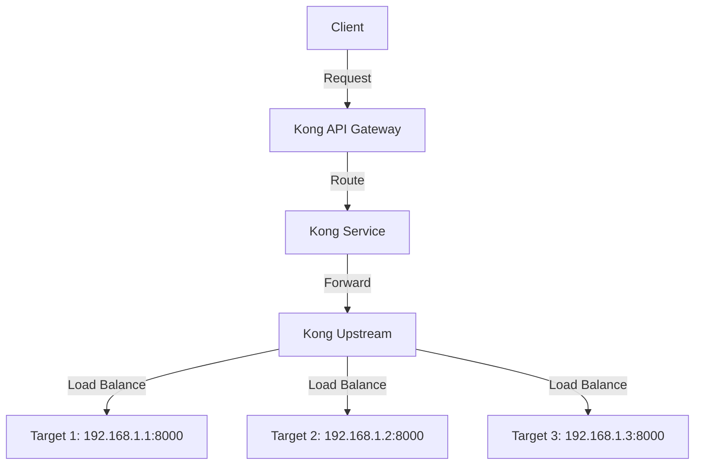

# Kong Upstream

## Introduction

When building modern applications with microservices architecture, efficiently managing the connections to your backend services becomes crucial. This is where Kong's **Upstream** concept comes into play. 

**Kong Upstream** is a powerful feature within Kong API Gateway that allows you to organize and manage groups of target services that Kong can forward requests to. Think of an Upstream as a virtual hostname that represents a collection of backend services (targets) that provide the same functionality.

In this guide, we'll explore what Kong Upstream is, how it works, and how you can use it to improve the reliability and performance of your applications.

## What is Kong Upstream?

An Upstream in Kong is essentially a logical entity that represents a group of backend services or targets. These targets are the actual nodes that will receive the traffic that Kong routes. The Upstream configuration allows you to:

1. **Define load balancing algorithms**: Decide how traffic is distributed across multiple targets
2. **Implement health checks**: Automatically detect and remove unhealthy targets
3. **Configure circuit breakers**: Prevent cascading failures in your system
4. **Manage connection pools**: Control how Kong maintains connections to your targets

Let's look at a visual representation of how Upstreams fit into Kong's architecture:



## Creating an Upstream in Kong

### Using the Admin API

You can create an Upstream in Kong using the Admin API. Here's a basic example:

```bash
# Create an Upstream
curl -X POST http://kong:8001/upstreams \
  --data "name=my-upstream-service"
```

The response will look something like this:

```json
{
  "id": "91855d6c-566d-4f85-8823-d2570ca48a52",
  "name": "my-upstream-service",
  "algorithm": "round-robin",
  "hash_on": "none",
  "hash_fallback": "none",
  "hash_on_cookie_path": "/",
  "slots": 10000,
  "healthchecks": {
    "active": {
      "concurrency": 10,
      "healthy": {
        "http_statuses": [200, 302],
        "interval": 0,
        "successes": 0
      },
      "http_path": "/",
      "https_verify_certificate": true,
      "timeout": 1,
      "type": "http",
      "unhealthy": {
        "http_failures": 0,
        "http_statuses": [429, 404, 500, 501, 502, 503, 504, 505],
        "interval": 0,
        "tcp_failures": 0,
        "timeouts": 0
      }
    },
    "passive": {
      "healthy": {
        "http_statuses": [200, 201, 202, 203, 204, 205, 206, 207, 208, 226],
        "successes": 0
      },
      "type": "http",
      "unhealthy": {
        "http_failures": 0,
        "http_statuses": [429, 500, 503],
        "tcp_failures": 0,
        "timeouts": 0
      }
    },
    "threshold": 0
  },
  "created_at": 1613407334
}
```

### Using declarative configuration (YAML)

If you're using Kong's declarative configuration with `kong.conf` or `kong.yaml`, you can define Upstreams like this:

```yaml
_format_version: "2.1"
_transform: true

upstreams:
  - name: my-upstream-service
    algorithm: round-robin
    slots: 10000
    healthchecks:
      active:
        concurrency: 10
        healthy:
          http_statuses:
            - 200
            - 302
        http_path: /
        timeout: 1
        type: http
```

## Adding Targets to an Upstream

Once you've created an Upstream, you need to add targets to it. Targets are the actual instances of your backend services that will receive traffic.

```bash
# Add a target to an Upstream
curl -X POST http://kong:8001/upstreams/my-upstream-service/targets \
  --data "target=192.168.1.1:8000" \
  --data "weight=100"
```

You can add multiple targets to create a pool of backend services:

```bash
# Add more targets
curl -X POST http://kong:8001/upstreams/my-upstream-service/targets \
  --data "target=192.168.1.2:8000" \
  --data "weight=100"

curl -X POST http://kong:8001/upstreams/my-upstream-service/targets \
  --data "target=192.168.1.3:8000" \
  --data "weight=100"
```

## Configuring Load Balancing

Kong offers several load balancing algorithms for distributing traffic across targets:

### Round Robin (Default)

The simplest and most common algorithm, which distributes requests evenly in a circular order.

```bash
curl -X PATCH http://kong:8001/upstreams/my-upstream-service \
  --data "algorithm=round-robin"
```

### Consistent Hashing

Routes the same clients to the same targets based on a specified key, providing session persistence.

```bash
curl -X PATCH http://kong:8001/upstreams/my-upstream-service \
  --data "algorithm=consistent-hashing" \
  --data "hash_on=ip"
```

### Least Connections

Routes traffic to the target with the fewest active connections.

```bash
curl -X PATCH http://kong:8001/upstreams/my-upstream-service \
  --data "algorithm=least-connections"
```

## Setting Up Health Checks

Health checks allow Kong to automatically detect and remove unhealthy targets from the load balancer pool.

### Active Health Checks

Kong actively probes targets to check their health status:

```bash
curl -X PATCH http://kong:8001/upstreams/my-upstream-service \
  --data "healthchecks.active.http_path=/health" \
  --data "healthchecks.active.healthy.interval=5" \
  --data "healthchecks.active.healthy.successes=2" \
  --data "healthchecks.active.unhealthy.interval=5" \
  --data "healthchecks.active.unhealthy.http_failures=2"
```

### Passive Health Checks

Kong monitors ongoing traffic to targets and marks them as unhealthy if they fail:

```bash
curl -X PATCH http://kong:8001/upstreams/my-upstream-service \
  --data "healthchecks.passive.healthy.successes=2" \
  --data "healthchecks.passive.unhealthy.http_failures=2"
```

## Practical Example: Creating a Resilient API Backend

Let's walk through a complete example of setting up a resilient API backend using Kong Upstreams. In this scenario, we have three instances of a user service, and we want to:

1. Distribute traffic evenly among them
2. Implement health checks to detect failures
3. Configure timeout and retry policies

### Step 1: Create the Upstream with Health Checks

```bash
curl -X POST http://kong:8001/upstreams \
  --data "name=user-service" \
  --data "algorithm=round-robin" \
  --data "healthchecks.active.http_path=/health" \
  --data "healthchecks.active.healthy.interval=5" \
  --data "healthchecks.active.healthy.successes=2" \
  --data "healthchecks.active.unhealthy.interval=5" \
  --data "healthchecks.active.unhealthy.http_failures=2" \
  --data "healthchecks.passive.healthy.successes=2" \
  --data "healthchecks.passive.unhealthy.http_failures=2"
```

### Step 2: Add Target Instances

```bash
# Add three instances of the user service
curl -X POST http://kong:8001/upstreams/user-service/targets \
  --data "target=user-service-1:8000" \
  --data "weight=100"

curl -X POST http://kong:8001/upstreams/user-service/targets \
  --data "target=user-service-2:8000" \
  --data "weight=100"

curl -X POST http://kong:8001/upstreams/user-service/targets \
  --data "target=user-service-3:8000" \
  --data "weight=100"
```

### Step 3: Create a Service Pointing to the Upstream

```bash
curl -X POST http://kong:8001/services \
  --data "name=user-api" \
  --data "host=user-service" \
  --data "connect_timeout=1000" \
  --data "read_timeout=10000" \
  --data "write_timeout=10000" \
  --data "retries=5"
```

### Step 4: Add a Route to the Service

```bash
curl -X POST http://kong:8001/services/user-api/routes \
  --data "paths[]=/api/users" \
  --data "strip_path=false"
```

Now, when clients send requests to `/api/users`, Kong will:

1. Route the request to the `user-api` service
2. The service will forward it to the `user-service` upstream
3. The upstream will load balance requests among the three targets
4. If any target fails health checks, it will be temporarily removed from the rotation

## Advanced Upstream Configurations

### Setting Target Weights for Uneven Distribution

You can assign different weights to targets to control the proportion of traffic they receive:

```bash
# Target 1 gets 50% of traffic
curl -X POST http://kong:8001/upstreams/my-upstream-service/targets \
  --data "target=192.168.1.1:8000" \
  --data "weight=100"

# Target 2 gets 25% of traffic
curl -X POST http://kong:8001/upstreams/my-upstream-service/targets \
  --data "target=192.168.1.2:8000" \
  --data "weight=50"

# Target 3 gets 25% of traffic
curl -X POST http://kong:8001/upstreams/my-upstream-service/targets \
  --data "target=192.168.1.3:8000" \
  --data "weight=50"
```

### Implementing Blue-Green Deployments

You can use Upstreams to implement blue-green deployments by gradually shifting traffic:

```bash
# Initially, all traffic goes to "blue" targets
curl -X POST http://kong:8001/upstreams/my-service/targets \
  --data "target=blue-1:8000" \
  --data "weight=100"

curl -X POST http://kong:8001/upstreams/my-service/targets \
  --data "target=blue-2:8000" \
  --data "weight=100"

# Add "green" targets with zero weight (no traffic yet)
curl -X POST http://kong:8001/upstreams/my-service/targets \
  --data "target=green-1:8000" \
  --data "weight=0"

curl -X POST http://kong:8001/upstreams/my-service/targets \
  --data "target=green-2:8000" \
  --data "weight=0"

# Gradually shift traffic (25% to green)
curl -X PATCH http://kong:8001/upstreams/my-service/targets/green-1 \
  --data "weight=25"

curl -X PATCH http://kong:8001/upstreams/my-service/targets/green-2 \
  --data "weight=25"

curl -X PATCH http://kong:8001/upstreams/my-service/targets/blue-1 \
  --data "weight=75"

curl -X PATCH http://kong:8001/upstreams/my-service/targets/blue-2 \
  --data "weight=75"

# Complete the switch (100% to green)
curl -X PATCH http://kong:8001/upstreams/my-service/targets/green-1 \
  --data "weight=100"

curl -X PATCH http://kong:8001/upstreams/my-service/targets/green-2 \
  --data "weight=100"

curl -X PATCH http://kong:8001/upstreams/my-service/targets/blue-1 \
  --data "weight=0"

curl -X PATCH http://kong:8001/upstreams/my-service/targets/blue-2 \
  --data "weight=0"
```

## Common Issues and Troubleshooting

### Resolving DNS Issues

If you're using hostnames for targets instead of IP addresses, you might encounter DNS resolution issues:

```bash
# Enable DNS resolution for this upstream
curl -X PATCH http://kong:8001/upstreams/my-upstream-service \
  --data "host_header=original_host" \
  --data "use_srv_name=true"
```

### Debugging Health Check Problems

If your targets are being marked as unhealthy unexpectedly:

1. Check the health check configuration:

```bash
curl -X GET http://kong:8001/upstreams/my-upstream-service
```

2. View the health status of targets:

```bash
curl -X GET http://kong:8001/upstreams/my-upstream-service/health
```

3. Adjust health check parameters if needed:

```bash
curl -X PATCH http://kong:8001/upstreams/my-upstream-service \
  --data "healthchecks.active.healthy.interval=10" \
  --data "healthchecks.active.healthy.successes=1"
```

## Summary

Kong Upstream is a powerful feature that enables efficient management of backend services in your API gateway infrastructure. Key benefits include:

- **Simplified Service Management**: Organize multiple backend instances under a single logical name
- **Enhanced Reliability**: Automatically detect and remove unhealthy targets
- **Flexible Load Balancing**: Choose from multiple algorithms to distribute traffic optimally
- **Traffic Control**: Apply fine-grained control over how requests are routed

By properly configuring Upstreams, you can build robust, scalable, and fault-tolerant API infrastructures that can handle high traffic loads and gracefully handle failures.

## Practice Exercises

1. **Basic Setup**: Create an Upstream with three targets and configure round-robin load balancing.

2. **Health Check Configuration**: Configure active and passive health checks for an Upstream to detect and handle failures.

3. **Advanced Load Balancing**: Implement consistent hashing load balancing based on the client IP address to ensure session persistence.

4. **Blue-Green Deployment**: Practice implementing a blue-green deployment strategy using target weights.

5. **Fault Tolerance Testing**: Intentionally take down one target and observe how Kong handles redirecting traffic to healthy targets.

## Further Learning

- Learn about Kong Plugins to add additional functionality to your API Gateway
- Explore Kong's Service Mesh capabilities for more advanced microservices scenarios
- Understand how Kong Ingress Controller integrates with Kubernetes for container-based deployments