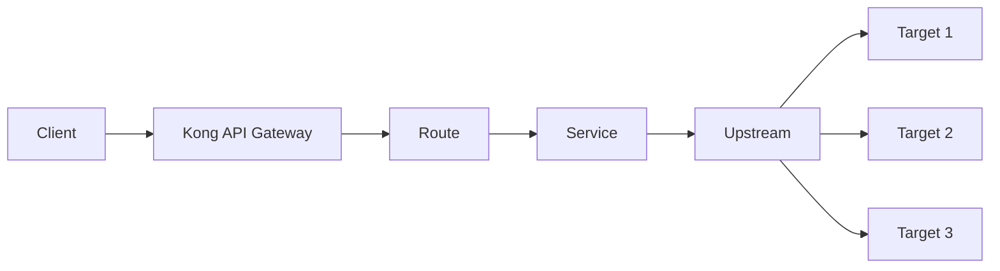

# Kong Targets

## Introduction

Kong Targets are a fundamental concept in Kong API Gateway that work hand-in-hand with Upstreams to provide sophisticated load balancing capabilities. In Kong's architecture, Targets represent the individual servers or instances that receive traffic forwarded through the gateway. When you're building modern microservices applications, proper target configuration is crucial for ensuring reliability, scalability, and fault tolerance.

This guide will walk you through everything you need to know about Kong Targets, from basic concepts to advanced configuration techniques.

## Understanding Upstreams and Targets

Before diving deeper into Targets, let's clarify how they fit into Kong's architecture:



In Kong's ecosystem:
- **Upstream** is a virtual hostname that represents a group of targets
- **Targets** are the actual backend instances (IP address/hostname + port) where requests are forwarded

This separation allows Kong to implement advanced load balancing and health checking functionality.

## Creating and Managing Targets

### Kong Admin API

The primary way to manage Targets is through Kong's Admin API. Here's how to add a Target to an existing Upstream:

```bash
# Add a new target to an upstream
curl -X POST http://kong:8001/upstreams/my-upstream/targets \
  --data "target=service-instance.example.com:8000" \
  --data "weight=100"
```

### Kong Declarative Configuration (YAML)

If you're using Kong's declarative config, you can define Targets within your YAML file:

```yaml
_format_version: "2.1"
_transform: true

upstreams:
  - name: my-upstream
    targets:
      - target: service-instance-1.example.com:8000
        weight: 100
      - target: service-instance-2.example.com:8000
        weight: 50
```

## Key Concepts and Properties

### Target Address Format

A Target is specified using the format:

```
hostname:port
```

For example:
- `service.example.com:8000`
- `192.168.1.25:80`

### Weight Property

The `weight` property determines how much traffic each Target receives relative to other Targets in the same Upstream:

- Higher weight = more traffic
- Setting weight to 0 disables the Target without removing it
- Default weight is 100

### Example: Traffic Distribution

With the following configuration:

```yaml
targets:
  - target: instance1.example.com:8000
    weight: 100
  - target: instance2.example.com:8000
    weight: 200
```

Traffic distribution will be:
- `instance1`: ~33% of traffic (100/300)
- `instance2`: ~67% of traffic (200/300)

## Health Checks and Target Health

Kong can actively check the health of your Targets to ensure traffic is only routed to healthy instances.

### Configuring Health Checks

Here's an example of configuring health checks for an Upstream:

```bash
curl -X POST http://kong:8001/upstreams \
  --data "name=my-upstream" \
  --data "healthchecks.active.healthy.interval=5" \
  --data "healthchecks.active.healthy.successes=2" \
  --data "healthchecks.active.unhealthy.interval=5" \
  --data "healthchecks.active.unhealthy.http_failures=2"
```

### Passive Health Checks

Kong also supports passive health checks, which detect failures in regular traffic:

```bash
curl -X PATCH http://kong:8001/upstreams/my-upstream \
  --data "healthchecks.passive.healthy.successes=5" \
  --data "healthchecks.passive.unhealthy.http_failures=5"
```

## Real-World Applications

### Blue-Green Deployments

Kong Targets make blue-green deployments straightforward. Here's an example workflow:

1. Start with all traffic going to v1:

```bash
curl -X POST http://kong:8001/upstreams/my-service/targets \
  --data "target=my-service-v1.example.com:8000" \
  --data "weight=100"
```

2. Deploy v2 and gradually shift traffic:

```bash
# Add v2 with a small weight
curl -X POST http://kong:8001/upstreams/my-service/targets \
  --data "target=my-service-v2.example.com:8000" \
  --data "weight=25"

# Later, adjust weights to shift more traffic
curl -X POST http://kong:8001/upstreams/my-service/targets \
  --data "target=my-service-v2.example.com:8000" \
  --data "weight=75"

# Finally, remove v1 or set its weight to 0
curl -X POST http://kong:8001/upstreams/my-service/targets \
  --data "target=my-service-v1.example.com:8000" \
  --data "weight=0"
```

### Microservices Load Balancing

When building microservices, you can use Kong Targets to distribute load across multiple instances:

```yaml
_format_version: "2.1"
_transform: true

services:
  - name: user-service
    url: http://user-service-upstream
    routes:
      - name: user-api
        paths:
          - /users

upstreams:
  - name: user-service-upstream
    targets:
      - target: user-service-1.internal:8080
        weight: 100
      - target: user-service-2.internal:8080
        weight: 100
      - target: user-service-3.internal:8080
        weight: 100
```

## Advanced Target Configuration

### Dynamic Reconfiguration

One of Kong's strengths is the ability to reconfigure Targets without downtime. You can add, remove, or modify Targets on the fly:

```bash
# Add a new instance during traffic spike
curl -X POST http://kong:8001/upstreams/my-upstream/targets \
  --data "target=scaling-instance.example.com:8000" \
  --data "weight=100"

# When traffic returns to normal, remove it
curl -X POST http://kong:8001/upstreams/my-upstream/targets \
  --data "target=scaling-instance.example.com:8000" \
  --data "weight=0"
```

### DNS-based Target Resolution

Kong can resolve DNS hostnames in Targets and automatically handle changes:

```bash
curl -X PATCH http://kong:8001/upstreams/my-upstream \
  --data "host_header=original-host.com" \
  --data "slots=1000" \
  --data "hash_on=cookie" \
  --data "hash_on_cookie=session" \
  --data "hash_fallback=ip"
```

## Best Practices

1. **Use meaningful naming conventions** for your Upstreams and services to make management easier.

2. **Start with equal weights** and adjust based on performance metrics.

3. **Configure health checks** to ensure high availability.

4. **Implement circuit breakers** with passive health checks to prevent cascading failures.

5. **Regularly clean up old Targets** that are no longer in use:

```bash
curl -X DELETE http://kong:8001/upstreams/my-upstream/targets/target-id
```

## Troubleshooting Common Issues

### Target Connection Refused

If Kong reports connection issues to your Targets:

1. Verify the Target is running and accessible
2. Check network configurations and firewall rules
3. Ensure Kong has network access to the Target
4. Verify the Target port is correct and open

### Uneven Load Distribution

If traffic isn't distributed as expected:

1. Check Target weights
2. Verify health check configurations
3. Look for any Target-specific issues causing slowdowns

## Summary

Kong Targets are a powerful mechanism for directing traffic to backend services with advanced load balancing capabilities. When used effectively with Upstreams, they provide:

- Flexible traffic distribution
- High availability through health checks
- Support for blue-green deployments and canary releases
- Seamless scaling of backend services

By understanding how to configure and manage Targets, you can build more resilient, scalable API infrastructures with Kong.

## Additional Resources

- Try creating an Upstream with multiple Targets and experiment with different weight configurations
- Implement health checks for your Upstream and simulate failures to see how Kong responds
- Practice a blue-green deployment using Target weight adjustments
- Explore Kong's load balancing algorithms and how they affect Target selection