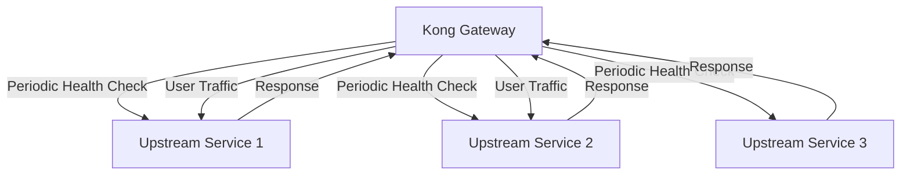
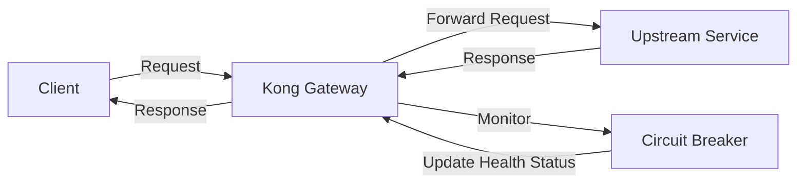

# Kong Health Checks

## Introduction

Health checks are a critical component of any robust microservice architecture. In Kong API Gateway, health checks provide automated monitoring of your upstream services, allowing Kong to detect when services become unavailable and redirect traffic accordingly. This mechanism helps maintain high availability and improves the overall reliability of your API ecosystem.

Kong's health check functionality periodically sends probe requests to your upstream targets. Based on the responses received, Kong determines whether these targets are healthy and should receive traffic, or unhealthy and should be temporarily removed from the load balancing pool.

## Understanding Kong Health Checks

Kong offers two complementary types of health checks:

1. **Active health checks**: Kong proactively sends periodic requests to verify service availability
2. **Passive health checks (circuit breakers)**: Kong monitors live traffic for failures

Let's explore each type in detail.

### Active Health Checks

Active health checks involve Kong periodically sending HTTP/HTTPS requests to each target in your upstream service. These dedicated probe requests occur in the background and are separate from regular user traffic.



#### Key Configuration Parameters

Active health checks can be configured with several parameters:

| Parameter | Description |
|-----------|-------------|
| `active.healthy.interval` | Interval between health checks for healthy targets (in seconds) |
| `active.unhealthy.interval` | Interval between health checks for unhealthy targets (in seconds) |
| `active.timeout` | Socket timeout for health check requests (in seconds) |
| `active.concurrency` | Number of concurrent health checks |
| `active.http_path` | Path to use for HTTP health checks |
| `active.healthy.threshold` | Number of successes to consider a target healthy |
| `active.unhealthy.threshold` | Number of failures to consider a target unhealthy |

### Passive Health Checks

Passive health checks (also known as circuit breakers) monitor the ongoing traffic between Kong and your upstream services. Instead of sending dedicated probe requests, Kong analyzes actual traffic patterns and responses to detect failures.



#### Key Configuration Parameters

Passive health checks can be customized with these parameters:

| Parameter | Description |
|-----------|-------------|
| `passive.healthy.successes` | Number of successes to consider a target healthy |
| `passive.unhealthy.timeouts` | Number of timeouts to consider a target unhealthy |
| `passive.unhealthy.http_failures` | Number of HTTP failures to consider a target unhealthy |
| `passive.unhealthy.tcp_failures` | Number of TCP failures to consider a target unhealthy |

## Implementing Health Checks in Kong

Let's walk through the process of setting up health checks for your Kong services.

### Prerequisites

Before configuring health checks, you need:

1. Kong Gateway installed and running
2. An upstream service configured in Kong
3. Admin access to Kong's configuration

### Step 1: Configure an Upstream with Targets

First, we'll create an upstream service with multiple targets:

```bash
# Create an upstream
curl -X POST http://localhost:8001/upstreams \
  --data "name=my-api-service"

# Add targets to the upstream
curl -X POST http://localhost:8001/upstreams/my-api-service/targets \
  --data "target=service1:8000" \
  --data "weight=100"

curl -X POST http://localhost:8001/upstreams/my-api-service/targets \
  --data "target=service2:8000" \
  --data "weight=100"
```

### Step 2: Configure Active Health Checks

Now, let's enable active health checks for our upstream:

```bash
curl -X PATCH http://localhost:8001/upstreams/my-api-service \
  --data "healthchecks.active.healthy.interval=5" \
  --data "healthchecks.active.healthy.successes=2" \
  --data "healthchecks.active.healthy.http_statuses=200,201,202" \
  --data "healthchecks.active.unhealthy.interval=5" \
  --data "healthchecks.active.unhealthy.http_failures=2" \
  --data "healthchecks.active.unhealthy.http_statuses=429,404,500,501,502,503,504,505" \
  --data "healthchecks.active.unhealthy.timeouts=3" \
  --data "healthchecks.active.http_path=/health"
```

This configuration:
- Checks healthy targets every 5 seconds
- Checks unhealthy targets every 5 seconds
- Requires 2 successful responses to mark a target as healthy
- Requires 2 failed responses to mark a target as unhealthy
- Considers HTTP status codes 200, 201, 202 as successful
- Considers HTTP status codes 429, 404, 500-505 as failures
- Sets 3 seconds as the timeout threshold
- Sends health check requests to the `/health` endpoint

### Step 3: Configure Passive Health Checks

Let's also enable passive health checks:

```bash
curl -X PATCH http://localhost:8001/upstreams/my-api-service \
  --data "healthchecks.passive.healthy.successes=5" \
  --data "healthchecks.passive.unhealthy.http_failures=5" \
  --data "healthchecks.passive.unhealthy.http_statuses=429,500,503" \
  --data "healthchecks.passive.unhealthy.tcp_failures=2" \
  --data "healthchecks.passive.unhealthy.timeouts=7"
```

This configuration:
- Requires 5 successful responses to mark a previously unhealthy target as healthy again
- Requires 5 HTTP failures to mark a target as unhealthy
- Considers HTTP status codes 429, 500, 503 as failures
- Requires 2 TCP failures to mark a target as unhealthy
- Sets 7 seconds as the timeout threshold

### Step 4: Configure a Service and Route

Finally, let's connect everything by creating a service and route that uses our upstream:

```bash
# Create a service using the upstream
curl -X POST http://localhost:8001/services \
  --data "name=my-api" \
  --data "host=my-api-service"

# Create a route for the service
curl -X POST http://localhost:8001/services/my-api/routes \
  --data "name=my-api-route" \
  --data "paths[]=/api"
```

## Declarative Configuration with Kong YAML

For those using declarative configuration, here's how to define health checks in your Kong YAML file:

```yaml
_format_version: "2.1"
_transform: true

upstreams:
  - name: my-api-service
    healthchecks:
      active:
        healthy:
          interval: 5
          http_statuses:
            - 200
            - 201
            - 202
          successes: 2
        unhealthy:
          interval: 5
          http_failures: 2
          http_statuses:
            - 429
            - 404
            - 500
            - 501
            - 502
            - 503
            - 504
            - 505
          timeouts: 3
        http_path: /health
        timeout: 1
        concurrency: 10
      passive:
        healthy:
          http_statuses:
            - 200
            - 201
            - 202
          successes: 5
        unhealthy:
          http_failures: 5
          http_statuses:
            - 429
            - 500
            - 503
          tcp_failures: 2
          timeouts: 7
    slots: 100
    targets:
      - target: service1:8000
        weight: 100
      - target: service2:8000
        weight: 100

services:
  - name: my-api
    host: my-api-service
    routes:
      - name: my-api-route
        paths:
          - /api
```

## Creating a Health Check Endpoint

For active health checks to work effectively, your services should expose a dedicated health check endpoint. Here's a simple example using Node.js and Express:

```javascript
const express = require('express');
const app = express();
const port = 8000;

// Regular API endpoints
app.get('/api/users', (req, res) => {
  res.json({ users: ['Alice', 'Bob', 'Charlie'] });
});

// Health check endpoint
app.get('/health', (req, res) => {
  // Check critical dependencies
  const databaseHealthy = checkDatabaseConnection();
  const cacheHealthy = checkCacheConnection();
  
  if (databaseHealthy && cacheHealthy) {
    // All systems operational
    res.status(200).json({
      status: 'healthy',
      timestamp: new Date().toISOString(),
      services: {
        database: 'connected',
        cache: 'connected'
      }
    });
  } else {
    // Report unhealthy status with details
    res.status(503).json({
      status: 'unhealthy',
      timestamp: new Date().toISOString(),
      services: {
        database: databaseHealthy ? 'connected' : 'disconnected',
        cache: cacheHealthy ? 'connected' : 'disconnected'
      }
    });
  }
});

// Mock dependency check functions
function checkDatabaseConnection() {
  // In a real app, check actual database connection
  return true;
}

function checkCacheConnection() {
  // In a real app, check actual cache connection
  return true;
}

app.listen(port, () => {
  console.log(`Service running on port ${port}`);
});
```

## Advanced Health Check Strategies

### Threshold Tuning

Finding the right balance for your health check thresholds is crucial:

- **Too sensitive**: Services might be marked unhealthy due to occasional network glitches
- **Too lenient**: Unhealthy services might continue receiving traffic, causing user-facing errors

Start with moderate thresholds and adjust based on observed behavior in your environment.

### HTTP vs. HTTPS Health Checks

Kong supports both HTTP and HTTPS health checks. For production environments, HTTPS health checks provide additional security:

```bash
curl -X PATCH http://localhost:8001/upstreams/my-api-service \
  --data "healthchecks.active.type=https" \
  --data "healthchecks.active.https_verify_certificate=true"
```

### Custom Headers

You can add custom headers to health check requests, which is useful for authorization or identifying health check traffic:

```bash
curl -X PATCH http://localhost:8001/upstreams/my-api-service \
  --data "healthchecks.active.headers.X-Health-Check=true" \
  --data "healthchecks.active.headers.Authorization=Bearer your-token"
```

## Monitoring Health Check Status

Kong provides several ways to monitor the health status of your targets:

### Using Admin API

```bash
# Get health status for all targets in an upstream
curl http://localhost:8001/upstreams/my-api-service/health

# Sample response
{
  "total": 2,
  "data": [
    {
      "created_at": 1614695642,
      "health": "HEALTHY",
      "id": "a9f03889-b6cb-4d9d-8f6d-93f59acf5319",
      "target": "service1:8000",
      "upstream": {"id": "7f8598f3-4d95-4f14-9a0f-b841eca8cff1"}
    },
    {
      "created_at": 1614695647,
      "health": "UNHEALTHY",
      "id": "b2d4b79b-cfb7-4ef5-89c1-b3e6d4bcc202",
      "target": "service2:8000",
      "upstream": {"id": "7f8598f3-4d95-4f14-9a0f-b841eca8cff1"}
    }
  ]
}
```

### Using Kong Manager

If you're using Kong Manager (Kong's web UI), you can view the health status of all targets in the "Upstreams" section.

## Real-World Example: Multiple Datacenters

Let's implement a more complex example with Kong health checks for services across multiple datacenters:

```yaml
_format_version: "2.1"
_transform: true

upstreams:
  - name: user-service
    healthchecks:
      active:
        healthy:
          interval: 5
          http_statuses:
            - 200
          successes: 2
        unhealthy:
          interval: 3
          http_failures: 3
          http_statuses:
            - 429
            - 500
            - 503
          timeouts: 2
        http_path: /health/status
        timeout: 1
        concurrency: 5
      passive:
        healthy:
          successes: 3
        unhealthy:
          http_failures: 5
          http_statuses:
            - 429
            - 500
            - 503
          timeouts: 3
    targets:
      # Primary datacenter
      - target: user-service-dc1.example.com:443
        weight: 100
      - target: user-service-dc1-backup.example.com:443
        weight: 50
      # Secondary datacenter
      - target: user-service-dc2.example.com:443
        weight: 75
      - target: user-service-dc2-backup.example.com:443
        weight: 25

services:
  - name: user-api
    host: user-service
    port: 443
    protocol: https
    routes:
      - name: user-endpoints
        paths:
          - /users
```

This configuration:
- Sets up a user service with targets across two datacenters (DC1 and DC2)
- Assigns different weights to primary and backup instances
- Uses HTTPS for health checks
- Implements both active and passive health checks
- Routes `/users` requests to the upstream service

## Troubleshooting Common Issues

### Target Incorrectly Marked as Unhealthy

If targets are incorrectly marked as unhealthy:

1. Check if the health endpoint is responding properly:
   ```bash
   curl -i https://service1:8000/health
   ```

2. Verify network connectivity between Kong and your targets

3. Check timeout settings (target might be responding too slowly)

4. Review your health check thresholds (they might be too strict)

### All Targets Unhealthy

If all targets for an upstream become unhealthy, Kong will:

1. Return an error for new requests to that upstream
2. Continue health checks to detect when targets become healthy again

To avoid service disruption, consider:
- Using a higher unhealthy threshold to prevent false positives
- Implementing backup services
- Setting up alerts for when targets become unhealthy

## Best Practices

1. **Use both active and passive health checks** for comprehensive monitoring
2. **Implement dedicated health endpoints** that check critical dependencies
3. **Set appropriate thresholds** based on your service reliability and importance
4. **Include multiple targets** in each upstream for redundancy
5. **Monitor health status** through Kong's Admin API or Kong Manager
6. **Set up alerting** when targets become unhealthy
7. **Test failover scenarios** to ensure your configuration works as expected

## Summary

Kong health checks provide a powerful mechanism for ensuring the reliability and availability of your API services. By implementing both active and passive health checks, you can automatically detect and route around failures, providing a better experience for your API consumers.

Key takeaways:
- Active health checks proactively verify service health
- Passive health checks monitor real traffic for failures
- Properly configured health checks improve service reliability
- Well-designed health check endpoints report meaningful status information
- Balancing threshold sensitivity is crucial for optimal performance

## Additional Resources

- [Kong Health Checks Documentation](https://docs.konghq.com/gateway/latest/reference/health-checks-circuit-breakers/)
- [Kong Upstream API Reference](https://docs.konghq.com/gateway/latest/admin-api/#upstream-object)
- [Microservice Health Checks](https://microservices.io/patterns/observability/health-check-api.html)

## Exercises

1. Configure active and passive health checks for an upstream service using the Kong Admin API.
2. Create a health check endpoint in your favorite programming language that checks database connectivity.
3. Test a failover scenario by shutting down one of your service instances and observing Kong's behavior.
4. Implement a custom health check strategy that considers application-specific metrics.
5. Set up monitoring and alerting for health check status using Kong's Admin API.