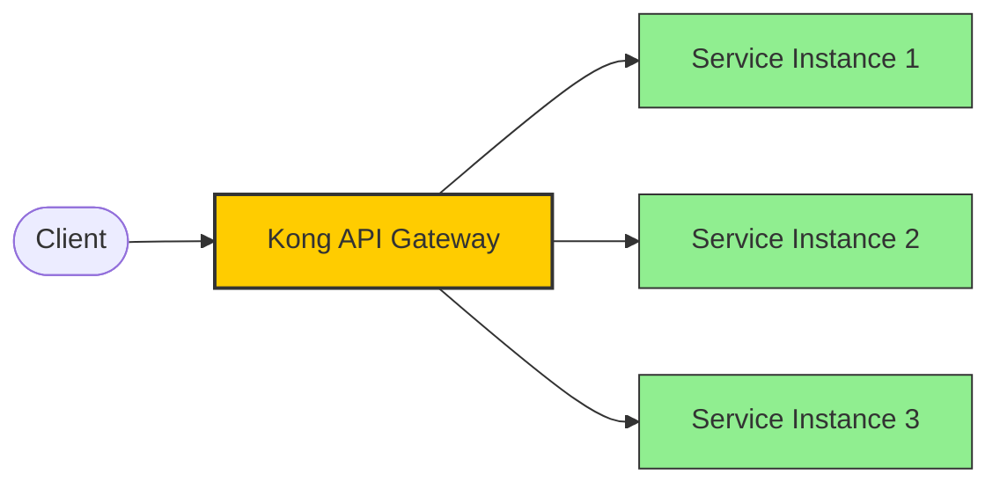
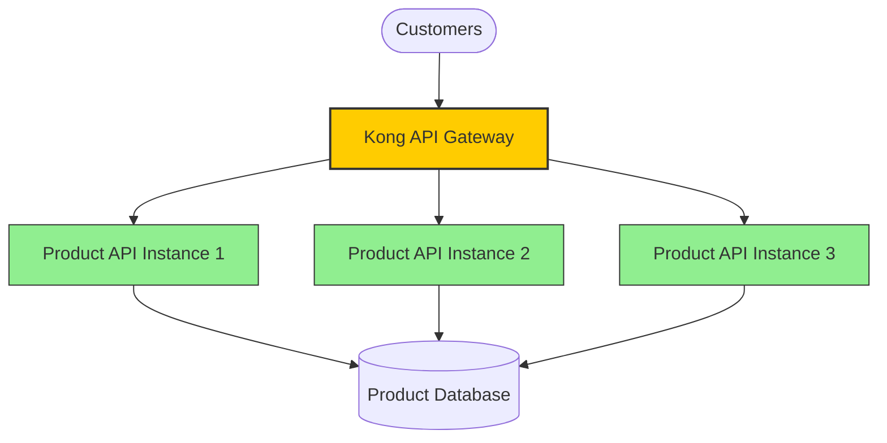

# Kong Load Balancing

## Introduction

Load balancing is a critical component of modern web architecture that helps distribute incoming network traffic across multiple backend servers. In the context of Kong, an open-source API gateway, load balancing enables you to efficiently route client requests to your upstream services while ensuring high availability, reliability, and optimal performance.

In this tutorial, we'll explore how Kong handles load balancing, the different algorithms available, and how to configure load balancing for your services. By the end, you'll have a solid understanding of how to implement Kong's load balancing features to build more resilient applications.

## What is Kong Load Balancing?

Kong acts as a proxy that sits between clients and your upstream services. When configured for load balancing, Kong intelligently distributes incoming requests across multiple instances of your services based on predefined rules and algorithms.

Here's a simplified view of how Kong load balancing works:



## Key Concepts

Before diving into implementation, let's understand some key concepts:

### Upstream

An Upstream object represents a virtual hostname and can be used to load balance incoming requests across multiple services (targets). Upstreams allow you to manage the health of these targets and define load balancing rules.

### Target

A Target is an IP address or hostname with a port that identifies an instance of a backend service. Each upstream can have multiple targets, and Kong will distribute traffic among these targets according to the configured load balancing algorithm.

### Health Checks

Kong can actively monitor the health of your targets through periodic checks. If a target fails these checks, Kong will temporarily remove it from the pool until it recovers.

## Load Balancing Algorithms

Kong supports several load balancing algorithms to distribute traffic:

1. **Round-robin** (default): Requests are distributed sequentially among targets.
2. **Consistent-hashing**: Requests with the same characteristics are sent to the same target.
3. **Least-connections**: Requests are assigned to the target with the least number of active connections.

## Setting Up Kong Load Balancing

Let's walk through the process of setting up load balancing in Kong step by step.

### Step 1: Create an Upstream

First, we need to create an Upstream object that will hold our list of targets:

```bash
curl -X POST http://localhost:8001/upstreams \
  --data "name=my-upstream-service"
```

The response will look like:

```json
{
  "id": "91855277-8fda-4b62-8878-e62a22ad25c1",
  "name": "my-upstream-service",
  "algorithm": "round-robin",
  "hash_on": "none",
  "hash_fallback": "none",
  "hash_on_cookie_path": "/",
  "slots": 10000,
  "healthchecks": {
    "active": {
      "https_verify_certificate": true,
      "unhealthy": {
        "http_statuses": [429, 404, 500, 501, 502, 503, 504, 505],
        "tcp_failures": 0,
        "timeouts": 0,
        "http_failures": 0,
        "interval": 0
      },
      "http_path": "/",
      "timeout": 1,
      "healthy": {
        "http_statuses": [200, 302],
        "interval": 0,
        "successes": 0
      },
      "https_sni": null,
      "concurrency": 10,
      "type": "http"
    },
    "passive": {
      "unhealthy": {
        "http_failures": 0,
        "http_statuses": [429, 500, 503],
        "tcp_failures": 0,
        "timeouts": 0
      },
      "type": "http",
      "healthy": {
        "successes": 0,
        "http_statuses": [200, 201, 202, 203, 204, 205, 206, 207, 208, 226, 300, 301, 302, 303, 304, 305, 306, 307, 308]
      }
    },
    "threshold": 0
  },
  "created_at": 1613151609,
  "tags": null
}
```

### Step 2: Add Targets to the Upstream

Next, we'll add targets to our upstream. These targets represent individual instances of our service:

```bash
curl -X POST http://localhost:8001/upstreams/my-upstream-service/targets \
  --data "target=service-instance1:8000" \
  --data "weight=100"

curl -X POST http://localhost:8001/upstreams/my-upstream-service/targets \
  --data "target=service-instance2:8000" \
  --data "weight=100"

curl -X POST http://localhost:8001/upstreams/my-upstream-service/targets \
  --data "target=service-instance3:8000" \
  --data "weight=100"
```

Response example for one target:

```json
{
  "id": "f4338a7f-5b6d-4318-a8c1-0912df5af802",
  "target": "service-instance1:8000",
  "weight": 100,
  "upstream": { "id": "91855277-8fda-4b62-8878-e62a22ad25c1" },
  "created_at": 1613151690
}
```

### Step 3: Create a Service Pointing to the Upstream

Now, we'll create a Kong Service that points to our upstream:

```bash
curl -X POST http://localhost:8001/services \
  --data "name=my-service" \
  --data "host=my-upstream-service" \
  --data "path=/api"
```

Response:

```json
{
  "id": "7fca84d0-54d4-4373-be8c-afcd5e6434db",
  "name": "my-service",
  "host": "my-upstream-service",
  "path": "/api",
  "protocol": "http",
  "port": 80,
  "created_at": 1613151749,
  "updated_at": 1613151749,
  "retries": 5,
  "connect_timeout": 60000,
  "write_timeout": 60000,
  "read_timeout": 60000
}
```

### Step 4: Add a Route to Access the Service

Finally, we'll create a route to expose our service:

```bash
curl -X POST http://localhost:8001/services/my-service/routes \
  --data "name=my-route" \
  --data "paths[]=/my-service"
```

Response:

```json
{
  "id": "96a9f9e3-0b58-4a17-b4e1-15f75456677a",
  "name": "my-route",
  "paths": ["/my-service"],
  "service": { "id": "7fca84d0-54d4-4373-be8c-afcd5e6434db" },
  "protocols": ["http", "https"],
  "created_at": 1613151810,
  "updated_at": 1613151810,
  "strip_path": true,
  "preserve_host": false
}
```

## Configuring Load Balancing Algorithms

You can specify which load balancing algorithm to use when creating or updating an upstream:

### Round Robin (Default)

```bash
curl -X PATCH http://localhost:8001/upstreams/my-upstream-service \
  --data "algorithm=round-robin"
```

### Consistent Hashing

```bash
curl -X PATCH http://localhost:8001/upstreams/my-upstream-service \
  --data "algorithm=consistent-hashing" \
  --data "hash_on=header" \
  --data "hash_on_header=x-user-id"
```

With consistent hashing, you need to specify what to hash on:
- `hash_on`: Can be set to `header`, `cookie`, `ip`, `path`, or `query_arg`
- `hash_on_header`: When `hash_on=header`, specifies which header to use
- `hash_fallback`: Where to look if the primary hash target is not present

### Least Connections

```bash
curl -X PATCH http://localhost:8001/upstreams/my-upstream-service \
  --data "algorithm=least-connections"
```

## Configuring Health Checks

Health checks are crucial for maintaining high availability. You can configure both active and passive health checks:

### Active Health Checks

Active health checks involve Kong periodically probing your targets:

```bash
curl -X PATCH http://localhost:8001/upstreams/my-upstream-service \
  --data "healthchecks.active.http_path=/health" \
  --data "healthchecks.active.healthy.interval=5" \
  --data "healthchecks.active.healthy.successes=2" \
  --data "healthchecks.active.unhealthy.interval=5" \
  --data "healthchecks.active.unhealthy.http_failures=2"
```

### Passive Health Checks

Passive health checks monitor the traffic that naturally flows through Kong:

```bash
curl -X PATCH http://localhost:8001/upstreams/my-upstream-service \
  --data "healthchecks.passive.healthy.successes=2" \
  --data "healthchecks.passive.unhealthy.http_failures=2"
```

## Real-World Example: Microservices Architecture

Let's look at a practical example of using Kong load balancing in a microservices architecture:

Imagine you have a product service that is critical to your e-commerce application. To ensure high availability, you deploy three instances of this service. You want to distribute traffic evenly but also ensure that if any instance fails, traffic is automatically rerouted.



### Implementation Steps:

1. Create an upstream for the product service:

```bash
curl -X POST http://localhost:8001/upstreams \
  --data "name=product-service" \
  --data "algorithm=round-robin"
```

2. Add the three service instances as targets:

```bash
curl -X POST http://localhost:8001/upstreams/product-service/targets \
  --data "target=product-api-1:8000" \
  --data "weight=100"

curl -X POST http://localhost:8001/upstreams/product-service/targets \
  --data "target=product-api-2:8000" \
  --data "weight=100"

curl -X POST http://localhost:8001/upstreams/product-service/targets \
  --data "target=product-api-3:8000" \
  --data "weight=100"
```

3. Configure health checks:

```bash
curl -X PATCH http://localhost:8001/upstreams/product-service \
  --data "healthchecks.active.http_path=/health" \
  --data "healthchecks.active.healthy.interval=5" \
  --data "healthchecks.active.healthy.successes=2" \
  --data "healthchecks.active.unhealthy.interval=5" \
  --data "healthchecks.active.unhealthy.http_failures=2" \
  --data "healthchecks.passive.healthy.successes=2" \
  --data "healthchecks.passive.unhealthy.http_failures=2"
```

4. Create a service pointing to the upstream:

```bash
curl -X POST http://localhost:8001/services \
  --data "name=product-api" \
  --data "host=product-service" \
  --data "path=/api/products"
```

5. Create a route:

```bash
curl -X POST http://localhost:8001/services/product-api/routes \
  --data "name=product-route" \
  --data "paths[]=/products"
```

Now, when customers access `/products`, Kong will distribute their requests across the three product API instances. If any instance fails the health checks, Kong will automatically stop routing traffic to it until it recovers.

## Advanced Configuration: Weighted Load Balancing

Sometimes, you might want to distribute traffic unevenly across your targets. For example, if one target is more powerful than the others, you can assign it a higher weight:

```bash
curl -X POST http://localhost:8001/upstreams/my-upstream-service/targets \
  --data "target=powerful-instance:8000" \
  --data "weight=200"

curl -X POST http://localhost:8001/upstreams/my-upstream-service/targets \
  --data "target=regular-instance-1:8000" \
  --data "weight=100"

curl -X POST http://localhost:8001/upstreams/my-upstream-service/targets \
  --data "target=regular-instance-2:8000" \
  --data "weight=100"
```

In this example, `powerful-instance` will receive approximately twice as many requests as each of the regular instances.

## Using the Kong Admin GUI

While we've shown the API-based approach, you can also configure load balancing through the Kong Admin GUI if you have Kong Manager installed:

1. Navigate to the Kong Manager dashboard
2. Go to the "Upstreams" section and click "New Upstream"
3. Fill in the details for your upstream configuration
4. After creating the upstream, you can add targets by navigating to the upstream details page
5. Create services and routes that point to your upstream

## Summary

Kong's load balancing capabilities provide a powerful way to distribute traffic across your services, ensuring high availability and optimal performance. In this tutorial, we've covered:

- Basic concepts of Kong load balancing (upstreams and targets)
- How to set up and configure load balancing using Kong's Admin API
- Different load balancing algorithms and when to use them
- Health check configuration for automatic failover
- A real-world example of implementing load balancing in a microservices architecture
- Advanced configuration like weighted load balancing

By implementing these load balancing techniques, you can build more resilient and scalable applications that can handle high traffic volumes and gracefully handle failures.

## Additional Resources

- **Practice Exercise**: Try implementing a round-robin load balancer for a simple web service with 3 instances and test failover by shutting down one of the instances.
- **Challenge**: Implement consistent hashing load balancing based on a specific header to ensure that users are always directed to the same backend server.
- **Experiment**: Compare the performance of different load balancing algorithms under various traffic patterns.

As you continue to work with Kong, you'll discover even more ways to leverage its load balancing features to build robust, highly available systems.