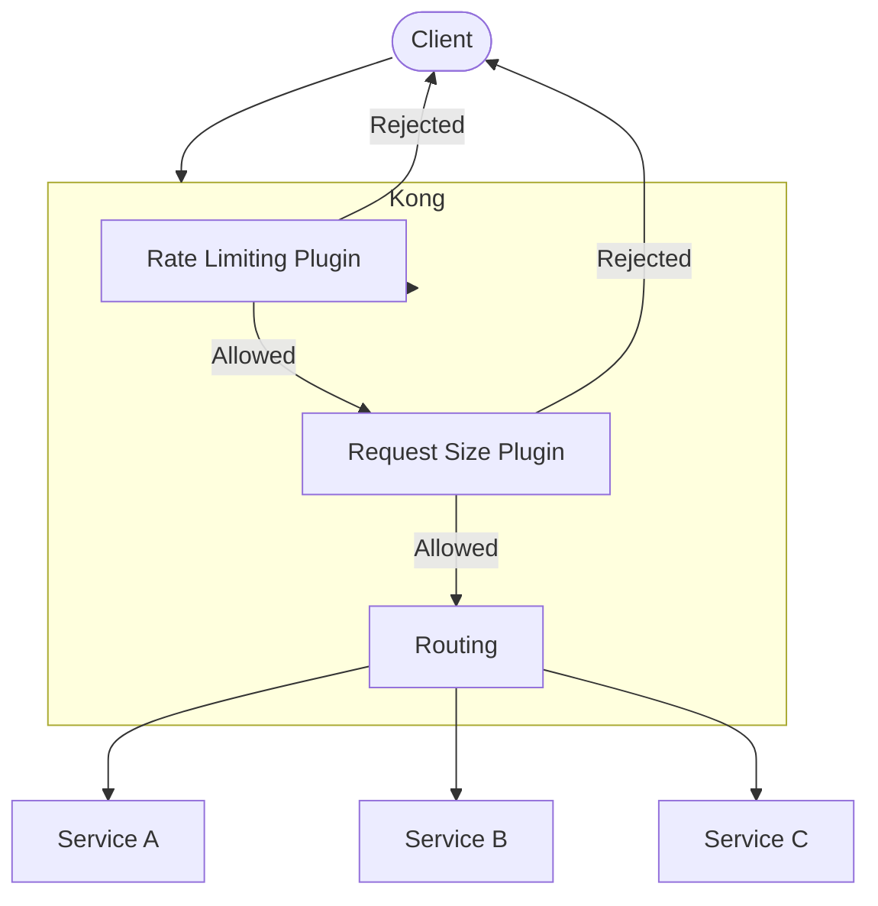

# Kong Traffic Control

## Introduction

Traffic control is a critical aspect of managing APIs and microservices in modern applications. As your services gain popularity, managing the flow of requests becomes essential to ensure reliability, security, and optimal performance. Kong, a powerful API gateway, provides robust traffic control capabilities that help you regulate how clients interact with your backend services.

In this guide, we'll explore Kong's traffic control features, understand their importance, and learn how to implement them in real-world scenarios. Traffic control with Kong allows you to:

- Protect your services from being overwhelmed
- Ensure fair resource allocation among consumers
- Mitigate potential security threats
- Optimize performance during peak usage periods
- Create tiered service levels for different users

Whether you're running a small application or a large-scale microservices architecture, understanding traffic control is essential for maintaining the health and reliability of your systems.

## Key Traffic Control Concepts

Before diving into specific implementations, let's understand the core traffic control concepts in Kong:

### Rate Limiting

Rate limiting restricts how many requests a consumer can make to your API within a specific time window. This prevents any single client from overwhelming your services and ensures fair usage across all consumers.

### Request Termination

Request termination allows you to immediately stop specific requests from reaching your services based on predefined conditions. This provides a safety mechanism to protect your backend.

### Request Size Limiting

This feature restricts the size of requests that clients can send to your API, preventing potential abuse from overly large payloads.

### Proxy Caching

While not strictly a traffic control feature, proxy caching significantly reduces traffic to your backend by storing and serving frequently requested responses.

### Traffic Routing and Load Balancing

Kong can distribute traffic across multiple backend instances, ensuring no single server gets overloaded.

## Implementing Rate Limiting in Kong

Rate limiting is one of the most commonly used traffic control features. Let's see how to implement it in Kong:

### Basic Rate Limiting

You can enable rate limiting through Kong's Admin API or declaratively using Kong configuration files.

Here's how to enable rate limiting using the Admin API:

```bash
curl -X POST http://localhost:8001/services/your-service/plugins \
  --data "name=rate-limiting" \
  --data "config.minute=5" \
  --data "config.hour=100"
```

This configuration limits consumers to 5 requests per minute and 100 requests per hour.

If you prefer a declarative approach using YAML configuration:

```yaml
_format_version: "2.1"
services:
- name: your-service
  url: http://your-backend-service:8000
  plugins:
  - name: rate-limiting
    config:
      minute: 5
      hour: 100
      policy: local
```

### Advanced Rate Limiting

Kong offers more advanced rate limiting options for sophisticated scenarios:

1. **Per-consumer rate limiting**: Apply different limits to different consumers

```bash
curl -X POST http://localhost:8001/consumers/consumer-123/plugins \
  --data "name=rate-limiting" \
  --data "config.minute=10" \
  --data "config.hour=200"
```

2. **Response headers**: Kong can add headers to responses indicating rate limit status

```yaml
_format_version: "2.1"
services:
- name: your-service
  url: http://your-backend-service:8000
  plugins:
  - name: rate-limiting
    config:
      minute: 5
      hour: 100
      policy: local
      header_name: X-RateLimit-Remaining-Minute
```

The client will receive headers like `X-RateLimit-Remaining-Minute: 4` indicating their remaining request quota.

### Rate Limiting Policies

Kong supports different rate limiting policies:

- **local**: Stores counters locally in-memory on the node
- **redis**: Uses Redis as a centralized store (recommended for clustered deployments)
- **cluster**: Uses Kong's cluster-wide data store

For production environments with multiple Kong nodes, Redis is recommended:

```yaml
_format_version: "2.1"
services:
- name: your-service
  url: http://your-backend-service:8000
  plugins:
  - name: rate-limiting
    config:
      minute: 5
      hour: 100
      policy: redis
      redis_host: redis-server
      redis_port: 6379
      redis_timeout: 2000
```

## Implementing Request Size Limiting

To protect your services from excessively large requests, you can use the request-size-limiting plugin:

```bash
curl -X POST http://localhost:8001/services/your-service/plugins \
  --data "name=request-size-limiting" \
  --data "config.allowed_payload_size=10"
```

This limits request sizes to 10 megabytes. In YAML configuration:

```yaml
_format_version: "2.1"
services:
- name: your-service
  url: http://your-backend-service:8000
  plugins:
  - name: request-size-limiting
    config:
      allowed_payload_size: 10
```

When a client attempts to upload content larger than the limit, Kong will respond with HTTP 413 (Request Entity Too Large).

## Traffic Control with Route-Level Rules

Traffic control can be applied at different levels in Kong. Applying rules at the route level allows for more granular control:

```yaml
_format_version: "2.1"
services:
- name: user-service
  url: http://user-service:8000
  routes:
  - name: user-create
    paths:
    - /users
    methods:
    - POST
    plugins:
    - name: rate-limiting
      config:
        minute: 2
        hour: 20
  - name: user-read
    paths:
    - /users
    methods:
    - GET
    plugins:
    - name: rate-limiting
      config:
        minute: 20
        hour: 200
```

In this example, we apply stricter rate limits to the creation of users than to reading user data.

## Advanced Traffic Management with Kong

Let's look at some more advanced traffic control scenarios:

### Circuit Breaker Pattern

The circuit breaker pattern prevents cascading failures by monitoring for failures and stopping requests when failure rates exceed a threshold. Kong can implement this using the circuit-breaker plugin:

```yaml
_format_version: "2.1"
services:
- name: your-service
  url: http://your-backend-service:8000
  plugins:
  - name: circuit-breaker
    config:
      timeout: 60
      failures: 5
      reset: 60
```

This configuration will "open the circuit" (stop forwarding requests) after 5 failures within 60 seconds, and will reset after 60 seconds.

### Tiered Rate Limiting by Consumer Groups

You can create tiered service levels with different rate limits based on consumer groups:

```yaml
_format_version: "2.1"
consumer_groups:
- name: premium
  plugins:
  - name: rate-limiting
    config:
      minute: 100
      hour: 1000
- name: basic
  plugins:
  - name: rate-limiting
    config:
      minute: 10
      hour: 100
```

Then assign consumers to these groups:

```bash
curl -X POST http://localhost:8001/consumers/consumer-123/consumer_groups \
  --data "group=premium"
```

### Request Termination for Maintenance

During maintenance periods, you might want to gracefully terminate specific requests:

```yaml
_format_version: "2.1"
services:
- name: your-service
  url: http://your-backend-service:8000
  routes:
  - name: write-operations
    paths:
    - /api
    methods:
    - POST
    - PUT
    - PATCH
    - DELETE
    plugins:
    - name: request-termination
      config:
        status_code: 503
        message: "Write operations temporarily disabled for maintenance"
```

This configuration allows read operations to continue while blocking write operations during maintenance.

## Visualizing Traffic Flow with Kong

Let's visualize a basic Kong traffic control setup:



## Real-world Example: E-commerce API Protection

Let's consider a real-world example of an e-commerce platform with different API endpoints:

```yaml
_format_version: "2.1"
services:
- name: product-catalog
  url: http://product-service:8000
  routes:
  - name: browse-products
    paths:
    - /products
    methods:
    - GET
    plugins:
    - name: rate-limiting
      config:
        minute: 60
        hour: 1000
        policy: redis

- name: checkout-service
  url: http://checkout-service:8000
  routes:
  - name: process-payment
    paths:
    - /checkout/payment
    methods:
    - POST
    plugins:
    - name: rate-limiting
      config:
        minute: 5
        hour: 20
        policy: redis
    - name: request-size-limiting
      config:
        allowed_payload_size: 2
```

In this configuration:
- Browsing products has a relatively high rate limit (60 requests per minute)
- Payment processing has a stricter limit (5 requests per minute) and a request size limit of 2MB

This approach protects critical payment processing endpoints while allowing generous access to product browsing functionality.

## Monitoring Kong Traffic Control

Proper monitoring is essential to fine-tune traffic control policies. Kong provides metrics on rate limiting and other plugin activities through its Prometheus plugin:

```yaml
_format_version: "2.1"
plugins:
- name: prometheus
  config:
    status_code_metrics: true
    latency_metrics: true
    upstream_health_metrics: true
```

With Prometheus and Grafana, you can create dashboards to visualize:
- Rate limit rejections
- Request size violations
- Traffic patterns across services and routes
- Consumer usage patterns

Using this data, you can adjust your traffic control settings to balance protection and accessibility.

## Best Practices for Kong Traffic Control

Here are some best practices to keep in mind:

1. **Start conservatively**: Begin with higher limits and gradually reduce them based on actual usage patterns.

2. **Use response headers**: Enable rate limit response headers to help clients adapt their behavior.

3. **Layer your defenses**: Combine multiple traffic control mechanisms (rate limiting + request size limiting + circuit breakers).

4. **Different limits for different endpoints**: Apply stricter limits to write operations and critical endpoints.

5. **Monitor and adjust**: Regularly review traffic patterns and adjust limits accordingly.

6. **Consider business impact**: Balance technical concerns with business needs when setting limits.

7. **Communicate limits to developers**: Document your rate limits in your API documentation.

8. **Use Redis for distributed deployments**: For multi-node Kong clusters, use Redis as the rate limiting policy.

## Troubleshooting Kong Traffic Control

If you're experiencing issues with Kong traffic control, here are some common troubleshooting steps:

### Rate limiting not working

1. Verify the plugin is properly configured:
```bash
curl -X GET http://localhost:8001/services/your-service/plugins
```

2. Check if you're using the correct consumer identification (API keys, JWT, etc.).

3. If using Redis, verify Redis connectivity:
```bash
curl -X GET http://localhost:8001/status
```

### Too many rejected requests

1. Review your current limits and adjust if necessary:
```bash
curl -X PATCH http://localhost:8001/services/your-service/plugins/{plugin-id} \
  --data "config.minute=10"
```

2. Check logs for patterns of abuse vs. legitimate traffic.

## Exercises

To deepen your understanding of Kong traffic control, try these exercises:

1. Set up a basic Kong gateway with rate limiting and test it using a tool like Apache Bench or Postman.

2. Implement tiered rate limiting with different limits for anonymous users versus authenticated users.

3. Create a circuit breaker configuration that protects a backend service and test its failure detection.

4. Implement request size limiting and test it by submitting requests of various sizes.

5. Set up Kong Prometheus metrics and create a simple Grafana dashboard to monitor rate limit rejections.

## Summary

Kong's traffic control capabilities provide powerful tools for protecting your services, ensuring fair usage, and maintaining system stability. By implementing rate limiting, request size limiting, and other traffic control mechanisms, you can create a robust API gateway that handles traffic intelligently.

Key takeaways from this guide:

- Traffic control is essential for API reliability and security
- Kong offers multiple traffic control mechanisms that can be combined
- Rate limiting protects services from excessive use
- Different services and routes often need different traffic control policies
- Proper monitoring helps optimize traffic control settings

As you continue working with Kong, you'll develop an intuitive sense for the right traffic control settings for your specific services and user base.

## Additional Resources

To learn more about Kong traffic control, explore these resources:

- Kong Rate Limiting Documentation
- Kong Request Size Limiting Documentation
- Kong Circuit Breaker Pattern
- Kong Enterprise Advanced Rate Limiting

By mastering Kong traffic control, you'll be well-equipped to build resilient, high-performance API gateways that can scale with your application needs.