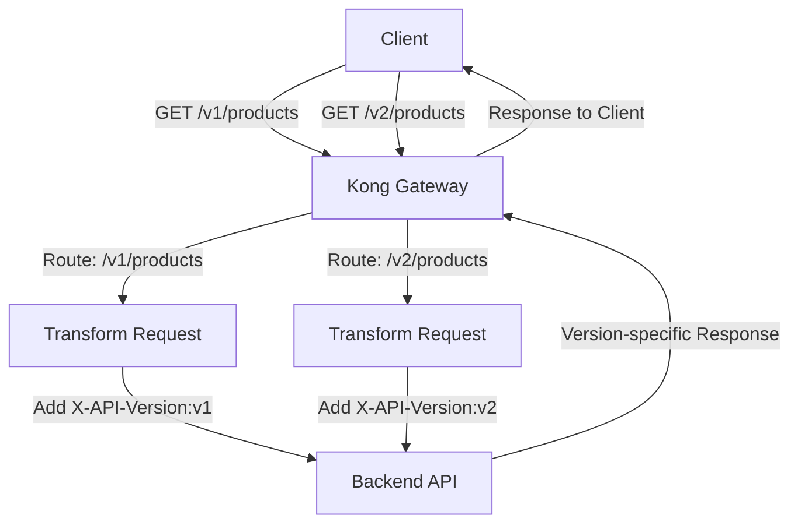

# Kong Service Versioning

## Introduction

API versioning is a critical practice in modern software development that allows you to evolve your APIs while maintaining backward compatibility for existing clients. Kong Gateway provides robust tools for managing multiple versions of your services, enabling smooth transitions between API iterations.

In this guide, we'll explore how to implement service versioning with Kong Gateway, understand different versioning strategies, and see practical examples of versioning in action.

## What is Service Versioning?

Service versioning allows you to maintain multiple versions of your API simultaneously. This is essential when:

- You need to make breaking changes to your API
- Different clients require different API behaviors
- You want to gradually roll out new features
- You need to deprecate old functionality while still supporting existing users

Kong allows you to manage these different versions efficiently through its routing and transformation capabilities.

## Versioning Strategies in Kong

Kong supports several API versioning strategies:

### 1. URL Path Versioning

This is the most straightforward approach, where the version is included in the URL path.

**Example:**
```
https://api.example.com/v1/users
https://api.example.com/v2/users
```

### 2. Query Parameter Versioning

Version information is passed as a query parameter.

**Example:**
```
https://api.example.com/users?version=1
https://api.example.com/users?version=2
```

### 3. Header-based Versioning

The API version is specified in an HTTP header.

**Example:**
```
GET /users HTTP/1.1
Host: api.example.com
Accept-Version: v1
```

### 4. Media Type Versioning (Content Negotiation)

The version is specified in the Accept header using custom media types.

**Example:**
```
GET /users HTTP/1.1
Host: api.example.com
Accept: application/vnd.example.v1+json
```

## Implementing Versioning in Kong

Let's implement each strategy step by step using Kong's configuration.

### URL Path Versioning Implementation

This is the simplest approach to implement in Kong:

```bash
# Create service for v1
curl -X POST http://localhost:8001/services \
  --data "name=users-service-v1" \
  --data "url=http://users-api-v1:3000"

# Create route for v1
curl -X POST http://localhost:8001/services/users-service-v1/routes \
  --data "name=users-route-v1" \
  --data "paths[]=/v1/users"

# Create service for v2
curl -X POST http://localhost:8001/services \
  --data "name=users-service-v2" \
  --data "url=http://users-api-v2:3000"

# Create route for v2
curl -X POST http://localhost:8001/services/users-service-v2/routes \
  --data "name=users-route-v2" \
  --data "paths[]=/v2/users"
```

**How it works:**
1. Requests to `/v1/users` are routed to the v1 backend service
2. Requests to `/v2/users` are routed to the v2 backend service

### Query Parameter Versioning Implementation

For query parameter versioning, we'll use the request-transformer plugin:

```bash
# Create a single service
curl -X POST http://localhost:8001/services \
  --data "name=users-service" \
  --data "url=http://users-api-base:3000"

# Create route for v1
curl -X POST http://localhost:8001/services/users-service/routes \
  --data "name=users-route-v1" \
  --data "paths[]=/users" \
  --data "query_string[]=version:1"

# Configure route to point to v1 backend
curl -X POST http://localhost:8001/routes/users-route-v1/plugins \
  --data "name=request-transformer" \
  --data "config.replace.uri=/v1/users"

# Create route for v2
curl -X POST http://localhost:8001/services/users-service/routes \
  --data "name=users-route-v2" \
  --data "paths[]=/users" \
  --data "query_string[]=version:2"

# Configure route to point to v2 backend
curl -X POST http://localhost:8001/routes/users-route-v2/plugins \
  --data "name=request-transformer" \
  --data "config.replace.uri=/v2/users"
```

**How it works:**
1. Kong matches requests based on the query parameter `version`
2. The request-transformer plugin modifies the request URI to include the version in the path before forwarding to the backend

### Header-based Versioning Implementation

For header-based versioning, we'll use a combination of route conditions and the request-transformer plugin:

```bash
# Create a single service
curl -X POST http://localhost:8001/services \
  --data "name=users-service" \
  --data "url=http://users-api-base:3000"

# Create route for v1
curl -X POST http://localhost:8001/services/users-service/routes \
  --data "name=users-route-v1" \
  --data "paths[]=/users" \
  --data "headers.Accept-Version=v1"

# Configure route to point to v1 backend
curl -X POST http://localhost:8001/routes/users-route-v1/plugins \
  --data "name=request-transformer" \
  --data "config.replace.uri=/v1/users"

# Create route for v2
curl -X POST http://localhost:8001/services/users-service/routes \
  --data "name=users-route-v2" \
  --data "paths[]=/users" \
  --data "headers.Accept-Version=v2"

# Configure route to point to v2 backend
curl -X POST http://localhost:8001/routes/users-route-v2/plugins \
  --data "name=request-transformer" \
  --data "config.replace.uri=/v2/users"
```

**How it works:**
1. Kong matches requests based on the `Accept-Version` header
2. The request-transformer plugin modifies the request URI to include the version in the path

### Media Type Versioning Implementation

For media type versioning, we'll use header matching with regex:

```bash
# Create a single service
curl -X POST http://localhost:8001/services \
  --data "name=users-service" \
  --data "url=http://users-api-base:3000"

# Create route for v1
curl -X POST http://localhost:8001/services/users-service/routes \
  --data "name=users-route-v1" \
  --data "paths[]=/users" \
  --data "headers.Accept=application/vnd.example.v1\\+json"

# Configure route to point to v1 backend
curl -X POST http://localhost:8001/routes/users-route-v1/plugins \
  --data "name=request-transformer" \
  --data "config.replace.uri=/v1/users"

# Create route for v2
curl -X POST http://localhost:8001/services/users-service/routes \
  --data "name=users-route-v2" \
  --data "paths[]=/users" \
  --data "headers.Accept=application/vnd.example.v2\\+json"

# Configure route to point to v2 backend
curl -X POST http://localhost:8001/routes/users-route-v2/plugins \
  --data "name=request-transformer" \
  --data "config.replace.uri=/v2/users"
```

**How it works:**
1. Kong matches requests based on the `Accept` header with a media type that includes version information
2. The request-transformer plugin modifies the request URI to include the version in the path

## Real-world Example: E-commerce API

Let's look at a real-world scenario for an e-commerce platform that needs to version its product catalog API.

### Scenario

- V1 of the API returns basic product information
- V2 adds enhanced product details, pricing tiers, and inventory information
- We need to maintain both versions while gradually migrating clients to V2

### Implementation with Kong Declarative Configuration (YAML)

Here's how we can implement this using Kong's declarative configuration format:

```yaml
_format_version: "2.1"
_transform: true

services:
  - name: product-catalog-service
    url: http://product-api-backend:3000
    routes:
      - name: products-v1-route
        paths:
          - /v1/products
        strip_path: true
        plugins:
          - name: request-transformer
            config:
              replace:
                uri: /products
              add:
                headers:
                  - X-API-Version:v1
      
      - name: products-v2-route
        paths:
          - /v2/products
        strip_path: true
        plugins:
          - name: request-transformer
            config:
              replace:
                uri: /products
              add:
                headers:
                  - X-API-Version:v2
```

In this example:
1. We define a single backend service that handles requests
2. We create two routes, one for each API version
3. We use the request-transformer plugin to add version information in headers
4. The backend service uses the `X-API-Version` header to determine which version of the response to provide

### Visualization of the Versioning Flow



## Best Practices for API Versioning

1. **Choose a Consistent Strategy**: Pick one versioning approach and stick with it across your APIs.

2. **Document Your Versioning Approach**: Make sure clients understand how to specify the version they need.

3. **Version for Breaking Changes Only**: Create new versions only when you make breaking changes, not for minor enhancements.

4. **Support Multiple Versions**: Plan to support at least one previous version during transition periods.

5. **Set Clear Deprecation Timelines**: Communicate when older versions will be retired.

6. **Use Content Negotiation When Possible**: Header-based versioning is less intrusive to your URL structure.

7. **Monitor Version Usage**: Track which clients use which versions to plan migrations.

## Advanced Versioning Techniques

### Canary Releases with Kong

Kong can help you implement canary releases where a percentage of traffic goes to the new version:

```bash
# Create a service for the v1 backend
curl -X POST http://localhost:8001/services \
  --data "name=users-service-v1" \
  --data "url=http://users-api-v1:3000"

# Create a service for the v2 backend
curl -X POST http://localhost:8001/services \
  --data "name=users-service-v2" \
  --data "url=http://users-api-v2:3000"

# Create route for users resource
curl -X POST http://localhost:8001/routes \
  --data "name=users-route" \
  --data "paths[]=/users"

# Apply canary release plugin
curl -X POST http://localhost:8001/routes/users-route/plugins \
  --data "name=canary" \
  --data "config.percentage=20" \
  --data "config.upstream_host=users-service-v2" \
  --data "config.upstream_fallback=users-service-v1"
```

This configuration directs 20% of traffic to v2 and 80% to v1.

### Feature Flagging with Kong

You can combine versioning with feature flags to gradually roll out new functionality:

```bash
# Apply the request-transformer plugin for feature flagging
curl -X POST http://localhost:8001/routes/users-route-v2/plugins \
  --data "name=request-transformer" \
  --data "config.add.headers[]=X-Feature-NewUserProfile:enabled" \
  --data "config.add.headers[]=X-Feature-EnhancedSearch:enabled"
```

The backend can then use these headers to determine which features to enable for v2 clients.

## Handling Version Deprecation

When deprecating an API version, it's good practice to:

1. Announce the deprecation well in advance
2. Provide migration guides for clients
3. Return deprecation notices in API responses

You can implement deprecation notices with Kong's response-transformer plugin:

```bash
# Add deprecation notice to v1 API responses
curl -X POST http://localhost:8001/routes/users-route-v1/plugins \
  --data "name=response-transformer" \
  --data "config.add.headers[]=Deprecation:true" \
  --data "config.add.headers[]=Sunset:Sat, 31 Dec 2023 23:59:59 GMT" \
  --data "config.add.headers[]=Link:<https://developer.example.com/migration-v1-v2>;rel=\"deprecation\"" 
```

This adds standardized HTTP headers to inform clients about the upcoming deprecation.

## Summary

Kong Gateway provides flexible and powerful tools for implementing API versioning strategies. By using Kong's routing capabilities and plugins, you can:

- Support multiple API versions simultaneously
- Direct clients to the appropriate backend services
- Implement gradual migrations through canary releases
- Manage version deprecation efficiently

The right versioning strategy depends on your specific requirements, but Kong offers the flexibility to implement any approach you choose.

## Additional Resources

- Explore more about Kong's [routing capabilities](https://docs.konghq.com/gateway/latest/key-concepts/routes/)
- Learn about the [request-transformer plugin](https://docs.konghq.com/hub/kong-inc/request-transformer/)
- Understand [canary releases](https://docs.konghq.com/hub/kong-inc/canary/) with Kong
- Consider implementing [API analytics](https://docs.konghq.com/hub/kong-inc/prometheus/) to track version usage

## Exercises

1. Implement URL path versioning for a simple "hello world" API with two versions
2. Create a declarative configuration for an API that supports both header-based and query parameter versioning
3. Set up a canary release that gradually increases traffic to a new API version over a week
4. Implement version-specific rate limiting where v1 clients have stricter limits than v2 clients