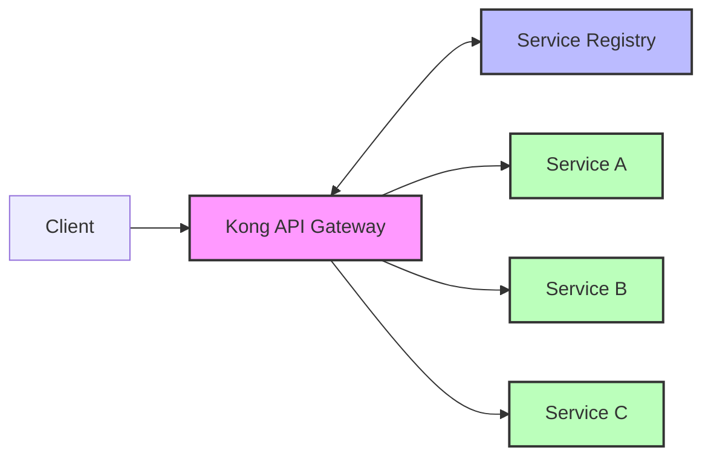

# Kong Service Discovery

## Introduction

Service discovery is a critical component in modern microservices architectures. As applications grow more complex and are split into dozens or hundreds of independently deployable services, keeping track of where each service is located becomes increasingly challenging. Kong, a popular API gateway, provides robust service discovery capabilities that help solve this problem.

In this guide, you'll learn how Kong Service Discovery works, why it's essential, and how to implement it in your own applications. We'll cover both the theoretical concepts and practical implementation details to give you a complete understanding of this powerful feature.

## What is Service Discovery?

Service discovery is the process of automatically detecting services and their instances on a network. In a microservices architecture, where services are constantly being created, destroyed, or moved, manually configuring service endpoints becomes impractical. 

Service discovery solves this by:

1. Registering services when they come online
2. Maintaining a directory of available service instances
3. Allowing clients to find and connect to services without knowing their exact location
4. Removing services from the registry when they go offline

<br />



## Why Kong Service Discovery Matters

Kong acts as an API gateway that sits between clients and your services. By integrating service discovery into Kong, you can:

- **Reduce configuration complexity**: No need to hardcode service locations
- **Improve resilience**: Automatically route around failed service instances
- **Enable scaling**: Easily add or remove service instances without downtime
- **Support dynamic environments**: Ideal for containerized deployments with Kubernetes or other orchestrators

## Kong Service Discovery Methods

Kong supports several methods for service discovery:

### 1. DNS-based Service Discovery

DNS-based service discovery uses DNS SRV records to locate services. This approach works well with container orchestration platforms like Kubernetes.

#### Configuration Example:

```yaml
services:
  - name: user-service
    host: user-service.example.svc.cluster.local
    port: 80
    protocol: http
    retries: 5
```

With this configuration, Kong will query DNS to find all instances of `user-service` and distribute traffic among them.

### 2. Kong Upstreams and Targets

Kong's built-in mechanism uses "Upstreams" (service groups) and "Targets" (individual instances) for service discovery and load balancing.

#### Configuration Example:

```bash
# Create an upstream
$ curl -X POST http://kong:8001/upstreams \
  --data name=user-service

# Add targets to the upstream
$ curl -X POST http://kong:8001/upstreams/user-service/targets \
  --data target=user-service-1:8000 \
  --data weight=100

$ curl -X POST http://kong:8001/upstreams/user-service/targets \
  --data target=user-service-2:8000 \
  --data weight=100
```

### 3. Integration with External Service Discovery

Kong can integrate with external service discovery tools through plugins:

- Consul
- etcd
- ZooKeeper

#### Example using the Consul plugin:

```bash
# Install the Consul plugin
$ kong plugin add kong-plugin-consul-discovery

# Configure the plugin
$ curl -X POST http://kong:8001/plugins \
  --data name=consul-discovery \
  --data config.host=consul.example.com \
  --data config.port=8500 \
  --data config.token=your-consul-token
```

## Implementing Kong Service Discovery: Step-by-Step Guide

Let's walk through a complete example of setting up Kong service discovery for a microservices architecture.

### Prerequisites:

- Kong Gateway installed
- Docker and Docker Compose (for our example)
- Basic understanding of RESTful APIs

### Step 1: Create a Docker Compose File

Create a `docker-compose.yml` file to set up Kong and our sample services:

```yaml
version: '3'
services:
  kong-database:
    image: postgres:13
    environment:
      POSTGRES_USER: kong
      POSTGRES_DB: kong
      POSTGRES_PASSWORD: kong
    ports:
      - "5432:5432"
    volumes:
      - kong-data:/var/lib/postgresql/data

  kong-migration:
    image: kong:latest
    depends_on:
      - kong-database
    environment:
      KONG_DATABASE: postgres
      KONG_PG_HOST: kong-database
      KONG_PG_USER: kong
      KONG_PG_PASSWORD: kong
    command: kong migrations bootstrap

  kong:
    image: kong:latest
    depends_on:
      - kong-database
      - kong-migration
    environment:
      KONG_DATABASE: postgres
      KONG_PG_HOST: kong-database
      KONG_PG_USER: kong
      KONG_PG_PASSWORD: kong
      KONG_PROXY_ACCESS_LOG: /dev/stdout
      KONG_ADMIN_ACCESS_LOG: /dev/stdout
      KONG_PROXY_ERROR_LOG: /dev/stderr
      KONG_ADMIN_ERROR_LOG: /dev/stderr
      KONG_ADMIN_LISTEN: 0.0.0.0:8001
    ports:
      - "8000:8000"
      - "8001:8001"

  service-a:
    image: nginx:alpine
    volumes:
      - ./service-a:/usr/share/nginx/html
    ports:
      - "8081:80"

  service-b:
    image: nginx:alpine
    volumes:
      - ./service-b:/usr/share/nginx/html
    ports:
      - "8082:80"

volumes:
  kong-data:
```

### Step 2: Create Simple Test Services

Create two simple services to test with:

For `service-a`, create a directory `./service-a` and add an `index.html` file:

```html
<!DOCTYPE html>
<html>
<head>
    <title>Service A</title>
</head>
<body>
    <h1>This is Service A</h1>
    <p>Instance ID: service-a-1</p>
</body>
</html>
```

For `service-b`, create a directory `./service-b` and add an `index.html` file:

```html
<!DOCTYPE html>
<html>
<head>
    <title>Service B</title>
</head>
<body>
    <h1>This is Service B</h1>
    <p>Instance ID: service-b-1</p>
</body>
</html>
```

### Step 3: Start the Services

```bash
$ docker-compose up -d
```

### Step 4: Configure Kong Upstream and Targets

```bash
# Create an upstream for our service
$ curl -X POST http://localhost:8001/upstreams \
  --data name=my-services

# Add service-a as a target
$ curl -X POST http://localhost:8001/upstreams/my-services/targets \
  --data target=service-a:80 \
  --data weight=100

# Add service-b as a target
$ curl -X POST http://localhost:8001/upstreams/my-services/targets \
  --data target=service-b:80 \
  --data weight=100
```

### Step 5: Create a Kong Service and Route

```bash
# Create a Kong service pointing to our upstream
$ curl -X POST http://localhost:8001/services \
  --data name=my-microservice \
  --data host=my-services \
  --data port=80 \
  --data protocol=http

# Create a route to access the service
$ curl -X POST http://localhost:8001/services/my-microservice/routes \
  --data name=my-microservice-route \
  --data paths[]=/api
```

### Step 6: Test the Service Discovery

Now when you access the service through Kong, it will automatically distribute requests between service-a and service-b:

```bash
$ curl -i http://localhost:8000/api
```

Run this command multiple times, and you should see responses alternating between Service A and Service B.

## Kong Service Discovery with Kubernetes

Kong integrates exceptionally well with Kubernetes, which has its own service discovery mechanisms. Here's how you can use Kong with Kubernetes:

### Using the Kong Ingress Controller

1. Install the Kong Ingress Controller in your Kubernetes cluster:

```bash
$ kubectl create -f https://bit.ly/k4k8s
```

2. Create Kubernetes Services and Deployments:

```yaml
apiVersion: apps/v1
kind: Deployment
metadata:
  name: example-service
spec:
  replicas: 3
  selector:
    matchLabels:
      app: example-service
  template:
    metadata:
      labels:
        app: example-service
    spec:
      containers:
      - name: example-service
        image: nginx:alpine
        ports:
        - containerPort: 80
---
apiVersion: v1
kind: Service
metadata:
  name: example-service
spec:
  selector:
    app: example-service
  ports:
  - port: 80
    targetPort: 80
```

3. Create an Ingress resource to expose it through Kong:

```yaml
apiVersion: networking.k8s.io/v1
kind: Ingress
metadata:
  name: example-ingress
  annotations:
    konghq.com/strip-path: "true"
spec:
  ingressClassName: kong
  rules:
  - http:
      paths:
      - path: /example
        pathType: Prefix
        backend:
          service:
            name: example-service
            port:
              number: 80
```

With this setup, Kubernetes handles the service discovery, and Kong routes traffic to the appropriate service instances.

## Health Checks and Circuit Breaking

Kong's service discovery becomes even more powerful when combined with health checks and circuit breaking:

### Configure Health Checks

```bash
$ curl -X POST http://localhost:8001/upstreams/my-services/health \
  --data active.healthy.interval=5 \
  --data active.healthy.successes=2 \
  --data active.unhealthy.interval=5 \
  --data active.unhealthy.http_failures=2
```

This configures Kong to actively check the health of services and stop routing traffic to unhealthy instances.

## Best Practices for Kong Service Discovery

1. **Use meaningful service names**: Choose descriptive names that reflect the service's purpose.

2. **Implement health checks**: Always configure health checking to avoid routing to failed instances.

3. **Set appropriate weights**: Adjust target weights for controlled traffic distribution.

4. **Use tags**: Tag services and targets to help with organization and filtering.

5. **Monitor Kong's performance**: Keep an eye on Kong's own resource usage, especially with many services.

6. **Consider using Kubernetes**: If possible, leverage Kubernetes for more robust orchestration.

7. **Implement retries and timeouts**: Configure proper retry policies to handle temporary failures.

```yaml
services:
  - name: user-service
    retries: 5
    connect_timeout: 60000
    write_timeout: 60000
    read_timeout: 60000
```

## Troubleshooting Kong Service Discovery

Here are some common issues and their solutions:

### Services Not Found

If Kong can't find your services:

1. Check that the service registry is accessible to Kong
2. Verify service names and namespaces
3. Check network connectivity between Kong and services

### Intermittent Failures

If you're seeing inconsistent behavior:

1. Check health check configurations
2. Look for timeout issues
3. Examine load balancing settings

### Debugging Commands

```bash
# Get upstream details
$ curl http://localhost:8001/upstreams/my-services

# Check targets and their health
$ curl http://localhost:8001/upstreams/my-services/targets

# Check health check status
$ curl http://localhost:8001/upstreams/my-services/health
```

## Summary

Kong Service Discovery is a powerful feature that simplifies the management of microservices architectures by:

- Automatically detecting and registering services
- Providing load balancing across service instances
- Integrating with various service registry solutions
- Supporting health checks and circuit breaking
- Working seamlessly with container orchestration platforms like Kubernetes

By implementing service discovery with Kong, you can build more resilient, scalable, and maintainable applications, while reducing the operational overhead of managing service endpoints manually.

## Additional Resources

1. Kong's official documentation on Upstreams and Targets
2. Kong Kubernetes Ingress Controller documentation
3. GitHub repositories with example implementations

## Exercises

1. **Basic Implementation**: Set up Kong with two sample services and configure service discovery using upstreams and targets.

2. **Kubernetes Integration**: Deploy the Kong Ingress Controller in a Kubernetes cluster and expose a sample application.

3. **External Registry**: Configure Kong to work with an external service registry like Consul or etcd.

4. **Advanced Configuration**: Implement health checks, circuit breaking, and retries for a more resilient service architecture.

5. **Performance Testing**: Conduct load tests to see how Kong's service discovery affects performance under different loads.