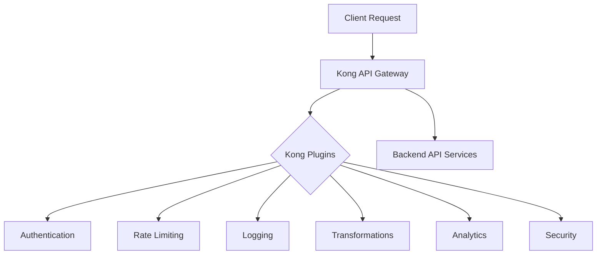

# Kong Plugins Introduction

## What are Kong Plugins?

Kong plugins are extensions that add functionality to Kong API Gateway, the popular open-source API management layer. These plugins allow you to enhance your API infrastructure with features like authentication, rate limiting, logging, and more without changing your API implementation.

Think of Kong as a modular system where the core handles basic API gateway functions, while plugins provide specialized capabilities that you can mix and match according to your needs.



## Why Use Kong Plugins?

Kong plugins solve several challenges in API management:

1. **Separation of concerns**: Focus on building your APIs without implementing cross-cutting concerns
2. **Standardization**: Apply consistent policies across all your services
3. **Flexibility**: Add or remove functionality without modifying your APIs
4. **Developer productivity**: Leverage existing solutions rather than building from scratch

## Types of Kong Plugins

Kong plugins fall into several categories:

### Authentication Plugins
Control who can access your APIs with plugins like:
- Basic Authentication
- Key Authentication
- OAuth2
- JWT

### Traffic Control Plugins
Manage API traffic with:
- Rate Limiting
- Request Termination
- Request Size Limiting
- Proxy Cache

### Analytics & Monitoring
Gain insights with:
- HTTP Log
- Datadog
- Prometheus
- Zipkin

### Transformation Plugins
Modify requests and responses:
- Request Transformer
- Response Transformer
- Correlation ID

### Security Plugins
Protect your APIs:
- CORS
- IP Restriction
- Bot Detection
- ACME (Let's Encrypt)

## Getting Started with Kong Plugins

### Prerequisites

Before working with Kong plugins, you should have:
- Kong Gateway installed and running
- Basic understanding of API concepts
- Admin access to your Kong instance

### Plugin Installation

Kong comes with many bundled plugins, but custom plugins may need installation:

```bash
# Install a plugin using luarocks (for Lua plugins)
luarocks install kong-plugin-myplugin

# For Docker installations
docker run -d --name kong \
  -e "KONG_PLUGINS=bundled,myplugin" \
  -e "KONG_LUA_PACKAGE_PATH=/usr/local/custom/?.lua;;" \
  kong:latest
```

### Basic Plugin Configuration

Plugins can be applied at different levels:
- Globally (all services)
- Per service
- Per route
- Per consumer

Here's how to enable a rate limiting plugin on a specific service:

```bash
# Using Kong Admin API
curl -X POST http://kong:8001/services/my-service/plugins \
  --data "name=rate-limiting" \
  --data "config.minute=5" \
  --data "config.hour=100"
```

Or using `deck` declarative configuration:

```yaml
_format_version: "2.1"
services:
- name: my-service
  url: http://my-api.com
  plugins:
  - name: rate-limiting
    config:
      minute: 5
      hour: 100
```

## Practical Example: Building an API with Multiple Plugins

Let's build a complete example of an API protected by multiple Kong plugins. We'll create an API with:
- Key authentication
- Rate limiting
- Request transformation
- Logging

### Step 1: Create a Service

First, let's create a service pointing to a backend API:

```bash
curl -i -X POST http://localhost:8001/services \
  --data name=example-service \
  --data url=http://example-api.com
```

### Step 2: Create a Route

Next, we'll create a route to expose our service:

```bash
curl -i -X POST http://localhost:8001/services/example-service/routes \
  --data 'paths[]=/api/v1' \
  --data name=example-route
```

### Step 3: Add Key Authentication

Let's secure our API with key authentication:

```bash
curl -i -X POST http://localhost:8001/services/example-service/plugins \
  --data name=key-auth
```

### Step 4: Create a Consumer

Now we need to create a consumer who can access our API:

```bash
curl -i -X POST http://localhost:8001/consumers \
  --data username=example-user
```

### Step 5: Provide the Consumer with a Key

```bash
curl -i -X POST http://localhost:8001/consumers/example-user/key-auth \
  --data key=your-secret-key
```

### Step 6: Add Rate Limiting

Let's prevent abuse by adding rate limiting:

```bash
curl -i -X POST http://localhost:8001/services/example-service/plugins \
  --data name=rate-limiting \
  --data config.minute=10 \
  --data config.hour=100 \
  --data config.policy=local
```

### Step 7: Add Request Transformation

We can modify incoming requests before they reach our backend:

```bash
curl -i -X POST http://localhost:8001/services/example-service/plugins \
  --data name=request-transformer \
  --data config.add.headers=x-api-version:v1 \
  --data config.add.querystring=version:1.0
```

### Step 8: Add HTTP Logging

Finally, let's add logging to monitor usage:

```bash
curl -i -X POST http://localhost:8001/services/example-service/plugins \
  --data name=http-log \
  --data config.http_endpoint=http://logging-service:8080
```

### Testing the API

Now let's test our protected API:

```bash
# This will fail without authentication
curl -i http://localhost:8000/api/v1

# This will succeed with proper authentication
curl -i http://localhost:8000/api/v1 \
  -H "apikey: your-secret-key"
```

Expected output:

```
HTTP/1.1 401 Unauthorized
{
  "message": "No API key found in request"
}

HTTP/1.1 200 OK
{
  "message": "API request successful"
}
```

## Creating Custom Plugins

While Kong provides many plugins out of the box, you might need custom functionality. Kong plugins can be written in:

- Lua (traditional)
- Go
- JavaScript/TypeScript (using Kong JS PDK)
- Python (experimental)

### Basic Structure of a Lua Plugin

Here's a simple example of a Lua plugin structure:

```lua
-- myPlugin.lua
local BasePlugin = require "kong.plugins.base_plugin"
local MyPlugin = BasePlugin:extend()

function MyPlugin:new()
  MyPlugin.super.new(self, "my-plugin")
end

function MyPlugin:access(config)
  MyPlugin.super.access(self)
  -- Add custom logic here
  kong.log("Plugin executing in access phase")
  kong.service.request.set_header("X-My-Plugin", "enabled")
end

return MyPlugin
```

The plugin schema definition:

```lua
-- schema.lua
return {
  name = "my-plugin",
  fields = {
    { config = {
        type = "record",
        fields = {
          { some_field = { type = "string", default = "default_value" } },
        },
      },
    },
  },
}
```

## Plugin Development Best Practices

When developing or implementing Kong plugins:

1. **Start with bundled plugins**: Explore Kong's bundled plugins before creating custom ones
2. **Use the right phase**: Understand [Kong's plugin execution phases](https://docs.konghq.com/gateway/latest/plugin-development/custom-logic/) (access, header_filter, body_filter, etc.)
3. **Consider performance**: Plugins run on every request, so performance is critical
4. **Test thoroughly**: Test plugins under various conditions and loads
5. **Monitor**: Implement metrics to monitor plugin performance and errors

## Troubleshooting Plugins

When troubleshooting plugin issues:

1. **Check logs**: Examine Kong's error logs:
   ```bash
   tail -f /usr/local/kong/logs/error.log
   ```

2. **Verify configuration**: Double-check plugin configuration parameters:
   ```bash
   curl http://localhost:8001/services/my-service/plugins
   ```

3. **Enable debug**: Temporarily increase log verbosity:
   ```bash
   export KONG_LOG_LEVEL=debug
   ```

4. **Inspect the request/response cycle**: Use the HTTP Log plugin or a tool like `tcpdump` to see exactly what's happening

## Summary

Kong plugins provide a flexible way to extend Kong API Gateway functionality without modifying your APIs. They allow you to implement authentication, rate limiting, request/response transformation, logging, and more in a modular fashion.

By understanding how to configure and use Kong plugins, you can build robust API infrastructure that meets your specific requirements while maintaining good separation of concerns.

## Additional Resources

- [Kong Hub](https://docs.konghq.com/hub/) - Official repository of Kong plugins
- [Kong Plugin Development Guide](https://docs.konghq.com/gateway/latest/plugin-development/) - Learn to create custom plugins
- [Kong Community Forums](https://discuss.konghq.com/) - Get help from the Kong community

## Exercises

1. Set up a basic Kong instance and configure the rate-limiting plugin to limit requests to 5 per minute.
2. Create a service that transforms incoming requests by adding a custom header.
3. Implement key authentication and create at least two consumers with different rate limits.
4. Try creating a simple custom plugin that logs request information to a file.
5. Configure multiple plugins on a single route and analyze the processing order.