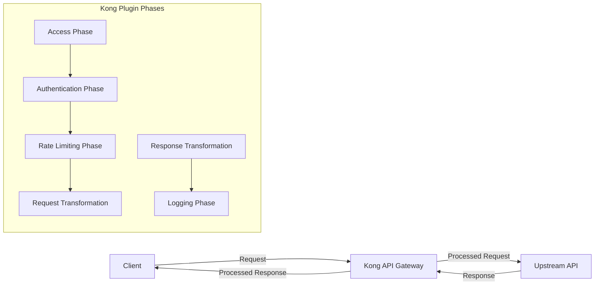

# Kong Plugin Development

## Introduction

Kong is a popular, open-source API gateway that manages the interface between clients and your API services. One of Kong's most powerful features is its extensibility through plugins. Kong plugins allow you to add functionality to your API gateway, including authentication, rate limiting, logging, and more.

This guide will walk you through the process of developing custom plugins for Kong. We'll cover the basics of the Kong plugin architecture, setting up a development environment, and creating your first plugin from scratch.

## Prerequisites

Before diving into plugin development, you should have:

- Basic understanding of APIs and API gateways
- Familiarity with Lua programming language (Kong plugins are written in Lua)
- Kong installed locally for testing (Docker is recommended)
- Basic understanding of HTTP requests and responses

## Kong Plugin Architecture

Kong plugins operate within Kong's request/response lifecycle, allowing you to execute custom logic at various points.



Kong processes requests and responses through several phases, and plugins can hook into one or more of these phases:

1. **Certificate** - Handles TLS handshake
2. **Rewrite** - URI manipulations
3. **Access** - Authentication, authorization, rate limiting
4. **HTTP Client** - Preparing to send request to upstream service
5. **Header Filter** - Processes response headers from upstream
6. **Body Filter** - Processes response body from upstream
7. **Log** - Logging after response has been sent to client

## Setting Up Your Development Environment

Let's set up a development environment to create and test Kong plugins.

### 1. Create a Plugin Directory Structure

Kong plugins follow a specific directory structure:

```
kong-plugin-myplugin/
├── kong/
│   └── plugins/
│       └── myplugin/
│           ├── handler.lua
│           └── schema.lua
└── kong-plugin-myplugin-0.1.0-1.rockspec
```

The `handler.lua` file contains the plugin's logic, while `schema.lua` defines the configuration schema.

### 2. Creating Your First Plugin

Let's create a simple "Hello World" plugin that adds a custom header to responses.

First, create the `schema.lua` file:

```lua
local typedefs = require "kong.db.schema.typedefs"

return {
  name = "hello-world",
  fields = {
    { consumer = typedefs.no_consumer },
    { protocols = typedefs.protocols_http },
    { config = {
        type = "record",
        fields = {
          { message = { type = "string", default = "Hello, World!" } },
        },
      },
    },
  },
}
```

Next, create the `handler.lua` file:

```lua
local HelloWorldHandler = {
  VERSION = "0.1.0",
  PRIORITY = 1000,
}

function HelloWorldHandler:header_filter(conf)
  kong.response.set_header("X-Hello-World", conf.message)
end

return HelloWorldHandler
```

Finally, create the `.rockspec` file:

```lua
package = "kong-plugin-hello-world"
version = "0.1.0-1"
source = {
  url = "git://github.com/yourusername/kong-plugin-hello-world",
  tag = "0.1.0"
}
description = {
  summary = "A Kong plugin that adds a Hello World header",
  license = "MIT"
}
dependencies = {
  "lua >= 5.1"
}
build = {
  type = "builtin",
  modules = {
    ["kong.plugins.hello-world.handler"] = "kong/plugins/hello-world/handler.lua",
    ["kong.plugins.hello-world.schema"] = "kong/plugins/hello-world/schema.lua",
  }
}
```

## Testing Your Plugin

To test your plugin locally with Kong, you'll need to:

1. Install the plugin using LuaRocks or by adding it to Kong's plugin path
2. Enable the plugin in Kong's configuration
3. Apply the plugin to a service or route

### Installing with LuaRocks

```bash
# From your plugin directory
luarocks make

# Or install directly from Git
luarocks install https://github.com/yourusername/kong-plugin-hello-world/kong-plugin-hello-world-0.1.0-1.rockspec
```

### Configuring Kong

Add your plugin to the `plugins` list in `kong.conf`:

```
plugins = bundled,hello-world
```

### Applying the Plugin

Use Kong's Admin API to apply your plugin to a service:

```bash
curl -X POST http://localhost:8001/services/my-service/plugins \
  --data "name=hello-world" \
  --data "config.message=Hello from my custom plugin!"
```

## Advanced Plugin Development

Once you've mastered the basics, you can build more complex plugins. Let's explore some advanced concepts.

### Accessing Request Information

Kong provides access to request information through the `kong.request` module:

```lua
function MyPlugin:access(conf)
  local client_ip = kong.client.get_ip()
  local headers = kong.request.get_headers()
  local query_params = kong.request.get_query()
  local body, err = kong.request.get_body()
  
  -- Use this information to make decisions or modify the request
end
```

### Modifying Requests and Responses

You can modify requests before they reach upstream services:

```lua
function MyPlugin:access(conf)
  -- Add a header to the request
  kong.service.request.set_header("X-Custom-Header", "Custom Value")
  
  -- Change the request path
  kong.service.request.set_path("/new-path")
  
  -- Modify query parameters
  kong.service.request.set_query({new_param = "value"})
end
```

And modify responses before they reach the client:

```lua
function MyPlugin:header_filter(conf)
  -- Add a response header
  kong.response.set_header("X-Response-Time", ngx.now() - ngx.req.start_time())
end

function MyPlugin:body_filter(conf)
  local chunk, eof = ngx.arg[1], ngx.arg[2]
  
  -- Replace text in the response body
  if chunk then
    chunk = chunk:gsub("old text", "new text")
    ngx.arg[1] = chunk
  end
end
```

### Storing Data with Kong's DAO

For plugins that need to store data, Kong provides a DAO (Data Access Object) abstraction:

```lua
-- Define a custom entity in your schema.lua
local schema = {
  name = "my_custom_entities",
  primary_key = { "id" },
  fields = {
    { id = { type = "string" } },
    { created_at = { type = "number", default = ngx.time() } },
    { consumer_id = { type = "string" } },
    { some_data = { type = "string" } },
  },
}

-- Then use it in your plugin
function MyPlugin:access(conf)
  local entity, err = kong.db.my_custom_entities:insert({
    consumer_id = kong.client.get_consumer().id,
    some_data = "stored value"
  })
  
  if err then
    kong.log.err("Failed to store data: ", err)
    return kong.response.exit(500, { message = "Internal server error" })
  end
end
```

## Example: Building an API Key Validation Plugin

Let's build a more practical plugin that validates API keys against a predefined list.

```lua
-- schema.lua
return {
  name = "api-key-validator",
  fields = {
    { consumer = typedefs.no_consumer },
    { protocols = typedefs.protocols_http },
    { config = {
        type = "record",
        fields = {
          { api_keys = { type = "array", elements = { type = "string" }, default = {} } },
          { header_name = { type = "string", default = "X-API-Key" } },
        },
      },
    },
  },
}

-- handler.lua
local ApiKeyHandler = {
  VERSION = "0.1.0",
  PRIORITY = 1000,
}

function ApiKeyHandler:access(conf)
  -- Get the API key from the request
  local api_key = kong.request.get_header(conf.header_name)
  
  if not api_key then
    return kong.response.exit(401, { message = "API key is required" })
  end
  
  -- Check if the API key is in the allowed list
  local key_found = false
  for _, allowed_key in ipairs(conf.api_keys) do
    if api_key == allowed_key then
      key_found = true
      break
    end
  end
  
  if not key_found then
    return kong.response.exit(403, { message = "Invalid API key" })
  end
  
  -- If we get here, the API key is valid
  kong.service.request.set_header("X-Consumer-Custom-ID", api_key)
end

return ApiKeyHandler
```

## Debugging Kong Plugins

Debugging Kong plugins can be challenging. Here are some effective techniques:

### Logging

Kong provides a logging module to help debug your plugins:

```lua
function MyPlugin:access(conf)
  kong.log.debug("Debug message - only seen when Kong's log level is debug")
  kong.log.info("Informational message")
  kong.log.err("Error message")
  
  kong.log.inspect({ complex = "data structure" }) -- Pretty-print tables
end
```

### Running Kong in Debug Mode

Set Kong's log level to debug in `kong.conf`:

```
log_level = debug
```

### Using the Kong PDK in Custom Plugins

The Plugin Development Kit (PDK) provides a set of functions to interact with Kong. Here's how you can use it:

```lua
-- Access plugin configuration
kong.log.debug("Config parameter: ", conf.some_param)

-- Access request information
local header_value = kong.request.get_header("X-Custom-Header")
local query_param = kong.request.get_query_arg("param_name")

-- Manipulate response
kong.response.set_header("X-Rate-Limit-Remaining", "10")
kong.response.set_status(403)

-- Exit early with a custom response
return kong.response.exit(403, { message = "Access denied" })
```

## Best Practices for Kong Plugin Development

1. **Respect the Priority**: Set the `PRIORITY` of your plugin appropriately to ensure it runs in the correct order relative to other plugins.

2. **Error Handling**: Always handle errors gracefully and provide meaningful error messages.

```lua
local result, err = some_function()
if err then
  kong.log.err("Error: ", err)
  return kong.response.exit(500, { message = "Internal server error" })
end
```

3. **Performance Considerations**: Be mindful of the performance impact of your plugin, especially in high-traffic environments.

4. **Testing**: Write unit tests for your plugin using Kong's test helpers.

5. **Documentation**: Document your plugin thoroughly, including configuration options and expected behavior.

6. **Version Compatibility**: Be aware of Kong version compatibility and document which versions your plugin supports.

## Deploying Kong Plugins

Once your plugin is ready for production, you have several options for deployment:

1. **LuaRocks**: Publish your plugin to LuaRocks, Kong's package manager.
2. **Custom Docker Image**: Create a custom Kong Docker image that includes your plugin.
3. **Custom RPM/DEB Packages**: Package your plugin for distribution.

For a custom Docker image, create a Dockerfile:

```Dockerfile
FROM kong:latest

USER root

# Install LuaRocks packages
RUN luarocks install kong-plugin-your-plugin

# Set custom plugins in Kong configuration
ENV KONG_PLUGINS=bundled,your-plugin

USER kong
```

## Summary

In this guide, we've covered the essentials of Kong plugin development, from setting up your development environment to creating, testing, and deploying plugins. We've also explored advanced concepts like modifying requests and responses, storing data, and following best practices.

Kong's plugin architecture provides a powerful way to extend its functionality to meet your specific needs. With the knowledge gained from this guide, you're now equipped to build custom plugins that enhance your API gateway implementation.

## Additional Resources

- [Kong Documentation](https://docs.konghq.com/latest/)
- [Kong Plugin Development Guide](https://docs.konghq.com/latest/plugin-development/)
- [Kong Plugin Development Kit (PDK) Reference](https://docs.konghq.com/latest/pdk/)
- [Kong Nation Community](https://discuss.konghq.com/)
- [Lua Programming Language](https://www.lua.org/manual/5.1/)

## Exercises

1. Create a rate-limiting plugin that restricts requests based on IP address.
2. Develop a plugin that adds CORS headers to responses.
3. Build a logging plugin that sends request data to a third-party service.
4. Create a plugin that transforms JSON responses by adding, removing, or modifying fields.
5. Implement a caching plugin that stores responses and serves them for repeated requests.