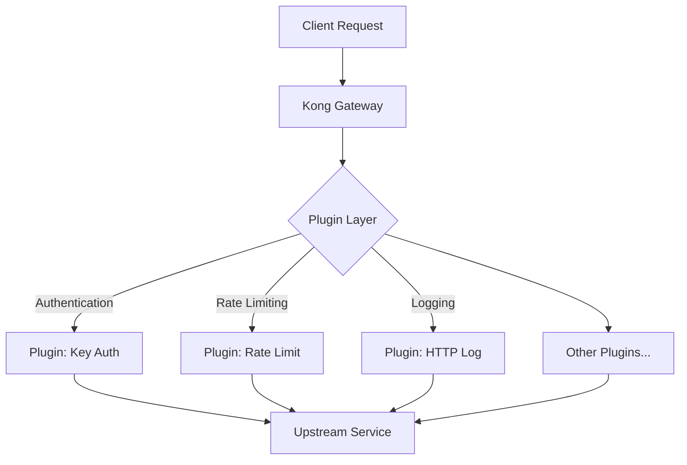
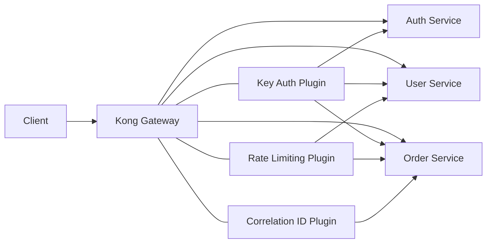

# Kong Plugin Configuration

## Introduction

Kong is a powerful API gateway that functions as the central layer between your clients and your upstream services (APIs, microservices). One of Kong's most valuable features is its plugin architecture, which allows you to extend Kong's functionality without modifying its core.

Plugins can add features like authentication, rate limiting, logging, and more to your API endpoints. However, to use these plugins effectively, you need to understand how to configure them properly. This guide will walk you through the fundamentals of Kong plugin configuration, providing you with the knowledge to customize Kong to fit your specific requirements.

## Understanding Kong Plugins

Before diving into configuration, let's understand what Kong plugins are and how they work in the Kong ecosystem.

Kong plugins are modular pieces of functionality that can be enabled and configured on various levels:

- **Global**: Applied to all services and routes
- **Service**: Applied to a specific service
- **Route**: Applied to a specific route
- **Consumer**: Applied to a specific consumer (client)



## Basic Plugin Configuration

Kong plugins are configured using JSON or YAML objects. You can apply plugin configurations through Kong's Admin API, the Kong Manager interface, or declarative configuration files.

### Plugin Configuration Structure

A basic plugin configuration typically includes:

1. The plugin name
2. A configuration object with plugin-specific parameters
3. The entity (service, route, etc.) it applies to

Here's the general structure for configuring a plugin:

```json
{
  "name": "plugin-name",
  "config": {
    "param1": "value1",
    "param2": "value2"
  }
}
```

## Configuring Plugins with the Admin API

Let's start with a simple example of how to configure a plugin using Kong's Admin API.

### Example: Configuring a Rate Limiting Plugin

The rate limiting plugin helps protect your APIs from overuse by limiting the number of requests a client can make in a given period.

**Request:**

```bash
curl -X POST http://localhost:8001/services/my-service/plugins \
  --data "name=rate-limiting" \
  --data "config.minute=5" \
  --data "config.policy=local"
```

**Response:**

```json
{
  "id": "a3ad71a8-6685-4b03-a101-980a953544f6",
  "name": "rate-limiting",
  "created_at": 1632489910,
  "route": null,
  "service": {
    "id": "de67c016-3133-4abf-94b9-b7e619b7db07"
  },
  "consumer": null,
  "config": {
    "minute": 5,
    "policy": "local",
    "limit_by": "consumer",
    "hide_client_headers": false,
    "hour": null,
    "second": null,
    "day": null,
    "month": null,
    "year": null,
    "path": null,
    "fault_tolerant": true,
    "redis_host": null,
    "redis_port": 6379,
    "redis_password": null,
    "redis_timeout": 2000,
    "redis_database": 0
  },
  "protocols": ["http", "https"],
  "enabled": true,
  "tags": null
}
```

In this example, we've configured the rate-limiting plugin to allow only 5 requests per minute per consumer.

## Declarative Configuration with YAML

Kong also supports declarative configuration using YAML files, which can be easier to manage for large deployments.

Here's how you would configure the same rate-limiting plugin using a YAML file:

```yaml
_format_version: "2.1"
services:
  - name: my-service
    url: http://my-upstream-service:8000
    plugins:
      - name: rate-limiting
        config:
          minute: 5
          policy: local
```

You can apply this configuration using Kong's declarative configuration feature:

```bash
kong config db_import config.yaml
```

## Common Plugin Configuration Scenarios

Let's explore some common plugin configuration scenarios to help you understand how to address specific requirements.

### Authentication Plugin Configuration

Authentication plugins are critical for securing your APIs. Here's an example of configuring the key-auth plugin:

```bash
curl -X POST http://localhost:8001/routes/my-route/plugins \
  --data "name=key-auth" \
  --data "config.key_names=apikey"
```

After setting up the key-auth plugin, you'll need to create consumers and provide them with API keys:

```bash
# Create a consumer
curl -X POST http://localhost:8001/consumers \
  --data "username=example-user"

# Create an API key for the consumer
curl -X POST http://localhost:8001/consumers/example-user/key-auth \
  --data "key=my-secret-api-key"
```

Now, clients must include the `apikey` header with their requests:

```bash
curl -i http://localhost:8000/my-api \
  -H "apikey: my-secret-api-key"
```

### Logging Configuration

Logging plugins help you monitor and debug your API traffic. Here's how to configure the http-log plugin to send logs to a logging service:

```bash
curl -X POST http://localhost:8001/services/my-service/plugins \
  --data "name=http-log" \
  --data "config.http_endpoint=http://my-logging-service:8080" \
  --data "config.method=POST" \
  --data "config.timeout=10000" \
  --data "config.keepalive=60000"
```

### Transformation Plugins

Transformation plugins allow you to modify requests and responses. Here's an example of the request-transformer plugin that adds headers to the request:

```bash
curl -X POST http://localhost:8001/routes/my-route/plugins \
  --data "name=request-transformer" \
  --data "config.add.headers=x-custom-header:custom-value" \
  --data "config.add.querystring=custom-query:custom-value"
```

## Plugin Configuration Best Practices

When configuring Kong plugins, follow these best practices to ensure optimal performance and maintainability:

1. **Start with minimal configuration**: Begin with the essential settings and add more as needed.

2. **Use consumer-specific configurations** when different clients need different policies.

3. **Leverage tags** to organize and manage your plugins more effectively.

4. **Monitor plugin performance** to ensure they don't add excessive latency.

5. **Validate configurations** before deploying to production.

6. **Use environment variables** for sensitive configuration values:

```yaml
plugins:
  - name: key-auth
    config:
      key_names:
        - apikey
      hide_credentials: ${HIDE_CREDENTIALS}
```

7. **Document your configurations** for future reference and team knowledge sharing.

## Advanced Plugin Configuration

### Plugin Ordering

When multiple plugins are applied, Kong processes them in a specific order. You can control this order with the `plugins` configuration in `kong.conf`:

```
plugins = bundled,custom-plugin-1,custom-plugin-2
```

### Conditionally Applying Plugins

You can use Kong's expression-based router to conditionally apply plugins:

```bash
curl -X POST http://localhost:8001/routes \
  --data "name=conditional-route" \
  --data "paths[]=/api" \
  --data "expression=(request.headers[\"user-agent\"] ~* \"mobile\")"
```

Then apply a plugin only to this route:

```bash
curl -X POST http://localhost:8001/routes/conditional-route/plugins \
  --data "name=response-transformer" \
  --data "config.add.headers=X-Mobile-Device:true"
```

### Plugin Configuration for Microservices

In a microservice architecture, you might want to apply different plugins to different services:



You can achieve this by configuring plugins at the service level:

```yaml
_format_version: "2.1"
services:
  - name: auth-service
    url: http://auth-service:8000
    plugins:
      - name: key-auth
  
  - name: user-service
    url: http://user-service:8000
    plugins:
      - name: key-auth
      - name: rate-limiting
        config:
          minute: 10
  
  - name: order-service
    url: http://order-service:8000
    plugins:
      - name: key-auth
      - name: rate-limiting
        config:
          minute: 5
      - name: correlation-id
        config:
          header_name: Kong-Request-ID
          generator: uuid
```

## Troubleshooting Plugin Configuration

When your plugin configuration isn't working as expected, follow these troubleshooting steps:

1. **Check the Kong error logs**:
   ```bash
   tail -f /usr/local/kong/logs/error.log
   ```

2. **Verify the plugin is enabled**:
   ```bash
   curl -s http://localhost:8001/plugins | grep -i "name"
   ```

3. **Inspect the specific plugin configuration**:
   ```bash
   curl -s http://localhost:8001/plugins/{plugin-id}
   ```

4. **Enable debug logging** in `kong.conf`:
   ```
   log_level = debug
   ```

5. **Test with minimal configuration** to isolate issues.

## Summary

Kong plugins provide a powerful way to extend the functionality of your API gateway. By understanding how to properly configure plugins, you can tailor Kong to meet your specific requirements, whether it's adding authentication, rate limiting, logging, or other capabilities.

The key points to remember are:

- Plugins can be applied at global, service, route, and consumer levels
- Configuration can be done through the Admin API, Kong Manager, or declarative configuration
- Follow best practices for maintaining and troubleshooting your plugin configurations
- Use advanced features like conditional application and plugin ordering for complex scenarios

By mastering Kong plugin configuration, you'll be able to build secure, scalable, and feature-rich API gateways for your applications.

## Additional Resources

- Practice configuring different types of plugins for various use cases
- Experiment with combining multiple plugins to create a comprehensive API gateway solution
- Try implementing a custom plugin to solve a specific problem for your organization