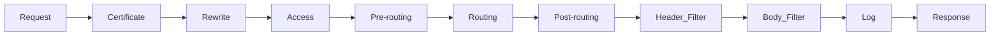

# Kong Plugin Ordering

## Introduction

When working with Kong API Gateway, you'll often need to apply multiple plugins to handle different aspects of your API traffic. Understanding how these plugins interact and execute relative to each other is crucial for building reliable API infrastructures. In this guide, we'll explore Kong's plugin execution order, why it matters, and how you can control it to achieve your desired API behavior.

## Why Plugin Order Matters

Imagine you have an API that requires both authentication and rate limiting. The order in which these plugins execute can significantly impact your API's behavior:

- If rate limiting runs **before** authentication, anonymous users could exhaust your rate limits, potentially blocking legitimate authenticated users.
- If authentication runs **before** rate limiting, you can apply different rate limits to authenticated versus anonymous users.

This simple example demonstrates why understanding and controlling plugin execution order is essential for proper API gateway configuration.

## Default Plugin Execution Order in Kong

Kong executes plugins in phases that correspond to the lifecycle of a request through the gateway. Each plugin belongs to a specific phase, and plugins within the same phase execute in a predefined priority order.

The main execution phases in Kong are:

1. **certificate** - HTTPS certificate operations
2. **rewrite** - URI rewrites before routing
3. **access** - Authentication, authorization, and other access controls
4. **pre-routing** - Executed before routing a request
5. **routing** - Determines where to route a request
6. **post-routing** - Executed after routing
7. **header_filter** - Modifies response headers
8. **body_filter** - Modifies response body
9. **log** - Logging after response has been sent to client



Within each phase, plugins are executed according to their priority number. **Lower priority numbers execute first**.

Here's a list of some common Kong plugins and their default priorities:

| Plugin | Priority | Phase |
|--------|----------|-------|
| cors | 1000 | access |
| jwt | 1005 | access |
| basic-auth | 1010 | access |
| key-auth | 1030 | access |
| rate-limiting | 901 | access |
| request-transformer | 801 | access |
| response-transformer | 800 | header_filter |
| logging plugins | 5-10 | log |

## Viewing Plugin Priorities

You can check a plugin's priority and execution phase using Kong's Admin API:

```bash
curl -X GET http://localhost:8001/plugins/schema/{plugin-name}
```

For example, to check the JWT plugin's priority:

```bash
curl -X GET http://localhost:8001/plugins/schema/jwt
```

Example output:

```json
{
  "fields": {
    "config": {
      "fields": {
        // plugin config options here
      }
    },
    "protocols": {"default": ["grpc", "grpcs", "http", "https"], "required": true, "type": "set"},
    "enabled": {"default": true, "type": "boolean"},
    "name": {"required": true, "type": "string"},
    "consumer": {"type": "foreign"},
    "service": {"type": "foreign"},
    "route": {"type": "foreign"}
  },
  "entity_checks": [],
  "name": "jwt",
  "priority": 1005,
  "phase": "access"
}
```

Notice the `priority` value of 1005 and `phase` set to "access".

## Controlling Plugin Execution Order

There are several ways to control the order in which plugins execute:

### 1. Using Different Phases

The most straightforward approach is to select plugins that run in different phases. Plugins in earlier phases always execute before plugins in later phases, regardless of priority.

### 2. Leveraging Default Priorities

For plugins in the same phase, understand their default priorities and use this knowledge to achieve your desired execution order.

For example, if you want authentication to happen before rate limiting, you can rely on the fact that most authentication plugins (like `jwt` with priority 1005) have higher priorities than the `rate-limiting` plugin (priority 901), meaning authentication will run first.

### 3. Custom Priorities with Kong Enterprise

If you're using Kong Enterprise, you can set custom priorities when adding a plugin:

```bash
curl -X POST http://localhost:8001/services/my-service/plugins \
  --data "name=rate-limiting" \
  --data "config.minute=5" \
  --data "config.policy=local" \
  --data "priority=1500"
```

This would make the rate-limiting plugin run **after** authentication plugins (which typically have priorities around 1000-1030).

## Practical Examples

Let's explore some common scenarios and how to configure plugin ordering for them:

### Example 1: Authentication Before Rate Limiting

**Objective**: Ensure users are authenticated before applying rate limits.

**Solution**: Use the default priorities, as authentication plugins (priority ~1000-1030) naturally run before rate-limiting (priority 901).

```bash
# Add JWT authentication plugin
curl -X POST http://localhost:8001/services/my-api/plugins \
  --data "name=jwt"

# Add rate limiting plugin
curl -X POST http://localhost:8001/services/my-api/plugins \
  --data "name=rate-limiting" \
  --data "config.minute=5" \
  --data "config.policy=local"
```

### Example 2: Request Transformation Before Authentication

**Objective**: Transform request parameters before authenticating users.

**Solution**: Since request-transformer (priority 801) has a lower priority than authentication plugins (priority ~1000+), it will execute first by default.

```bash
# Add request transformer plugin
curl -X POST http://localhost:8001/services/my-api/plugins \
  --data "name=request-transformer" \
  --data "config.add.headers=X-Custom-Header:SomeValue"

# Add basic authentication plugin
curl -X POST http://localhost:8001/services/my-api/plugins \
  --data "name=basic-auth"
```

### Example 3: Multi-Step Authentication Process

**Objective**: Implement an IP restriction check before proceeding to JWT authentication.

**Solution**: Use the ip-restriction plugin (priority varies) and JWT plugin. If using Kong Enterprise, you might want to set custom priorities to ensure specific ordering.

```bash
# Add IP restriction plugin
curl -X POST http://localhost:8001/services/my-api/plugins \
  --data "name=ip-restriction" \
  --data "config.whitelist=192.168.1.1,192.168.1.2"

# Add JWT authentication plugin
curl -X POST http://localhost:8001/services/my-api/plugins \
  --data "name=jwt"
```

## Debugging Plugin Order Issues

If you're experiencing unexpected behavior, it might be due to plugin ordering issues. Here are some steps to debug:

1. **Check plugin priorities**: Use the Admin API to verify each plugin's priority and phase.

2. **Use the Kong Debug Plugin**: If available, add the debug plugin to see the exact sequence of plugin execution:

```bash
curl -X POST http://localhost:8001/services/my-api/plugins \
  --data "name=debug"
```

3. **Check logs**: Enable verbose logging in Kong to see the order of plugin execution:

```bash
# In kong.conf
log_level = debug
```

4. **Create a test route**: Create a simple test route with just the plugins you're troubleshooting to isolate the issue.

## Best Practices for Plugin Ordering

1. **Document your plugin dependencies**: Keep track of which plugins depend on others.

2. **Start with authentication**: In most cases, authentication should be one of the first plugins to execute.

3. **Use consistent ordering across environments**: Ensure your development, staging, and production environments use the same plugin ordering.

4. **Consider response flow**: Remember that some plugins (like response-transformer) operate during the response cycle.

5. **Test thoroughly**: After configuring multiple plugins, test different scenarios to verify the behavior matches your expectations.

## Summary

Understanding and controlling Kong plugin execution order is essential for building reliable and secure API gateways. The execution flow follows specific phases in the request/response lifecycle, with plugins in the same phase executing according to their priority values.

Key takeaways:
- Plugins execute in phases from certificate to log
- Within each phase, lower priority numbers execute first
- Default priorities are set based on the common use cases
- Kong Enterprise allows custom priority configurations
- Proper ordering ensures plugins work together effectively

By mastering plugin ordering, you can create sophisticated API gateway configurations that properly handle authentication, rate limiting, request/response transformations, and more in the exact sequence you need.

## Additional Resources

- [Kong Plugin Development Guide](https://docs.konghq.com/gateway/latest/plugin-development/)
- [Kong Plugin Hub](https://docs.konghq.com/hub/)
- [Kong Admin API Reference](https://docs.konghq.com/gateway/latest/admin-api/)

## Exercises

1. Set up Kong locally with three plugins: key-auth, rate-limiting, and request-transformer. Observe the execution order and confirm it matches the expected behavior.

2. Create a route with the response-transformer plugin and another plugin in the access phase. Trace the request through Kong to understand how plugins in different phases interact.

3. If you have access to Kong Enterprise, experiment with custom priorities to change the default execution order of two plugins in the same phase.