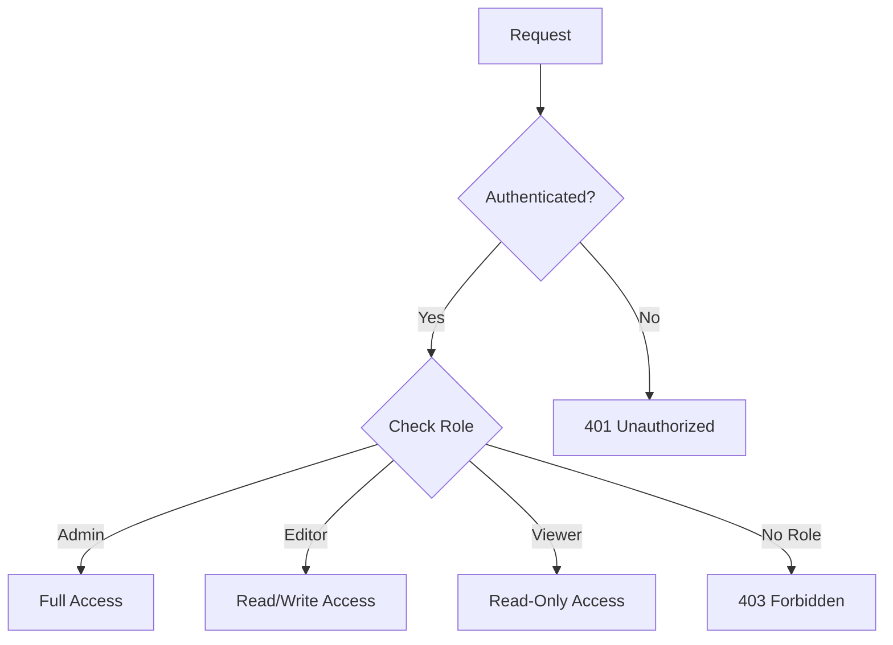

# Kong Authorization

## Introduction

Authorization is a crucial aspect of API security that determines what actions authenticated users can perform. While authentication verifies who you are, authorization decides what you're allowed to do. The Kong Authorization plugin provides a flexible system to control access to your APIs based on credentials, consumer groups, and custom rules.

In this guide, we'll explore how to implement and configure the Kong Authorization plugin to secure your API endpoints effectively. By the end of this tutorial, you'll understand how to set up different authorization mechanisms and apply them to real-world scenarios.

## Understanding Kong Authorization

Kong's Authorization plugin works alongside authentication plugins to create a complete security solution. It helps you:

- Control access to specific routes or services
- Define granular permissions based on roles
- Apply custom logic for authorization decisions
- Protect sensitive endpoints from unauthorized access

Let's dive into how authorization works in Kong and how to implement it effectively.

## Prerequisites

Before working with Kong Authorization, you should have:

- Kong Gateway installed and running
- Basic understanding of Kong concepts (Services, Routes, Consumers)
- Familiarity with Kong's authentication plugins
- A test API to work with

## Basic Authorization Configuration

### Step 1: Create a Service and Route

First, let's set up a simple service and route that we'll protect with authorization:

```bash
# Create a service pointing to your upstream API
curl -i -X POST http://localhost:8001/services \
  --data name=example-service \
  --data url='http://example-api.com'

# Create a route for the service
curl -i -X POST http://localhost:8001/services/example-service/routes \
  --data 'paths[]=/api' \
  --data name=example-route
```

### Step 2: Enable an Authentication Plugin

Before applying authorization, we need to set up authentication. Let's use the Key Authentication plugin:

```bash
# Enable the key-auth plugin on the service
curl -i -X POST http://localhost:8001/services/example-service/plugins \
  --data name=key-auth
```

### Step 3: Create a Consumer

```bash
# Create a consumer
curl -i -X POST http://localhost:8001/consumers \
  --data username=example-user

# Provide credentials for the consumer
curl -i -X POST http://localhost:8001/consumers/example-user/key-auth \
  --data key=my-secret-key
```

### Step 4: Apply the ACL Plugin for Basic Authorization

The ACL (Access Control List) plugin is Kong's basic authorization mechanism:

```bash
# Enable the ACL plugin on the service
curl -i -X POST http://localhost:8001/services/example-service/plugins \
  --data name=acl \
  --data config.allow=["admin-group"]

# Add the consumer to the allowed group
curl -i -X POST http://localhost:8001/consumers/example-user/acls \
  --data group=admin-group
```

Now, only consumers in the "admin-group" can access the API.

## Testing the Authorization

Let's test our configuration:

```bash
# This should fail (no key provided)
curl -i http://localhost:8000/api

# This should succeed (correct key and in allowed group)
curl -i http://localhost:8000/api \
  -H "apikey: my-secret-key"
```

The first request will fail with a 401 Unauthorized response, while the second should succeed.

## Advanced Authorization Techniques

### Role-Based Access Control

For more granular control, you can implement role-based access control (RBAC) using Kong's plugins:



### Example: Different Endpoints for Different Roles

Let's configure different permissions for different API endpoints:

```bash
# Route for admin operations
curl -i -X POST http://localhost:8001/services/example-service/routes \
  --data 'paths[]=/api/admin' \
  --data name=admin-route

# Apply ACL to admin route
curl -i -X POST http://localhost:8001/routes/admin-route/plugins \
  --data name=acl \
  --data config.allow=["admin-group"]

# Route for regular users
curl -i -X POST http://localhost:8001/services/example-service/routes \
  --data 'paths[]=/api/users' \
  --data name=users-route

# Apply ACL to users route
curl -i -X POST http://localhost:8001/routes/users-route/plugins \
  --data name=acl \
  --data config.allow=["admin-group", "users-group"]
```

Now, users in the "admin-group" can access both routes, while users in the "users-group" can only access the `/api/users` route.

## Using Custom Authorization Logic

For more complex authorization requirements, you can use the Kong JWT plugin with custom claims or implement a custom plugin with Lua:

### JWT-Based Authorization

```bash
# Enable JWT plugin
curl -i -X POST http://localhost:8001/services/example-service/plugins \
  --data name=jwt

# Create a consumer and credentials
curl -i -X POST http://localhost:8001/consumers \
  --data username=jwt-user

curl -i -X POST http://localhost:8001/consumers/jwt-user/jwt \
  --data key=my-consumer-key \
  --data secret=my-consumer-secret
```

Now you can include custom claims in your JWT that define permissions:

```json
{
  "sub": "user123",
  "name": "Example User",
  "role": "editor",
  "permissions": ["read:items", "write:items"]
}
```

### Custom Authorization Plugin

For advanced use cases, you might need to create a custom plugin. Here's a simple example of a Lua-based authorization plugin:

```lua
-- my-custom-auth.lua
local BasePlugin = require "kong.plugins.base_plugin"
local CustomAuth = BasePlugin:extend()

function CustomAuth:new()
  CustomAuth.super.new(self, "my-custom-auth")
end

function CustomAuth:access(conf)
  CustomAuth.super.access(self)
  
  local consumer = kong.client.get_consumer()
  if not consumer then
    return kong.response.exit(403, { message = "Not authorized" })
  end
  
  -- Your custom authorization logic here
  local path = kong.request.get_path()
  if path:find("/admin") and consumer.username ~= "admin" then
    return kong.response.exit(403, { message = "Admin access required" })
  end
end

return CustomAuth
```

## Real-World Example: API Resource Protection

Let's build a comprehensive example of protecting different resources in a blog API:

1. Public endpoints: Available to all users
2. Authenticated endpoints: Require authentication
3. Admin endpoints: Require admin privileges

### Step 1: Create the Service

```bash
curl -i -X POST http://localhost:8001/services \
  --data name=blog-service \
  --data url='http://blog-api.example.com'
```

### Step 2: Create Routes for Different Resources

```bash
# Public route (no auth required)
curl -i -X POST http://localhost:8001/services/blog-service/routes \
  --data 'paths[]=/blog/posts' \
  --data methods[]=GET \
  --data name=public-posts

# Authenticated route (requires auth)
curl -i -X POST http://localhost:8001/services/blog-service/routes \
  --data 'paths[]=/blog/posts' \
  --data methods[]=POST,PUT,DELETE \
  --data name=auth-posts

# Admin route
curl -i -X POST http://localhost:8001/services/blog-service/routes \
  --data 'paths[]=/blog/admin' \
  --data name=admin-route
```

### Step 3: Configure Authentication and Authorization

```bash
# Key auth for authenticated routes
curl -i -X POST http://localhost:8001/routes/auth-posts/plugins \
  --data name=key-auth

curl -i -X POST http://localhost:8001/routes/admin-route/plugins \
  --data name=key-auth

# ACL for admin route
curl -i -X POST http://localhost:8001/routes/admin-route/plugins \
  --data name=acl \
  --data config.allow=["admin-group"]
```

### Step 4: Create Consumers with Different Permissions

```bash
# Regular user
curl -i -X POST http://localhost:8001/consumers \
  --data username=regular-user

curl -i -X POST http://localhost:8001/consumers/regular-user/key-auth \
  --data key=regular-key

# Admin user
curl -i -X POST http://localhost:8001/consumers \
  --data username=admin-user

curl -i -X POST http://localhost:8001/consumers/admin-user/key-auth \
  --data key=admin-key

curl -i -X POST http://localhost:8001/consumers/admin-user/acls \
  --data group=admin-group
```

### Step 5: Test the Configuration

```bash
# Public access (should work without authentication)
curl -i http://localhost:8000/blog/posts

# Create post (requires authentication)
curl -i -X POST http://localhost:8000/blog/posts \
  -H "apikey: regular-key" \
  --data '{"title": "New Post", "content": "Content here"}'

# Access admin endpoint as regular user (should fail)
curl -i http://localhost:8000/blog/admin \
  -H "apikey: regular-key"

# Access admin endpoint as admin user (should succeed)
curl -i http://localhost:8000/blog/admin \
  -H "apikey: admin-key"
```

## Best Practices for Kong Authorization

1. **Layer your security**: Use authentication and authorization together
2. **Use the principle of least privilege**: Grant the minimum necessary permissions
3. **Organize consumers into groups**: Makes permission management easier
4. **Monitor authorization failures**: Set up logging and alerts for security events
5. **Test your authorization rules**: Regularly verify your configuration works as expected
6. **Document your authorization policies**: Keep clear documentation of who has access to what

## Troubleshooting

If you encounter issues with your authorization setup, check these common problems:

### 401 Unauthorized Errors

- Authentication plugin is enabled but credentials are missing or invalid
- Check that you're sending the correct authentication credentials

### 403 Forbidden Errors

- Authentication succeeded, but authorization failed
- Verify the consumer belongs to the required ACL groups
- Check that the route has the correct ACL configuration

### Plugin Order Matters

Kong processes plugins in a specific order. Generally, authentication plugins run before authorization plugins. If you're using multiple plugins, ensure they're configured in the correct order.

## Summary

Kong Authorization provides powerful tools to secure your APIs by controlling who can access what resources. In this guide, we've covered:

- Basic authorization using the ACL plugin
- Role-based access control implementation
- Custom authorization strategies
- A real-world example of protecting different API resources

By combining Kong's authentication and authorization plugins, you can build a comprehensive security solution that protects your APIs while providing the right level of access to different users.

## Additional Resources

- [Kong Plugin Documentation](https://docs.konghq.com/hub/)
- [Kong ACL Plugin](https://docs.konghq.com/hub/kong-inc/acl/)
- [Kong JWT Plugin](https://docs.konghq.com/hub/kong-inc/jwt/)
- [Custom Plugin Development](https://docs.konghq.com/gateway/latest/plugin-development/)

## Exercises

1. Set up a Kong service with three different consumer groups: admin, editor, and viewer.
2. Configure routes with different permissions for each group.
3. Create a custom JWT claim that includes role information and use it for authorization.
4. Implement rate limiting that varies based on the consumer's authorization level.
5. Use the Kong Developer Portal to document your API's authorization requirements.