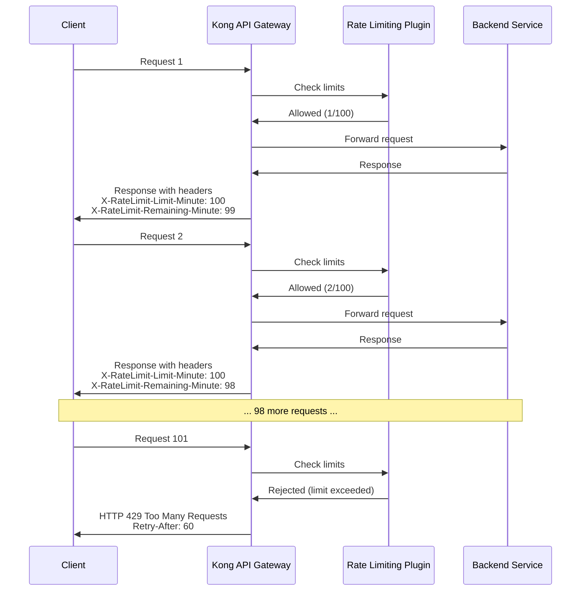

# Kong Traffic Control

## Introduction

Traffic control is a critical aspect of API management that helps ensure stability, reliability, and optimal performance of your services. Kong, a popular API gateway, provides several plugins specifically designed for traffic control that allow you to manage the flow of requests to your upstream services.

In this guide, we'll explore Kong's traffic control capabilities, which are essential for:

- Protecting backend services from overload
- Preventing abuse of your APIs
- Implementing fair usage policies
- Managing API quotas
- Controlling traffic flow during maintenance or incidents

Let's dive into the world of Kong Traffic Control and see how these plugins can help you build more robust and reliable API infrastructures.

## Core Traffic Control Concepts

Before we explore specific plugins, let's understand some fundamental concepts related to traffic control:

### Rate Limiting vs. Request Limiting

- **Rate Limiting**: Restricts the number of requests a consumer can make in a given time period (e.g., 100 requests per minute)
- **Request Limiting**: Controls the total number of requests allowed (e.g., 10,000 requests per day)

### Global vs. Consumer-Specific Controls

- **Global Controls**: Apply to all consumers of an API
- **Consumer-Specific**: Apply different limits to different consumers based on their needs or subscription tier

### Response Behavior

When a limit is reached, Kong can:
- Return a specific error code (typically HTTP 429 Too Many Requests)
- Delay the response (request throttling)
- Queue requests for later processing

Now, let's explore the specific plugins Kong offers for traffic control.

## Rate Limiting Plugin

The Rate Limiting plugin is one of Kong's most commonly used traffic control tools. It restricts how many requests can be made in a configurable time period.

### Basic Configuration

Here's how to configure a simple rate limit using Kong's Admin API:

```bash
# Apply rate limiting to a specific service
curl -X POST http://localhost:8001/services/my-service/plugins \
  --data "name=rate-limiting" \
  --data "config.minute=100" \
  --data "config.hour=1000"
```

This configuration:
- Limits requests to 100 per minute
- Also limits requests to 1000 per hour

### Configuration Options

The Rate Limiting plugin offers several configuration options:

| Parameter | Description | Default |
|-----------|-------------|---------|
| `second` | Requests per second | None |
| `minute` | Requests per minute | None |
| `hour` | Requests per hour | None |
| `day` | Requests per day | None |
| `month` | Requests per month | None |
| `policy` | Rate-limiting policy to use | `local` |
| `limit_by` | What to limit by | `consumer` |
| `hide_client_headers` | Hide headers from clients | `false` |

### Example: Tiered Rate Limiting

Let's create a more complex example with different limits for different consumer groups:

```bash
# Create a "premium" consumer group
curl -X POST http://localhost:8001/consumer_groups \
  --data "name=premium"

# Create a "basic" consumer group
curl -X POST http://localhost:8001/consumer_groups \
  --data "name=basic"

# Add consumers to groups (assuming these consumers already exist)
curl -X POST http://localhost:8001/consumer_groups/premium/consumers \
  --data "consumer=premium-customer-1"

curl -X POST http://localhost:8001/consumer_groups/basic/consumers \
  --data "consumer=basic-customer-1"

# Apply rate limiting with different limits per group
curl -X POST http://localhost:8001/services/my-api/plugins \
  --data "name=rate-limiting" \
  --data "config.minute=500" \
  --data "config.hour=5000" \
  --data "config.limit_by=consumer_group" \
  --data "config.consumer_group_config.premium.minute=1000" \
  --data "config.consumer_group_config.premium.hour=10000" \
  --data "config.consumer_group_config.basic.minute=100" \
  --data "config.consumer_group_config.basic.hour=1000"
```

In this example:
- Default limits: 500 requests per minute, 5000 per hour
- Premium consumers: 1000 requests per minute, 10000 per hour
- Basic consumers: 100 requests per minute, 1000 per hour

## Request Termination Plugin

The Request Termination plugin allows you to immediately terminate requests with a specific response. This is useful for temporarily disabling endpoints or implementing maintenance modes.

### Basic Configuration

```bash
# Apply request termination to a route
curl -X POST http://localhost:8001/routes/api-docs/plugins \
  --data "name=request-termination" \
  --data "config.status_code=503" \
  --data "config.message=API documentation temporarily unavailable for maintenance"
```

This configuration:
- Returns a 503 Service Unavailable status code
- Includes a custom message explaining the situation

### Conditional Termination

You can combine this with Kong's request transformer plugin to conditionally terminate requests:

```bash
# Create a condition to terminate during maintenance window
curl -X POST http://localhost:8001/services/my-service/plugins \
  --data "name=request-transformer" \
  --data "config.add.headers=X-Maintenance-Check:true"

curl -X POST http://localhost:8001/services/my-service/plugins \
  --data "name=request-termination" \
  --data "config.status_code=503" \
  --data "config.message=Service under maintenance" \
  --data "config.if_header=X-Maintenance-Check:true"
```

## Traffic Control Visualization

Let's visualize how Kong's rate limiting works:



## Proxy Caching Plugin

While not strictly a traffic control plugin, Kong's Proxy Caching plugin can significantly reduce the load on your backend services by caching responses.

### Basic Configuration

```bash
# Apply caching to a service
curl -X POST http://localhost:8001/services/product-catalog/plugins \
  --data "name=proxy-cache" \
  --data "config.content_type=application/json" \
  --data "config.cache_ttl=300" \
  --data "config.strategy=memory"
```

This configuration:
- Caches JSON responses for 5 minutes (300 seconds)
- Uses in-memory storage for the cache

### Cache Control Headers

The proxy caching plugin respects standard HTTP cache control headers:

```bash
# Example of a backend response with cache control headers
curl -I https://api.example.com/products
HTTP/1.1 200 OK
Content-Type: application/json
Cache-Control: max-age=60, public
```

## Real-World Use Cases

### Use Case 1: API Tier Management

Imagine you're offering a weather API with different subscription tiers:

```bash
# Free tier: 10 requests per minute
curl -X POST http://localhost:8001/services/weather-api/plugins \
  --data "name=rate-limiting" \
  --data "config.minute=10" \
  --data "config.policy=redis" \
  --data "config.redis_host=redis.example.com" \
  --data "config.consumer_group_config.premium.minute=60" \
  --data "config.consumer_group_config.business.minute=1000"
```

### Use Case 2: Traffic Shaping During Peak Hours

During high-traffic periods, you might want to prioritize premium customers:

```bash
# Set up request termination for free tier during peak hours
curl -X POST http://localhost:8001/routes/high-load-endpoint/plugins \
  --data "name=request-termination" \
  --data "config.status_code=503" \
  --data "config.message=This endpoint is currently available only to premium users" \
  --data "config.if_header=X-Consumer-Group:free,X-Peak-Hours:true"
```

### Use Case 3: Circuit Breaking

Using Kong plugins together to implement a basic circuit breaker pattern:

```bash
# Track upstream health
curl -X POST http://localhost:8001/services/payment-service/plugins \
  --data "name=health-checks" \
  --data "config.active.healthy.interval=5" \
  --data "config.active.unhealthy.interval=1" \
  --data "config.passive.healthy.successes=5" \
  --data "config.passive.unhealthy.tcp_failures=2"

# Combine with request termination
curl -X POST http://localhost:8001/services/payment-service/plugins \
  --data "name=request-termination" \
  --data "config.status_code=503" \
  --data "config.message=Payment service temporarily unavailable" \
  --data "config.if_header=X-Upstream-Status:unhealthy"
```

## Best Practices for Kong Traffic Control

1. **Start Conservative**: Begin with generous limits and tighten them as you understand your traffic patterns.

2. **Monitor Effectiveness**: Use Kong's logging plugins to track how often limits are hit.

3. **Implement Graceful Degradation**: When possible, provide alternative functionality when limits are reached.

4. **Communicate Limits Clearly**: Make sure your API documentation clearly explains rate limits.

5. **Use Redis for Distributed Deployments**: When running multiple Kong instances, use a Redis backend for rate limiting to ensure consistent enforcement.

6. **Set Headers Appropriately**: Configure Kong to return appropriate rate limit headers to help clients manage their usage.

7. **Plan for Scale**: Consider how your traffic control strategy will work as your API usage grows.

## Implementing a Complete Traffic Control Strategy

Let's put everything together to create a comprehensive traffic control strategy:

```bash
# 1. Set up base rate limiting
curl -X POST http://localhost:8001/services/my-api/plugins \
  --data "name=rate-limiting" \
  --data "config.second=5" \
  --data "config.minute=100" \
  --data "config.hour=1000" \
  --data "config.policy=redis" \
  --data "config.redis_host=redis.example.com"

# 2. Add proxy caching for GET requests
curl -X POST http://localhost:8001/services/my-api/plugins \
  --data "name=proxy-cache" \
  --data "config.cache_ttl=60" \
  --data "config.cache_control=true" \
  --data "config.request_method=GET"

# 3. Implement request termination for maintenance periods
curl -X POST http://localhost:8001/services/my-api/plugins \
  --data "name=request-termination" \
  --data "config.status_code=503" \
  --data "config.message=API is currently in maintenance mode" \
  --data "config.if_header=X-Maintenance-Mode:active"
```

## Troubleshooting Kong Traffic Control

### Common Issues and Solutions

1. **Rate limits not being enforced**
   - Check that the plugin is properly configured
   - Verify that the policy storage (e.g., Redis) is accessible
   - Ensure the `limit_by` parameter matches your use case

2. **Inconsistent rate limiting in a cluster**
   - Switch from `local` to `redis` policy
   - Check Redis connectivity from all Kong nodes

3. **Unexpected 429 responses**
   - Check if multiple rate limiting plugins are being applied (route, service, global)
   - Verify consumer group assignments

4. **Plugins not applying to specific consumers**
   - Check consumer credentials and authentication
   - Verify plugin configurations for consumer-specific settings

## Summary

Kong's traffic control plugins provide powerful tools for managing API traffic, protecting your backend services, and ensuring fair resource allocation among consumers. By combining rate limiting, request termination, and proxy caching, you can build a robust traffic management strategy that scales with your API usage.

Key takeaways:
- Use rate limiting to set fair usage policies
- Implement request termination for maintenance and emergency scenarios
- Leverage proxy caching to reduce backend load
- Consider different policies for different consumer groups
- Monitor and adjust your traffic control strategy as your API usage evolves

## Additional Resources

For further exploration:

- Kong Rate Limiting Advanced plugin for more complex rate limiting scenarios
- Kong Response Rate Limiting plugin to limit based on response size
- Kong Queue plugin for implementing request queuing when limits are reached

## Exercises

1. Set up a basic Kong environment and configure rate limiting for a test API.
2. Implement different rate limits for different consumer groups.
3. Create a maintenance mode toggle using the request termination plugin.
4. Design a caching strategy for a product catalog API with varying TTLs for different endpoints.
5. Build a circuit breaker pattern using Kong's health checks and request termination.

By mastering Kong's traffic control plugins, you'll be able to build more resilient, fair, and performant API infrastructures that can handle growth and unexpected traffic patterns with ease.