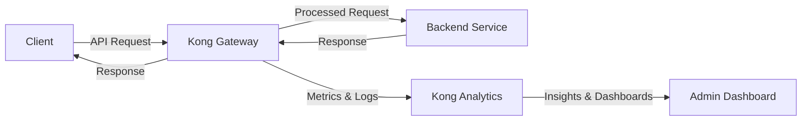

# Kong Analytics

## Introduction

Kong Analytics is a powerful plugin within the Kong API Gateway ecosystem that provides detailed insights into your API traffic, performance metrics, and usage patterns. By collecting, processing, and visualizing data from your API requests, Kong Analytics helps you make informed decisions about your API infrastructure, identify bottlenecks, detect anomalies, and understand how your APIs are being consumed.

This plugin is particularly valuable for teams looking to:
- Monitor API health and performance
- Understand traffic patterns
- Track API usage across different consumers
- Generate reports for business decisions
- Identify potential security threats or unusual behavior

## How Kong Analytics Works

At its core, Kong Analytics operates by intercepting API requests passing through your Kong gateway, extracting relevant information, and storing this data for analysis. The plugin can be configured to track various metrics and attributes of API calls, allowing for comprehensive monitoring and reporting.



## Setting Up Kong Analytics

### Prerequisites

Before setting up Kong Analytics, ensure you have:

- Kong Gateway installed and running (version 2.0 or later)
- Administrative access to your Kong instance
- Basic understanding of Kong configuration

### Installation

Kong Analytics is available as a plugin in the Kong Enterprise tier. If you're using Kong Enterprise, the plugin should already be available. If you're using the open-source version of Kong, you'll need to use a combination of other plugins to achieve similar functionality.

### Configuration

To enable Kong Analytics for a specific service or route, you can use the Admin API:

```bash
curl -X POST http://kong:8001/services/my-service/plugins \
  --data "name=analytics" \
  --data "config.metrics=request_count,request_size,response_size,latency" \
  --data "config.storage=prometheus" \
  --data "config.sampling_rate=100"
```

Or, if you prefer using declarative configuration (YAML):

```yaml
plugins:
- name: analytics
  service: my-service
  config:
    metrics:
    - request_count
    - request_size
    - response_size
    - latency
    storage: prometheus
    sampling_rate: 100
```

### Configuration Parameters

| Parameter | Description | Default | Required |
|-----------|-------------|---------|----------|
| `metrics` | Array of metrics to collect | `[]` | Yes |
| `storage` | Backend storage for analytics data | `postgres` | Yes |
| `sampling_rate` | Percentage of requests to analyze (1-100) | `100` | No |
| `flush_timeout` | How often to flush metrics to storage (in seconds) | `2` | No |
| `udp_log` | Whether to also send logs via UDP | `false` | No |
| `udp_host` | Host for UDP logging | `127.0.0.1` | No if `udp_log` is false |
| `udp_port` | Port for UDP logging | `9999` | No if `udp_log` is false |

## Key Features of Kong Analytics

### 1. Traffic Visualization

Kong Analytics provides intuitive visualizations of your API traffic, helping you understand patterns and trends:

- Request volume over time
- Geographic distribution of API calls
- Traffic breakdown by endpoint
- Consumer usage patterns

### 2. Performance Monitoring

Track key performance indicators to ensure your APIs are functioning optimally:

- Response latency
- Error rates
- Bandwidth usage
- Request/response size

### 3. Alerting Capabilities

Set up alerts to be notified when certain conditions are met:

```javascript
// Example alert configuration
{
  "name": "High Error Rate Alert",
  "metric": "error_rate",
  "condition": "greater_than",
  "threshold": 5,
  "timeframe": "5m",
  "notification": {
    "type": "email",
    "recipients": ["api-team@example.com"]
  }
}
```

### 4. Consumer Insights

Understand how different consumers are utilizing your APIs:

- Most active consumers
- Endpoints frequently accessed by specific consumers
- Consumer-specific error rates
- Usage trends by consumer

## Practical Examples

### Example 1: Monitoring API Health

Let's set up Kong Analytics to monitor the health of a payment processing API:

```yaml
plugins:
- name: analytics
  route: payment-processing
  config:
    metrics:
    - request_count
    - error_rate
    - average_latency
    storage: influxdb
    sampling_rate: 100
    alert_thresholds:
      error_rate: 2
      average_latency: 500
```

This configuration will track request count, error rate, and average latency for your payment processing route. Alerts will be triggered if the error rate exceeds 2% or if the average latency surpasses 500ms.

### Example 2: Analyzing Traffic Patterns

Let's configure Kong Analytics to help understand traffic patterns for a content delivery API:

```yaml
plugins:
- name: analytics
  service: content-delivery
  config:
    metrics:
    - request_count
    - unique_consumers
    - bandwidth
    storage: prometheus
    sampling_rate: 50
    dimensions:
    - consumer_id
    - request_path
    - request_method
    time_granularity: "1h"
```

This setup will allow you to analyze:
- Which content is most popular
- When your API experiences peak traffic
- Which consumers are using the most bandwidth
- How usage patterns change over time

### Example 3: Rate Limiting with Analytics

You can combine Kong Analytics with rate limiting to create a more intelligent rate limiting strategy:

```yaml
plugins:
- name: analytics
  route: user-registration
  config:
    metrics:
    - request_count
    - unique_ips
    dimensions:
    - ip_address
    - user_agent
    storage: postgres
    sampling_rate: 100

- name: rate-limiting
  route: user-registration
  config:
    minute: 5
    hour: 100
    policy: redis
    analytics_based_exemptions: true
    trusted_ips: ["192.168.1.1/24"]
```

With this configuration, Kong will track registration attempts and can adjust rate limits based on analytics data, potentially helping to prevent spam registrations while allowing legitimate users to register.

## Integrating with Other Tools

Kong Analytics works well with several third-party tools:

### Prometheus + Grafana

Export Kong Analytics metrics to Prometheus and create custom dashboards in Grafana:

```yaml
plugins:
- name: analytics
  global: true
  config:
    storage: prometheus
    prometheus_port: 9542
```

Then, configure Prometheus to scrape metrics from Kong:

```yaml
# prometheus.yml
scrape_configs:
  - job_name: 'kong'
    scrape_interval: 5s
    static_configs:
      - targets: ['kong:9542']
```

### ELK Stack

Send Kong Analytics data to Elasticsearch for advanced querying capabilities:

```yaml
plugins:
- name: analytics
  global: true
  config:
    storage: elasticsearch
    elasticsearch_host: "http://elasticsearch:9200"
    elasticsearch_index: "kong-analytics"
    batch_size: 100
```

### DataDog

For teams using DataDog for monitoring:

```yaml
plugins:
- name: analytics
  global: true
  config:
    storage: datadog
    datadog_api_key: "YOUR_API_KEY"
    datadog_tags:
      environment: production
      service: api-gateway
```

## Troubleshooting Kong Analytics

### Common Issues

1. **High CPU Usage**

If Kong Analytics is causing high CPU usage, try:
- Reducing the sampling rate
- Collecting fewer metrics
- Increasing the flush interval

```yaml
plugins:
- name: analytics
  global: true
  config:
    sampling_rate: 20
    flush_timeout: 10
    metrics:
    - request_count
    - error_rate
```

2. **Storage Issues**

If you're experiencing storage-related problems:
- Ensure your storage backend (Postgres, Elasticsearch, etc.) is properly configured
- Check connection settings
- Verify disk space availability

3. **Missing Data**

If you're not seeing expected data:
- Verify that the plugin is correctly applied to your services/routes
- Check that the metrics you want to collect are specified in the configuration
- Ensure there's actual traffic flowing through your configured endpoints

## Best Practices

1. **Start with a reasonable sampling rate**

For high-traffic APIs, begin with a lower sampling rate (10-20%) and adjust as needed.

2. **Choose metrics carefully**

Only collect metrics that provide actionable insights. Too many metrics can impact performance.

3. **Set up retention policies**

Configure data retention policies to manage storage growth:

```yaml
plugins:
- name: analytics
  global: true
  config:
    storage: postgres
    retention_period: "30d"
```

4. **Use dimensions effectively**

Dimensions allow you to slice and dice your analytics data. Choose dimensions that add context to your metrics:

```yaml
dimensions:
- consumer_id
- service_id
- response_status
- request_method
```

5. **Regular monitoring**

Set up a regular review process to analyze the analytics data and make necessary adjustments to your API infrastructure.

## Summary

Kong Analytics is a powerful tool for gaining insights into your API ecosystem. By properly configuring and utilizing this plugin, you can:

- Monitor the health and performance of your APIs
- Understand how your APIs are being used
- Make data-driven decisions about scaling and optimization
- Identify potential security issues
- Improve the overall developer experience

The key to successful API analytics is starting with clear goals, collecting the right metrics, and regularly reviewing and acting on the insights gained.

## Additional Resources

- Kong Enterprise Documentation
- API Analytics Best Practices
- Kong Community Forums
- Kong University Training Courses

## Exercises

1. Set up Kong Analytics to monitor a test API and configure it to track request counts and latency.
2. Create a simple dashboard using Grafana to visualize the metrics collected by Kong Analytics.
3. Configure an alert to notify you when the error rate exceeds a certain threshold.
4. Analyze a week's worth of API traffic data and identify patterns or anomalies.
5. Integrate Kong Analytics with an existing monitoring solution in your organization.