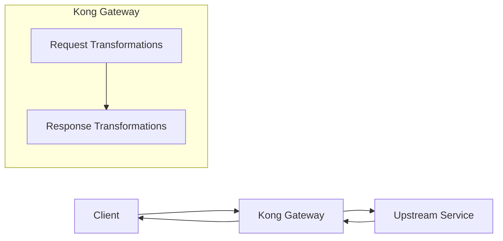

# Kong Transformations

## Introduction

When building APIs and microservices, you'll often need to modify requests and responses as they flow through your API gateway. Kong Gateway provides a powerful set of transformation plugins that allow you to manipulate HTTP requests before they reach your upstream services and modify responses before they're sent back to clients.

In this guide, we'll explore various Kong transformation plugins, understand how they work, and see them in action through practical examples.

## What are Kong Transformations?

Kong transformations are a collection of plugins that enable you to modify various aspects of HTTP requests and responses. These transformations can range from simple header additions to complex JSON payload restructuring.



Common use cases for transformations include:

- Converting between data formats (XML to JSON, etc.)
- Adding, removing, or modifying headers
- Changing request or response bodies
- Renaming parameters
- Implementing security headers
- Sanitizing data

## Key Transformation Plugins

Let's explore the most commonly used transformation plugins in Kong:

### 1. Request-Transformer

The Request-Transformer plugin allows you to modify incoming requests before they reach your upstream services.

#### Installation

```bash
$ kong config db_import request-transformer.yml
```

#### Configuration Example

```yaml
plugins:
  - name: request-transformer
    config:
      add:
        headers: ["x-consumer-id:$(consumer.id)"]
        querystring: ["api-version:v1"]
        body: ["new-field:new-value"]
      remove:
        headers: ["x-credential-id"]
        querystring: ["old-param"]
        body: ["sensitive-data"]
      rename:
        headers: ["original-header:new-header"]
        querystring: ["old-query:new-query"]
        body: ["original-field:new-field"]
      replace:
        headers: ["host:new-host.com"]
        querystring: ["param:new-value"]
        body: ["field:new-value"]
```

#### Practical Example

Let's say you have a legacy API that requires specific headers, but your clients don't provide them:

```yaml
plugins:
  - name: request-transformer
    config:
      add:
        headers: ["x-api-key:${vault://secrets/api-keys/legacy-system}"]
        querystring: ["version:1.0"]
      rename:
        body: ["user_id:accountId"]
```

**Before Transformation:**
```http
POST /users HTTP/1.1
Host: example.com
Content-Type: application/json

{
  "user_id": "12345",
  "name": "John Doe"
}
```

**After Transformation:**
```http
POST /users?version=1.0 HTTP/1.1
Host: example.com
Content-Type: application/json
x-api-key: s3cr3t-ap1-k3y

{
  "accountId": "12345",
  "name": "John Doe"
}
```

### 2. Response-Transformer

The Response-Transformer plugin allows you to modify outgoing responses from your upstream services before they're sent back to clients.

#### Configuration Example

```yaml
plugins:
  - name: response-transformer
    config:
      add:
        headers: ["x-powered-by:Kong"]
        json: ["metadata.timestamp:$(date)"]
      remove:
        json: ["internal_id", "sensitive_data"]
      rename:
        json: ["server_id:id"]
      replace:
        json: ["status:active"]
```

#### Practical Example

Imagine your upstream service returns sensitive data that should be removed before responses reach clients:

```yaml
plugins:
  - name: response-transformer
    config:
      remove:
        json: ["credit_card", "password", "ssn"]
      add:
        headers: ["X-Content-Type-Options:nosniff", "X-Frame-Options:DENY"]
      replace:
        json: ["error.code:user-friendly-error"]
```

**Before Transformation:**
```http
HTTP/1.1 200 OK
Content-Type: application/json

{
  "id": "user-123",
  "name": "John Doe",
  "credit_card": "1234-5678-9012-3456",
  "password": "hashed_password",
  "ssn": "123-45-6789",
  "error": {
    "code": "ERR-29491",
    "message": "Operation completed with warnings"
  }
}
```

**After Transformation:**
```http
HTTP/1.1 200 OK
Content-Type: application/json
X-Content-Type-Options: nosniff
X-Frame-Options: DENY

{
  "id": "user-123",
  "name": "John Doe",
  "error": {
    "code": "user-friendly-error",
    "message": "Operation completed with warnings"
  }
}
```

### 3. Correlation-ID

The Correlation-ID plugin adds a unique identifier to requests flowing through Kong, which is helpful for tracing requests across microservices.

#### Configuration Example

```yaml
plugins:
  - name: correlation-id
    config:
      header_name: X-Correlation-ID
      generator: uuid
      echo_downstream: true
```

#### Practical Example

**Before Request Reaches Kong:**
```http
GET /api/products HTTP/1.1
Host: example.com
```

**After Passing Through Kong:**
```http
GET /api/products HTTP/1.1
Host: example.com
X-Correlation-ID: 706d4e10-3431-4c1a-b785-cd0a9e45ff7b
```

**Response from Upstream with Echo Enabled:**
```http
HTTP/1.1 200 OK
Content-Type: application/json
X-Correlation-ID: 706d4e10-3431-4c1a-b785-cd0a9e45ff7b

{
  "products": []
}
```

This ID can be used for tracking the entire request flow through your microservices architecture.

### 4. JSON-to-XML and XML-to-JSON Transformers

These plugins convert payloads between JSON and XML formats, useful when working with services that require different data formats.

#### JSON-to-XML Example

**Configuration:**
```yaml
plugins:
  - name: json-to-xml
    config:
      content_type: application/xml
```

**Before (JSON):**
```json
{
  "user": {
    "id": 123,
    "name": "John Doe",
    "roles": ["admin", "developer"]
  }
}
```

**After (XML):**
```xml
<?xml version="1.0" encoding="UTF-8"?>
<root>
  <user>
    <id>123</id>
    <name>John Doe</name>
    <roles>admin</roles>
    <roles>developer</roles>
  </user>
</root>
```

#### XML-to-JSON Example

**Configuration:**
```yaml
plugins:
  - name: xml-to-json
    config: 
      remove_xml_declaration: true
      preserve_root: false
```

**Before (XML):**
```xml
<?xml version="1.0" encoding="UTF-8"?>
<order>
  <id>12345</id>
  <customer>
    <name>Jane Doe</name>
    <email>jane@example.com</email>
  </customer>
  <items>
    <item>
      <product>Widget</product>
      <quantity>2</quantity>
    </item>
    <item>
      <product>Gadget</product>
      <quantity>1</quantity>
    </item>
  </items>
</order>
```

**After (JSON):**
```json
{
  "id": "12345",
  "customer": {
    "name": "Jane Doe",
    "email": "jane@example.com"
  },
  "items": {
    "item": [
      {
        "product": "Widget",
        "quantity": "2"
      },
      {
        "product": "Gadget",
        "quantity": "1"
      }
    ]
  }
}
```

## Advanced Use Cases

### Chaining Multiple Transformations

You can chain multiple transformation plugins to create complex data manipulation pipelines:

```yaml
plugins:
  - name: request-transformer
    config:
      add:
        headers: ["x-version:1.0"]
  - name: response-transformer
    config:
      remove:
        json: ["internal_fields"]
  - name: correlation-id
    config:
      header_name: X-Correlation-ID
      generator: uuid
```

### Using Transformation Templates

For more complex transformations, you can use template rendering with the `request-transformer-advanced` and `response-transformer-advanced` plugins, which support templating:

```yaml
plugins:
  - name: request-transformer-advanced
    config:
      add:
        body:
          - |
            {"timestamp": "$(now)", "api_version": "$(headers.accept_version)"}
```

### Data Masking and Compliance

You can use transformations for meeting compliance requirements like GDPR or PCI-DSS:

```yaml
plugins:
  - name: response-transformer
    config:
      replace:
        json:
          - "credit_card:XXXX-XXXX-XXXX-$(substring(body.credit_card,12,16))"
          - "email:$(substring(body.email,0,3))***@$(substring_after(body.email,'@'))"
```

## Best Practices

When working with Kong transformations, consider these best practices:

1. **Start Simple**: Begin with basic transformations and gradually add complexity.

2. **Test Thoroughly**: Test your transformations against different inputs to ensure they handle edge cases properly.

3. **Monitor Performance**: Complex transformations can impact gateway performance. Monitor latency and adjust as needed.

4. **Security First**: Be careful not to expose sensitive data through transformations. Always validate transformed content.

5. **Documentation**: Document your transformations so other developers understand the expected input and output formats.

6. **Use Declarative Config**: Use Kong's declarative configuration format (YAML) to version control your transformations.

## Common Patterns and Solutions

### API Versioning

```yaml
plugins:
  - name: request-transformer
    config:
      add:
        headers: ["Accept-Version:v2"]
        querystring: ["api_version:2"]
```

### Error Response Standardization

```yaml
plugins:
  - name: response-transformer
    config:
      replace:
        json:
          - "error:{\"code\":\"$(body.status)\",\"message\":\"$(body.message)\",\"id\":\"$(headers.x-correlation-id)\"}"
```

### Security Headers Addition

```yaml
plugins:
  - name: response-transformer
    config:
      add:
        headers:
          - "Strict-Transport-Security:max-age=31536000; includeSubDomains"
          - "Content-Security-Policy:default-src 'self'"
          - "X-Content-Type-Options:nosniff"
          - "X-Frame-Options:DENY"
```

## Creating Custom Transformations

For scenarios where the built-in plugins don't meet your requirements, you can create custom transformations using Lua plugins:

```lua
local CustomTransformer = {
  PRIORITY = 800,
  VERSION = "1.0.0",
}

function CustomTransformer:access(conf)
  local request_headers = kong.request.get_headers()
  local body, err = kong.request.get_body()
  
  -- Perform custom transformations here
  
  -- Example: Add a custom header based on body content
  if body and body.user_type then
    kong.service.request.set_header("X-User-Type", body.user_type)
  end
end

return CustomTransformer
```

## Summary

Kong transformations provide powerful tools for modifying HTTP requests and responses as they flow through your API gateway. By using these plugins effectively, you can:

- Standardize API interfaces
- Implement security best practices
- Convert between data formats
- Mask sensitive information
- Improve debugging and monitoring
- Create backward compatibility for APIs

The ability to transform requests and responses is one of Kong's most valuable features, allowing you to adapt different services and clients to work together seamlessly without changing their implementation.

## Additional Resources

- Kong Plugin Development Guide
- Request Transformer Plugin Documentation
- Response Transformer Plugin Documentation  
- Kong Correlation ID Plugin Documentation
- Understanding JSON and XML Data Formats
- Advanced Data Transformation Patterns

## Exercises

1. **Basic Header Transformation**: Configure a request-transformer plugin to add an `X-API-Version` header to all requests.

2. **Body Modification**: Create a response-transformer configuration that removes a sensitive field like `password` from all responses.

3. **Format Conversion**: Set up an API route that accepts JSON but converts it to XML before sending it to the upstream service.

4. **Advanced Transformation**: Create a custom Lua plugin that transforms data based on complex business rules.

5. **Error Standardization**: Configure a response transformer that standardizes error responses across different services.

By mastering Kong transformations, you'll have powerful tools to integrate services, enhance security, and create consistent API experiences.