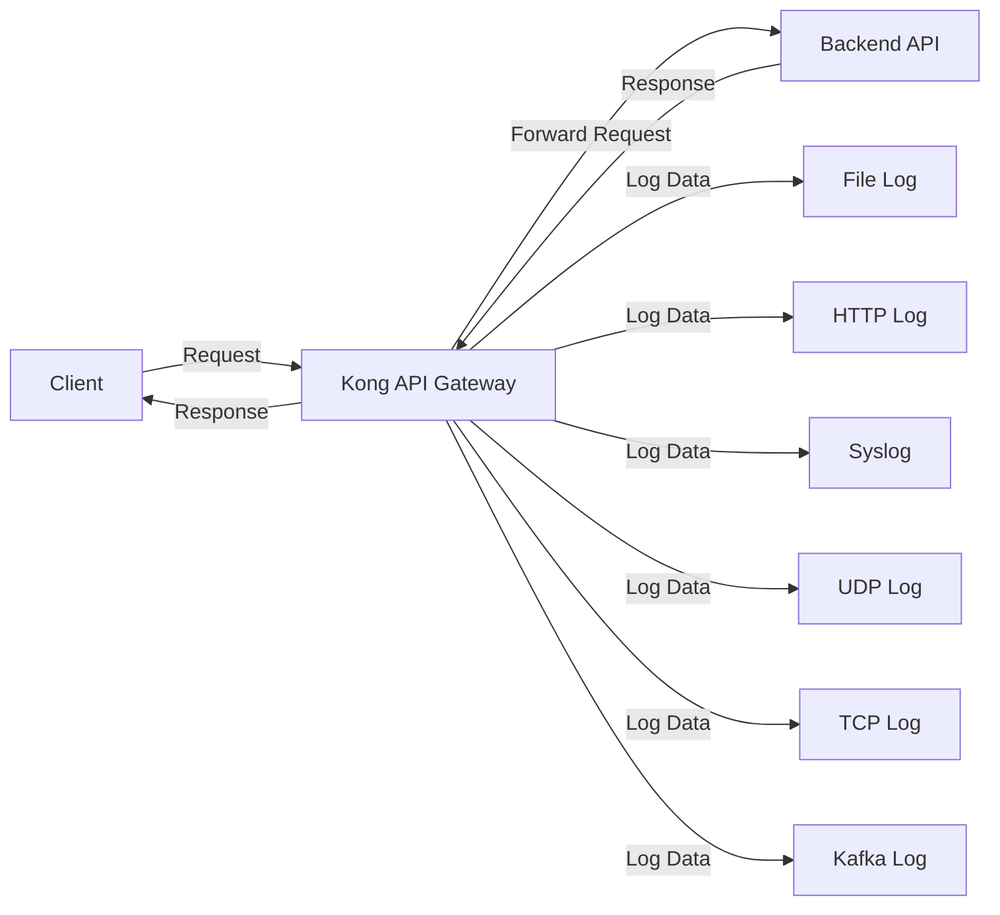

# Kong Logging

## Introduction

Logging is a critical aspect of managing and monitoring API gateways. Kong, a popular open-source API gateway, provides powerful logging capabilities through its plugin system. In this guide, we'll explore how Kong logging plugins work, how to configure them, and how they can help you monitor and troubleshoot your API infrastructure.

Kong logging plugins capture request and response data from your APIs and send this information to various destinations such as files, HTTP endpoints, or third-party logging services. This gives you visibility into your API traffic, helping you identify issues, track usage patterns, and ensure your services are operating correctly.

## Understanding Kong's Logging Architecture

Before diving into specific plugins, let's understand how logging works in Kong:

1. **Plugin-based approach**: Kong uses plugins to extend its functionality, including logging
2. **Multiple targets**: Logs can be sent to various destinations simultaneously
3. **Customizable output**: You can control what data gets logged
4. **Performance considerations**: Logging affects performance, so Kong offers async options



## Common Logging Plugins

Kong offers several logging plugins to suit different needs:

- **File Log**: Writes logs to a local file
- **HTTP Log**: Sends log data to an HTTP endpoint
- **TCP Log**: Sends log data to a TCP server
- **UDP Log**: Sends log data to a UDP server
- **Syslog**: Logs to the system's syslog
- **Kafka Log**: Pushes logs to a Kafka topic
- **StatsD**: Logs various metrics to a StatsD server
- **Loggly**: Sends logs to Loggly service
- **Datadog**: Forwards logs to Datadog

Let's look at how to implement some of these plugins.

## File Log Plugin

The File Log plugin is one of the simplest to configure. It writes request and response data to a local file.

### Configuration

Here's how to enable the File Log plugin:

```bash
curl -X POST http://localhost:8001/services/my-service/plugins \
  --data "name=file-log" \
  --data "config.path=/tmp/kong-file-log.log"
```

Or using declarative configuration in `kong.yml`:

```yaml
plugins:
  - name: file-log
    service: my-service
    config:
      path: /tmp/kong-file-log.log
      reopen: true
```

### Parameters

The File Log plugin accepts the following parameters:

| Parameter | Required | Default | Description |
|-----------|----------|---------|-------------|
| `path`    | Yes      |         | The file path where logs are written |
| `reopen`  | No       | false   | Determines if log file is reopened on each request |

### Example Output

The following shows an example of what gets written to the log file:

```json
{
  "latencies": {
    "request": 45,
    "kong": 15,
    "proxy": 30
  },
  "service": {
    "host": "example.com",
    "created_at": 1614145966,
    "connect_timeout": 60000,
    "id": "3340a747-89c6-4275-a901-d7a5a3b38d72",
    "protocol": "http",
    "name": "example-service",
    "read_timeout": 60000,
    "port": 80,
    "updated_at": 1614145966,
    "write_timeout": 60000,
    "retries": 5
  },
  "request": {
    "querystring": {},
    "size": 76,
    "uri": "/test",
    "url": "http://localhost:8000/test",
    "headers": {
      "host": "localhost:8000",
      "user-agent": "curl/7.68.0",
      "accept": "*/*"
    },
    "method": "GET"
  },
  "client_ip": "172.19.0.1",
  "response": {
    "status": 200,
    "size": 934,
    "headers": {
      "Content-Type": "application/json",
      "Content-Length": "805",
      "Connection": "keep-alive"
    }
  },
  "route": {
    "id": "e6ea8d0b-5d5e-4wef-b0d3-1f2f5ea8434f",
    "paths": [
      "/test"
    ],
    "protocols": [
      "http"
    ],
    "created_at": 1614145972,
    "service": {
      "id": "3340a747-89c6-4275-a901-d7a5a3b38d72"
    }
  },
  "started_at": 1620125123
}
```

## HTTP Log Plugin

The HTTP Log plugin sends log data to an HTTP server. This is useful when you want to centralize your logs or integrate with external log management systems.

### Configuration

```bash
curl -X POST http://localhost:8001/services/my-service/plugins \
  --data "name=http-log" \
  --data "config.http_endpoint=http://logserver.com:8080/logs" \
  --data "config.method=POST" \
  --data "config.timeout=10000" \
  --data "config.keepalive=60000"
```

Using declarative configuration:

```yaml
plugins:
  - name: http-log
    service: my-service
    config:
      http_endpoint: http://logserver.com:8080/logs
      method: POST
      timeout: 10000
      keepalive: 60000
```

### Practical Example: Setting Up Centralized Logging

Let's walk through a real-world example of setting up centralized logging with Kong and the HTTP Log plugin.

1. First, set up a logging server. For this example, we'll use a simple Express.js server:

```javascript
const express = require('express');
const bodyParser = require('body-parser');
const fs = require('fs');
const app = express();

app.use(bodyParser.json({ limit: '10mb' }));

app.post('/logs', (req, res) => {
  const logData = req.body;
  const timestamp = new Date().toISOString();
  
  // Add timestamp to log data
  logData.received_at = timestamp;
  
  // Write to file
  fs.appendFileSync(
    './centralized-logs.json', 
    JSON.stringify(logData) + '
'
  );
  
  console.log(`Log received at ${timestamp}`);
  res.status(200).send('Log received');
});

app.listen(8080, () => {
  console.log('Log server listening on port 8080');
});
```

2. Configure Kong to send logs to this server:

```bash
curl -X POST http://localhost:8001/services/my-service/plugins \
  --data "name=http-log" \
  --data "config.http_endpoint=http://logserver:8080/logs" \
  --data "config.method=POST" \
  --data "config.timeout=10000" \
  --data "config.keepalive=60000" \
  --data "config.queue_size=10" \
  --data "config.flush_timeout=2"
```

3. Test your API to generate some logs:

```bash
curl -i http://localhost:8000/my-service/api/endpoint
```

4. Check your log server to confirm logs are being received.

## Advanced Logging Configurations

### Custom Log Format

Kong allows you to customize what data gets included in your logs. This is particularly useful when you want to focus on specific information or need to comply with data privacy regulations.

For example, with the HTTP Log plugin:

```yaml
plugins:
  - name: http-log
    service: my-service
    config:
      http_endpoint: http://logserver.com:8080/logs
      method: POST
      timeout: 10000
      keepalive: 60000
      custom_fields_by_lua:
        important_header: "return kong.request.get_header('X-Important')"
        request_path: "return kong.request.get_path()"
        environment: "return 'production'"
```

### Asynchronous Logging

To minimize the impact of logging on API performance, Kong can send logs asynchronously:

```yaml
plugins:
  - name: http-log
    service: my-service
    config:
      http_endpoint: http://logserver.com:8080/logs
      method: POST
      timeout: 10000
      keepalive: 60000
      queue_size: 100
      flush_timeout: 2
```

The `queue_size` parameter defines how many logs can be queued before being sent, and `flush_timeout` defines how often (in seconds) the queue is flushed.

## Troubleshooting Common Issues

### Logs Not Being Sent

If your logs aren't reaching their destination:

1. **Check plugin configuration**: Verify your plugin is correctly configured
2. **Verify connectivity**: Ensure Kong can reach the log destination
3. **Check permissions**: For file logs, make sure Kong has write permissions
4. **Inspect Kong error logs**: Look for errors in Kong's own logs: `/usr/local/kong/logs/error.log`

### Performance Impact

If logging is affecting your API performance:

1. **Use async logging**: Configure queue_size and flush_timeout
2. **Limit log data**: Only log necessary fields
3. **Scale horizontally**: Add more Kong nodes to distribute logging load
4. **Consider sampling**: Log only a percentage of requests in high-traffic environments

## Best Practices for Kong Logging

1. **Log meaningful data**: Focus on information that helps with troubleshooting and monitoring
2. **Consider log volume**: High-traffic APIs can generate enormous logs; plan accordingly
3. **Use different log levels**: Not all events need the same level of detail
4. **Rotate logs**: For file-based logging, implement log rotation
5. **Secure sensitive data**: Mask or exclude sensitive information like passwords or tokens
6. **Centralize logs**: Use HTTP or TCP logging to send logs to a central system
7. **Set up alerts**: Configure alerts for error patterns or unusual activity

## Implementing a Complete Logging Strategy

For a robust logging strategy, consider combining multiple logging plugins:

```yaml
# kong.yml
services:
  - name: user-service
    url: http://user-service:3000
    plugins:
      - name: file-log
        config:
          path: /usr/local/kong/logs/user-service.log
          reopen: true
      - name: http-log
        config:
          http_endpoint: http://elk-stack:9200/kong-logs
          method: POST
          timeout: 10000
          keepalive: 60000
      - name: datadog
        config:
          host: datadog-agent
          port: 8125
          metrics:
            - request_count
            - latency
            - request_size
            - response_size
    routes:
      - name: user-api
        paths:
          - /users
```

This configuration sends logs to:
1. A local file for quick debugging
2. An ELK stack for centralized logging and analysis
3. Datadog for monitoring and alerting

## Practical Exercise: Implementing Structured Logging

Let's implement a structured logging system for a microservices architecture:

1. **Setup a centralized logging stack** (e.g., ELK or Graylog)

2. **Configure Kong with HTTP Log plugin**:

```yaml
plugins:
  - name: http-log
    service: all-services
    config:
      http_endpoint: http://logstash:8080/kong-logs
      method: POST
      timeout: 10000
      keepalive: 60000
      custom_fields_by_lua:
        service_name: "return kong.service.name or 'unknown'"
        environment: "return 'production'"
        request_id: "return kong.request.get_header('X-Request-ID') or kong.request.get_header('X-Correlation-ID') or require('kong.tools.uuid').uuid()"
      queue_size: 100
      flush_timeout: 2
```

3. **Create dashboards** in your log management system to visualize:
   - Request volumes by service
   - Error rates
   - Response times
   - Geographic distribution of requests

4. **Set up alerting rules** for:
   - Sudden increases in error rates
   - Unusual traffic patterns
   - Slow response times

## Summary

Kong's logging plugins provide a flexible and powerful system for capturing, analyzing, and monitoring API traffic. By properly configuring these plugins, you can gain valuable insights into your API usage, troubleshoot issues quickly, and ensure your services are running optimally.

Remember these key points:
- Choose the right logging plugins based on your infrastructure and requirements
- Configure asynchronous logging to minimize performance impact
- Centralize logs for better analysis and troubleshooting
- Implement a complete logging strategy for comprehensive monitoring

## Additional Resources

- [Kong Plugin Documentation](https://docs.konghq.com/hub/kong-inc/file-log/)
- [ELK Stack Integration Guide](https://www.elastic.co/guide/index.html)
- [API Monitoring Best Practices](https://konghq.com/blog)
- [Kong Community Forum](https://discuss.konghq.com/)

## Practice Exercises

1. Set up the HTTP Log plugin to send logs to a local server and observe the data being transmitted.
2. Configure the File Log plugin with log rotation.
3. Create a centralized logging system using the ELK stack and Kong's HTTP Log plugin.
4. Implement custom fields to track specific headers and request attributes.
5. Build a dashboard to visualize response times and error rates across your services.