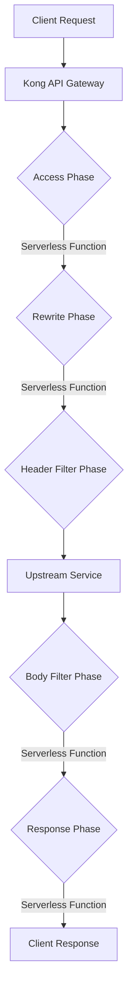

# Kong Serverless

## Introduction

The Kong Serverless plugin allows you to execute custom logic directly within Kong's request/response lifecycle without requiring a separate microservice. Using this plugin, you can write JavaScript or Lua functions that run within the Kong Gateway itself, enabling you to transform requests and responses, implement custom authentication, rate-limiting, or other API gateway functionality without deploying separate services.

This approach has several advantages for API developers:

- **Reduced latency**: Functions execute within Kong, eliminating network hops
- **Simplified architecture**: Fewer microservices to maintain
- **Flexible deployment**: Quick implementation of business logic without building dedicated services
- **Resource efficiency**: Lightweight functions rather than full applications

## How Kong Serverless Works

Kong Serverless functions can be executed at different phases of the request/response lifecycle:



The plugin supports two primary types of serverless functions:

1. **Pre-function**: Executes before the request reaches the upstream service
2. **Post-function**: Executes after receiving the response from the upstream service

## Setting Up Kong Serverless

### Prerequisites

- Kong Gateway installed and running
- Basic understanding of Kong configuration
- Knowledge of JavaScript or Lua programming

### Installation

If you're using Kong Enterprise, the Serverless plugins are included by default. For Kong Community Edition, you need to ensure they're enabled in your `kong.conf` file:

```
plugins = bundled,pre-function,post-function
```

## Using the Pre-function Plugin

The pre-function plugin executes custom code before the request reaches your upstream service.

### Basic Configuration

Here's how to configure a pre-function plugin using the Admin API:

```bash
curl -X POST http://localhost:8001/services/my-service/plugins \
  --data "name=pre-function" \
  --data "config.functions[]=return function(conf) 
      kong.log('Hello from pre-function!') 
    end"
```

### Example: Request Transformation

Let's create a pre-function that adds a custom header to all requests:

```js
// Add X-Request-ID header to all requests
return function(config)
  local uuid = require "kong.tools.uuid"
  local new_id = uuid()
  kong.service.request.set_header("X-Request-ID", new_id)
  kong.log("Added X-Request-ID: " .. new_id)
end
```

This function:
1. Generates a unique ID
2. Adds it as an X-Request-ID header to the request
3. Logs the action

### Example: Basic Authentication Check

Here's a more complex example implementing a simple authentication check:

```js
return function(config)
  -- Get the Authorization header
  local auth_header = kong.request.get_header("Authorization")
  
  -- Check if the header exists and matches our pattern
  if not auth_header or not auth_header:match("^Basic") then
    kong.response.exit(401, { message = "Authentication required" })
  end
  
  -- Extract credentials (base64 encoded)
  local cred = auth_header:sub(7):gsub("%s+", "")
  local decoded_cred = ngx.decode_base64(cred)
  local username, password = decoded_cred:match("([^:]+):(.*)")
  
  -- Simple check (in production, use a more secure approach)
  if username ~= "admin" or password ~= "secret" then
    kong.response.exit(401, { message = "Invalid credentials" })
  end
  
  kong.log("User authenticated: " .. username)
end
```

## Using the Post-function Plugin

The post-function plugin executes after receiving a response from your upstream service.

### Basic Configuration

Configure a post-function using the Admin API:

```bash
curl -X POST http://localhost:8001/services/my-service/plugins \
  --data "name=post-function" \
  --data "config.functions[]=return function(conf) 
      kong.log('Hello from post-function!') 
    end"
```

### Example: Response Transformation

This example modifies the response body to include additional metadata:

```js
return function(config)
  -- Get the response body
  local body = kong.service.response.get_body()
  
  -- If it's JSON, add metadata
  if kong.response.get_header("Content-Type"):find("application/json", 1, true) then
    if type(body) == "table" then
      body.metadata = {
        timestamp = os.time(),
        gateway = "Kong/" .. kong.version
      }
      kong.service.response.set_body(body)
    end
  end
end
```

This function:
1. Retrieves the response body
2. Checks if it's JSON
3. Adds a metadata object with timestamp and Kong version information

## Advanced Usage

### Combining Pre-function and Post-function

You can use both plugins together to create comprehensive request/response processing:

```bash
# Add pre-function
curl -X POST http://localhost:8001/routes/my-route/plugins \
  --data "name=pre-function" \
  --data "config.functions[]=return function() kong.log('Pre-processing request') end"

# Add post-function
curl -X POST http://localhost:8001/routes/my-route/plugins \
  --data "name=post-function" \
  --data "config.functions[]=return function() kong.log('Post-processing response') end"
```

### Multiple Functions

Both plugins support executing multiple functions in sequence:

```bash
curl -X POST http://localhost:8001/services/my-service/plugins \
  --data "name=pre-function" \
  --data "config.functions[]=return function() kong.log('First function') end" \
  --data "config.functions[]=return function() kong.log('Second function') end"
```

### Sharing State Between Functions

You can use the `kong.ctx` table to share state between functions:

```js
-- In pre-function
return function()
  kong.ctx.shared.start_time = ngx.now()
end

-- In post-function
return function()
  local duration = ngx.now() - kong.ctx.shared.start_time
  kong.log("Request took " .. duration .. " seconds")
end
```

## Real-world Applications

### 1. Rate Limiting Implementation

```js
return function()
  local redis = require "resty.redis"
  local red = redis:new()
  red:set_timeout(2000)
  
  -- Connect to Redis
  local ok, err = red:connect("127.0.0.1", 6379)
  if not ok then
    kong.log.err("Failed to connect to Redis: ", err)
    return
  end
  
  -- Get the client IP
  local client_ip = kong.client.get_ip()
  local key = "ratelimit:" .. client_ip
  
  -- Increment and check the counter
  local count, err = red:incr(key)
  if not count then
    kong.log.err("Failed to increment counter: ", err)
    return
  end
  
  -- Set expiry if this is a new key
  if count == 1 then
    red:expire(key, 60)  -- 60 seconds window
  end
  
  -- Check against limit
  if count > 10 then
    kong.response.exit(429, { message = "Rate limit exceeded" })
  end
  
  -- Add headers
  kong.response.set_header("X-RateLimit-Limit", 10)
  kong.response.set_header("X-RateLimit-Remaining", 10 - count)
  
  -- Put connection back in pool
  red:set_keepalive(10000, 100)
end
```

### 2. Request Logging Service

```js
return function()
  -- Collect request details
  local req_data = {
    method = kong.request.get_method(),
    uri = kong.request.get_path(),
    query = kong.request.get_raw_query(),
    headers = kong.request.get_headers(),
    body = kong.request.get_body(),
    client_ip = kong.client.get_ip(),
    started_at = ngx.req.start_time()
  }
  
  -- Store in Kong context to access in post-function
  kong.ctx.shared.req_data = req_data
end
```

Paired with a post-function:

```js
return function()
  local req_data = kong.ctx.shared.req_data
  
  -- Add response details
  req_data.response = {
    status = kong.response.get_status(),
    headers = kong.response.get_headers(),
    body = kong.service.response.get_body(),
    ended_at = ngx.now()
  }
  
  req_data.duration = req_data.ended_at - req_data.started_at
  
  -- Log the complete request/response cycle
  kong.log.serialize(req_data)
  
  -- Could also send to external logging service
  -- local http = require "resty.http"
  -- local httpc = http.new()
  -- httpc:request_uri("http://logging-service", {
  --   method = "POST",
  --   body = require("cjson").encode(req_data),
  --   headers = {
  --     ["Content-Type"] = "application/json"
  --   }
  -- })
end
```

## Best Practices

1. **Keep functions lightweight**: Serverless functions should execute quickly to avoid adding latency.

2. **Error handling**: Always include proper error handling to prevent request failures.

3. **Testing**: Test functions thoroughly before deploying to production.

4. **Monitoring**: Use Kong's logging capabilities to monitor function performance.

5. **Security**: Avoid storing sensitive information in functions; use Kong's environment variables or Vault integrations instead.

6. **Function size**: Break complex logic into multiple smaller functions for better maintainability.

7. **Version control**: Store function code in version control systems separate from Kong configuration.

## Summary

The Kong Serverless plugin provides a powerful way to execute custom logic directly within Kong API Gateway. By implementing pre-functions and post-functions, you can transform requests and responses, implement custom business logic, and extend Kong's capabilities without deploying separate microservices.

This approach offers benefits in terms of performance, simplicity, and flexibility, allowing you to quickly implement and iterate on API functionality while keeping your architecture lean.

## Additional Resources

- [Kong Serverless Functions Official Documentation](https://docs.konghq.com/hub/kong-inc/serverless-functions/)
- [Kong PDK (Plugin Development Kit) Reference](https://docs.konghq.com/gateway/latest/pdk/)
- [OpenResty Lua Documentation](https://github.com/openresty/lua-nginx-module)

## Exercises

1. Create a pre-function that validates a JWT token before allowing access to an endpoint.

2. Implement a post-function that adds CORS headers to all responses.

3. Develop a pre-function that routes requests to different upstream services based on the value of a specific header.

4. Create a logging solution that captures request details, response status, and timing information.

5. Implement a caching layer using Kong's serverless functions and an external Redis instance.