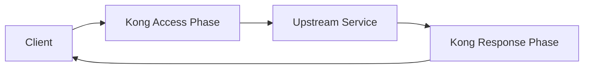

# Kong Custom Plugins

## Introduction

Kong is a popular open-source API Gateway that helps you manage, secure, and extend your APIs. While Kong comes with many built-in plugins for authentication, rate limiting, logging, and more, you might encounter situations where you need custom functionality specific to your business needs. This is where custom plugins come in.

Custom plugins allow you to extend Kong's functionality by writing your own logic in Lua, Kong's programming language of choice. By creating custom plugins, you can implement unique business rules, integrate with proprietary systems, or modify request/response handling in ways that aren't covered by Kong's built-in plugins.

## Prerequisites

Before diving into custom plugin development, make sure you have:

- Kong Gateway installed and running (version 2.0 or later)
- Basic knowledge of Lua programming language
- Understanding of Kong's architecture and plugin system
- Development environment with Lua installed

## Kong Plugin Framework Overview

Kong plugins use a framework that divides plugin execution into phases that align with the HTTP request/response lifecycle:



The main phases where plugins can interact are:

- **init_worker**: Runs when Kong starts
- **certificate**: Handles SSL/TLS certificate operations
- **rewrite**: Executes before any other plugin
- **access**: Authenticates and authorizes the request
- **header_filter**: Processes response headers
- **body_filter**: Processes response body
- **log**: Records information after the response has been sent to the client

## Creating Your First Custom Plugin

Let's create a simple custom plugin that adds a custom header to incoming requests.

### 1. Setting Up the Plugin Structure

Kong plugins follow a specific directory structure:

```
kong-plugin/
├── kong/
│   └── plugins/
│       └── my-custom-plugin/
│           ├── handler.lua
│           └── schema.lua
└── my-custom-plugin-0.1.0-1.rockspec
```

### 2. Defining the Plugin Schema

First, let's define the schema for our plugin. This specifies what configuration options our plugin accepts.

Create a file called `schema.lua`:

```lua
local typedefs = require "kong.db.schema.typedefs"

return {
  name = "my-custom-plugin",
  fields = {
    { consumer = typedefs.no_consumer },
    { protocols = typedefs.protocols_http },
    { config = {
        type = "record",
        fields = {
          { header_name = { type = "string", default = "X-My-Custom-Header" }, },
          { header_value = { type = "string", default = "Hello World!" }, },
        },
      },
    },
  },
}
```

This schema defines two configuration options: `header_name` and `header_value`, both with default values.

### 3. Writing the Plugin Handler

Next, create a file called `handler.lua`:

```lua
local plugin = {
  PRIORITY = 1000,
  VERSION = "0.1.0",
}

function plugin:access(conf)
  -- Add the custom header to the request
  kong.service.request.set_header(conf.header_name, conf.header_value)
end

return plugin
```

This simple handler:
- Sets a priority of 1000 (determines the order of execution among plugins)
- Implements the `access` phase
- Adds our custom header to the request

### 4. Creating a RockSpec File

Kong uses LuaRocks for package management. Create a `.rockspec` file to define your plugin package:

```lua
package = "my-custom-plugin"
version = "0.1.0-1"
source = {
  url = "git://github.com/yourusername/kong-my-custom-plugin",
  tag = "0.1.0"
}
description = {
  summary = "A Kong plugin that adds a custom header",
  license = "MIT",
}
dependencies = {
  "lua >= 5.1"
}
build = {
  type = "builtin",
  modules = {
    ["kong.plugins.my-custom-plugin.handler"] = "kong/plugins/my-custom-plugin/handler.lua",
    ["kong.plugins.my-custom-plugin.schema"] = "kong/plugins/my-custom-plugin/schema.lua",
  }
}
```

### 5. Installing and Testing Your Plugin

Install your plugin using LuaRocks:

```bash
luarocks install my-custom-plugin-0.1.0-1.rockspec
```

Add your plugin to the Kong configuration file (`kong.conf`):

```
plugins = bundled,my-custom-plugin
```

Restart Kong:

```bash
kong restart
```

Enable the plugin for a specific service or route:

```bash
curl -X POST http://localhost:8001/services/my-service/plugins \
  --data "name=my-custom-plugin" \
  --data "config.header_name=X-Custom-Header" \
  --data "config.header_value=CustomValue"
```

## Advanced Plugin Development

### Working with Request and Response Data

Custom plugins can manipulate various aspects of the request and response:

**Modifying Request Body**

```lua
function plugin:access(conf)
  -- Read request body
  local body, err = kong.request.get_body()
  
  if body then
    -- Modify the body
    body.additional_field = "added by plugin"
    
    -- Set the modified body
    kong.service.request.set_body(body)
  end
end
```

**Transforming Response**

```lua
function plugin:body_filter(conf)
  local chunk, eof = ngx.arg[1], ngx.arg[2]
  
  if eof then
    -- Transform the response at the end
    chunk = chunk:gsub("important", "IMPORTANT")
    ngx.arg[1] = chunk
  end
end
```

### Adding Authentication Logic

Here's a simplified example of an authentication plugin:

```lua
function plugin:access(conf)
  -- Get the API key from header
  local api_key = kong.request.get_header("X-API-Key")
  
  if not api_key then
    return kong.response.exit(401, { message = "API key required" })
  end
  
  -- Verify the API key (simplified example)
  local valid = verify_api_key(api_key)
  if not valid then
    return kong.response.exit(403, { message = "Invalid API key" })
  end
  
  -- If we reach here, authentication is successful
  kong.service.request.set_header("X-Consumer-ID", "verified-user")
end
```

### Creating a Rate Limiting Plugin

Rate limiting is a common use case for custom plugins:

```lua
local redis = require "resty.redis"

function plugin:access(conf)
  local client_ip = kong.client.get_ip()
  local redis_key = "rate_limit:" .. client_ip
  
  -- Connect to Redis
  local red = redis:new()
  red:connect("localhost", 6379)
  
  -- Increment counter
  local current = red:incr(redis_key)
  
  -- Set expiry if this is the first request in the window
  if current == 1 then
    red:expire(redis_key, conf.window_size)
  end
  
  -- Check if the limit is exceeded
  if current > conf.limit then
    return kong.response.exit(429, { message = "Rate limit exceeded" })
  end
  
  red:close()
end
```

## Real-World Examples

### Example 1: Custom Logging Plugin

This plugin logs specific request details to a custom endpoint:

```lua
function plugin:log(conf)
  -- Collect data to log
  local log_data = {
    api = kong.router.get_service().name,
    path = kong.request.get_path(),
    query = kong.request.get_query(),
    status = kong.response.get_status(),
    request_time = ngx.now() - ngx.req.start_time(),
    client_ip = kong.client.get_ip()
  }
  
  -- Send log data to external service (async)
  kong.log.notice("Logging request details")
  
  local http = require "resty.http"
  local httpc = http.new()
  
  -- Send log asynchronously
  ngx.timer.at(0, function()
    httpc:request_uri(conf.log_endpoint, {
      method = "POST",
      body = kong.json.encode(log_data),
      headers = {
        ["Content-Type"] = "application/json"
      }
    })
  end)
end
```

### Example 2: Request Transformation Plugin

This plugin modifies incoming requests based on specific conditions:

```lua
function plugin:access(conf)
  -- Check if we should apply the transformation
  local path = kong.request.get_path()
  
  if string.match(path, conf.path_pattern) then
    -- Get current query parameters
    local query_params = kong.request.get_query()
    
    -- Add or modify query parameters
    for k, v in pairs(conf.additional_params) do
      query_params[k] = v
    end
    
    -- Set the modified query parameters
    kong.service.request.set_query(query_params)
    
    -- Add headers for downstream services
    kong.service.request.set_header("X-Modified-By", "transformation-plugin")
  end
end
```

## Testing Strategies for Custom Plugins

### Unit Testing with Busted

Busted is a testing framework for Lua that works well with Kong plugins:

```lua
-- spec/my-custom-plugin/01-unit_spec.lua
local PLUGIN_NAME = "my-custom-plugin"

describe(PLUGIN_NAME .. ": (unit)", function()
  local plugin_handler

  setup(function()
    -- Load the plugin
    plugin_handler = require("kong.plugins." .. PLUGIN_NAME .. ".handler")
  end)

  describe("access", function()
    it("adds the configured header", function()
      -- Mock Kong functions
      _G.kong = {
        service = {
          request = {
            set_header = spy.new(function() end)
          }
        }
      }
      
      -- Test configuration
      local conf = {
        header_name = "X-Test-Header",
        header_value = "Test-Value"
      }
      
      -- Call the plugin function
      plugin_handler.access(plugin_handler, conf)
      
      -- Verify the header was set
      assert.spy(kong.service.request.set_header).was_called_with("X-Test-Header", "Test-Value")
    end)
  end)
end)
```

### Integration Testing with Kong's test utilities

Kong provides tools to test plugins in a more integrated way:

```lua
-- spec/my-custom-plugin/02-integration_spec.lua
local helpers = require "spec.helpers"

describe("Plugin: my-custom-plugin (integration)", function()
  local proxy_client

  setup(function()
    local bp = helpers.get_db_utils()
    
    -- Create test Service and Route
    local service = bp.services:insert({
      name = "test-service",
      url = "http://mockbin.org"
    })
    
    bp.routes:insert({
      service = { id = service.id },
      hosts = { "test.com" }
    })
    
    -- Enable the plugin
    bp.plugins:insert({
      name = "my-custom-plugin",
      service = { id = service.id },
      config = {
        header_name = "X-Test-Header",
        header_value = "Test-Value"
      }
    })
    
    -- Start Kong
    assert(helpers.start_kong())
    proxy_client = helpers.proxy_client()
  end)
  
  teardown(function()
    if proxy_client then proxy_client:close() end
    helpers.stop_kong()
  end)
  
  it("adds the configured header to the request", function()
    local res = proxy_client:get("/request", {
      headers = { host = "test.com" }
    })
    
    local body = assert.res_status(200, res)
    local json = cjson.decode(body)
    
    assert.equal("Test-Value", json.headers["X-Test-Header"])
  end)
end)
```

## Debugging Custom Plugins

When developing plugins, debugging is essential. Kong offers several ways to debug your plugins:

### Enable Debug Logs

In your `kong.conf`:

```
log_level = debug
```

### Use Kong's logger

```lua
function plugin:access(conf)
  kong.log.debug("Processing request with my custom plugin")
  kong.log.inspect(conf)  -- This prints the configuration
end
```

### Common Issues and Solutions

1. **Plugin doesn't load**
   - Check if the plugin is listed in `kong.conf`
   - Verify the plugin structure follows Kong's conventions
   - Look for Lua syntax errors

2. **Plugin loads but doesn't execute**
   - Check the plugin priority
   - Ensure you're implementing the correct phases
   - Verify the plugin is enabled for your service/route

3. **Errors during execution**
   - Check Kong's error logs
   - Add debug statements
   - Verify input data types and values

## Deploying Custom Plugins

### Method 1: LuaRocks Installation

```bash
# Build and install
luarocks make

# Or install from a rockspec
luarocks install my-custom-plugin-0.1.0-1.rockspec
```

### Method 2: Using Kong's plugins directory

Add your plugin to Kong's plugin directory:

```bash
cp -r kong/plugins/my-custom-plugin /usr/local/share/lua/5.1/kong/plugins/
```

### Method 3: Using Docker

Create a Dockerfile that extends the Kong image:

```dockerfile
FROM kong:latest

USER root

COPY kong/plugins/my-custom-plugin /usr/local/share/lua/5.1/kong/plugins/my-custom-plugin

# Ensure proper permissions
RUN chown -R kong:kong /usr/local/share/lua/5.1/kong/plugins/my-custom-plugin

USER kong

# Add the plugin to the list of enabled plugins
ENV KONG_PLUGINS=bundled,my-custom-plugin
```

Build and run your custom Kong image:

```bash
docker build -t kong-with-custom-plugin .
docker run -d --name kong-custom -e "KONG_DATABASE=off" -e "KONG_PROXY_ACCESS_LOG=/dev/stdout" -e "KONG_ADMIN_ACCESS_LOG=/dev/stdout" -e "KONG_PROXY_ERROR_LOG=/dev/stderr" -e "KONG_ADMIN_ERROR_LOG=/dev/stderr" -e "KONG_ADMIN_LISTEN=0.0.0.0:8001" -p 8000:8000 -p 8001:8001 kong-with-custom-plugin
```

## Summary

Custom plugins are a powerful way to extend Kong's functionality to meet your specific requirements. By following a few key steps, you can create plugins that:

- Modify requests and responses
- Implement custom authentication and authorization
- Add rate limiting or throttling
- Perform custom logging and analytics
- Transform data between your clients and upstream services

Creating custom plugins does require knowledge of Lua and Kong's architecture, but the flexibility it provides is well worth the learning curve for advanced API management needs.

## Additional Resources

- [Kong Plugin Development Guide](https://docs.konghq.com/gateway/latest/plugin-development/)
- [Lua Programming Language](https://www.lua.org/docs.html)
- [Kong Plugin Development Kit (PDK) Reference](https://docs.konghq.com/gateway/latest/pdk/)
- [OpenResty (Nginx + Lua) Documentation](https://openresty.org/en/getting-started.html)

## Exercises

1. Create a plugin that adds a response header with the total processing time.
2. Develop a plugin that redirects requests based on a custom rule set.
3. Build a plugin that validates JSON request bodies against a schema.
4. Create a plugin that implements a simple cache for responses.
5. Develop a plugin that integrates with a third-party service for additional request validation.