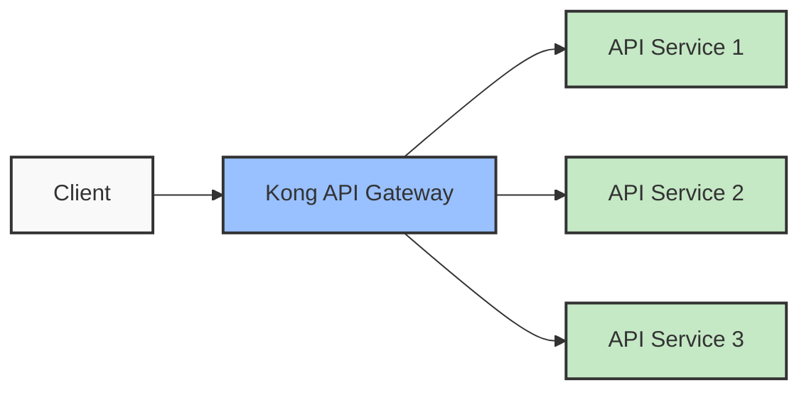
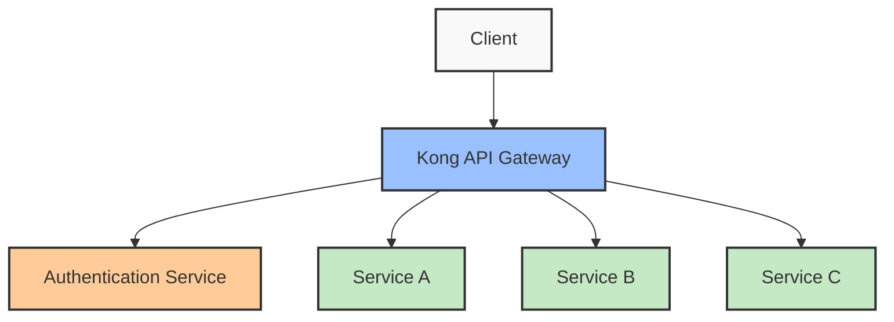

# Kong Authentication

## Introduction

Authentication is a critical component of modern web applications and APIs. It ensures that only legitimate users and services can access your resources. Kong, a popular API gateway, provides several authentication mechanisms to protect your APIs from unauthorized access.

In this guide, we'll explore Kong's authentication options, learn how they work, and implement them step by step. By the end, you'll have a solid understanding of how to secure your APIs using Kong's authentication plugins.

## What is Kong?

Before diving into authentication, let's briefly understand what Kong is. Kong is an open-source API gateway and microservices management layer that sits in front of your APIs. It acts as a gatekeeper, handling cross-cutting concerns like:

- Traffic control
- Monitoring
- **Authentication and authorization**
- Rate limiting
- Caching



## Authentication in Kong

Kong provides multiple authentication plugins to secure your APIs. Each plugin implements a different authentication method, allowing you to choose the one that best suits your needs.

### Available Authentication Plugins

Kong offers several authentication plugins out of the box:

1. **Basic Authentication**: Username and password-based authentication
2. **Key Authentication**: API key-based authentication
3. **JWT (JSON Web Token)**: Token-based authentication
4. **OAuth 2.0**: Standard protocol for authorization
5. **LDAP Authentication**: Authenticates against an LDAP server
6. **HMAC Authentication**: Hash-based message authentication

Let's explore the most common ones in detail.

## Basic Authentication

Basic Authentication is one of the simplest forms of authentication. It requires users to provide a username and password to access protected resources.

### How Basic Authentication Works

1. The client includes a username and password in the request header
2. Kong validates these credentials against its database
3. If valid, Kong forwards the request to the upstream service
4. If invalid, Kong returns a 401 Unauthorized response

### Setting Up Basic Authentication in Kong

Let's set up Basic Authentication for a service in Kong:

#### Step 1: Create a Service and Route

First, let's create a service and a route that we want to protect:

```bash
# Create a service
curl -X POST http://localhost:8001/services \
  --data name=example-service \
  --data url=http://example.com

# Create a route for the service
curl -X POST http://localhost:8001/services/example-service/routes \
  --data "paths[]=/api/protected" \
  --data name=protected-route
```

#### Step 2: Enable the Basic Authentication Plugin

Next, enable the Basic Authentication plugin for the service:

```bash
curl -X POST http://localhost:8001/services/example-service/plugins \
  --data name=basic-auth \
  --data config.hide_credentials=true
```

#### Step 3: Create a Consumer

In Kong, a consumer represents a user or service that consumes your APIs:

```bash
curl -X POST http://localhost:8001/consumers \
  --data username=john
```

#### Step 4: Create Credentials for the Consumer

Create username and password credentials for the consumer:

```bash
curl -X POST http://localhost:8001/consumers/john/basic-auth \
  --data username=john \
  --data password=secret
```

#### Step 5: Test the Authentication

Now, let's test our protected API:

Without authentication:

```bash
curl -i http://localhost:8000/api/protected
```

Output:
```
HTTP/1.1 401 Unauthorized
...
{
  "message": "Unauthorized"
}
```

With correct authentication:

```bash
curl -i http://localhost:8000/api/protected \
  -H "Authorization: Basic $(echo -n 'john:secret' | base64)"
```

Output:
```
HTTP/1.1 200 OK
...
(Your API response here)
```

## Key Authentication

Key Authentication (also known as API key authentication) is a simple yet effective way to secure your APIs. Clients include an API key in their requests, which Kong validates before allowing access.

### How Key Authentication Works

1. The client includes an API key in the request (header, query parameter, or body)
2. Kong validates the key against its database
3. If valid, Kong forwards the request to the upstream service
4. If invalid, Kong returns a 401 Unauthorized response

### Setting Up Key Authentication in Kong

Let's set up Key Authentication for a service:

#### Step 1: Create a Service and Route

```bash
# Create a service
curl -X POST http://localhost:8001/services \
  --data name=api-service \
  --data url=http://api.example.com

# Create a route
curl -X POST http://localhost:8001/services/api-service/routes \
  --data "paths[]=/api/data" \
  --data name=data-route
```

#### Step 2: Enable the Key Authentication Plugin

```bash
curl -X POST http://localhost:8001/services/api-service/plugins \
  --data name=key-auth \
  --data config.key_names=apikey
```

#### Step 3: Create a Consumer

```bash
curl -X POST http://localhost:8001/consumers \
  --data username=application
```

#### Step 4: Create an API Key for the Consumer

```bash
curl -X POST http://localhost:8001/consumers/application/key-auth \
  --data key=YOUR_API_KEY
```

#### Step 5: Test the Authentication

Without API key:

```bash
curl -i http://localhost:8000/api/data
```

Output:
```
HTTP/1.1 401 Unauthorized
...
{
  "message": "No API key found in request"
}
```

With API key in header:

```bash
curl -i http://localhost:8000/api/data \
  -H "apikey: YOUR_API_KEY"
```

Output:
```
HTTP/1.1 200 OK
...
(Your API response here)
```

With API key in query parameter:

```bash
curl -i "http://localhost:8000/api/data?apikey=YOUR_API_KEY"
```

## JWT Authentication

JSON Web Tokens (JWT) provide a more sophisticated authentication mechanism. They allow you to securely transmit information between parties as a JSON object.

### How JWT Authentication Works

1. A user logs in, and the authentication server creates a JWT
2. The JWT is signed with a secret key
3. The client includes this JWT in subsequent requests
4. Kong validates the JWT signature and claims
5. If valid, Kong forwards the request to the upstream service

### Setting Up JWT Authentication in Kong

Let's set up JWT Authentication:

#### Step 1: Create a Service and Route

```bash
# Create a service
curl -X POST http://localhost:8001/services \
  --data name=jwt-service \
  --data url=http://jwt.example.com

# Create a route
curl -X POST http://localhost:8001/services/jwt-service/routes \
  --data "paths[]=/api/secure" \
  --data name=secure-route
```

#### Step 2: Enable the JWT Plugin

```bash
curl -X POST http://localhost:8001/services/jwt-service/plugins \
  --data name=jwt
```

#### Step 3: Create a Consumer

```bash
curl -X POST http://localhost:8001/consumers \
  --data username=user123
```

#### Step 4: Create a JWT Credential

```bash
curl -X POST http://localhost:8001/consumers/user123/jwt \
  --data algorithm=HS256 \
  --data secret=your_jwt_secret
```

This will return a response containing the JWT credential details, including an `key` (also known as the "iss" claim):

```json
{
  "algorithm": "HS256",
  "key": "generate_key",
  "secret": "your_jwt_secret",
  "consumer": { "id": "consumer_id" }
}
```

#### Step 5: Generate a JWT Token

You'll need to generate a JWT token for testing. Here's an example using JavaScript:

```javascript
// Example code to generate JWT with jsonwebtoken library
const jwt = require('jsonwebtoken');

const payload = {
  iss: "generate_key" // The key from step 4
};

const token = jwt.sign(payload, "your_jwt_secret", { algorithm: 'HS256' });
console.log(token);
```

#### Step 6: Test the Authentication

Without JWT:

```bash
curl -i http://localhost:8000/api/secure
```

Output:
```
HTTP/1.1 401 Unauthorized
...
{
  "message": "Unauthorized"
}
```

With valid JWT:

```bash
curl -i http://localhost:8000/api/secure \
  -H "Authorization: Bearer YOUR_JWT_TOKEN"
```

Output:
```
HTTP/1.1 200 OK
...
(Your API response here)
```

## OAuth 2.0 Authentication

OAuth 2.0 is a standard protocol for authorization. It's more complex but provides robust security and flexibility.

### How OAuth 2.0 Works with Kong

1. A client requests an access token from the authorization server
2. The user authenticates and authorizes the client
3. The client receives an access token
4. The client includes this token in requests to Kong
5. Kong validates the token with the authorization server
6. If valid, Kong forwards the request to the upstream service

### Setting Up OAuth 2.0 in Kong

Setting up OAuth 2.0 in Kong involves multiple steps:

#### Step 1: Create a Service and Route

```bash
# Create a service
curl -X POST http://localhost:8001/services \
  --data name=oauth-service \
  --data url=http://api.example.org

# Create a route
curl -X POST http://localhost:8001/services/oauth-service/routes \
  --data "paths[]=/api/resources" \
  --data name=resources-route
```

#### Step 2: Enable the OAuth 2.0 Plugin

```bash
curl -X POST http://localhost:8001/services/oauth-service/plugins \
  --data name=oauth2 \
  --data config.enable_authorization_code=true \
  --data config.enable_client_credentials=true \
  --data config.scopes=read,write \
  --data config.global_credentials=false
```

#### Step 3: Create a Consumer

```bash
curl -X POST http://localhost:8001/consumers \
  --data username=oauth-app
```

#### Step 4: Create an OAuth 2.0 Application

```bash
curl -X POST http://localhost:8001/consumers/oauth-app/oauth2 \
  --data name="My OAuth App" \
  --data client_id=CLIENT_ID \
  --data client_secret=CLIENT_SECRET \
  --data redirect_uris=http://callback.example.com
```

#### Step 5: Get an Access Token

For the authorization code flow:

1. Redirect the user to:

```
http://localhost:8000/oauth2/authorize?client_id=CLIENT_ID&response_type=code&scope=read&state=STATE&redirect_uri=http://callback.example.com
```

2. After user authorization, exchange the code for a token:

```bash
curl -X POST http://localhost:8000/oauth2/token \
  --data code=AUTHORIZATION_CODE \
  --data client_id=CLIENT_ID \
  --data client_secret=CLIENT_SECRET \
  --data grant_type=authorization_code \
  --data redirect_uri=http://callback.example.com
```

For the client credentials flow:

```bash
curl -X POST http://localhost:8000/oauth2/token \
  --data client_id=CLIENT_ID \
  --data client_secret=CLIENT_SECRET \
  --data grant_type=client_credentials \
  --data scope=read
```

#### Step 6: Test the Authentication

```bash
curl -i http://localhost:8000/api/resources \
  -H "Authorization: Bearer ACCESS_TOKEN"
```

## Best Practices for Kong Authentication

When implementing authentication in Kong, follow these best practices:

1. **Use HTTPS**: Always use HTTPS to encrypt your traffic and protect credentials.

2. **Set Appropriate Timeouts**: For token-based authentication, set reasonable expiration times.

3. **Implement Rate Limiting**: Combine authentication with rate limiting to prevent brute force attacks.

4. **Apply the Principle of Least Privilege**: Give consumers only the permissions they need.

5. **Regular Rotation of Secrets**: Regularly rotate API keys, JWT secrets, and OAuth credentials.

6. **Monitor and Audit**: Keep track of authentication attempts and investigate suspicious activity.

7. **Use Multiple Authentication Methods When Necessary**: For highly sensitive APIs, consider combining authentication methods (e.g., JWT + IP restriction).

## Implementing Authentication for Microservices

When working with microservices, authentication becomes even more important. Here's a real-world example of how to structure authentication in a microservices architecture using Kong:



In this scenario:

1. Kong handles authentication at the gateway level
2. After authentication, Kong adds headers with user information for the services
3. Each service focuses on its business logic without reimplementing authentication

### Example Configuration

Here's a practical example of configuring authentication for a microservices architecture:

```bash
# Create services for each microservice
curl -X POST http://localhost:8001/services --data name=users-service --data url=http://users-service:3000
curl -X POST http://localhost:8001/services --data name=products-service --data url=http://products-service:3000
curl -X POST http://localhost:8001/services --data name=orders-service --data url=http://orders-service:3000

# Create routes
curl -X POST http://localhost:8001/services/users-service/routes --data "paths[]=/api/users" --data name=users-route
curl -X POST http://localhost:8001/services/products-service/routes --data "paths[]=/api/products" --data name=products-route
curl -X POST http://localhost:8001/services/orders-service/routes --data "paths[]=/api/orders" --data name=orders-route

# Apply JWT authentication to all routes
curl -X POST http://localhost:8001/routes/users-route/plugins --data name=jwt
curl -X POST http://localhost:8001/routes/products-route/plugins --data name=jwt
curl -X POST http://localhost:8001/routes/orders-route/plugins --data name=jwt

# Apply rate limiting
curl -X POST http://localhost:8001/routes/users-route/plugins \
  --data name=rate-limiting \
  --data config.minute=60 \
  --data config.policy=local
```

## Troubleshooting Authentication Issues

When working with Kong authentication, you might encounter some common issues:

### 1. 401 Unauthorized Errors

**Problem**: API returns 401 Unauthorized even with correct credentials

**Solutions**:
- Verify the consumer exists and has valid credentials
- Check that the credential format is correct (e.g., proper Authorization header)
- Ensure the plugin is correctly configured for the service/route

### 2. JWT Validation Issues

**Problem**: JWT tokens are being rejected

**Solutions**:
- Verify the JWT has not expired
- Check that the signing algorithm matches (HS256, RS256, etc.)
- Ensure the "iss" claim matches the key in Kong
- Verify the token is properly formatted

### 3. OAuth 2.0 Problems

**Problem**: Unable to obtain or use OAuth tokens

**Solutions**:
- Verify redirect URIs match exactly
- Check scopes are properly defined and requested
- Ensure the client ID and secret are correct
- Verify the token is sent in the correct format

## Summary

Kong offers a robust set of authentication options to secure your APIs. In this guide, we've explored:

- Basic Authentication for simple username/password security
- Key Authentication for API keys
- JWT Authentication for token-based security
- OAuth 2.0 for standardized authorization

By implementing these authentication methods, you can ensure that only authorized users and applications can access your APIs, protecting your data and services from unauthorized access.

Authentication is just one part of a comprehensive security strategy. Consider combining it with other Kong security features like:

- Rate limiting
- IP restriction
- Request termination
- ACL (Access Control List)
- CORS (Cross-Origin Resource Sharing)

## Exercises

To reinforce your understanding of Kong authentication, try these exercises:

1. Set up Basic Authentication for an API and test it with different credentials
2. Implement Key Authentication and configure it to accept keys from both headers and query parameters
3. Create a JWT authentication system and test token validation
4. Set up OAuth 2.0 authentication with multiple scopes and test different grant types
5. Create a microservices architecture with different authentication methods for different services

## Additional Resources

To learn more about Kong authentication, check out these resources:

- Kong's official documentation on authentication plugins
- Kong Enterprise documentation for advanced authentication features
- Kong community forums for troubleshooting and best practices
- Kong University for in-depth courses on Kong configuration and security

Remember that authentication is just the first step in securing your APIs. Always follow security best practices and keep your Kong instance and plugins updated to the latest versions.