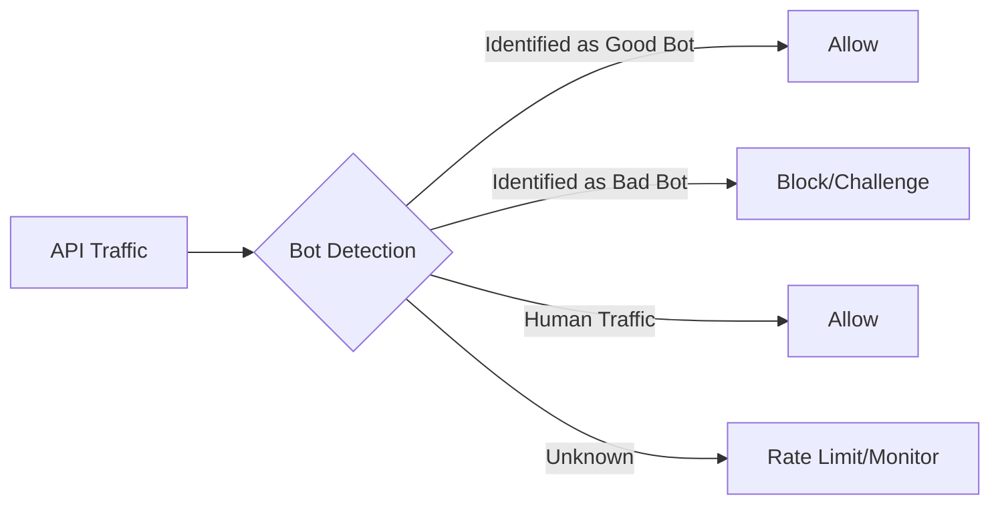
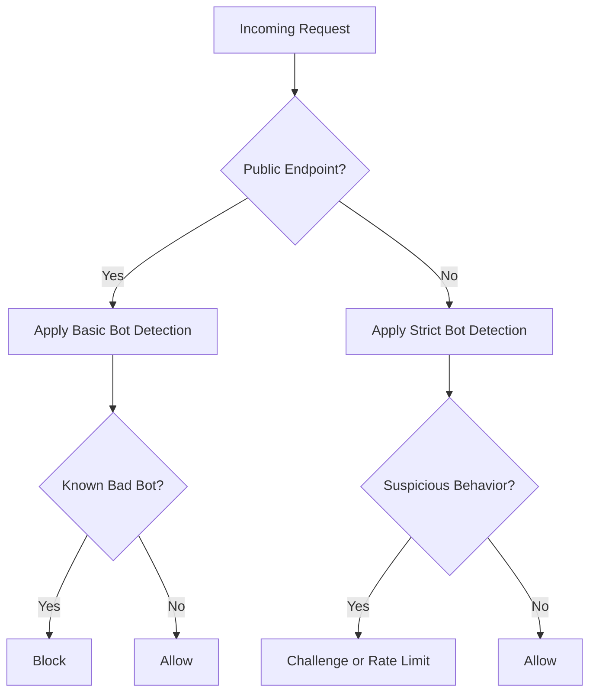

# Kong Bot Detection

## Introduction

In today's digital landscape, automated bots account for a significant portion of internet traffic. While some bots are beneficial (like search engine crawlers), malicious bots can pose serious security threats to your applications and APIs. They can scrape sensitive data, perform credential stuffing attacks, generate spam, or launch DDoS attacks that overwhelm your services.

Kong Bot Detection is a powerful security feature within Kong Gateway that helps identify and mitigate unwanted bot traffic before it reaches your backend services. This tutorial will guide you through understanding, configuring, and implementing effective bot detection strategies using Kong.

## Understanding Bot Traffic

Before diving into Kong's bot detection capabilities, let's understand the different types of bots you might encounter:

### Types of Bots

1. **Good Bots**: Legitimate automated clients like search engine crawlers, monitoring tools, and partner integrations.
2. **Bad Bots**: Malicious automated clients designed to attack, scrape, or abuse your services.
3. **Sophisticated Bots**: Advanced malicious bots that attempt to mimic human behavior to evade detection.



## Setting Up Kong Bot Detection

Kong provides several approaches to bot detection, from simple rule-based methods to sophisticated behavioral analysis. Let's explore how to set up basic bot detection in Kong Gateway.

### Prerequisites

- Kong Gateway installed and running
- Basic familiarity with Kong configuration
- Admin access to your Kong instance

### 1. Installing the Bot Detection Plugin

The Bot Detection plugin can be installed via the Kong Admin API or using declarative configuration.

Using the Admin API:

```bash
curl -X POST http://localhost:8001/plugins/ \
    --data "name=bot-detection" \
    --data "config.allow=googlebot,bingbot" \
    --data "config.deny=scrapybot,badbot"
```

Using declarative configuration (in `kong.yml`):

```yaml
plugins:
- name: bot-detection
  config:
    allow:
    - googlebot
    - bingbot
    deny:
    - scrapybot
    - badbot
```

### 2. Understanding Configuration Options

The bot detection plugin offers several configuration parameters:

| Parameter | Description | Example |
|-----------|-------------|---------|
| `allow` | List of bots to allow | `["googlebot", "bingbot"]` |
| `deny` | List of bots to deny | `["scrapybot", "badbot"]` |
| `allow_status` | Status code for allowed bots | `200` |
| `deny_status` | Status code for denied bots | `403` |
| `whitelist_ua` | User-Agent patterns to whitelist | `["^Mozilla.*"]` |
| `blacklist_ua` | User-Agent patterns to blacklist | `[".*crawl.*"]` |

### 3. Basic Configuration Example

Let's implement a simple bot detection configuration that allows legitimate crawlers but blocks known bad bots:

```lua
local BotDetectionHandler = {
  PRIORITY = 900,
  VERSION = "1.0",
}

function BotDetectionHandler:access(conf)
  local user_agent = kong.request.get_header("User-Agent")
  
  if not user_agent then
    kong.response.exit(403, { message = "User-Agent header required" })
    return
  end
  
  user_agent = user_agent:lower()
  
  -- Check against denied bots
  for _, pattern in ipairs(conf.deny) do
    if user_agent:find(pattern:lower()) then
      kong.response.exit(conf.deny_status, { message = "Bot access forbidden" })
      return
    end
  end
  
  -- Check against allowed bots
  for _, pattern in ipairs(conf.allow) do
    if user_agent:find(pattern:lower()) then
      return
    end
  end
end

return BotDetectionHandler
```

## Advanced Bot Detection Techniques

Basic User-Agent detection is just the beginning. Let's explore more sophisticated techniques available in Kong for bot detection:

### Behavioral Analysis

Kong Enterprise offers advanced behavioral analysis that examines patterns such as:

- Request timing and frequency
- Navigation patterns
- Mouse movements and keystrokes (when combined with client-side telemetry)
- Browser fingerprinting

### CAPTCHA Challenges

For suspicious traffic, Kong can issue CAPTCHA challenges to verify human users:

```lua
-- Example of integrating CAPTCHA challenge
if is_suspicious_behavior(request) then
  return kong.response.exit(403, {
    message = "Please complete CAPTCHA",
    captcha_url = "https://your-captcha-endpoint"
  })
end
```

### Rate Limiting Combined with Bot Detection

Combining rate limiting with bot detection creates a powerful defense:

```bash
# First apply bot detection
curl -X POST http://localhost:8001/services/my-api/plugins \
    --data "name=bot-detection" \
    --data "config.deny=badbot,scraper"

# Then apply rate limiting
curl -X POST http://localhost:8001/services/my-api/plugins \
    --data "name=rate-limiting" \
    --data "config.minute=5" \
    --data "config.hour=100" \
    --data "config.policy=local"
```

## Real-World Implementation

Let's build a complete real-world implementation that protects an e-commerce API from scraping and credential stuffing attacks.

### Step 1: Define Bot Detection Strategy

First, identify which endpoints need protection and what types of bots to block:



### Step 2: Implement Bot Detection for Product Catalog

For public product listing APIs, we want to allow legitimate crawlers but prevent aggressive scrapers:

```bash
curl -X POST http://localhost:8001/routes/product-catalog/plugins \
    --data "name=bot-detection" \
    --data "config.allow=googlebot,bingbot" \
    --data "config.deny=scrapybot" \
    --data "config.blacklist_ua=scraper,harvest,download" \
    --data "config.deny_status=429"
```

### Step 3: Enhance Authentication Endpoints

For login and registration endpoints, we need stricter protection against credential stuffing:

```bash
# Apply bot detection
curl -X POST http://localhost:8001/routes/auth/plugins \
    --data "name=bot-detection" \
    --data "config.deny=*" \
    --data "config.allow=" \
    --data "config.deny_status=403"

# Add rate limiting
curl -X POST http://localhost:8001/routes/auth/plugins \
    --data "name=rate-limiting" \
    --data "config.minute=3" \
    --data "config.hour=10" \
    --data "config.policy=ip"
```

### Step 4: Monitor and Analyze Bot Traffic

Set up logging and monitoring to analyze bot patterns:

```yaml
plugins:
- name: file-log
  config:
    path: /var/log/kong/bot-activity.log
    reopen: true
    custom_fields_by_lua:
      bot_detected: "return kong.ctx.shared.bot_detection ~= nil"
      user_agent: "return kong.request.get_header('User-Agent')"
```

## Testing Your Bot Detection

To verify your bot detection is working correctly, you can simulate bot requests:

```bash
# Simulate a good bot
curl -X GET http://your-api.com/products \
     -H "User-Agent: Mozilla/5.0 (compatible; Googlebot/2.1; +http://www.google.com/bot.html)"

# Expected: 200 OK

# Simulate a bad bot
curl -X GET http://your-api.com/products \
     -H "User-Agent: scrapybot/1.0"

# Expected: 403 Forbidden or 429 Too Many Requests
```

## Common Challenges and Solutions

### Challenge 1: False Positives

**Problem**: Legitimate users being identified as bots.

**Solution**: Start with permissive rules and gradually tighten them. Use a combination of signals rather than a single criterion.

### Challenge 2: Bot Evolution

**Problem**: Sophisticated bots evolve to evade detection.

**Solution**: Implement layered security and update detection rules regularly. Use machine learning-based detection when available.

### Challenge 3: Performance Impact

**Problem**: Complex bot detection can impact API performance.

**Solution**: Apply stricter detection only to sensitive or targeted endpoints. Use caching for detection results.

## Summary

Kong Bot Detection provides powerful capabilities to protect your APIs from malicious automated traffic. By implementing a layered approach that combines User-Agent analysis, rate limiting, behavioral patterns, and challenges, you can effectively identify and mitigate bot traffic while allowing legitimate users and good bots to access your services.

Key takeaways:
- Bot detection is essential for protecting modern APIs
- Kong provides flexible configuration options for identifying bots
- Combine multiple security plugins for the most effective protection
- Regular monitoring and rule updates are crucial for ongoing protection

## Additional Resources

- Kong Bot Detection Plugin Documentation
- Web Application Security Best Practices
- OWASP Automated Threats to Web Applications

## Exercises

1. Configure a bot detection rule that allows specific good bots but blocks all others.
2. Implement a combined strategy using bot detection and rate limiting for a login endpoint.
3. Design a monitoring dashboard to analyze bot traffic patterns on your APIs.
4. Create a custom plugin that extends Kong's bot detection with additional heuristics.