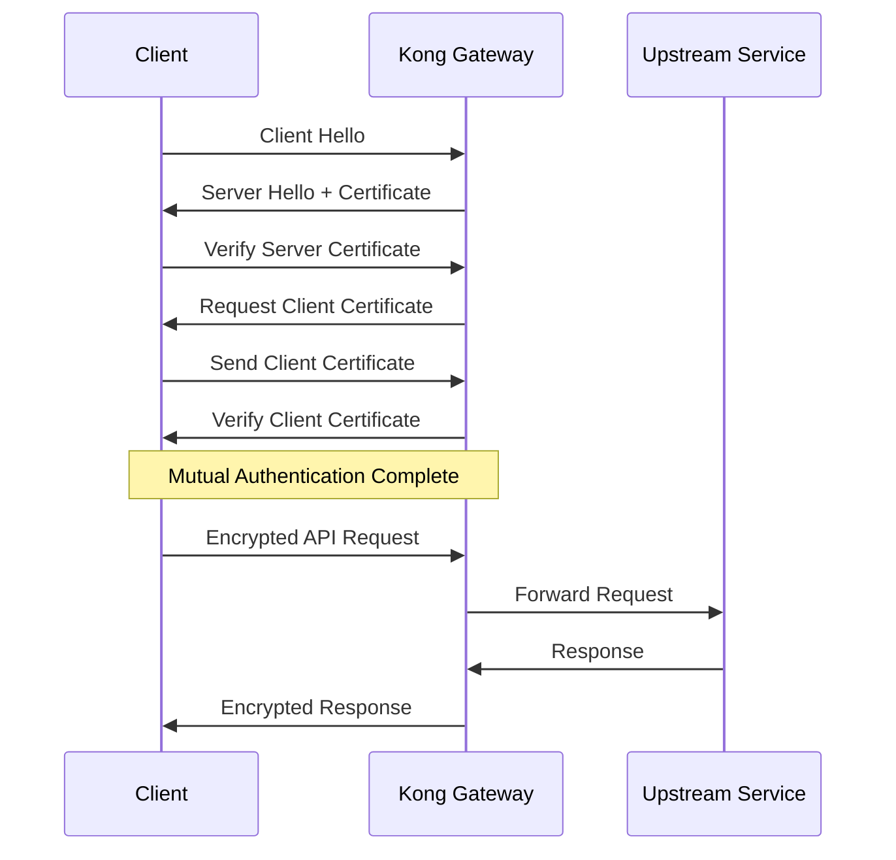
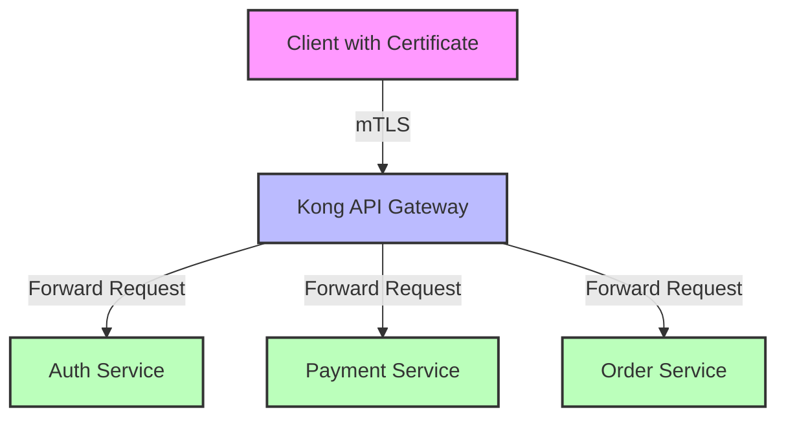

# Kong Mutual TLS

## Introduction

Mutual TLS (mTLS) is a powerful security mechanism that extends the standard TLS protocol by requiring both the client and server to verify each other's identity through digital certificates. In traditional TLS, only the server proves its identity to the client, but with mTLS, the client must also authenticate itself to the server.

Kong API Gateway offers robust support for mTLS, allowing you to implement this advanced security measure to protect your APIs from unauthorized access and ensure secure communication between services.

## Understanding the Basics

### What is TLS?

Transport Layer Security (TLS) is a cryptographic protocol that provides secure communication over a network. It ensures:

1. **Confidentiality**: Data is encrypted during transmission
2. **Integrity**: Data cannot be modified during transmission
3. **Authentication**: The server's identity is verified

### How Mutual TLS Extends TLS

Mutual TLS adds an additional layer of security by requiring client authentication:



## Setting Up Mutual TLS in Kong

### Prerequisites

Before implementing mTLS in Kong, you'll need:

- Kong Gateway installed and running
- Administrative access to Kong
- A Certificate Authority (CA) to issue certificates
- Server and client certificates generated from your CA

### Step 1: Create a Certificate Authority (for testing purposes)

For production, you should use a trusted CA. For testing, you can create your own:

```bash
# Create a private key for your CA
openssl genrsa -out ca.key 2048

# Create a CA certificate
openssl req -new -x509 -key ca.key -out ca.crt -subj "/CN=My Test CA"
```

### Step 2: Create Server Certificates

```bash
# Create server private key
openssl genrsa -out server.key 2048

# Create Certificate Signing Request (CSR)
openssl req -new -key server.key -out server.csr -subj "/CN=kong-server"

# Sign the server certificate with your CA
openssl x509 -req -in server.csr -CA ca.crt -CAkey ca.key -CAcreateserial -out server.crt
```

### Step 3: Create Client Certificates

```bash
# Create client private key
openssl genrsa -out client.key 2048

# Create client CSR
openssl req -new -key client.key -out client.csr -subj "/CN=api-client"

# Sign the client certificate with your CA
openssl x509 -req -in client.csr -CA ca.crt -CAkey ca.key -CAcreateserial -out client.crt
```

### Step 4: Configure Kong for mTLS

#### Using the Admin API

Add your CA certificate to Kong so it can validate client certificates:

```bash
curl -X POST http://localhost:8001/ca_certificates \
  --data "cert=$(cat ca.crt)"
```

Expected output:
```json
{
  "id": "d3e8cb8a-9d43-422c-9f96-87b543de0bd2",
  "cert": "-----BEGIN CERTIFICATE-----
MIID...
-----END CERTIFICATE-----",
  "created_at": 1614369846
}
```

### Step 5: Create a Service and Route with mTLS

```bash
# Create a service
curl -X POST http://localhost:8001/services \
  --data "name=secure-service" \
  --data "url=https://mockbin.org"

# Create a route for the service
curl -X POST http://localhost:8001/services/secure-service/routes \
  --data "name=secure-route" \
  --data "paths[]=/secure"

# Enable mTLS on the route
curl -X POST http://localhost:8001/routes/secure-route/plugins \
  --data "name=mtls-auth"
```

## Testing Your mTLS Configuration

### Making a Request Without a Client Certificate

When you try to access your protected route without a valid client certificate, Kong will reject the request:

```bash
curl -i https://localhost:8443/secure
```

Expected output:
```
HTTP/2 401 
content-type: application/json; charset=utf-8
content-length: 62
date: Fri, 26 Feb 2021 14:30:45 GMT
server: kong/2.3.0

{
  "message": "Invalid client certificate"
}
```

### Making a Request With a Valid Client Certificate

To successfully access the protected route, you need to include your client certificate and key:

```bash
curl -i https://localhost:8443/secure \
  --cert client.crt \
  --key client.key \
  --cacert ca.crt
```

Expected output:
```
HTTP/2 200 
content-type: application/json
content-length: 253
date: Fri, 26 Feb 2021 14:32:15 GMT
server: kong/2.3.0

{
  "status": "success",
  "message": "Request authenticated with mTLS"
}
```

## Real-World Examples

### Securing Microservices Communication

In a microservices architecture, mTLS can ensure that only authorized services can communicate with each other:



### Zero Trust Architecture

mTLS is a cornerstone of Zero Trust security models, where the principle "never trust, always verify" applies to all network communications:

```javascript
// Example Kong declarative configuration (kong.yml)
_format_version: "2.1"
services:
  - name: secure-api
    url: https://internal-api.example.com
    routes:
      - name: secure-route
        paths:
          - /api
    plugins:
      - name: mtls-auth
        config:
          ca_certificates:
            - a4e9ee1a-1f1f-4574-bffd-0583ed32d99a
          revocation_check_mode: STRICT
```

### Implementing Certificate Revocation

In production environments, you'll want to handle certificate revocation:

```bash
# Create a Certificate Revocation List (CRL)
openssl ca -config openssl.cnf -gencrl -keyfile ca.key -cert ca.crt -out ca.crl

# Add CRL to Kong
curl -X POST http://localhost:8001/ca_certificates/{ca_id}/crl \
  --data "crl=$(cat ca.crl)"
```

## Advanced Configuration Options

### Certificate-Based Client Identification

You can use client certificates to identify specific clients:

```bash
# Create a consumer
curl -X POST http://localhost:8001/consumers \
  --data "username=trusted-partner"

# Associate a certificate with the consumer
curl -X POST http://localhost:8001/consumers/trusted-partner/mtls-auth \
  --data "subject_name=CN=api-client"
```

### Implementing Certificate Pinning

For additional security, you can implement certificate pinning to validate specific certificates:

```javascript
// Example Kong plugin configuration
plugins:
  - name: mtls-auth
    config:
      ca_certificates:
        - a4e9ee1a-1f1f-4574-bffd-0583ed32d99a
      revocation_check_mode: STRICT
      skip_consumer_lookup: false
      pinned_certificates:
        - "sha256//YN5nE3JfwDpwJc9yQcK8G+YRvWWRQgPW7zN+MTrX5hM="
```

## Troubleshooting Common Issues

### Certificate Verification Failures

If you're experiencing certificate verification failures, check:

1. **Certificate Chain**: Ensure all intermediate certificates are included
2. **Expiration Dates**: Verify certificates are not expired
3. **Certificate Authority**: Confirm the CA certificate is properly configured in Kong

```bash
# Check certificate information
openssl x509 -in client.crt -text -noout
```

### Connection Issues

If connections are being refused:

1. **TLS Version**: Ensure compatible TLS versions (Kong uses TLS 1.2+)
2. **Cipher Suites**: Verify compatible cipher suites

```bash
# Test TLS connection
openssl s_client -connect localhost:8443 -cert client.crt -key client.key -CAfile ca.crt
```

## Summary

Mutual TLS provides a robust security mechanism for Kong API Gateway deployments, ensuring that both clients and servers authenticate each other. By implementing mTLS, you can:

- Prevent unauthorized access to your APIs
- Secure service-to-service communication
- Implement zero-trust security architectures
- Identify clients based on their certificates

The setup process involves:
1. Creating certificates (CA, server, and client)
2. Configuring Kong to require client certificates
3. Testing and troubleshooting your implementation

By following this guide, you should now have a solid understanding of how to implement Mutual TLS in Kong and why it's an essential component of your API security strategy.

## Additional Resources

- [Kong mTLS Authentication Plugin Documentation](https://docs.konghq.com/hub/kong-inc/mtls-auth/)
- [OWASP API Security Top 10](https://owasp.org/www-project-api-security/)
- [Understanding X.509 Certificates](https://www.ssl.com/faqs/what-is-an-x-509-certificate/)

## Exercises

1. Set up a local Kong environment with mTLS authentication
2. Create client certificates for two different consumers and test access control
3. Implement certificate revocation and test revoking a previously valid certificate
4. Configure Kong to pass client certificate information to upstream services
5. Design a microservices architecture that uses mTLS for service-to-service communication