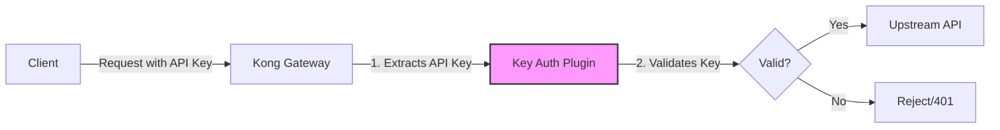

# Kong Key Auth

## Introduction

API keys are one of the most common methods for securing APIs, and Kong Gateway makes implementing this security measure straightforward with its Key Authentication plugin. In this guide, we'll explore how to protect your APIs using API keys in Kong, enabling you to control who accesses your services and track usage patterns.

Key Authentication (or "API key authentication") is simple yet effective: clients include a unique key in their requests, and Kong verifies this key before allowing access to the protected API. This approach offers a good balance between security and simplicity for many use cases.

## What is Kong Key Auth?

Kong Key Authentication is a plugin that adds API key authentication to your services. When enabled, the plugin will check for valid API keys in incoming requests before allowing them to reach your upstream services.



### Key Features

- **Simple Implementation**: Easy to set up and manage compared to more complex authentication schemes
- **Flexible Key Locations**: Can check for keys in headers, query parameters, or request bodies
- **Consumer Association**: Each key is associated with a Kong Consumer entity
- **Key Management**: Offers API endpoints to create, read, update, and delete keys
- **Customizable Error Messages**: Configure how rejections are communicated to clients

## Setting Up Kong Key Auth

Let's walk through the process of implementing Key Authentication in Kong:

### Prerequisites

- Kong Gateway installed and running
- Basic familiarity with Kong concepts (Services, Routes)

### Step 1: Create a Service and Route

First, let's create a service pointing to our backend API:

```bash
# Create a service
curl -i -X POST http://localhost:8001/services \
  --data name=example-service \
  --data url=http://example-api.com

# Create a route for the service
curl -i -X POST http://localhost:8001/services/example-service/routes \
  --data name=example-route \
  --data paths[]=/api
```

### Step 2: Enable the Key Auth Plugin

Now, let's enable the Key Authentication plugin on our service:

```bash
curl -i -X POST http://localhost:8001/services/example-service/plugins \
  --data name=key-auth \
  --data config.key_names=apikey
```

This configures Kong to look for an API key in the `apikey` header, query parameter, or request body parameter.

### Step 3: Create a Consumer

Consumers in Kong represent API clients. Let's create one:

```bash
curl -i -X POST http://localhost:8001/consumers \
  --data username=example-user
```

### Step 4: Provision an API Key for the Consumer

Now, let's create an API key for our consumer:

```bash
curl -i -X POST http://localhost:8001/consumers/example-user/key-auth \
  --data key=my-secret-api-key
```

You can also let Kong generate a key automatically by omitting the `key` parameter:

```bash
curl -i -X POST http://localhost:8001/consumers/example-user/key-auth
```

Kong will return a response with the generated key:

```json
{
  "consumer": { "id": "876bf719-8f18-4ce5-cc9f-5b5af6c36007" },
  "created_at": 1678234132,
  "id": "3b932825-1f13-4e65-b6fb-71ec8020a968",
  "key": "Bgz2Le57MFkGBGCrQmm8lAQPUISSFLdY",
  "ttl": null
}
```

## Using Kong Key Auth

### Making Authenticated Requests

Once Key Authentication is enabled, clients must include their API key in requests. There are three ways to include the key:

#### 1. As a header:

```bash
curl -i http://localhost:8000/api \
  -H "apikey: my-secret-api-key"
```

#### 2. As a query parameter:

```bash
curl -i http://localhost:8000/api?apikey=my-secret-api-key
```

#### 3. As a form parameter (for POST requests):

```bash
curl -i -X POST http://localhost:8000/api \
  -d "apikey=my-secret-api-key"
```

### Handling Authentication Failures

If a request doesn't include a valid API key, Kong responds with a 401 Unauthorized status code:

```json
{
  "message": "No API key found in request"
}
```

Or if the key is invalid:

```json
{
  "message": "Invalid authentication credentials"
}
```

## Advanced Configuration

### Custom Configuration Options

The Key Auth plugin offers several configuration options:

```bash
curl -i -X POST http://localhost:8001/services/example-service/plugins \
  --data name=key-auth \
  --data config.key_names=apikey,x-api-key \
  --data config.hide_credentials=true \
  --data config.anonymous=anonymous-consumer-id \
  --data config.key_in_body=false
```

Let's break down these options:

- **key_names**: A list of parameter names where Kong should look for the API key (default: `apikey`)
- **hide_credentials**: If true, Kong will hide the credential from the upstream service (default: `false`)
- **anonymous**: An optional consumer ID to use if authentication fails (allows for "public" access with rate limiting)
- **key_in_body**: Allow looking for keys in the request body (default: `false`)
- **run_on_preflight**: Run the plugin on OPTIONS preflight requests (default: `true`)

### Multiple Authentication Methods

Kong allows combining multiple authentication mechanisms. For example, you might want to allow either key authentication or JWT:

```bash
# Add Key Auth plugin
curl -i -X POST http://localhost:8001/services/example-service/plugins \
  --data name=key-auth \
  --data config.anonymous=anonymous-consumer-id

# Add JWT plugin
curl -i -X POST http://localhost:8001/services/example-service/plugins \
  --data name=jwt \
  --data config.anonymous=anonymous-consumer-id
```

This setup allows clients to authenticate with either method.

## Real-World Example: Protecting a Microservice API

Let's walk through a practical example of using Kong Key Auth to protect a microservice architecture:

### Scenario

You have a set of microservices:
- User Service: Handles user data
- Product Service: Manages product information  
- Order Service: Processes orders

You want to:
1. Protect all services with API key authentication
2. Allow internal services to communicate without authentication
3. Track API usage by client

### Implementation

#### 1. Set up services and routes:

```bash
# User Service
curl -X POST http://localhost:8001/services \
  --data name=user-service \
  --data url=http://user-service:3000
curl -X POST http://localhost:8001/services/user-service/routes \
  --data name=user-route \
  --data paths[]=/users

# Product Service
curl -X POST http://localhost:8001/services \
  --data name=product-service \
  --data url=http://product-service:3000
curl -X POST http://localhost:8001/services/product-service/routes \
  --data name=product-route \
  --data paths[]=/products

# Order Service
curl -X POST http://localhost:8001/services \
  --data name=order-service \
  --data url=http://order-service:3000
curl -X POST http://localhost:8001/services/order-service/routes \
  --data name=order-route \
  --data paths[]=/orders
```

#### 2. Enable Key Auth on public-facing routes:

```bash
# Apply Key Auth to all services
for service in user-service product-service order-service; do
  curl -X POST http://localhost:8001/services/$service/plugins \
    --data name=key-auth \
    --data config.key_names=apikey
done
```

#### 3. Create consumers for different clients:

```bash
# Create a consumer for a mobile app
curl -X POST http://localhost:8001/consumers \
  --data username=mobile-app

# Create a consumer for a partner API
curl -X POST http://localhost:8001/consumers \
  --data username=partner-api

# Create a consumer for internal services
curl -X POST http://localhost:8001/consumers \
  --data username=internal-services
```

#### 4. Create API keys:

```bash
# For mobile app
curl -X POST http://localhost:8001/consumers/mobile-app/key-auth

# For partner API
curl -X POST http://localhost:8001/consumers/partner-api/key-auth

# For internal services
curl -X POST http://localhost:8001/consumers/internal-services/key-auth
```

#### 5. Add IP restriction for internal services (optional):

```bash
curl -X POST http://localhost:8001/consumers/internal-services/plugins \
  --data name=ip-restriction \
  --data config.allow=["10.0.0.0/8"]
```

Now you have a secure API gateway setup where:
- All external requests require valid API keys
- You can track usage per consumer
- Internal communications are secured

## Best Practices

When implementing Key Authentication with Kong, keep these best practices in mind:

### Security Considerations

1. **Use HTTPS**: Always use HTTPS to prevent API keys from being intercepted
2. **Rotate Keys Regularly**: Establish a process for periodic key rotation
3. **Limit Key Permissions**: Use Kong's ACL plugin alongside Key Auth to limit what each key can access
4. **Monitor Usage**: Watch for unusual patterns that might indicate key compromise

### Implementation Tips

1. **Consistent Key Naming**: Use consistent key names across your APIs
2. **Clear Documentation**: Document your authentication requirements for API consumers
3. **Error Messages**: Configure helpful but not overly revealing error messages
4. **Test Authentication**: Include authentication testing in your CI/CD pipeline

### API Key Management

1. **Establish a Key Lifecycle**: Define processes for key creation, distribution, rotation, and revocation
2. **Automate Key Management**: Use Kong's Admin API to automate key management tasks
3. **Key Storage**: Advise clients on secure API key storage practices
4. **Emergency Revocation**: Have procedures ready for emergency key revocation

## Troubleshooting Common Issues

### Key Auth Not Working

1. **Check Plugin Configuration**: Ensure the plugin is correctly configured on your service or route
   ```bash
   curl http://localhost:8001/services/example-service/plugins
   ```

2. **Verify Consumer and Key**: Make sure the consumer and key exist
   ```bash
   curl http://localhost:8001/consumers/example-user/key-auth
   ```

3. **Check Key Format**: Ensure the key is being sent in the format you configured

### 401 Unauthorized Errors

1. **Check Kong Logs**: Look for detailed error messages
2. **Verify Key Placement**: Make sure the key is in the expected location (header, query, etc.)
3. **Check for Typos**: Confirm the key name and value are correct

### Performance Issues

If you're experiencing slowdowns:

1. **Enable Caching**: Use Kong's cache to speed up key validation
2. **Monitor Plugin Performance**: Use Kong's Prometheus plugin to track authentication times
3. **Optimize Key Lookup**: If using a custom Authentication plugin, ensure key lookup is efficient

## Summary

Kong Key Authentication provides a straightforward yet powerful way to secure your APIs. By following this guide, you've learned how to:

- Set up and configure the Key Auth plugin
- Create consumers and provision API keys
- Make authenticated requests to your APIs
- Apply advanced configurations for real-world scenarios
- Follow best practices for API key security

This authentication method balances security and simplicity, making it an excellent choice for many API scenarios where you need to control and track access without implementing complex OAuth flows.

## Additional Resources

- Practice creating a simple API and securing it with Kong Key Auth
- Experiment with combining Key Auth with other Kong plugins like Rate Limiting or ACL
- Try implementing a key rotation strategy for your API keys

## Next Steps

Now that you've mastered Kong Key Auth, consider exploring other Kong security plugins like JWT Authentication, OAuth 2.0, or mTLS for more advanced authentication scenarios.