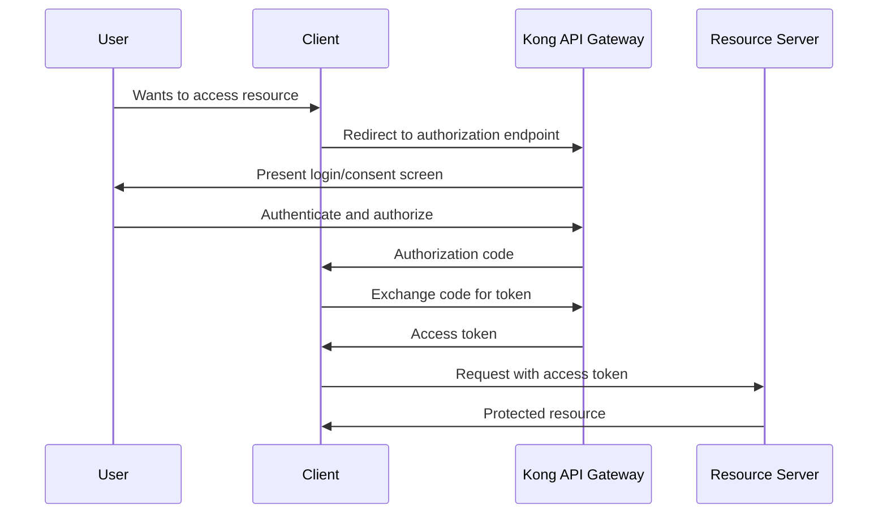

# Kong OAuth2 Authentication

## Introduction

OAuth2 is an industry-standard protocol for authorization that allows third-party applications to access resources on behalf of users without exposing their credentials. Kong, a popular API Gateway, offers robust OAuth2 support through its OAuth2 plugin, enabling you to secure your APIs with this powerful authentication mechanism.

In this tutorial, we'll explore how to configure and use Kong's OAuth2 plugin to protect your APIs. By the end, you'll understand how to implement OAuth2 flow with Kong, manage access tokens, and secure your services effectively.

## Prerequisites

Before we begin, you should have:

- Kong Gateway installed and running
- Basic understanding of API Gateway concepts
- Familiarity with HTTP and REST APIs
- Kong Admin API access

## Understanding OAuth2 Flow

OAuth2 provides several "grant types" (flows) for different scenarios. Here's a simple diagram of the most common flow - the Authorization Code flow:



## Setting Up Kong OAuth2 Plugin

Let's walk through the setup process for the Kong OAuth2 plugin.

### Step 1: Create a Service in Kong

First, we need to create a service that will point to our backend API:

```bash
curl -X POST http://localhost:8001/services \
  --data "name=my-api" \
  --data "url=http://my-backend-api.com"
```

### Step 2: Create a Route for the Service

Next, we need to define a route for our service:

```bash
curl -X POST http://localhost:8001/services/my-api/routes \
  --data "name=my-api-route" \
  --data "paths[]=/api"
```

### Step 3: Enable the OAuth2 Plugin

Now, let's configure the OAuth2 plugin on our service:

```bash
curl -X POST http://localhost:8001/services/my-api/plugins \
  --data "name=oauth2" \
  --data "config.enable_authorization_code=true" \
  --data "config.scopes=email,profile" \
  --data "config.mandatory_scope=true" \
  --data "config.provision_key=PROVISION_KEY" \
  --data "config.token_expiration=7200"
```

This command sets up the OAuth2 plugin with the following configurations:
- Enables the authorization code grant
- Defines scopes for access control
- Makes scopes mandatory for token requests
- Sets a provision key (replace `PROVISION_KEY` with your own secure key)
- Sets token expiration to 7200 seconds (2 hours)

## Creating OAuth2 Credentials

Before clients can authenticate, we need to create OAuth2 credentials:

### Step 1: Create a Consumer

First, create a Kong consumer:

```bash
curl -X POST http://localhost:8001/consumers \
  --data "username=my-app"
```

### Step 2: Create OAuth2 Credentials for the Consumer

Next, create OAuth2 credentials for this consumer:

```bash
curl -X POST http://localhost:8001/consumers/my-app/oauth2 \
  --data "name=My Application" \
  --data "client_id=SOME_CLIENT_ID" \
  --data "client_secret=SOME_CLIENT_SECRET" \
  --data "redirect_uris[]=https://my-app.com/callback"
```

Replace `SOME_CLIENT_ID` and `SOME_CLIENT_SECRET` with your own values.

## OAuth2 Flow Implementation

Let's go through a complete OAuth2 authorization code flow example:

### Step 1: Redirect User to Authorization Page

Your application should redirect the user to Kong's authorization endpoint:

```javascript
// Client-side code
const authUrl = `http://kong:8000/oauth2/authorize?response_type=code&client_id=SOME_CLIENT_ID&redirect_uri=https://my-app.com/callback&scope=email profile&state=1234`;
window.location.href = authUrl;
```

### Step 2: Exchange Authorization Code for Token

After the user authorizes your application, Kong redirects back to your `redirect_uri` with a code. Exchange this code for an access token:

```javascript
// Server-side code
async function exchangeCodeForToken(code) {
  const response = await fetch('http://kong:8000/oauth2/token', {
    method: 'POST',
    headers: {
      'Content-Type': 'application/x-www-form-urlencoded'
    },
    body: new URLSearchParams({
      grant_type: 'authorization_code',
      client_id: 'SOME_CLIENT_ID',
      client_secret: 'SOME_CLIENT_SECRET',
      redirect_uri: 'https://my-app.com/callback',
      code: code
    })
  });
  
  return await response.json();
}

// This will return something like:
// {
//   "access_token": "ABCDEFGHIJKLMNOPQRSTUVWXYZ",
//   "token_type": "bearer",
//   "expires_in": 7200,
//   "refresh_token": "REFRESH_TOKEN",
//   "scope": "email profile"
// }
```

### Step 3: Use the Access Token to Access Protected APIs

Once you have the access token, you can use it to make requests to the protected API:

```javascript
async function fetchProtectedResource(accessToken) {
  const response = await fetch('http://kong:8000/api/resource', {
    headers: {
      'Authorization': `Bearer ${accessToken}`
    }
  });
  
  return await response.json();
}
```

## Different OAuth2 Grant Types

Kong supports multiple OAuth2 grant types. Here's how to enable them:

### Client Credentials Grant

Useful for server-to-server authentication:

```bash
curl -X POST http://localhost:8001/services/my-api/plugins \
  --data "name=oauth2" \
  --data "config.enable_client_credentials=true" \
  --data "config.token_expiration=7200"
```

Client usage:

```javascript
async function getClientCredentialsToken() {
  const response = await fetch('http://kong:8000/oauth2/token', {
    method: 'POST',
    headers: {
      'Content-Type': 'application/x-www-form-urlencoded'
    },
    body: new URLSearchParams({
      grant_type: 'client_credentials',
      client_id: 'SOME_CLIENT_ID',
      client_secret: 'SOME_CLIENT_SECRET',
      scope: 'read write'
    })
  });
  
  return await response.json();
}
```

### Password Grant

For trusted applications:

```bash
curl -X POST http://localhost:8001/services/my-api/plugins \
  --data "name=oauth2" \
  --data "config.enable_password=true" \
  --data "config.token_expiration=7200"
```

Client usage:

```javascript
async function getPasswordToken(username, password) {
  const response = await fetch('http://kong:8000/oauth2/token', {
    method: 'POST',
    headers: {
      'Content-Type': 'application/x-www-form-urlencoded'
    },
    body: new URLSearchParams({
      grant_type: 'password',
      client_id: 'SOME_CLIENT_ID',
      client_secret: 'SOME_CLIENT_SECRET',
      scope: 'read write',
      username: username,
      password: password
    })
  });
  
  return await response.json();
}
```

## Token Management

### Refreshing Access Tokens

Access tokens expire after the configured time. Use refresh tokens to get new access tokens:

```javascript
async function refreshAccessToken(refreshToken) {
  const response = await fetch('http://kong:8000/oauth2/token', {
    method: 'POST',
    headers: {
      'Content-Type': 'application/x-www-form-urlencoded'
    },
    body: new URLSearchParams({
      grant_type: 'refresh_token',
      client_id: 'SOME_CLIENT_ID',
      client_secret: 'SOME_CLIENT_SECRET',
      refresh_token: refreshToken
    })
  });
  
  return await response.json();
}
```

### Invalidating Tokens

To revoke a token:

```javascript
async function revokeToken(token) {
  const response = await fetch('http://kong:8000/oauth2/tokens', {
    method: 'DELETE',
    headers: {
      'Authorization': `Bearer ${token}`
    }
  });
  
  return response.status === 204; // Success if status is 204 No Content
}
```

## Advanced Configuration

### Customizing Token Fields

You can customize what gets stored in the token:

```bash
curl -X PATCH http://localhost:8001/plugins/{plugin-id} \
  --data "config.token_default_scopes[]=email" \
  --data "config.token_default_scopes[]=profile" \
  --data "config.auth_header_name=X-Custom-Authorization"
```

### Rate Limiting Based on OAuth2

Combine OAuth2 with rate limiting for enhanced security:

```bash
curl -X POST http://localhost:8001/services/my-api/plugins \
  --data "name=rate-limiting" \
  --data "config.minute=5" \
  --data "config.limit_by=credential"
```

This configuration limits API calls to 5 requests per minute per OAuth2 credential.

## Best Practices

1. **Use HTTPS**: Always use HTTPS for all OAuth2 endpoints to prevent token interception.

2. **Secure Secrets**: Keep your client secrets and provision keys secure and rotate them regularly.

3. **Scope Management**: Define granular scopes and enforce the principle of least privilege.

4. **Token Expiration**: Set reasonable token expiration times based on your security requirements.

5. **Validate Tokens Server-Side**: Always validate tokens on the server side, not just in the client.

6. **Monitor Token Usage**: Implement monitoring to detect unusual token usage patterns.

## Real-World Example: API Marketplace

Imagine you're building an API marketplace where third-party developers can access your services. Here's a simplified implementation:

1. **Developer Registration**:
   Developers register their applications and receive client credentials.

2. **User Authentication and Authorization**:
   When users want to allow a third-party app to access their data, they go through the OAuth2 flow.

3. **Access Control**:
   Different API endpoints require different scopes, ensuring that applications only access what they need.

```javascript
// Example of implementing an API marketplace client
class APIMarketplaceClient {
  constructor(clientId, clientSecret, redirectUri) {
    this.clientId = clientId;
    this.clientSecret = clientSecret;
    this.redirectUri = redirectUri;
    this.tokens = {};
  }

  getAuthorizationUrl(scopes, state) {
    const scopeString = scopes.join(' ');
    return `http://kong:8000/oauth2/authorize?response_type=code&client_id=${this.clientId}&redirect_uri=${encodeURIComponent(this.redirectUri)}&scope=${encodeURIComponent(scopeString)}&state=${state}`;
  }

  async exchangeCodeForTokens(code) {
    const response = await fetch('http://kong:8000/oauth2/token', {
      method: 'POST',
      headers: {
        'Content-Type': 'application/x-www-form-urlencoded'
      },
      body: new URLSearchParams({
        grant_type: 'authorization_code',
        client_id: this.clientId,
        client_secret: this.clientSecret,
        redirect_uri: this.redirectUri,
        code: code
      })
    });
    
    this.tokens = await response.json();
    return this.tokens;
  }

  async callAPI(endpoint, method = 'GET', data = null) {
    if (!this.tokens.access_token) {
      throw new Error('Not authenticated');
    }
    
    const options = {
      method,
      headers: {
        'Authorization': `Bearer ${this.tokens.access_token}`,
        'Content-Type': 'application/json'
      }
    };
    
    if (data && method !== 'GET') {
      options.body = JSON.stringify(data);
    }
    
    const response = await fetch(`http://kong:8000/api${endpoint}`, options);
    
    if (response.status === 401) {
      // Token expired, try to refresh
      await this.refreshToken();
      // Retry the request with new token
      options.headers.Authorization = `Bearer ${this.tokens.access_token}`;
      return fetch(`http://kong:8000/api${endpoint}`, options).then(r => r.json());
    }
    
    return await response.json();
  }

  async refreshToken() {
    if (!this.tokens.refresh_token) {
      throw new Error('No refresh token available');
    }
    
    const response = await fetch('http://kong:8000/oauth2/token', {
      method: 'POST',
      headers: {
        'Content-Type': 'application/x-www-form-urlencoded'
      },
      body: new URLSearchParams({
        grant_type: 'refresh_token',
        client_id: this.clientId,
        client_secret: this.clientSecret,
        refresh_token: this.tokens.refresh_token
      })
    });
    
    this.tokens = await response.json();
    return this.tokens;
  }
}

// Usage:
// const client = new APIMarketplaceClient('client-id', 'client-secret', 'https://my-app.com/callback');
// const authUrl = client.getAuthorizationUrl(['profile', 'orders'], 'random-state');
// // Redirect user to authUrl
// // After redirect back with code:
// await client.exchangeCodeForTokens(code);
// const userProfile = await client.callAPI('/user/profile');
```

## Troubleshooting Common Issues

### Invalid Client

If you see "Invalid client authentication" errors, check:
- Client ID and secret are correct
- The consumer exists in Kong
- The OAuth2 credentials are properly configured

### Token Issues

For token-related problems:
- Verify token expiration settings
- Check if the token has been revoked
- Ensure you're using the correct authorization header format

### Scope Problems

If you encounter scope validation errors:
- Make sure the requested scopes are configured in Kong
- Verify that the access token has the necessary scopes for the resource
- Check if `config.mandatory_scope` is enabled and you're providing scopes

## Summary

Kong's OAuth2 plugin provides a comprehensive solution for API authentication and authorization. In this tutorial, we've covered:

- Setting up the OAuth2 plugin in Kong
- Creating and managing OAuth2 credentials
- Implementing different OAuth2 grant types
- Managing tokens (creation, refresh, revocation)
- Advanced configuration options
- Best practices for OAuth2 implementation

By leveraging Kong's OAuth2 capabilities, you can secure your APIs with industry-standard authentication while maintaining flexibility for different client scenarios.

## Additional Resources

- [Kong OAuth2 Plugin Documentation](https://docs.konghq.com/hub/kong-inc/oauth2/)
- [OAuth 2.0 Specification](https://oauth.net/2/)
- [Using OAuth 2.0 for Web Server Applications](https://tools.ietf.org/html/rfc6749#section-4.1)

## Exercises

1. Set up Kong with the OAuth2 plugin using the authorization code flow.
2. Create a simple client application that authenticates with Kong OAuth2.
3. Implement token refresh logic in your application.
4. Try configuring different grant types and observe how the authentication flow changes.
5. Implement a complete OAuth2 flow with proper error handling and token management.