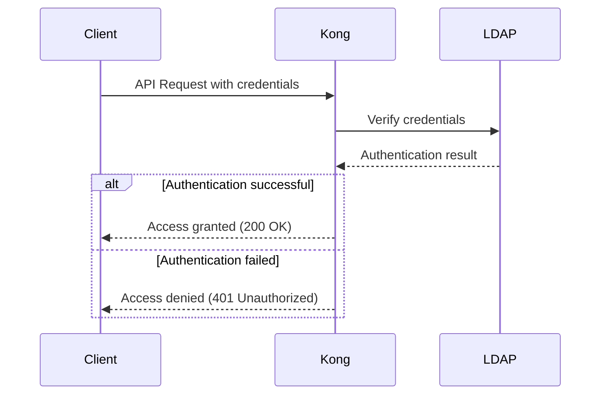
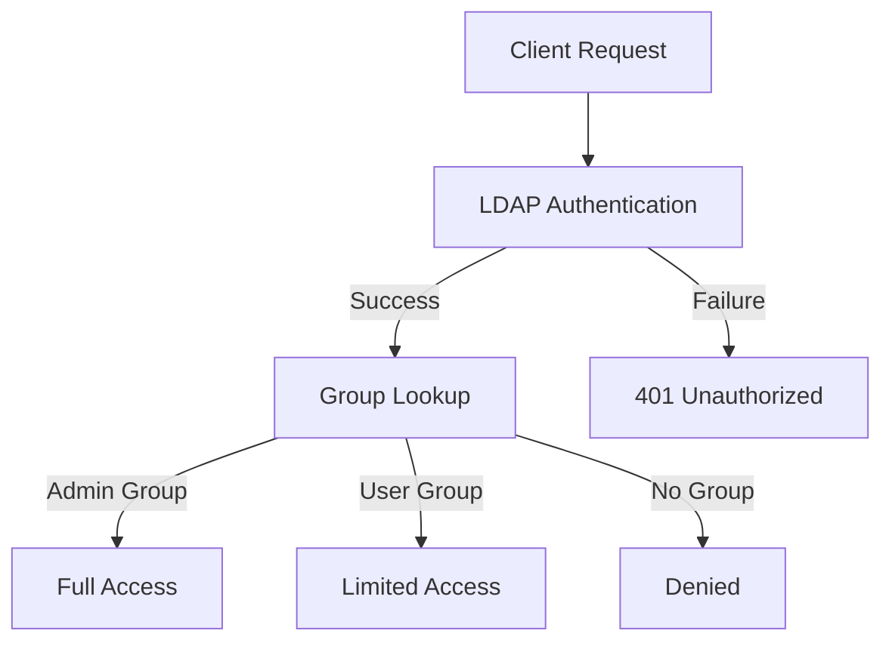

# Kong LDAP Authentication

## Introduction

Lightweight Directory Access Protocol (LDAP) is a standardized protocol used for accessing and maintaining distributed directory information services over an IP network. When integrated with Kong API Gateway, LDAP authentication provides a robust security layer that allows you to authenticate API consumers against an existing LDAP server.

In this guide, we'll explore how Kong LDAP authentication works, how to set it up, and best practices for implementation. This powerful feature enables you to leverage your organization's existing user directory for API access control, simplifying user management and enhancing security.

## What is LDAP?

Before diving into Kong's integration, let's understand the basics of LDAP:

LDAP is a protocol that enables applications to query and modify data stored in directory services. Think of it as a specialized database optimized for reading, browsing, and searching operations. It's commonly used for:

- User authentication (login)
- User authorization (permissions)
- Storing organizational information (employees, departments)
- Storing configuration data for various applications

An LDAP directory is organized in a hierarchical tree structure, using entries consisting of attributes with values.

## Kong LDAP Authentication Plugin

Kong's LDAP Authentication plugin provides a way to authenticate consumers through an LDAP server. When enabled, this plugin will check credentials against your LDAP directory before allowing access to your APIs.

### How It Works



## Setting Up Kong LDAP Authentication

### Prerequisites

- Kong Gateway installed and running
- Access to an LDAP server
- Basic understanding of Kong plugins
- `curl` or another API testing tool

### Step 1: Install the Plugin

If you're using Kong Enterprise, the LDAP plugin is already included. For Kong Community Edition, you'll need to install it separately:

```bash
$ luarocks install kong-ldap-auth
```

### Step 2: Enable the Plugin

You can enable the LDAP Authentication plugin on a specific Service, Route, or globally.

#### Enable for a Service:

```bash
$ curl -X POST http://localhost:8001/services/your-service/plugins \
  --data "name=ldap-auth" \
  --data "config.ldap_host=ldap.example.com" \
  --data "config.ldap_port=389" \
  --data "config.base_dn=dc=example,dc=com" \
  --data "config.attribute=cn" \
  --data "config.cache_ttl=60" \
  --data "config.header_type=ldap"
```

#### Enable globally:

```bash
$ curl -X POST http://localhost:8001/plugins \
  --data "name=ldap-auth" \
  --data "config.ldap_host=ldap.example.com" \
  --data "config.ldap_port=389" \
  --data "config.base_dn=dc=example,dc=com" \
  --data "config.attribute=cn" \
  --data "config.cache_ttl=60" \
  --data "config.header_type=ldap"
```

### Step 3: Configure the Plugin

The LDAP Authentication plugin offers several configuration options:

| Parameter | Description | Default |
|-----------|-------------|---------|
| `ldap_host` | LDAP server host | required |
| `ldap_port` | LDAP server port | 389 |
| `ldap_timeout` | LDAP server timeout | 10000 (ms) |
| `base_dn` | Base DN used for LDAP search | required |
| `attribute` | Attribute used for username matching | required |
| `cache_ttl` | TTL for cache in seconds | 60 |
| `start_tls` | Use StartTLS protocol | false |
| `ldaps` | Use LDAPS protocol | false |
| `hide_credentials` | Hide credentials in requests | false |
| `header_type` | Type of authorization header | ldap |

### Step 4: Test the Configuration

After configuring the plugin, you can test it with a simple request:

```bash
$ curl -i -X GET \
  --url http://localhost:8000/your-api-endpoint \
  --header 'Authorization: ldap username=john,password=password123'
```

If your credentials are valid in the LDAP directory, Kong will grant access to the API.

## Example: Real-World Implementation

Let's look at a complete example for a company that wants to secure their internal APIs using their existing Active Directory.

### Scenario

- Company: TechCorp
- LDAP Server: `ldap.techcorp.com`
- Base DN: `ou=Users,dc=techcorp,dc=com`
- Service to protect: Internal Analytics API

### Implementation

First, create the service in Kong:

```bash
$ curl -i -X POST \
  --url http://localhost:8001/services/ \
  --data 'name=analytics-api' \
  --data 'url=http://internal-analytics-api.techcorp.com'
```

Next, create a route for the service:

```bash
$ curl -i -X POST \
  --url http://localhost:8001/services/analytics-api/routes \
  --data 'name=analytics' \
  --data 'paths[]=/analytics'
```

Finally, enable LDAP authentication for this service:

```bash
$ curl -i -X POST \
  --url http://localhost:8001/services/analytics-api/plugins \
  --data 'name=ldap-auth' \
  --data 'config.ldap_host=ldap.techcorp.com' \
  --data 'config.ldap_port=389' \
  --data 'config.base_dn=ou=Users,dc=techcorp,dc=com' \
  --data 'config.attribute=sAMAccountName' \
  --data 'config.cache_ttl=300' \
  --data 'config.header_type=ldap'
```

Now, users can access the analytics API with their Active Directory credentials:

```bash
$ curl -i -X GET \
  --url http://kong-gateway:8000/analytics/daily-report \
  --header 'Authorization: ldap username=jsmith,password=mysecretpwd'
```

## Advanced Configuration

### Secure LDAP (LDAPS)

For production environments, it's recommended to use LDAPS or StartTLS to encrypt LDAP communication:

```bash
$ curl -X POST http://localhost:8001/services/your-service/plugins \
  --data "name=ldap-auth" \
  --data "config.ldap_host=ldaps.example.com" \
  --data "config.ldap_port=636" \
  --data "config.ldaps=true" \
  --data "config.base_dn=dc=example,dc=com" \
  --data "config.attribute=cn"
```

### Group-Based Authorization

While the LDAP Authentication plugin handles authentication, you might want to add authorization based on LDAP groups. This can be achieved by combining the LDAP plugin with Kong's ACL plugin:

1. First, use LDAP authentication to verify the user.
2. Then, use a custom plugin or Lambda to check the user's group membership.
3. Apply the ACL plugin to restrict access based on those groups.

Here's a conceptual workflow:



## Troubleshooting

### Common Issues

1. **Connection Failed**
   - Check if your LDAP server is reachable from Kong
   - Verify port settings and firewall rules

2. **Authentication Failed**
   - Verify the base_dn and attribute settings
   - Check user credentials in LDAP directory
   - Check LDAP logs for failed binds

3. **SSL/TLS Issues**
   - Ensure proper certificate configuration
   - Check if you need to use `start_tls` instead of `ldaps`

### Debugging

Enable verbose logging in Kong by setting the log level to debug:

```bash
$ curl -X PATCH http://localhost:8001/services/your-service \
  --data "log_level=debug"
```

Then check Kong's error logs for detailed information.

## Best Practices

1. **Security**
   - Always use LDAPS or StartTLS in production
   - Store LDAP credentials securely
   - Consider using a read-only LDAP account for binding

2. **Performance**
   - Enable caching with appropriate TTL
   - Create specific LDAP queries with proper scope
   - Consider LDAP connection pooling for high-traffic APIs

3. **Maintenance**
   - Regularly update your LDAP plugin
   - Monitor authentication failures
   - Set up alerts for LDAP connectivity issues

## Summary

The Kong LDAP Authentication plugin provides a powerful way to integrate your API gateway with existing directory services. By leveraging LDAP authentication, you can:

- Centralize user management
- Enhance security with enterprise-grade authentication
- Simplify onboarding and offboarding processes
- Maintain consistent access control across systems

LDAP authentication is particularly valuable for organizations that already have an investment in directory services and want to extend that infrastructure to API access control.

## Additional Resources

- [Kong LDAP Authentication Plugin Official Documentation](https://docs.konghq.com/hub/kong-inc/ldap-auth/)
- [LDAP.com - LDAP Reference](https://ldap.com)
- [Active Directory Integration Guidelines](https://learn.microsoft.com/en-us/windows-server/identity/ad-ds/get-started/virtual-dc/active-directory-domain-services-overview)

## Exercises

1. Set up a test LDAP server (such as OpenLDAP) and configure Kong to authenticate against it.
2. Create a service with both anonymous access for some endpoints and LDAP authentication for protected endpoints.
3. Implement LDAPS and measure the performance difference compared to standard LDAP.
4. Develop a custom plugin that extends LDAP authentication with role-based access control based on LDAP groups.