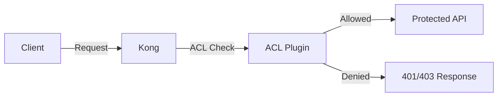

# Kong ACL

## Introduction

Access Control Lists (ACLs) are a fundamental security mechanism in Kong API Gateway that allow you to control which consumers can access your APIs. Kong's ACL plugin enables you to create whitelists or blacklists of consumers who are permitted or forbidden to access your services, routes, or APIs.

In this guide, we'll explore how Kong ACL works, how to set it up, and provide practical examples to help you implement effective access control in your API infrastructure.

## What is Kong ACL?

The Kong ACL plugin is a security feature that restricts access to your APIs based on the consumer groups. It works by:

1. Associating consumers with specific groups
2. Configuring the ACL plugin to allow or deny access based on these groups
3. Validating incoming requests against these permissions

This access control layer sits between your clients and your APIs, ensuring only authorized consumers can access protected resources.



## Prerequisites

Before implementing Kong ACL, you should have:

- Kong API Gateway installed and running
- Basic understanding of Kong concepts (Services, Routes, Consumers)
- Authentication mechanism configured (JWT, Key Auth, Basic Auth, etc.)

ACL typically works alongside an authentication plugin, as it relies on the consumer information provided by these plugins.

## Setting Up Kong ACL

### Step 1: Create Consumers

First, let's create consumers who will access our APIs:

```bash
# Create the first consumer
curl -X POST http://localhost:8001/consumers/ \
  --data "username=consumer1"

# Create the second consumer
curl -X POST http://localhost:8001/consumers/ \
  --data "username=consumer2"
```

### Step 2: Associate Consumers with Groups

Next, we'll associate these consumers with specific groups:

```bash
# Associate consumer1 with the "gold" group
curl -X POST http://localhost:8001/consumers/consumer1/acls \
  --data "group=gold"

# Associate consumer2 with the "silver" group
curl -X POST http://localhost:8001/consumers/consumer2/acls \
  --data "group=silver"
```

You can associate a consumer with multiple groups:

```bash
# Associate consumer1 with the "admin" group as well
curl -X POST http://localhost:8001/consumers/consumer1/acls \
  --data "group=admin"
```

### Step 3: Configure an Authentication Plugin

Before applying ACL, set up an authentication plugin. Here's an example using Key Authentication:

```bash
# Enable key-auth on a route
curl -X POST http://localhost:8001/routes/my-route/plugins \
  --data "name=key-auth"

# Create an API key for consumer1
curl -X POST http://localhost:8001/consumers/consumer1/key-auth \
  --data "key=consumer1-key"

# Create an API key for consumer2
curl -X POST http://localhost:8001/consumers/consumer2/key-auth \
  --data "key=consumer2-key"
```

### Step 4: Enable the ACL Plugin

Now, let's enable the ACL plugin on our route:

```bash
# Allow only the "gold" group to access the route
curl -X POST http://localhost:8001/routes/my-route/plugins \
  --data "name=acl" \
  --data "config.allow=gold"
```

Alternatively, you can specify groups to deny:

```bash
# Deny the "limited" group from accessing the route
curl -X POST http://localhost:8001/routes/my-route/plugins \
  --data "name=acl" \
  --data "config.deny=limited"
```

## Understanding ACL Configuration

The ACL plugin has two mutually exclusive modes:

1. **Whitelist mode** (`config.allow`): Only consumers belonging to the specified groups can access the API
2. **Blacklist mode** (`config.deny`): Consumers belonging to the specified groups cannot access the API

You must choose either one mode or the other, not both.

### Configuration Parameters

| Parameter | Description |
|-----------|-------------|
| `name` | Should be set to `acl` |
| `config.allow` | Array of group names that are allowed to access the API |
| `config.deny` | Array of group names that are forbidden from accessing the API |
| `config.hide_groups_header` | Boolean that controls whether the `X-Consumer-Groups` header is sent in responses (default: `false`) |

## Real-World Examples

### Example 1: Tiered API Access

Let's implement a tiered access model for a fictional e-commerce API:

```bash
# Create routes for different tiers
curl -X POST http://localhost:8001/services/ecommerce/routes \
  --data "name=basic-tier" \
  --data "paths[]=/api/v1/products"

curl -X POST http://localhost:8001/services/ecommerce/routes \
  --data "name=premium-tier" \
  --data "paths[]=/api/v1/recommendations"

# Apply authentication
curl -X POST http://localhost:8001/routes/basic-tier/plugins \
  --data "name=key-auth"

curl -X POST http://localhost:8001/routes/premium-tier/plugins \
  --data "name=key-auth"

# Apply ACL to basic tier (allow both silver and gold)
curl -X POST http://localhost:8001/routes/basic-tier/plugins \
  --data "name=acl" \
  --data "config.allow=silver" \
  --data "config.allow=gold"

# Apply ACL to premium tier (allow only gold)
curl -X POST http://localhost:8001/routes/premium-tier/plugins \
  --data "name=acl" \
  --data "config.allow=gold"
```

Now:
- Consumer1 (gold) can access both the basic tier and premium tier
- Consumer2 (silver) can only access the basic tier

### Example 2: Internal vs. Public APIs

For separating internal and public APIs:

```bash
# Create routes for internal and public APIs
curl -X POST http://localhost:8001/services/analytics/routes \
  --data "name=internal-analytics" \
  --data "paths[]=/api/v1/analytics/internal"

curl -X POST http://localhost:8001/services/analytics/routes \
  --data "name=public-analytics" \
  --data "paths[]=/api/v1/analytics/public"

# Apply authentication
curl -X POST http://localhost:8001/routes/internal-analytics/plugins \
  --data "name=key-auth"

curl -X POST http://localhost:8001/routes/public-analytics/plugins \
  --data "name=key-auth"

# Allow only internal group to access internal analytics
curl -X POST http://localhost:8001/routes/internal-analytics/plugins \
  --data "name=acl" \
  --data "config.allow=internal"

# Allow anyone authenticated to access public analytics
# (No ACL plugin needed for public-analytics)
```

## Testing ACL Configuration

To test your ACL configuration:

```bash
# Request with consumer1 (gold group) - Should succeed
curl -i http://localhost:8000/api/v1/recommendations \
  -H "apikey: consumer1-key"

# Request with consumer2 (silver group) - Should fail with 403
curl -i http://localhost:8000/api/v1/recommendations \
  -H "apikey: consumer2-key"
```

## Debugging ACL Issues

If you're experiencing issues with your ACL configuration:

1. **Check the consumer's groups**:
   ```bash
   curl http://localhost:8001/consumers/consumer1/acls
   ```

2. **Verify the ACL plugin configuration**:
   ```bash
   curl http://localhost:8001/routes/my-route/plugins
   ```

3. **Examine Kong logs for detailed error messages**

## Best Practices

1. **Use Authentication with ACL**: Always pair the ACL plugin with an authentication plugin
2. **Group Naming Convention**: Adopt a clear and consistent naming convention for groups
3. **Principle of Least Privilege**: Grant the minimum access necessary
4. **Regular Audits**: Periodically review and audit your ACL configurations
5. **Documentation**: Keep documentation of which groups have access to which resources

## ACL vs. RBAC

It's important to understand that Kong ACL provides simple group-based access control, not full Role-Based Access Control (RBAC). For more complex authorization needs:

- ACL: Simple group-based allowlist/denylist
- RBAC: Fine-grained control with roles, permissions, and operations

For advanced authorization, consider combining Kong ACL with other plugins or implementing custom logic.

## Summary

Kong ACL is a powerful security feature that allows you to control access to your APIs based on consumer groups. By combining authentication and ACL, you can implement a robust security model that ensures only authorized consumers can access your protected resources.

The key points to remember:
- ACL works alongside authentication plugins
- You can use either whitelist or blacklist mode, not both
- Consumers can belong to multiple groups
- ACL operates at the service, route, or global level

## Additional Resources

- [Kong ACL Plugin Official Documentation](https://docs.konghq.com/hub/kong-inc/acl/)
- [Kong Authentication Plugins](https://docs.konghq.com/hub/#authentication)
- [Kong Security Guide](https://konghq.com/blog/kong-gateway-security)

## Exercises

1. **Basic Setup**: Create a new service with two routes, and configure the ACL plugin to allow different groups to access each route.

2. **Group Hierarchy**: Implement a hierarchical access model with "user", "editor", and "admin" groups, where each group has access to progressively more routes.

3. **Combining Plugins**: Set up a service that uses both the Rate Limiting plugin and the ACL plugin to provide different rate limits based on consumer groups.

4. **Migration Exercise**: Practice migrating from a simple key authentication system to one that incorporates ACLs for more granular access control.

By following this guide and completing these exercises, you'll develop a strong foundation in implementing access control with Kong API Gateway, enhancing the security of your microservices architecture.