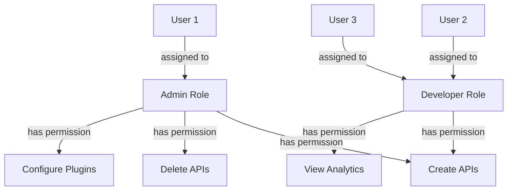

# Understanding Kong RBAC

## Introduction

Role-Based Access Control (RBAC) is a crucial security mechanism in modern applications, and Kong API Gateway provides robust RBAC capabilities to secure your API infrastructure. In this guide, we'll explore how Kong implements RBAC, allowing you to control who can access what within your API ecosystem.

Kong RBAC works by defining roles with specific permissions and then assigning those roles to users. This creates a flexible security model that's easier to manage than directly assigning permissions to individual users. Whether you're managing a small team or a large enterprise, Kong RBAC helps you implement the principle of least privilege, ensuring users have exactly the access they need—no more, no less.

## What is RBAC?

RBAC (Role-Based Access Control) is a security approach that restricts system access based on the roles of individual users within an organization. Instead of defining permissions for each user directly, permissions are linked to roles, and users are assigned to appropriate roles.

The three primary components of RBAC are:

1. **Users** - Individual entities who need access to the system
2. **Roles** - Collections of permissions that define what actions can be performed
3. **Permissions** - Specific operations that can be executed on resources

Let's visualize this relationship:



## Kong RBAC Implementation

Kong implements RBAC through its admin API and database. When you enable RBAC in Kong, all Admin API access requires authentication and authorization checks.

### Prerequisites

Before implementing Kong RBAC, you'll need:

1. Kong Gateway installed and running
2. Admin API access
3. Basic familiarity with Kong's configuration

### Enabling RBAC in Kong

RBAC is typically enabled in your Kong configuration file (`kong.conf`):

```
enforce_rbac = on
rbac_admin_roles = super-admin
```

Alternatively, you can use environment variables:

```bash
export KONG_ENFORCE_RBAC=on
export KONG_RBAC_ADMIN_ROLES=super-admin
```

### Creating Roles

Let's create some roles using Kong's Admin API:

```bash
# Create an admin role
curl -X POST http://localhost:8001/rbac/roles \
  --data name=admin \
  --data comment="Full administrative access"
```

The response will look something like:

```json
{
  "name": "admin",
  "comment": "Full administrative access",
  "created_at": 1637240048,
  "id": "a8288566-5deb-43c1-94a5-b3fb81c87438"
}
```

### Adding Permissions to Roles

Now, let's add permissions to our role:

```bash
# Add permission to create services to the admin role
curl -X POST http://localhost:8001/rbac/roles/admin/permissions \
  --data endpoint=/services \
  --data actions=create,read,update,delete
```

Example response:

```json
{
  "actions": [
    "create",
    "read",
    "update",
    "delete"
  ],
  "created_at": 1637240148,
  "endpoint": "/services",
  "negative": false,
  "role": {
    "id": "a8288566-5deb-43c1-94a5-b3fb81c87438"
  },
  "workspace": "default"
}
```

### Creating Users

Now, let's create a user:

```bash
# Create a user
curl -X POST http://localhost:8001/rbac/users \
  --data name=john \
  --data user_token=custom-token \
  --data comment="API team lead"
```

Response:

```json
{
  "comment": "API team lead",
  "created_at": 1637240200,
  "enabled": true,
  "id": "92ddcb77-2f8c-44a9-8c7f-cfddb6df6a5f",
  "name": "john",
  "user_token": "custom-token"
}
```

### Assigning Roles to Users

Finally, let's assign our admin role to the user:

```bash
# Assign role to user
curl -X POST http://localhost:8001/rbac/users/john/roles \
  --data roles=admin
```

Response:

```json
{
  "roles": [
    "admin"
  ],
  "user": {
    "id": "92ddcb77-2f8c-44a9-8c7f-cfddb6df6a5f"
  }
}
```

## Practical Examples

### Example 1: Creating Team-Based Access

Imagine you have different teams managing different services in your API ecosystem:

```bash
# Create roles for different teams
curl -X POST http://localhost:8001/rbac/roles --data name=payment-team
curl -X POST http://localhost:8001/rbac/roles --data name=user-management-team
curl -X POST http://localhost:8001/rbac/roles --data name=analytics-team

# Assign specific permissions to each team
curl -X POST http://localhost:8001/rbac/roles/payment-team/permissions \
  --data endpoint=/services/payment-service \
  --data actions=read,update

curl -X POST http://localhost:8001/rbac/roles/user-management-team/permissions \
  --data endpoint=/services/user-service \
  --data actions=read,update

curl -X POST http://localhost:8001/rbac/roles/analytics-team/permissions \
  --data endpoint=/services \
  --data actions=read
```

### Example 2: Implementing Workspace-Specific Roles

For organizations with multi-team Kong deployments, you can restrict roles to specific workspaces:

```bash
# Create a workspace-specific role
curl -X POST http://localhost:8001/rbac/roles \
  --data name=development-admin \
  --data comment="Admin for development workspace only"

# Add workspace-specific permissions
curl -X POST http://localhost:8001/rbac/roles/development-admin/permissions \
  --data workspace=development \
  --data endpoint=/services \
  --data actions=create,read,update,delete
```

### Example 3: Using RBAC with Kong Manager

In a real-world scenario, you'll often manage RBAC through Kong Manager (Kong's admin GUI):

1. Log in to Kong Manager as an admin user
2. Navigate to the "Teams" section
3. Create roles with specific permissions
4. Create user accounts
5. Assign roles to users

The Kong Manager interface simplifies these operations, providing a user-friendly way to manage your RBAC configuration.

## Best Practices for Kong RBAC

1. **Follow the Principle of Least Privilege**: Give users only the permissions they absolutely need.

2. **Use Role Hierarchies**: Create a hierarchy of roles where appropriate (e.g., junior-dev → senior-dev → team-lead).

3. **Regularly Audit Permissions**: Review who has access to what on a regular basis.

4. **Implement Proper User Lifecycle Management**: Promptly disable accounts when users leave the organization.

5. **Secure Your Admin API**: Make sure your Kong Admin API is not publicly accessible.

## Troubleshooting Kong RBAC

### Common Issues:

**1. Authentication Failures**

If you're getting 401 Unauthorized errors:
- Check that your authentication token is valid
- Verify the token is being passed correctly in the `Kong-Admin-Token` header

**2. Authorization Failures**

If you're getting 403 Forbidden errors:
- Ensure the user has the correct role
- Check that the role has the necessary permissions for the endpoint
- Verify workspace settings if using workspace-specific permissions

**3. RBAC Configuration Issues**

If RBAC isn't working as expected:
- Confirm RBAC is enabled in your Kong configuration
- Check your Kong logs for any RBAC-related errors
- Verify that the `enforce_rbac` setting is on

## Summary

Kong RBAC provides a powerful and flexible way to secure your API management infrastructure. By defining roles with specific permissions and assigning those roles to users, you can implement fine-grained access control that aligns with your organizational structure and security requirements.

In this guide, we've covered:
- The fundamental concepts of RBAC
- How to implement RBAC in Kong
- Creating and managing roles, permissions, and users
- Real-world examples and best practices
- Troubleshooting common issues

With Kong RBAC, you can ensure that your API gateway is secure while still allowing team members to access the resources they need to do their jobs effectively.

## Additional Resources

- Kong RBAC Documentation: [https://docs.konghq.com/gateway/latest/admin-api/rbac/reference/](https://docs.konghq.com/gateway/latest/admin-api/rbac/reference/)
- Kong Security Guide: [https://docs.konghq.com/gateway/latest/plan-and-deploy/security/](https://docs.konghq.com/gateway/latest/plan-and-deploy/security/)

## Exercises

1. Set up a basic Kong environment and enable RBAC.
2. Create roles for a hypothetical team structure with at least three different roles.
3. Create test users and assign appropriate roles to them.
4. Test access to various Kong Admin API endpoints with different user accounts.
5. Implement a role hierarchy for your organization.