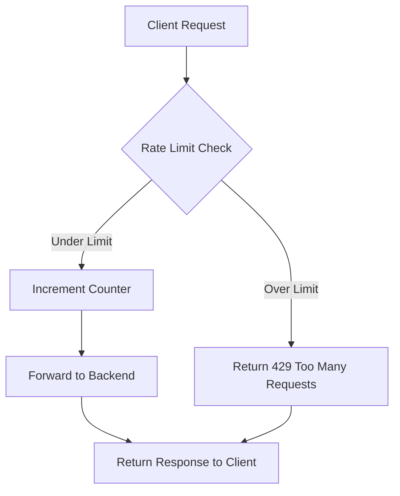
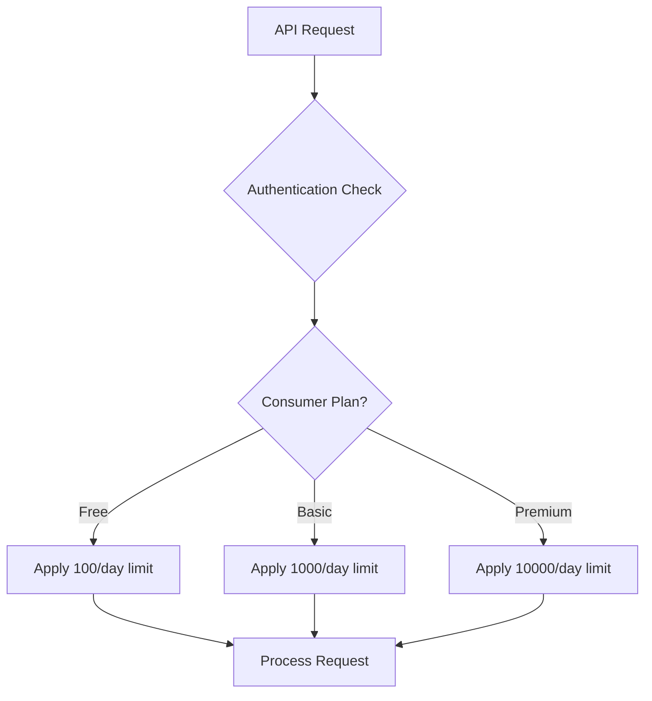

# Kong Rate Limiting

## Introduction

Rate limiting is a critical security technique used to control the amount of traffic a user, client, or IP address can send to an API within a specified time window. In this guide, we'll explore how Kong API Gateway implements rate limiting to protect your services from abuse, denial-of-service attacks, and unintended traffic spikes.

Kong's rate limiting plugin allows you to:
- Limit how many requests clients can make in a given period
- Apply different limits to different consumers or routes
- Protect backend services from being overwhelmed
- Ensure fair usage of your API resources

## Understanding Rate Limiting Concepts

Before diving into Kong's implementation, let's understand some key rate limiting concepts:

### What is Rate Limiting?

Rate limiting restricts how many requests a client can make to your API within a specific timeframe. When the limit is reached, subsequent requests are typically blocked until the time window resets.

### Why Use Rate Limiting?

- **Security**: Prevents brute force attacks and DDoS attempts
- **Stability**: Ensures your backend services aren't overwhelmed by traffic
- **Fair Usage**: Prevents any single client from monopolizing your resources
- **Cost Control**: Helps manage infrastructure costs by controlling traffic
- **SLA Management**: Enables different tiers of API access based on subscription levels

### Rate Limiting Parameters

- **Window Size**: The time period for the limit (seconds, minutes, hours, days)
- **Limit**: Maximum number of requests allowed in the window
- **Identifier**: How to identify clients (IP, consumer ID, credential, header)
- **Response**: What happens when limits are exceeded (rejection, queuing, etc.)

## Kong Rate Limiting Plugin

Kong offers a powerful rate limiting plugin that integrates seamlessly with its API gateway functionality.

### How Kong Rate Limiting Works



When a request arrives at Kong:
1. Kong identifies the client using the configured identifier
2. Checks if the client has exceeded their limit for the current window
3. If under the limit, the request is forwarded and the counter incremented
4. If over the limit, Kong returns a 429 status code (Too Many Requests)

### Installing the Rate Limiting Plugin

To enable rate limiting in Kong, you need to apply the plugin to a service, route, or globally:

```bash
# Apply to a specific service
curl -X POST http://kong:8001/services/your-service/plugins \
  --data "name=rate-limiting" \
  --data "config.minute=5" \
  --data "config.policy=local"

# Apply globally
curl -X POST http://kong:8001/plugins \
  --data "name=rate-limiting" \
  --data "config.minute=5" \
  --data "config.policy=local"
```

### Basic Configuration Options

Here are the fundamental configuration parameters:

| Parameter | Description | Example |
|-----------|-------------|---------|
| `second` | Requests per second | `10` |
| `minute` | Requests per minute | `60` |
| `hour` | Requests per hour | `3600` |
| `day` | Requests per day | `86400` |
| `month` | Requests per month | `2592000` |
| `policy` | Where counter is stored | `local`, `redis`, `cluster` |
| `limit_by` | How to identify consumers | `consumer`, `credential`, `ip` |

## Simple Example: Limiting Requests per Minute

Let's implement a basic rate limit that allows 5 requests per minute:

```bash
# Create a service
curl -X POST http://kong:8001/services \
  --data "name=example-api" \
  --data "url=http://example-api.com"

# Create a route
curl -X POST http://kong:8001/services/example-api/routes \
  --data "name=example" \
  --data "paths[]=/example"

# Apply rate limiting
curl -X POST http://kong:8001/services/example-api/plugins \
  --data "name=rate-limiting" \
  --data "config.minute=5" \
  --data "config.policy=local"
```

### Testing Our Rate Limit

Now let's test our configuration:

```bash
# Make 6 requests to see the rate limit in action
for i in {1..6}; do
  echo "Request $i:"
  curl -i http://localhost:8000/example
  echo -e "
"
  sleep 1
done
```

Output for the first 5 requests:

```
HTTP/1.1 200 OK
X-RateLimit-Limit-Minute: 5
X-RateLimit-Remaining-Minute: 4
...

(response body)
```

Output for the 6th request:

```
HTTP/1.1 429 Too Many Requests
X-RateLimit-Limit-Minute: 5
X-RateLimit-Remaining-Minute: 0
Retry-After: 54
...

{"message":"API rate limit exceeded"}
```

Notice Kong adds helpful headers:
- `X-RateLimit-Limit-Minute`: Shows your configured limit
- `X-RateLimit-Remaining-Minute`: Shows remaining requests in the current window
- `Retry-After`: Seconds until the limit resets (when exceeded)

## Advanced Rate Limiting Scenarios

Let's look at some more sophisticated use cases:

### Different Limits for Different Consumers

You can apply different rate limits to different consumers:

```bash
# Create a consumer
curl -X POST http://kong:8001/consumers \
  --data "username=premium-user"

# Apply a higher rate limit for this consumer  
curl -X POST http://kong:8001/consumers/premium-user/plugins \
  --data "name=rate-limiting" \
  --data "config.minute=100" \
  --data "config.policy=local"
```

This configuration would allow:
- 5 requests per minute for regular users (from our service-level configuration)
- 100 requests per minute for the premium-user consumer

### Distributed Rate Limiting with Redis

For a multi-node Kong deployment, using the local policy won't work effectively as each node would have its own counters. Use Redis instead:

```bash
curl -X POST http://kong:8001/services/example-api/plugins \
  --data "name=rate-limiting" \
  --data "config.minute=5" \
  --data "config.policy=redis" \
  --data "config.redis_host=redis-server" \
  --data "config.redis_port=6379" \
  --data "config.redis_database=0"
```

### Multiple Time Windows

You can combine time windows for more complex limiting:

```bash
curl -X POST http://kong:8001/services/example-api/plugins \
  --data "name=rate-limiting" \
  --data "config.second=5" \
  --data "config.minute=30" \
  --data "config.hour=500" \
  --data "config.policy=local"
```

This configuration ensures that clients cannot make:
- More than 5 requests per second
- More than 30 requests per minute
- More than 500 requests per hour

### Rate Limiting by Header Value

You can limit based on a specific header value:

```bash
curl -X POST http://kong:8001/services/example-api/plugins \
  --data "name=rate-limiting" \
  --data "config.minute=5" \
  --data "config.limit_by=header" \
  --data "config.header_name=X-Consumer-Group" \
  --data "config.policy=local"
```

Now requests are limited based on the value of the `X-Consumer-Group` header.

## Best Practices

Here are some recommendations for implementing rate limiting with Kong:

1. **Start Conservative**: Begin with more generous limits and tighten as needed.

2. **Use Multiple Time Windows**: Combine second, minute, and hour limits for better protection.

3. **Distributed Deployments**: Use Redis for multi-node deployments to ensure consistent enforcement.

4. **Communicate Limits**: Make sure your API documentation clearly states the rate limits.

5. **Monitor Rate Limit Events**: Set up alerts for when consumers regularly hit rate limits.

6. **Consider Response**: Customize the response when clients exceed limits with useful information.

7. **Implement Backoff Strategy**: Suggest exponential backoff in your client documentation.

## Debugging Rate Limiting Issues

If you're experiencing unexpected rate limiting behavior:

1. Check the rate limiting headers in responses:
   ```
   X-RateLimit-Limit-Minute
   X-RateLimit-Remaining-Minute
   ```

2. Verify your configuration:
   ```bash
   curl -X GET http://kong:8001/services/example-api/plugins
   ```

3. Check Kong logs:
   ```bash
   tail -f /usr/local/kong/logs/error.log
   ```

4. For Redis-based rate limiting, ensure Redis connectivity:
   ```bash
   redis-cli ping
   ```

## Advanced Configuration

Here's a comprehensive example with advanced options:

```bash
curl -X POST http://kong:8001/services/example-api/plugins \
  --data "name=rate-limiting" \
  --data "config.second=10" \
  --data "config.minute=100" \
  --data "config.hour=1000" \
  --data "config.policy=redis" \
  --data "config.redis_host=redis-server" \
  --data "config.redis_port=6379" \
  --data "config.limit_by=consumer" \
  --data "config.hide_client_headers=false" \
  --data "config.error_message=Please slow down! You've exceeded your rate limit." \
  --data "config.sync_rate=10"
```

## Common Use Cases

### API Monetization Tiers



### Protection Against Security Threats

Rate limiting can be combined with other Kong plugins:

```bash
# Apply IP restriction plugin first
curl -X POST http://kong:8001/services/login-service/plugins \
  --data "name=ip-restriction" \
  --data "config.blacklist=1.2.3.4,5.6.7.8"

# Then apply strict rate limiting 
curl -X POST http://kong:8001/services/login-service/plugins \
  --data "name=rate-limiting" \
  --data "config.second=3" \
  --data "config.minute=10" \
  --data "config.limit_by=ip" \
  --data "config.policy=local"
```

## Summary

Kong's rate limiting plugin provides a flexible and powerful way to control API traffic. By implementing rate limiting, you can:

- Protect your backend services from excessive load
- Prevent abuse and denial-of-service attacks
- Create tiered access levels for API monetization
- Ensure fair usage among all consumers

Remember that effective rate limiting requires careful planning of your limits, clear communication with API consumers, and monitoring of rate limiting events to adjust as needed.

## Additional Resources

To learn more about Kong rate limiting:

- [Kong Rate Limiting Plugin Documentation](https://docs.konghq.com/hub/kong-inc/rate-limiting/)
- [Kong Enterprise Rate Limiting Advanced Plugin](https://docs.konghq.com/hub/kong-inc/rate-limiting-advanced/)
- [Redis Documentation](https://redis.io/documentation)

## Exercises

1. Configure a global rate limit of 1000 requests per hour, with a per-service limit of 100 requests per minute.

2. Set up different rate limits for authenticated and unauthenticated users.

3. Implement a rate limiting strategy that allows burst traffic but prevents sustained high volume.

4. Create a tiered rate limiting system with three different consumer groups.

5. Set up distributed rate limiting across a Kong cluster using Redis.