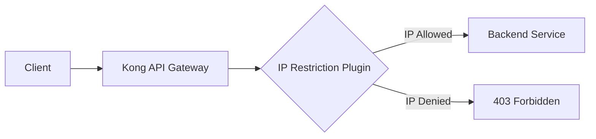

# Kong IP Restriction

## Introduction

IP restriction is a fundamental security measure that allows you to control which IP addresses or CIDR ranges can access your APIs. Kong's IP Restriction plugin provides a powerful and flexible way to implement this control at the API gateway level, giving you fine-grained access control without modifying your backend services.

In this guide, we'll explore how to configure and use Kong's IP Restriction plugin to secure your APIs by allowing or denying specific client IP addresses.

## What is Kong IP Restriction?

Kong IP Restriction is a security plugin for the Kong API Gateway that allows you to:

- Allow specific IP addresses or CIDR ranges to access your API endpoints
- Deny specific IP addresses or CIDR ranges from accessing your API endpoints
- Apply these restrictions globally, to specific services, or to individual routes

This plugin acts as a gatekeeper at the API gateway level, filtering requests based on the client's IP address before they reach your backend services.



## Why Use IP Restriction?

IP-based restrictions offer several benefits in an API security strategy:

1. **Zero-trust security model** - Explicitly define trusted sources rather than assuming all traffic is legitimate
2. **Defense in depth** - Add another layer of security alongside authentication and authorization
3. **Protection from specific threats** - Block known malicious IP addresses
4. **Compliance requirements** - Meet regulatory requirements for access control
5. **Backend protection** - Shield sensitive internal services from external access

## Setting Up Kong IP Restriction

### Prerequisites

Before implementing IP restriction, you'll need:

- A running Kong instance (self-hosted or Kong Enterprise)
- Admin access to configure Kong
- Knowledge of the IP addresses or CIDR ranges you want to allow or deny

### Basic Configuration

The IP Restriction plugin can be configured in different ways:

1. **Global application** - Apply to all services and routes
2. **Service-specific** - Apply to all routes within a service
3. **Route-specific** - Apply only to a specific route

Let's look at how to configure the plugin for a specific service using the Kong Admin API:

```bash
# Allow only specific IPs to access a service
curl -X POST http://kong:8001/services/my-service/plugins \
  --data name=ip-restriction \
  --data config.allow="192.168.1.0/24,10.0.0.1"
```

This creates an IP restriction that allows only traffic from the `192.168.1.0/24` subnet and the specific IP `10.0.0.1`.

Alternatively, you can deny specific IPs while allowing all others:

```bash
# Deny specific IPs from accessing a service
curl -X POST http://kong:8001/services/my-service/plugins \
  --data name=ip-restriction \
  --data config.deny="192.168.0.1,192.168.0.2"
```

### Declarative Configuration (YAML)

If you're using Kong's declarative configuration approach with `kong.yml`, you can define the IP restriction plugin like this:

```yaml
services:
- name: my-api
  url: http://my-api.internal:8000
  plugins:
  - name: ip-restriction
    config:
      allow:
      - 192.168.1.0/24
      - 10.0.0.1
  routes:
  - name: my-route
    paths:
    - /api
```

### Configuration Parameters

The IP Restriction plugin supports the following configuration options:

| Parameter | Description | Default |
| --------- | ----------- | ------- |
| `allow` | List of IPs or CIDR ranges to allow | `[]` (none) |
| `deny` | List of IPs or CIDR ranges to deny | `[]` (none) |
| `status` | HTTP status code to return for denied requests | `403` |
| `message` | Message to return for denied requests | `"Your IP address is not allowed"` |

**Important Notes:**
- You should use either `allow` or `deny`, but not both in the same configuration
- If `allow` is set, only the specified IPs will be allowed (all others are denied)
- If `deny` is set, only the specified IPs will be denied (all others are allowed)

## Real-world Examples

### Example 1: Protecting an Admin API

Let's say you have an administrative API that should only be accessible from your company's office network:

```bash
curl -X POST http://kong:8001/services/admin-api/plugins \
  --data name=ip-restriction \
  --data config.allow="198.51.100.0/24" \
  --data config.message="Access restricted to company network only"
```

### Example 2: Blocking Abusive IP Addresses

If you've identified IP addresses that are abusing your API, you can block them:

```bash
curl -X POST http://kong:8001/services/public-api/plugins \
  --data name=ip-restriction \
  --data config.deny="203.0.113.5,203.0.113.13" \
  --data config.message="Your access has been revoked due to suspicious activity"
```

### Example 3: Combining with Rate Limiting

IP restriction works well alongside other security plugins. Here's how to combine it with rate limiting:

```bash
# First, set up IP restriction
curl -X POST http://kong:8001/services/my-service/plugins \
  --data name=ip-restriction \
  --data config.allow="192.168.1.0/24"

# Then, add rate limiting for the allowed IPs
curl -X POST http://kong:8001/services/my-service/plugins \
  --data name=rate-limiting \
  --data config.minute=100 \
  --data config.policy=local
```

## Testing Your IP Restriction Configuration

After setting up IP restriction, it's important to test it thoroughly:

1. **Test allowed IPs**: Make requests from allowed IP addresses to confirm they can access your API
2. **Test denied IPs**: Make requests from denied IP addresses to confirm they receive the expected error
3. **Check logs**: Examine Kong logs to verify that the plugin is working as expected

Here's a simple example using curl to test the restriction:

```bash
# From an allowed IP
curl -i https://api.example.com/resource

# Expected successful response
HTTP/1.1 200 OK
...

# From a denied IP
curl -i https://api.example.com/resource

# Expected denial response
HTTP/1.1 403 Forbidden
...
{"message":"Your IP address is not allowed"}
```

## Troubleshooting

If your IP restriction isn't working as expected, check these common issues:

### Client IP Detection

Kong needs to correctly identify the client's IP address. This can be complicated by:

- Proxies and load balancers that may hide the original client IP
- X-Forwarded-For headers that contain multiple IPs

Configure Kong's `trusted_ips` and `real_ip_header` settings to ensure accurate client IP detection:

```bash
# Configure Kong to trust X-Forwarded-For from your load balancer
kong start --nginx-conf /path/to/custom/nginx.conf
```

In your custom nginx.conf:

```
real_ip_header X-Forwarded-For;
set_real_ip_from 10.0.0.0/8;
```

### Common Errors

1. **Locked yourself out**: If you accidentally restrict your own admin access, you'll need to modify Kong's configuration directly on the server.

2. **Conflicting plugins**: If you have multiple security plugins, ensure they work together as expected.

3. **CIDR format errors**: Ensure your CIDR notation is correct (e.g., `192.168.1.0/24` not `192.168.1/24`).

## Advanced Use Cases

### Combining Allow and Deny with Multiple Plugins

While a single IP restriction plugin instance can use either `allow` or `deny` (not both), you can create multiple instances for more complex scenarios:

```bash
# First plugin: Allow specific network
curl -X POST http://kong:8001/services/my-service/plugins \
  --data name=ip-restriction \
  --data config.allow="192.168.1.0/24"

# Second plugin: Deny specific IP within the allowed network
curl -X POST http://kong:8001/routes/my-route/plugins \
  --data name=ip-restriction \
  --data config.deny="192.168.1.13"
```

### Dynamic IP Restriction with Kong Enterprise

If you're using Kong Enterprise, you can leverage the Admin API to dynamically update IP restrictions:

```bash
# Add a new IP to the deny list
curl -X PATCH http://kong:8001/plugins/{plugin-id} \
  --data config.deny[]="203.0.113.20"
```

## Best Practices

When implementing IP restriction with Kong:

1. **Use CIDR notation** for network ranges to keep configurations concise.

2. **Be cautious with allowlists** - if you're using `allow`, ensure you include all legitimate sources.

3. **Document your restrictions** - maintain a record of which IPs are allowed/denied and why.

4. **Regular auditing** - periodically review and update your IP restrictions.

5. **Don't rely solely on IP restriction** - combine with authentication, authorization, and other security measures.

6. **Use meaningful error messages** - help legitimate users understand why they might be blocked.

7. **Monitor false positives** - watch for legitimate users being accidentally blocked.

## Summary

Kong's IP Restriction plugin provides a powerful way to control access to your APIs based on client IP addresses. By implementing IP-based access control at the API gateway level, you can:

- Enhance security by restricting access to trusted networks
- Block malicious or abusive IP addresses
- Protect sensitive APIs from unauthorized access
- Implement tiered access based on client location

Remember that IP restriction should be part of a comprehensive security strategy that includes authentication, authorization, encryption, and monitoring.

## Additional Resources

- [Official Kong IP Restriction Plugin Documentation](https://docs.konghq.com/hub/kong-inc/ip-restriction/)
- [Kong Security Guide](https://konghq.com/blog/kong-gateway-security)
- [CIDR Notation Explained](https://en.wikipedia.org/wiki/Classless_Inter-Domain_Routing)

## Exercises

1. **Basic Configuration**: Set up Kong IP Restriction to allow only your current IP address to access a test API.

2. **Network Configuration**: Configure Kong to allow a small subnet (e.g., `/29` CIDR block) containing multiple test IP addresses.

3. **Mixed Strategy**: Create a configuration that allows a corporate network but specifically denies a few problematic IPs within that network.

4. **Integration Exercise**: Combine IP Restriction with Rate Limiting and JWT Authentication for a defense-in-depth approach.

5. **Troubleshooting Challenge**: Deliberately create a misconfiguration and practice troubleshooting to identify and fix the issue.