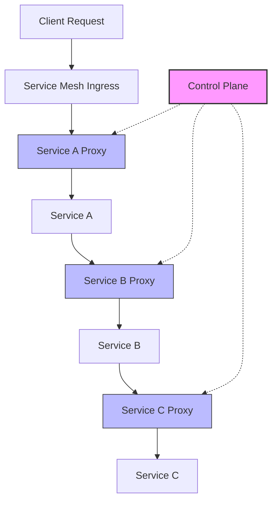

# Kong Service Mesh

## Introduction

A service mesh is a dedicated infrastructure layer that controls service-to-service communication in a microservices architecture. Kong Service Mesh, built on top of the open-source Kuma platform, provides a powerful solution for managing microservices interactions with features like traffic control, security, and observability.

In this guide, you'll learn what Kong Service Mesh is, how it works, and how to implement it in your applications. Whether you're managing a complex microservices environment or planning to migrate to one, understanding service mesh concepts will help you build more reliable, secure, and observable systems.

## What is a Service Mesh?

Before diving into Kong Service Mesh specifically, let's understand what a service mesh is and why it's useful.

In a microservices architecture, applications are broken down into small, independently deployable services. As the number of services grows, managing communication between them becomes increasingly complex:

- How do services discover each other?
- How do we secure communication between services?
- How do we implement resilience patterns like retries and circuit breaking?
- How can we monitor and trace requests as they move through multiple services?

A service mesh addresses these challenges by providing a dedicated infrastructure layer that handles service-to-service communication. It typically consists of two main components:

1. **Data Plane**: A set of intelligent proxies (sidecars) deployed alongside each service instance
2. **Control Plane**: A centralized component that configures and manages the proxies



## Kong Service Mesh Overview

Kong Service Mesh is Kong's service mesh offering, built on top of Kuma, an open-source service mesh platform donated by Kong to the Cloud Native Computing Foundation (CNCF).

Key features of Kong Service Mesh include:

- **Universal Compatibility**: Works across Kubernetes, virtual machines, and bare metal environments
- **Multi-Zone Support**: Manages services across multiple clusters and regions
- **Security**: Built-in mutual TLS (mTLS), role-based access control, and traffic permissions
- **Traffic Control**: Load balancing, circuit breakers, health checks, and fault injection
- **Observability**: Integration with Prometheus, Grafana, and distributed tracing systems
- **GUI Dashboard**: Visual management and observation through Kong Mesh GUI

## Getting Started with Kong Service Mesh

### Prerequisites

To follow along with this guide, you'll need:

- Kubernetes cluster (v1.16 or later)
- kubectl command-line tool
- helm (v3.x or later)

### Installation

Let's install Kong Service Mesh in a Kubernetes environment:

1. Add the Kong Mesh Helm repository:

```bash
$ helm repo add kong-mesh https://kong.github.io/kong-mesh-charts
$ helm repo update
```

2. Install Kong Mesh with default configurations:

```bash
$ helm install kong-mesh kong-mesh/kong-mesh --namespace kong-mesh-system --create-namespace
```

The output should look similar to:

```
NAME: kong-mesh
LAST DEPLOYED: Tue Feb 25 15:30:45 2023
NAMESPACE: kong-mesh-system
STATUS: deployed
REVISION: 1
TEST SUITE: None
NOTES:
Kong Mesh has been installed successfully!

To verify the installation, run:
  kubectl get pods -n kong-mesh-system
```

3. Verify the installation:

```bash
$ kubectl get pods -n kong-mesh-system
```

You should see the control plane components running:

```
NAME                                 READY   STATUS    RESTARTS   AGE
kong-mesh-control-plane-7f8b4845f9-c7rjb   1/1     Running   0          60s
```

### Deploying the Demo Application

Let's deploy a simple demo application to see Kong Service Mesh in action. We'll use a basic two-service application:

1. Create a namespace for our demo:

```bash
$ kubectl create namespace demo
```

2. Label the namespace for Kong Service Mesh injection:

```bash
$ kubectl label namespace demo kuma.io/sidecar-injection=enabled
```

3. Deploy the demo services:

```yaml
# demo.yaml
apiVersion: apps/v1
kind: Deployment
metadata:
  name: frontend
  namespace: demo
spec:
  replicas: 1
  selector:
    matchLabels:
      app: frontend
  template:
    metadata:
      labels:
        app: frontend
    spec:
      containers:
      - name: frontend
        image: nginx:latest
        ports:
        - containerPort: 80
---
apiVersion: v1
kind: Service
metadata:
  name: frontend
  namespace: demo
spec:
  selector:
    app: frontend
  ports:
  - port: 80
    targetPort: 80
---
apiVersion: apps/v1
kind: Deployment
metadata:
  name: backend
  namespace: demo
spec:
  replicas: 1
  selector:
    matchLabels:
      app: backend
  template:
    metadata:
      labels:
        app: backend
    spec:
      containers:
      - name: backend
        image: httpbin
        ports:
        - containerPort: 80
---
apiVersion: v1
kind: Service
metadata:
  name: backend
  namespace: demo
spec:
  selector:
    app: backend
  ports:
  - port: 80
    targetPort: 80
```

Apply the configuration:

```bash
$ kubectl apply -f demo.yaml
```

4. Verify that pods are running with sidecars:

```bash
$ kubectl get pods -n demo
```

You should see two pods, each with two containers (the service and the Kong Mesh sidecar):

```
NAME                        READY   STATUS    RESTARTS   AGE
backend-7c8fb547f-k8h9t     2/2     Running   0          30s
frontend-6d8c7b95d7-f2mrt   2/2     Running   0          30s
```

Notice that each pod shows 2/2 containers ready, indicating that both the application container and the Kong Mesh sidecar proxy are running.

## Configuring Kong Service Mesh

Now that we have our application running with Kong Service Mesh, let's explore some common configurations.

### Traffic Policies

One of the most powerful features of a service mesh is the ability to control traffic between services. Let's implement a traffic routing policy:

```yaml
# traffic-route.yaml
apiVersion: kuma.io/v1alpha1
kind: TrafficRoute
metadata:
  name: route-all-traffic
  namespace: demo
spec:
  sources:
    - match:
        kuma.io/service: frontend_demo_svc_80
  destinations:
    - match:
        kuma.io/service: backend_demo_svc_80
  conf:
    loadBalancer:
      roundRobin: {}
    destination:
      kuma.io/service: backend_demo_svc_80
```

Apply the configuration:

```bash
$ kubectl apply -f traffic-route.yaml
```

This policy ensures that all traffic from the frontend service goes to the backend service, using round-robin load balancing.

### Implementing Mutual TLS (mTLS)

Security is a critical aspect of service meshes. Let's enable mutual TLS for all services in our demo namespace:

```yaml
# mtls.yaml
apiVersion: kuma.io/v1alpha1
kind: Mesh
metadata:
  name: default
spec:
  mtls:
    enabledBackend: ca-1
    backends:
      - name: ca-1
        type: builtin
```

Apply the configuration:

```bash
$ kubectl apply -f mtls.yaml
```

Now all traffic between your services is automatically encrypted and authenticated using mTLS, without any changes to your application code.

### Implementing Retries and Timeouts

To make our services more resilient, let's add retry and timeout policies:

```yaml
# retry-policy.yaml
apiVersion: kuma.io/v1alpha1
kind: RetryPolicy
metadata:
  name: retry-policy
  namespace: demo
spec:
  sources:
    - match:
        kuma.io/service: frontend_demo_svc_80
  destinations:
    - match:
        kuma.io/service: backend_demo_svc_80
  conf:
    http:
      numRetries: 3
      perTryTimeout: 200ms
      backOff:
        baseInterval: 100ms
        maxInterval: 1s
```

```yaml
# timeout-policy.yaml
apiVersion: kuma.io/v1alpha1
kind: TimeoutPolicy
metadata:
  name: timeout-policy
  namespace: demo
spec:
  sources:
    - match:
        kuma.io/service: frontend_demo_svc_80
  destinations:
    - match:
        kuma.io/service: backend_demo_svc_80
  conf:
    connectTimeout: 500ms
    http:
      requestTimeout: 2s
      idleTimeout: 60s
```

Apply these configurations:

```bash
$ kubectl apply -f retry-policy.yaml
$ kubectl apply -f timeout-policy.yaml
```

## Observability with Kong Service Mesh

Kong Service Mesh provides built-in observability features. Let's configure metrics collection:

```yaml
# metrics.yaml
apiVersion: kuma.io/v1alpha1
kind: Mesh
metadata:
  name: default
spec:
  metrics:
    enabledBackend: prometheus-1
    backends:
      - name: prometheus-1
        type: prometheus
        conf:
          port: 5670
          path: /metrics
          skipMTLS: false
```

Apply the configuration:

```bash
$ kubectl apply -f metrics.yaml
```

Now we can set up Prometheus and Grafana to collect and visualize these metrics:

1. Install Prometheus and Grafana using Helm:

```bash
$ helm repo add prometheus-community https://prometheus-community.github.io/helm-charts
$ helm repo update
$ helm install prometheus prometheus-community/kube-prometheus-stack --namespace monitoring --create-namespace
```

2. Configure Prometheus to scrape Kong Mesh metrics:

```yaml
# prometheus-config.yaml
apiVersion: v1
kind: ConfigMap
metadata:
  name: prometheus-server-conf
  namespace: monitoring
  labels:
    name: prometheus-server-conf
data:
  prometheus.yml: |-
    scrape_configs:
      - job_name: 'kong-mesh'
        kubernetes_sd_configs:
        - role: pod
        relabel_configs:
        - source_labels: [__meta_kubernetes_pod_annotation_prometheus_io_scrape]
          action: keep
          regex: true
        - source_labels: [__meta_kubernetes_pod_annotation_prometheus_io_path]
          action: replace
          target_label: __metrics_path__
          regex: (.+)
```

Apply the configuration:

```bash
$ kubectl apply -f prometheus-config.yaml
```

Now you can access Grafana dashboards to visualize your service mesh traffic, response times, and more.

## Real-World Use Case: Canary Deployments

Let's implement a real-world scenario: canary deployments. This allows you to gradually roll out a new version of your service to a small subset of users before deploying it to everyone.

1. First, deploy a new version of our backend service:

```yaml
# backend-v2.yaml
apiVersion: apps/v1
kind: Deployment
metadata:
  name: backend-v2
  namespace: demo
spec:
  replicas: 1
  selector:
    matchLabels:
      app: backend
      version: v2
  template:
    metadata:
      labels:
        app: backend
        version: v2
    spec:
      containers:
      - name: backend
        image: httpbin
        env:
        - name: VERSION
          value: "v2"
        ports:
        - containerPort: 80
```

Apply the configuration:

```bash
$ kubectl apply -f backend-v2.yaml
```

2. Now, create a traffic split policy to send 20% of the traffic to the new version:

```yaml
# traffic-split.yaml
apiVersion: kuma.io/v1alpha1
kind: TrafficRoute
metadata:
  name: canary-rollout
  namespace: demo
spec:
  sources:
    - match:
        kuma.io/service: frontend_demo_svc_80
  destinations:
    - match:
        kuma.io/service: backend_demo_svc_80
  conf:
    split:
      - weight: 80
        destination:
          kuma.io/service: backend_demo_svc_80
          version: v1
      - weight: 20
        destination:
          kuma.io/service: backend_demo_svc_80
          version: v2
```

Apply the configuration:

```bash
$ kubectl apply -f traffic-split.yaml
```

3. Monitor the performance and error rates of both versions. If the new version performs well, gradually increase its traffic percentage:

```yaml
# traffic-split-update.yaml
apiVersion: kuma.io/v1alpha1
kind: TrafficRoute
metadata:
  name: canary-rollout
  namespace: demo
spec:
  sources:
    - match:
        kuma.io/service: frontend_demo_svc_80
  destinations:
    - match:
        kuma.io/service: backend_demo_svc_80
  conf:
    split:
      - weight: 50
        destination:
          kuma.io/service: backend_demo_svc_80
          version: v1
      - weight: 50
        destination:
          kuma.io/service: backend_demo_svc_80
          version: v2
```

Apply the updated configuration:

```bash
$ kubectl apply -f traffic-split-update.yaml
```

4. Once you're confident in the new version, direct all traffic to it:

```yaml
# traffic-split-final.yaml
apiVersion: kuma.io/v1alpha1
kind: TrafficRoute
metadata:
  name: canary-rollout
  namespace: demo
spec:
  sources:
    - match:
        kuma.io/service: frontend_demo_svc_80
  destinations:
    - match:
        kuma.io/service: backend_demo_svc_80
  conf:
    destination:
      kuma.io/service: backend_demo_svc_80
      version: v2
```

Apply the final configuration:

```bash
$ kubectl apply -f traffic-split-final.yaml
```

This canary deployment pattern allows you to safely roll out new versions with minimal risk.

## Kong Service Mesh vs. Other Service Meshes

Kong Service Mesh is one of several service mesh implementations available. Here's a brief comparison with other popular options:

| Feature | Kong Service Mesh | Istio | Linkerd |
|---------|------------------|-------|---------|
| Control Plane | Kuma (CNCF) | istiod | linkerd-controller |
| Data Plane | Envoy | Envoy | linkerd-proxy |
| Multi-zone | ✅ | ✅ | ✅ |
| Multi-cluster | ✅ | ✅ | ✅ |
| VM Support | ✅ | ⚠️ (Limited) | ❌ |
| WebAssembly Support | ✅ | ✅ | ❌ |
| GUI Dashboard | ✅ | ❌ (Third-party) | ✅ |
| Learning Curve | Medium | High | Low |

Kong Service Mesh stands out with its universal control plane that works across Kubernetes, VMs, and bare metal, making it an excellent choice for heterogeneous environments.

## Summary

In this guide, we've explored Kong Service Mesh, a powerful service mesh solution for managing microservices communication. We've covered:

- What a service mesh is and why it's important
- Key features of Kong Service Mesh
- Installing Kong Service Mesh on Kubernetes
- Configuring traffic routing, security, and resilience policies
- Setting up observability with Prometheus and Grafana
- Implementing a real-world canary deployment scenario

Kong Service Mesh simplifies complex microservices operations by providing a consistent layer for managing service-to-service communication, security, and observability. By separating these concerns from your application code, you can focus on building features while the service mesh handles the infrastructure challenges.

## Additional Resources

To deepen your knowledge of Kong Service Mesh, consider exploring these resources:

- **Practice Exercises**:
  1. Try implementing a circuit breaker policy to prevent cascading failures
  2. Set up distributed tracing with Jaeger
  3. Create a fault injection policy to test application resilience

- **Further Learning**:
  - Explore Kong's documentation on integrating API Gateway with Kong Service Mesh
  - Learn about Kong Mesh's WebAssembly capabilities for custom plugins
  - Investigate multi-zone deployments for multi-cluster scenarios

By mastering service mesh concepts and Kong Service Mesh specifically, you'll be well-equipped to build resilient, secure, and observable microservices architectures.