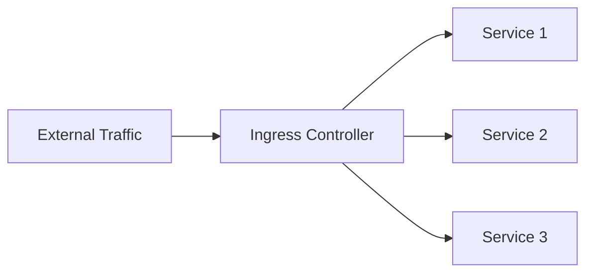
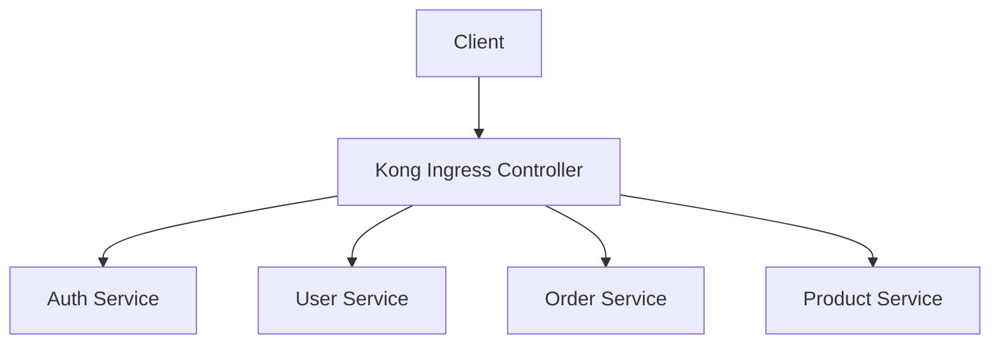

# Kong Ingress Controller

## Introduction

The Kong Ingress Controller is a powerful tool that extends Kubernetes' networking capabilities by integrating Kong - a popular API gateway - with Kubernetes' native ingress resources. It allows developers to efficiently manage, secure, and observe API traffic flowing into their Kubernetes clusters.

As modern applications evolve towards microservices architectures, the need for sophisticated traffic management increases. The Kong Ingress Controller provides a solution by acting as an intelligent entry point for external traffic, routing requests to appropriate services while offering features like authentication, rate limiting, and observability.

## What is an Ingress Controller?

Before diving into Kong specifically, let's understand what an Ingress Controller is in Kubernetes:

In Kubernetes, an **Ingress** is an API object that manages external access to services within a cluster, typically HTTP. An **Ingress Controller** is the implementation that fulfills the Ingress rules.



The Ingress Controller sits at the edge of your cluster and routes incoming traffic according to the defined rules, essentially functioning as a smart router.

## Why Kong Ingress Controller?

Kong Ingress Controller enhances standard Kubernetes Ingress with:

- **Advanced routing capabilities**: Path-based, header-based, and method-based routing
- **Traffic control**: Rate limiting, request transformation, and response transformation
- **Security features**: Authentication, authorization, and IP restriction
- **Observability**: Logging, monitoring, and tracing
- **Plugin ecosystem**: Extend functionality with Kong's robust plugin architecture

## Getting Started with Kong Ingress Controller

### Prerequisites

To follow along, you'll need:

- A running Kubernetes cluster (local or cloud-based)
- `kubectl` configured to communicate with your cluster
- Basic understanding of Kubernetes concepts (Pods, Services, Deployments)

### Installation

The simplest way to install Kong Ingress Controller is using Helm:

```bash
# Add the Kong Helm repository
helm repo add kong https://charts.konghq.com

# Update local Helm chart repository
helm repo update

# Install Kong Ingress Controller
helm install kong kong/kong --namespace kong --create-namespace
```

You can verify your installation by checking if the Kong pods are running:

```bash
kubectl get pods -n kong
```

Expected output:

```
NAME                            READY   STATUS    RESTARTS   AGE
kong-kong-5c44f5bdd9-xsshw      2/2     Running   0          2m
```

### Basic Configuration

Let's create a simple application and expose it through Kong Ingress Controller:

1. First, create a simple web application:

```yaml
# sample-app.yaml
apiVersion: apps/v1
kind: Deployment
metadata:
  name: sample-app
spec:
  replicas: 1
  selector:
    matchLabels:
      app: sample-app
  template:
    metadata:
      labels:
        app: sample-app
    spec:
      containers:
      - name: sample-app
        image: nginx:latest
        ports:
        - containerPort: 80
---
apiVersion: v1
kind: Service
metadata:
  name: sample-app-service
spec:
  selector:
    app: sample-app
  ports:
  - port: 80
    targetPort: 80
```

Apply this configuration:

```bash
kubectl apply -f sample-app.yaml
```

2. Create an Ingress resource to route traffic to your application:

```yaml
# sample-ingress.yaml
apiVersion: networking.k8s.io/v1
kind: Ingress
metadata:
  name: sample-ingress
  annotations:
    konghq.com/strip-path: "true"
spec:
  ingressClassName: kong
  rules:
  - http:
      paths:
      - path: /sample
        pathType: Prefix
        backend:
          service:
            name: sample-app-service
            port:
              number: 80
```

Apply this configuration:

```bash
kubectl apply -f sample-ingress.yaml
```

3. Access your application:

Once configured, you can access your application through the Kong proxy:

```bash
# Get Kong proxy endpoint
export PROXY_IP=$(kubectl get -o jsonpath="{.status.loadBalancer.ingress[0].ip}" service -n kong kong-kong-proxy)

# Access the application
curl http://$PROXY_IP/sample
```

You should see the Nginx welcome page, indicating that Kong successfully routed your request to the sample application.

## Advanced Features

### Custom Plugins with Kong Ingress Controller

Kong's plugin architecture is one of its most powerful features. Let's see how to enable a rate limiting plugin:

```yaml
# rate-limiting.yaml
apiVersion: configuration.konghq.com/v1
kind: KongPlugin
metadata:
  name: rate-limiting
config:
  minute: 5
  policy: local
plugin: rate-limiting
---
apiVersion: networking.k8s.io/v1
kind: Ingress
metadata:
  name: sample-ingress
  annotations:
    konghq.com/plugins: rate-limiting
    konghq.com/strip-path: "true"
spec:
  ingressClassName: kong
  rules:
  - http:
      paths:
      - path: /sample
        pathType: Prefix
        backend:
          service:
            name: sample-app-service
            port:
              number: 80
```

Apply this configuration:

```bash
kubectl apply -f rate-limiting.yaml
```

Now, if you make more than 5 requests to `/sample` within a minute, you'll receive a 429 Too Many Requests response.

### Authentication with Kong

Let's add basic authentication to our API:

1. First, create a secret with credentials:

```yaml
# basic-auth-credentials.yaml
apiVersion: v1
kind: Secret
metadata:
  name: basic-auth-credentials
type: Opaque
stringData:
  username: user1
  password: password123
```

2. Create a Kong consumer and link the credentials:

```yaml
# kong-consumer.yaml
apiVersion: configuration.konghq.com/v1
kind: KongConsumer
metadata:
  name: example-user
  annotations:
    kubernetes.io/ingress.class: kong
username: user1
credentials:
- basic-auth-credentials
```

3. Create a basic authentication plugin:

```yaml
# basic-auth-plugin.yaml
apiVersion: configuration.konghq.com/v1
kind: KongPlugin
metadata:
  name: basic-auth
plugin: basic-auth
```

4. Apply the configurations and update the ingress:

```bash
kubectl apply -f basic-auth-credentials.yaml
kubectl apply -f kong-consumer.yaml
kubectl apply -f basic-auth-plugin.yaml
```

Now, update your ingress to use the basic-auth plugin:

```yaml
# secure-ingress.yaml
apiVersion: networking.k8s.io/v1
kind: Ingress
metadata:
  name: sample-ingress
  annotations:
    konghq.com/plugins: basic-auth
    konghq.com/strip-path: "true"
spec:
  ingressClassName: kong
  rules:
  - http:
      paths:
      - path: /sample
        pathType: Prefix
        backend:
          service:
            name: sample-app-service
            port:
              number: 80
```

Apply this updated ingress:

```bash
kubectl apply -f secure-ingress.yaml
```

Now, when accessing the API, you need to provide authentication:

```bash
curl -u user1:password123 http://$PROXY_IP/sample
```

### Traffic Control with Kong

Kong allows you to implement sophisticated traffic control patterns. Let's see how to set up a canary release:

```yaml
# canary-deployment.yaml
apiVersion: apps/v1
kind: Deployment
metadata:
  name: sample-app-v2
spec:
  replicas: 1
  selector:
    matchLabels:
      app: sample-app-v2
  template:
    metadata:
      labels:
        app: sample-app-v2
    spec:
      containers:
      - name: sample-app
        image: nginx:alpine
        ports:
        - containerPort: 80
---
apiVersion: v1
kind: Service
metadata:
  name: sample-app-v2-service
spec:
  selector:
    app: sample-app-v2
  ports:
  - port: 80
    targetPort: 80
```

Now, let's create a KongIngress resource to control traffic splitting:

```yaml
# traffic-split.yaml
apiVersion: configuration.konghq.com/v1
kind: KongIngress
metadata:
  name: traffic-split
route:
  protocols:
  - http
  - https
  regex_priority: 0
  strip_path: true
upstream:
  algorithm: round-robin
  hash_on: none
  hash_fallback: none
  hash_on_cookie_path: /
  slots: 10000
---
apiVersion: networking.k8s.io/v1
kind: Ingress
metadata:
  name: canary-ingress
  annotations:
    konghq.com/override: traffic-split
spec:
  ingressClassName: kong
  rules:
  - http:
      paths:
      - path: /sample
        pathType: Prefix
        backend:
          service:
            name: sample-app-service
            port:
              number: 80
      - path: /sample
        pathType: Prefix
        backend:
          service:
            name: sample-app-v2-service
            port:
              number: 80
```

Apply these configurations:

```bash
kubectl apply -f canary-deployment.yaml
kubectl apply -f traffic-split.yaml
```

Now, traffic to `/sample` will be distributed between both versions of your application.

## Monitoring and Observability

Kong provides several options for monitoring and observability:

### Enable Prometheus Metrics

```yaml
# prometheus.yaml
apiVersion: configuration.konghq.com/v1
kind: KongClusterPlugin
metadata:
  name: prometheus
  annotations:
    kubernetes.io/ingress.class: kong
  labels:
    global: "true"
config:
  status_code_metrics: true
  latency_metrics: true
  bandwidth_metrics: true
  upstream_health_metrics: true
plugin: prometheus
```

Apply this configuration:

```bash
kubectl apply -f prometheus.yaml
```

Once applied, Kong will expose Prometheus metrics at `/metrics` endpoint on port 8100 of the Kong proxy service.

## Real-World Use Case: API Gateway for Microservices

Let's explore a more comprehensive example that demonstrates how Kong Ingress Controller can be used as an API gateway for a microservices architecture:



In this scenario, Kong serves as the entry point for all client requests, handling:

1. Authentication and authorization
2. Rate limiting
3. Request/response transformation
4. Service discovery and routing
5. Health checks
6. Monitoring

The configuration might look like:

```yaml
# microservices-gateway.yaml
apiVersion: networking.k8s.io/v1
kind: Ingress
metadata:
  name: api-gateway
  annotations:
    konghq.com/strip-path: "true"
spec:
  ingressClassName: kong
  rules:
  - http:
      paths:
      - path: /auth
        pathType: Prefix
        backend:
          service:
            name: auth-service
            port:
              number: 80
      - path: /users
        pathType: Prefix
        backend:
          service:
            name: user-service
            port:
              number: 80
      - path: /orders
        pathType: Prefix
        backend:
          service:
            name: order-service
            port:
              number: 80
      - path: /products
        pathType: Prefix
        backend:
          service:
            name: product-service
            port:
              number: 80
```

This configuration allows Kong to route requests to the appropriate microservice based on the URL path.

## Troubleshooting Common Issues

### 1. Ingress Not Working

If your ingress doesn't seem to be working:

```bash
# Check if the ingress was created correctly
kubectl get ingress

# Check Kong Ingress Controller logs
kubectl logs -n kong deployment/kong-kong -c ingress-controller

# Verify Kong is receiving the configuration
kubectl get kongconsumer,kongplugin -A
```

### 2. Plugin Configuration Issues

If your plugins aren't working as expected:

```bash
# Check plugin status
kubectl get kongplugin -A

# Check configuration
kubectl describe kongplugin <plugin-name>

# Check Kong logs for plugin errors
kubectl logs -n kong deployment/kong-kong -c proxy
```

## Summary

The Kong Ingress Controller provides a powerful way to manage API traffic in Kubernetes environments. It extends Kubernetes' basic ingress capabilities with advanced features like authentication, rate limiting, and observability.

In this guide, we've covered:
- What Kong Ingress Controller is and why it's useful
- How to install and configure it
- How to set up basic routing
- How to implement advanced features like authentication and traffic control
- Real-world applications in a microservices architecture
- Troubleshooting common issues

By leveraging Kong Ingress Controller, developers can build more robust, secure, and observable Kubernetes-based applications.

## Additional Resources

To learn more about Kong Ingress Controller, check out:

- [Kong Ingress Controller GitHub Repository](https://github.com/Kong/kubernetes-ingress-controller)
- [Kong for Kubernetes Documentation](https://docs.konghq.com/kubernetes-ingress-controller/)
- [Kong Plugins Documentation](https://docs.konghq.com/hub/)

## Exercises

To reinforce your understanding of Kong Ingress Controller, try these exercises:

1. Set up a Kong Ingress Controller in a local Kubernetes cluster (like minikube or kind).
2. Create two simple microservices and expose them through Kong.
3. Implement rate limiting for one service and basic authentication for another.
4. Configure logging and monitor traffic flowing through Kong.
5. Implement a canary deployment using Kong's traffic splitting capabilities.