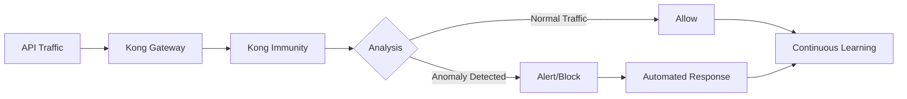

# Kong Immunity

## Introduction

Kong Immunity is an advanced AI-powered security feature that monitors API traffic patterns to detect and respond to anomalies automatically. It uses machine learning algorithms to establish a baseline of normal traffic behaviors and identifies potential security threats or operational issues that deviate from this baseline. Think of it as an immune system for your API gateway - continuously watching for and protecting against unusual activities without requiring manual intervention.

## How Kong Immunity Works

Kong Immunity operates in three main phases:

1. **Learning Phase**: Observes API traffic to establish normal behavior patterns
2. **Detection Phase**: Identifies anomalies that deviate from learned patterns
3. **Response Phase**: Takes configurable actions when anomalies are detected



## Prerequisites

Before setting up Kong Immunity, ensure you have:

- Kong Enterprise installed (version 2.1.0 or later)
- Kong Immunity license
- Kong Manager access
- Admin API access

## Setting Up Kong Immunity

### Step 1: Enable the Immunity Plugin

First, let's enable the Kong Immunity plugin for a specific service:

```bash
curl -X POST http://localhost:8001/services/my-service/plugins \
  --data "name=immunity" \
  --data "config.server_url=http://immunity-server:5000" \
  --data "config.alert_threshold=70"
```

This will:
- Enable Immunity for the service named `my-service`
- Set the Immunity server location
- Configure the alert threshold to 70% (alerts will trigger when anomaly confidence exceeds 70%)

### Step 2: Configure Alert Notifications

Set up notification channels to receive alerts:

```bash
curl -X POST http://localhost:8001/immunity/alerts/config \
  --data "email.enabled=true" \
  --data "email.recipients=security-team@example.com" \
  --data "slack.enabled=true" \
  --data "slack.webhook_url=https://hooks.slack.com/services/your-webhook-url"
```

## Core Concepts

### Anomaly Detection Types

Kong Immunity can detect several types of anomalies:

| Anomaly Type | Description | Example |
|--------------|-------------|---------|
| Traffic Spikes | Unusual volume of requests | Potential DDoS attack |
| Unusual Patterns | Atypical request sequences | API scanning/probing |
| Latency Anomalies | Unexpected response time changes | Service degradation |
| Status Code Anomalies | Unusual error rates | Failed backend service |
| Payload Anomalies | Unexpected request content | Injection attacks |

### Detection Sensitivity

You can adjust how sensitive Kong Immunity is to potential anomalies using the `alert_threshold` parameter:

```bash
curl -X PATCH http://localhost:8001/services/my-service/plugins/{plugin-id} \
  --data "config.alert_threshold=50"
```

- Lower values (e.g., 30): More sensitive, may generate more false positives
- Higher values (e.g., 90): Less sensitive, may miss some anomalies

## Practical Examples

### Example 1: Detecting and Responding to a DDoS Attack

In this scenario, we'll configure Kong Immunity to automatically enable rate limiting when it detects a traffic spike:

```bash
# First, create a rate limiting plugin but disable it initially
curl -X POST http://localhost:8001/services/my-service/plugins \
  --data "name=rate-limiting" \
  --data "config.minute=100" \
  --data "config.hour=1000" \
  --data "config.enabled=false"

# Now configure Immunity to enable this plugin when anomalies are detected
curl -X POST http://localhost:8001/immunity/actions \
  --data "name=enable-rate-limiting" \
  --data "service_id=my-service" \
  --data "anomaly_type=traffic_spike" \
  --data "action_type=plugin" \
  --data "plugin_name=rate-limiting" \
  --data "plugin_action=enable"
```

When Kong Immunity detects a traffic spike, it will automatically enable the rate limiting plugin to protect your API.

### Example 2: Creating Custom Anomaly Responses

For more sophisticated responses, you can use Kong's serverless functions:

```lua
-- Create a file named immunity-response.lua
return function(kong)
  -- Get information about the detected anomaly
  local anomaly = kong.ctx.shared.immunity.anomaly
  
  -- Log details about the anomaly
  kong.log.err("Anomaly detected: " .. anomaly.type .. " with confidence " .. anomaly.confidence)
  
  -- Add custom response headers
  kong.response.set_header("X-Anomaly-Detected", "true")
  
  -- For high-confidence anomalies, return a custom error
  if anomaly.confidence > 90 then
    return kong.response.exit(403, { 
      message = "Request blocked due to suspicious behavior",
      anomaly_id = anomaly.id
    })
  end
end
```

Then add this as a custom action:

```bash
curl -X POST http://localhost:8001/immunity/actions \
  --data "name=custom-anomaly-response" \
  --data "service_id=my-service" \
  --data "anomaly_type=any" \
  --data "action_type=serverless" \
  --data "serverless_function=immunity-response.lua"
```

## Advanced Configuration

### Machine Learning Parameters

For fine-tuning the anomaly detection:

```bash
curl -X PATCH http://localhost:8001/services/my-service/plugins/{plugin-id} \
  --data "config.learning_mode_duration=86400" \
  --data "config.sample_rate=15" \
  --data "config.analyzed_fields=request_uri,request_method,client_ip,status_code"
```

This configures:
- 24-hour learning period (86400 seconds)
- Samples 15% of traffic
- Analyzes specific fields for anomalies

### Excluding Expected Patterns

To prevent false positives, you can exclude known patterns from anomaly detection:

```bash
curl -X POST http://localhost:8001/immunity/exclusions \
  --data "service_id=my-service" \
  --data "pattern_type=uri" \
  --data "pattern=/api/batch-jobs*" \
  --data "reason=Expected periodic traffic spikes"
```

## Troubleshooting

### Common Issues

1. **Too Many Alerts**: Adjust the `alert_threshold` to a higher value or add exclusions for known traffic patterns.

2. **Missing Anomalies**: Lower the `alert_threshold` or increase the `sample_rate` to capture more traffic for analysis.

3. **High CPU Usage**: Reduce the `sample_rate` to analyze less traffic or increase the resources allocated to the Immunity server.

### Viewing Immunity Logs

```bash
curl http://localhost:8001/immunity/logs?service_id=my-service&limit=10
```

This returns the most recent 10 log entries for the specified service.

## Summary

Kong Immunity provides AI-powered protection for your APIs by:

- Learning normal traffic patterns automatically
- Detecting anomalies in real-time
- Taking automated actions to protect your services
- Providing visibility into potential security threats

This automated approach to API security reduces the burden on operations teams and provides faster responses to potential threats than manual monitoring alone.

## Additional Resources

- Experiment with different threshold settings to find the right balance between sensitivity and false positives
- Create custom serverless functions to implement more complex response logic
- Combine Kong Immunity with other Kong security plugins for comprehensive API protection:
  - Kong Rate Limiting
  - Kong Bot Detection
  - Kong IP Restriction

## Practice Exercises

1. Set up Kong Immunity for a test API and generate artificial traffic spikes to observe detection
2. Create a custom anomaly response that logs details to a monitoring system
3. Configure different actions for different types of anomalies
4. Experiment with different learning periods to see how they affect anomaly detection accuracy