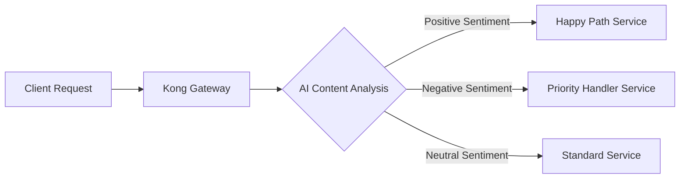

# Kong AI

## Introduction

Kong AI represents a powerful extension to the Kong API Gateway that brings artificial intelligence capabilities directly into your API infrastructure. By leveraging various AI plugins, Kong allows developers to enhance their APIs with machine learning features without having to build these capabilities from scratch.

In this guide, we'll explore how Kong AI plugins can transform your API gateway into an intelligent intermediary that can analyze, enhance, and optimize API traffic using artificial intelligence.

## What is Kong AI?

Kong AI is not a separate product but rather a set of capabilities within the Kong API Gateway ecosystem that allows you to integrate AI functionality into your API workflows. These capabilities are implemented through plugins that connect to various AI services and models.

With Kong AI, you can:

- Apply AI processing to API requests and responses
- Implement intelligent routing based on content analysis
- Add AI-powered security features
- Enhance APIs with natural language processing, image recognition, and other AI capabilities

## Getting Started with Kong AI

### Prerequisites

Before diving into Kong AI, make sure you have:

- A working Kong Gateway installation (version 2.8 or higher recommended)
- Basic knowledge of Kong configuration and plugins
- Access to AI services (like OpenAI, AWS Bedrock, or your custom AI models)

### Installing Kong AI Plugins

Most Kong AI functionality comes in the form of plugins that you can add to your Kong installation. Here's how to install the basic Kong AI plugin package:

```bash
# Using luarocks with Kong 3.0+
luarocks install kong-plugin-ai

# Or add to your Kong configuration
plugins = bundled,ai

# Then restart Kong
kong restart
```

## Common Kong AI Plugins

### 1. AI Proxy Plugin

The AI Proxy plugin allows you to route API requests to AI services and models, acting as an intelligent middleware.

#### Configuration Example

```yaml
plugins:
  - name: ai-proxy
    config:
      upstream_url: https://api.openai.com/v1
      api_key: $OPENAI_API_KEY
      default_model: gpt-4
      timeout: 60000
```

#### Usage Example

```javascript
// Client-side request
const response = await fetch('/api/ai/completion', {
  method: 'POST',
  headers: {
    'Content-Type': 'application/json',
  },
  body: JSON.stringify({
    prompt: "Explain what Kong Gateway is in simple terms",
  }),
});

const result = await response.json();
console.log(result.choices[0].text);
```

### 2. Content Analysis Plugin

This plugin analyzes the content of API requests using AI to make routing or transformation decisions.

#### Configuration Example

```yaml
plugins:
  - name: ai-content-analysis
    config:
      enabled: true
      analysis_type: sentiment
      confidence_threshold: 0.7
      ai_provider: azure
      azure_endpoint: https://your-cognitive-service.azure.com/
      azure_key: $AZURE_AI_KEY
```

#### Practical Example: Sentiment-Based Routing



With this setup, customer feedback submitted through an API can be automatically routed to different handling services based on the detected sentiment, ensuring that negative feedback receives priority attention.

### 3. AI Rate Limiting

This intelligent rate limiting plugin uses AI to dynamically adjust rate limits based on traffic patterns, user behavior, and content analysis.

#### Configuration Example

```yaml
plugins:
  - name: ai-rate-limiting
    config:
      enabled: true
      window_size: 60
      learning_mode: true
      max_baseline_requests: 100
      adjustment_factors:
        user_reputation: 1.5
        content_complexity: 0.8
        time_of_day: 1.2
```

#### How It Works

The AI rate limiting plugin:

1. Establishes baseline traffic patterns for your API
2. Analyzes incoming requests for potential abuse patterns
3. Considers factors like user history and request complexity
4. Dynamically adjusts rate limits in real-time

## Implementing Kong AI in Production

### Step 1: Identify AI Integration Points

First, identify where AI can add value to your API infrastructure:

- Authentication and security enhancement
- Content filtering and moderation
- Dynamic traffic management
- Personalization and recommendation

### Step 2: Select and Configure AI Plugins

Choose the appropriate Kong AI plugins that match your use cases:

```yaml
# Example kong.yml configuration
services:
  - name: product-api
    url: http://product-service:8000
    routes:
      - name: product-recommendations
        paths:
          - /products/recommendations
    plugins:
      - name: ai-personalization
        config:
          model: recommendation-engine
          features:
            - user_history
            - current_session
            - trending_items
```

### Step 3: Monitor and Optimize

Kong provides metrics for AI plugin performance:

```bash
# Get AI plugin metrics
curl -X GET http://localhost:8001/ai-plugins/metrics
```

## Advanced Kong AI Use Cases

### Real-time Language Translation

Using Kong AI, you can automatically translate API responses based on the requester's preferred language:

```yaml
plugins:
  - name: ai-translator
    config:
      detect_language: true
      target_language_header: Accept-Language
      source_fields:
        - body.description
        - body.details
      translation_service: google
      api_key: $GOOGLE_TRANSLATE_KEY
```

### Content Moderation

Implement automatic content moderation for user-generated content APIs:

```yaml
plugins:
  - name: ai-content-moderation
    config:
      enabled: true
      moderation_level: medium
      action: reject
      notify_admins: true
      moderation_fields:
        - body.message
        - body.username
        - body.comment
```

### Code Example: Implementing a Basic AI Gateway

Here's how you might set up a basic AI-enhanced API gateway using Kong:

```javascript
// Node.js example for setting up Kong routes with AI capabilities
const Kong = require('kong-admin-client');

const kong = new Kong({
  adminUrl: 'http://localhost:8001',
});

async function setupAiGateway() {
  try {
    // Create a service
    await kong.services.create({
      name: 'ai-enrichment-service',
      url: 'http://ai-backend:3000',
    });
    
    // Create a route
    await kong.routes.create({
      name: 'ai-route',
      service: { name: 'ai-enrichment-service' },
      paths: ['/ai'],
    });
    
    // Add AI plugin
    await kong.plugins.create({
      name: 'ai-content-enrichment',
      service: { name: 'ai-enrichment-service' },
      config: {
        enrichment_type: 'entity-extraction',
        ai_model: 'nlp-processor',
        confidence_threshold: 0.65,
        fields_to_analyze: ['request.body.text'],
        fields_to_inject: ['response.body.entities'],
      },
    });
    
    console.log('AI Gateway successfully configured!');
  } catch (error) {
    console.error('Error setting up AI Gateway:', error);
  }
}

setupAiGateway();
```

## Troubleshooting Kong AI

### Common Issues and Solutions

| Issue | Possible Cause | Solution |
|-------|---------------|----------|
| High latency | AI service processing time | Increase timeout settings or implement caching |
| Failed AI requests | Invalid credentials | Check API keys and service endpoints |
| Memory issues | Large payloads | Configure request size limits or streaming for large content |
| AI model errors | Incompatible input format | Transform requests to match model requirements |

### Debugging Kong AI Plugins

Add debug logging to identify issues:

```yaml
plugins:
  - name: ai-plugin-name
    config:
      debug: true
      log_level: debug
```

Check the logs with:

```bash
tail -f /usr/local/kong/logs/error.log | grep ai-plugin
```

## Summary

Kong AI extends the capabilities of Kong API Gateway by adding artificial intelligence features to your API infrastructure. By implementing AI plugins, you can enhance your APIs with intelligent processing, security, and content analysis without having to build these capabilities yourself.

The key advantages of Kong AI include:

- Simplified integration with AI services
- Centralized management of AI capabilities
- Reduced development time for AI-enhanced APIs
- Intelligent, dynamic API behavior

## Further Learning

To deepen your knowledge of Kong AI:

1. Explore the official Kong Plugin Hub for more AI plugins
2. Experiment with connecting to different AI providers
3. Try building custom AI plugins for specialized use cases
4. Join the Kong community to share experiences and solutions

## Exercises

1. Set up a basic Kong gateway with the AI Proxy plugin connecting to a free tier of an AI service.
2. Implement an intelligent content router that directs requests to different services based on content analysis.
3. Create a custom Kong AI plugin that integrates with an open-source machine learning model.
4. Build a proof-of-concept API that uses Kong AI for automatic language translation.