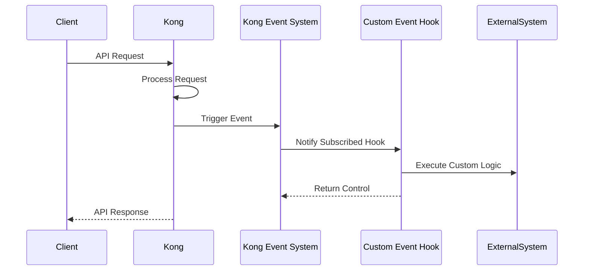

# Kong Event Hooks

## Introduction

Event hooks are a powerful feature in Kong that allow you to execute custom logic in response to specific events that occur within the Kong API Gateway. Think of them as listeners that wait for certain events to happen and then trigger predefined actions when those events occur.

In this guide, we'll explore how event hooks work in Kong, their benefits, and how to implement them in your API management workflows.

## What Are Event Hooks?

Event hooks in Kong provide a way to create event-driven architectures for your API gateway. They enable you to:

- Execute custom logic when specific events occur
- Integrate Kong with external systems
- Create automation workflows
- Implement advanced logging and monitoring

Kong's event hooks follow a publish-subscribe pattern where Kong publishes events, and your custom code subscribes to and handles these events.

## Types of Kong Events

Kong generates various types of events that you can hook into:

| Event Type | Description | Common Use Cases |
|------------|-------------|------------------|
| `crud` | Database operations events | Sync configuration changes with external systems |
| `rate-limiting` | Consumer rate limit violations | Alert systems or block suspicious IPs |
| `cache` | Cache invalidation events | Clear related caches or update dependencies |
| `plugin` | Plugin-specific events | Custom plugin integrations |
| `cluster` | Node operations in a Kong cluster | High-availability monitoring |

## Setting Up Your First Event Hook

Let's walk through creating a basic event hook that logs when a new API service is created in Kong.

### Step 1: Create a Custom Handler

First, you'll need to create a custom Lua script that will handle the event:

```lua
-- /usr/local/share/lua/5.1/kong/plugins/my-event-hook/handler.lua

local BasePlugin = require "kong.plugins.base_plugin"
local cjson = require "cjson"

local MyEventHookHandler = BasePlugin:extend()

function MyEventHookHandler:new()
  MyEventHookHandler.super.new(self, "my-event-hook")
end

function MyEventHookHandler:init_worker()
  MyEventHookHandler.super.init_worker(self)
  
  -- Subscribe to CRUD events for services
  kong.worker_events.register(function(data)
    kong.log.notice("New service created: " .. cjson.encode(data.entity))
    
    -- You could make an HTTP call to an external system here
    -- local http = require "resty.http"
    -- local httpc = http.new()
    -- httpc:request_uri("http://my-notification-service/api/notify", {
    --   method = "POST",
    --   body = cjson.encode({ event = "service.created", service = data.entity }),
    --   headers = { ["Content-Type"] = "application/json" }
    -- })
    
  end, "crud", "services.create")
end

return MyEventHookHandler
```

### Step 2: Create Plugin Schema

Create a schema for your plugin:

```lua
-- /usr/local/share/lua/5.1/kong/plugins/my-event-hook/schema.lua

return {
  name = "my-event-hook",
  fields = {
    { config = {
        type = "record",
        fields = {
          { notification_url = { type = "string", required = false } }
        }
    } }
  }
}
```

### Step 3: Register Your Plugin

Add your plugin to the Kong configuration file (`kong.conf`):

```
plugins = bundled,my-event-hook
```

### Step 4: Restart Kong

```bash
kong restart
```

### Step 5: Enable the Plugin Globally

You can enable the plugin for all services:

```bash
curl -X POST http://localhost:8001/plugins \
  --data "name=my-event-hook"
```

## Common Event Hook Patterns

### 1. Configuration Synchronization

This pattern synchronizes Kong's configuration with external systems:

```lua
kong.worker_events.register(function(data)
  local http = require "resty.http"
  local httpc = http.new()
  
  httpc:request_uri("http://configuration-service/sync", {
    method = "POST",
    body = cjson.encode({
      entity_type = "route",
      operation = "update",
      entity = data.entity
    }),
    headers = { ["Content-Type"] = "application/json" }
  })
end, "crud", "routes")
```

### 2. Security Monitoring

This example sends alerts when rate limiting is triggered:

```lua
kong.worker_events.register(function(data)
  local consumer = data.consumer
  local ip = data.ip
  
  kong.log.alert("Rate limit exceeded: Consumer=" .. consumer .. ", IP=" .. ip)
  
  -- Send alert to security team
  local http = require "resty.http"
  local httpc = http.new()
  
  httpc:request_uri("http://security-monitor/alert", {
    method = "POST",
    body = cjson.encode({
      event_type = "rate_limit_exceeded",
      consumer = consumer,
      ip = ip,
      timestamp = ngx.time()
    }),
    headers = { ["Content-Type"] = "application/json" }
  })
end, "rate-limiting", "exceeded")
```

## Event Hooks Workflow

Here's a visualization of the event hooks workflow:



## Advanced: Creating an Event-Driven Architecture

You can build sophisticated event-driven systems with Kong event hooks:

### 1. Set up a Webhook Publisher Plugin

```lua
-- webhook_publisher.lua
local WebhookPublisherHandler = {}

WebhookPublisherHandler.PRIORITY = 1000

function WebhookPublisherHandler:init_worker()
  -- Register event handlers for various events
  kong.worker_events.register(self.handle_service_event, "crud", "services")
  kong.worker_events.register(self.handle_route_event, "crud", "routes")
  kong.worker_events.register(self.handle_consumer_event, "crud", "consumers")
end

function WebhookPublisherHandler:handle_service_event(data)
  self:publish_event("service", data.operation, data.entity)
end

function WebhookPublisherHandler:handle_route_event(data)
  self:publish_event("route", data.operation, data.entity)
end

function WebhookPublisherHandler:handle_consumer_event(data)
  self:publish_event("consumer", data.operation, data.entity)
end

function WebhookPublisherHandler:publish_event(entity_type, operation, entity)
  local http = require "resty.http"
  local httpc = http.new()
  
  local conf = kong.db.plugins:select_by_name("webhook-publisher")
  
  if not conf or not conf.config.webhook_url then
    return
  end
  
  httpc:request_uri(conf.config.webhook_url, {
    method = "POST",
    body = cjson.encode({
      entity_type = entity_type,
      operation = operation,
      entity = entity,
      timestamp = ngx.time()
    }),
    headers = { 
      ["Content-Type"] = "application/json",
      ["X-Kong-Event"] = entity_type .. "." .. operation
    }
  })
end

return WebhookPublisherHandler
```

### 2. Implement a Configuration Management System

With these event hooks, you can build a configuration management system that:

1. Tracks all changes to Kong configuration
2. Maintains audit logs of who changed what and when
3. Implements approval workflows for configuration changes
4. Enables rollback of configuration changes

## Best Practices for Kong Event Hooks

1. **Keep handlers lightweight**: Event hooks run in the Kong worker processes, so keep your handlers as lightweight as possible to avoid affecting API performance.

2. **Use non-blocking I/O**: When making external HTTP calls, use the non-blocking HTTP client provided by Kong.

3. **Implement error handling**: Always add error handling to your event hooks to prevent failures from affecting Kong's operation.

4. **Consider using a dedicated event bus**: For high-volume events, consider using a message queue like Redis or Kafka as an intermediate layer.

5. **Monitor performance**: Keep an eye on the performance impact of your event hooks and optimize them if necessary.

## Troubleshooting Kong Event Hooks

### Common Issues and Solutions

| Issue | Potential Solution |
|-------|-------------------|
| Event hook not firing | Check event name and subscription pattern |
| Slow performance | Optimize handler code, consider using async processing |
| High memory usage | Reduce event payload size, optimize Lua code |
| HTTP request failures | Implement retry logic with exponential backoff |

### Debugging Tips

Add debug logging to your event hooks:

```lua
kong.log.debug("Event received: " .. cjson.encode(data))
```

Then enable debug logging in your Kong configuration:

```
log_level = debug
```

## Summary

Kong Event Hooks provide a powerful way to extend Kong's functionality and integrate it with external systems. They allow you to respond to various events that occur within Kong, enabling you to build advanced, event-driven architectures for your API gateway.

By following the patterns and best practices outlined in this guide, you can leverage Kong Event Hooks to create sophisticated, automated workflows that improve the management, security, and observability of your APIs.

## Further Resources

- [Kong Documentation on Worker Events](https://docs.konghq.com/gateway/latest/reference/pluginserver/javascript/worker-events/)
- [Kong Plugin Development Guide](https://docs.konghq.com/gateway/latest/plugin-development/)
- [Kong Admin API Reference](https://docs.konghq.com/gateway/latest/admin-api/)

## Exercises

1. Create an event hook that logs all consumer creation events to a file.
2. Implement a hook that sends an email notification when a service is updated.
3. Build an event hook that tracks rate limiting events and creates a real-time dashboard.
4. Extend the webhook publisher example to include authentication for secure webhook delivery.