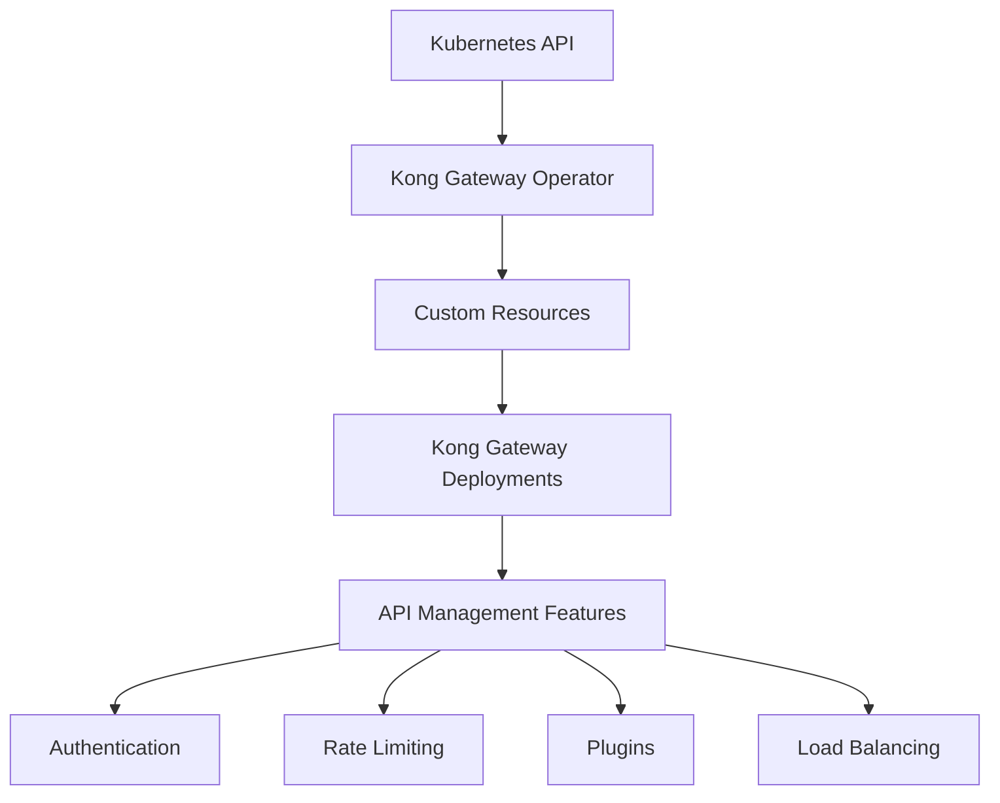

# Kong Gateway Operator

## Introduction

The Kong Gateway Operator is a powerful extension to Kong's API Gateway ecosystem that leverages Kubernetes' Operator pattern to automate the deployment, configuration, and lifecycle management of Kong Gateway instances. If you're stepping into the world of microservices and Kubernetes, understanding how the Kong Gateway Operator works will significantly streamline your API management processes.

In this guide, we'll explore what the Kong Gateway Operator is, why it's beneficial, and how to use it effectively in your Kubernetes environments.

## What is Kong Gateway Operator?

The Kong Gateway Operator is a Kubernetes Operator that extends the Kubernetes API with custom resources for managing Kong Gateway deployments. But before diving deeper, let's understand the two key concepts:

1. **Kong Gateway**: An API gateway that sits in front of your services, providing features like authentication, rate limiting, and request transformation.

2. **Kubernetes Operator**: A software extension to Kubernetes that uses custom resources to manage applications and their components.

The Kong Gateway Operator combines these concepts to provide a declarative way to deploy and manage Kong Gateway instances in Kubernetes environments.



## Why Use the Kong Gateway Operator?

The Kong Gateway Operator offers several benefits:

1. **Declarative Configuration**: Define your desired Kong Gateway state in YAML, and the operator ensures it stays that way.
2. **Automated Management**: Handles upgrades, scaling, and configuration changes with minimal manual intervention.
3. **GitOps Friendly**: Store your Kong configuration as code in a Git repository for version control.
4. **Native Kubernetes Integration**: Works seamlessly with other Kubernetes resources and tools.
5. **Simplified Operations**: Reduces the complexity of managing Kong deployments at scale.

## Getting Started with Kong Gateway Operator

### Prerequisites

Before installing the Kong Gateway Operator, ensure you have:

- A running Kubernetes cluster (version 1.19+)
- kubectl installed and configured
- Helm 3 (optional, for Helm installation method)

### Installation

Let's install the Kong Gateway Operator using kubectl:

```bash
# Create a namespace for the operator
kubectl create namespace kong-system

# Install the Kong Gateway Operator
kubectl apply -f https://raw.githubusercontent.com/Kong/kong-operator/main/deploy/single/all-in-one.yaml
```

You can verify the installation with:

```bash
kubectl get pods -n kong-system
```

Expected output:

```
NAME                                READY   STATUS    RESTARTS   AGE
kong-operator-controller-manager-xxxxx-yyyyy   2/2     Running   0          30s
```

### Creating Your First Kong Gateway Instance

Once the operator is installed, you can create a Kong Gateway instance by defining a custom resource:

```yaml
apiVersion: gateway.kong.io/v1beta1
kind: KongGateway
metadata:
  name: my-kong-gateway
  namespace: default
spec:
  version: "3.1"
  replicas: 1
  proxy:
    type: LoadBalancer
    ports:
      - name: http
        port: 80
        targetPort: 8000
      - name: https
        port: 443
        targetPort: 8443
```

Save this YAML to a file named `kong-gateway.yaml`, then apply it:

```bash
kubectl apply -f kong-gateway.yaml
```

The operator will now create all necessary resources for your Kong Gateway instance.

## Managing Kong Gateway with the Operator

### Scaling Your Gateway

To scale your Kong Gateway, update the `replicas` field in the KongGateway resource:

```yaml
apiVersion: gateway.kong.io/v1beta1
kind: KongGateway
metadata:
  name: my-kong-gateway
  namespace: default
spec:
  version: "3.1"
  replicas: 3  # Increased from 1 to 3
  # rest of configuration...
```

Apply the updated configuration:

```bash
kubectl apply -f kong-gateway.yaml
```

The operator will automatically scale your deployment to the specified number of replicas.

### Upgrading Kong Version

When a new version of Kong is released, you can upgrade by changing the `version` field:

```yaml
spec:
  version: "3.2"  # Updated from 3.1 to 3.2
```

Apply the change, and the operator will handle the upgrade process.

### Configuring Plugins

Kong's plugins can be configured through the KongClusterPlugin or KongPlugin resources. Here's an example of adding rate limiting to all routes:

```yaml
apiVersion: configuration.konghq.com/v1
kind: KongClusterPlugin
metadata:
  name: global-rate-limit
  annotations:
    kubernetes.io/ingress.class: kong
  labels:
    global: "true"
config:
  minute: 5
  policy: local
plugin: rate-limiting
```

Apply this configuration:

```bash
kubectl apply -f rate-limit-plugin.yaml
```

## Practical Example: Setting Up an API Gateway with Authentication

Let's walk through a complete example of setting up an API gateway with authentication using the Kong Gateway Operator.

### Step 1: Deploy a Sample API

First, deploy a sample API that we'll expose through Kong:

```yaml
# sample-api.yaml
apiVersion: apps/v1
kind: Deployment
metadata:
  name: sample-api
spec:
  replicas: 1
  selector:
    matchLabels:
      app: sample-api
  template:
    metadata:
      labels:
        app: sample-api
    spec:
      containers:
      - name: sample-api
        image: httpbin:latest
        ports:
        - containerPort: 80
---
apiVersion: v1
kind: Service
metadata:
  name: sample-api
spec:
  selector:
    app: sample-api
  ports:
  - port: 80
    targetPort: 80
```

Apply this configuration:

```bash
kubectl apply -f sample-api.yaml
```

### Step 2: Create an Ingress Resource for Kong

```yaml
# kong-ingress.yaml
apiVersion: networking.k8s.io/v1
kind: Ingress
metadata:
  name: sample-api-ingress
  annotations:
    konghq.com/strip-path: "true"
spec:
  ingressClassName: kong
  rules:
  - http:
      paths:
      - path: /api
        pathType: Prefix
        backend:
          service:
            name: sample-api
            port:
              number: 80
```

Apply the Ingress:

```bash
kubectl apply -f kong-ingress.yaml
```

### Step 3: Add Key Authentication

Create a key authentication plugin for the API:

```yaml
# key-auth.yaml
apiVersion: configuration.konghq.com/v1
kind: KongPlugin
metadata:
  name: key-auth
spec:
  plugin: key-auth
```

Apply the plugin:

```bash
kubectl apply -f key-auth.yaml
```

Update the Ingress to use the plugin:

```yaml
# updated-kong-ingress.yaml
apiVersion: networking.k8s.io/v1
kind: Ingress
metadata:
  name: sample-api-ingress
  annotations:
    konghq.com/strip-path: "true"
    konghq.com/plugins: key-auth
spec:
  # rest of configuration remains the same...
```

Apply the updated Ingress:

```bash
kubectl apply -f updated-kong-ingress.yaml
```

### Step 4: Create a Consumer and Key

```yaml
# consumer.yaml
apiVersion: configuration.konghq.com/v1
kind: KongConsumer
metadata:
  name: example-user
  annotations:
    kubernetes.io/ingress.class: kong
username: example-user
---
apiVersion: configuration.konghq.com/v1
kind: KongConsumerKeyAuth
metadata:
  name: example-user-key
consumerRef: example-user
key: my-secret-api-key
```

Apply the consumer configuration:

```bash
kubectl apply -f consumer.yaml
```

### Step 5: Test the Setup

Now you can test your API with the key:

```bash
# Getting the Kong Gateway IP
export KONG_IP=$(kubectl get service my-kong-gateway-proxy -o jsonpath='{.status.loadBalancer.ingress[0].ip}')

# Try without key (should fail)
curl -i http://$KONG_IP/api/get

# Try with key (should succeed)
curl -i http://$KONG_IP/api/get -H 'apikey: my-secret-api-key'
```

Expected output without key:

```
HTTP/1.1 401 Unauthorized
...
{
  "message": "No API key found in request"
}
```

Expected output with key:

```
HTTP/1.1 200 OK
...
{
  "args": {},
  "headers": {
    "Accept": "*/*",
    "Apikey": "my-secret-api-key",
    ...
  },
  ...
}
```

## Advanced Configurations

### High Availability Setup

For production environments, you'll want a highly available Kong Gateway setup:

```yaml
apiVersion: gateway.kong.io/v1beta1
kind: KongGateway
metadata:
  name: production-kong-gateway
spec:
  version: "3.1"
  replicas: 3
  deploymentOptions:
    podAnnotations:
      prometheus.io/scrape: "true"
      prometheus.io/port: "8100"
    resources:
      limits:
        cpu: "1"
        memory: "1Gi"
      requests:
        cpu: "500m"
        memory: "512Mi"
  proxy:
    type: LoadBalancer
    annotations:
      service.beta.kubernetes.io/aws-load-balancer-type: nlb
    ports:
      - name: http
        port: 80
        targetPort: 8000
      - name: https
        port: 443
        targetPort: 8443
  database:
    postgresql:
      host: postgres-kong.database
      database: kong
      user: kong
      passwordSecretRef:
        name: kong-postgres-password
        key: password
```

### Working with Enterprise Features

If you're using Kong Gateway Enterprise, you can configure enterprise-specific features:

```yaml
apiVersion: gateway.kong.io/v1beta1
kind: KongGateway
metadata:
  name: enterprise-kong-gateway
spec:
  version: "3.1.1.0"
  enterprise:
    enabled: true
    licenseSecretRef:
      name: kong-enterprise-license
      key: license
  admin:
    enabled: true
    type: LoadBalancer
    rbac:
      enabled: true
  manager:
    enabled: true
    type: LoadBalancer
  portal:
    enabled: true
    type: LoadBalancer
```

## Troubleshooting

### Common Issues and Solutions

#### Operator Pod Not Starting

If the operator pod doesn't start:

```bash
kubectl describe pod -n kong-system kong-operator-controller-manager-xxxxx-yyyyy
```

Look for errors in the events section.

#### Kong Gateway Pod Issues

For issues with Kong Gateway pods:

```bash
kubectl logs -l app=my-kong-gateway
```

#### Custom Resource Not Being Processed

If your custom resources aren't being processed:

```bash
kubectl get konggateway my-kong-gateway -o yaml
```

Check the status field for error messages.

## Summary

The Kong Gateway Operator brings the power of Kubernetes Operators to Kong API Gateway, enabling automated deployment and management of your API infrastructure. By using this operator, you can:

- Declaratively define your Kong Gateway infrastructure
- Automate scaling, upgrades, and configuration changes
- Integrate Kong Gateway seamlessly with your Kubernetes environment
- Simplify complex operational tasks

This combination of Kong's powerful API management capabilities with Kubernetes' orchestration features creates a robust foundation for your microservices architecture.

## Additional Resources

To continue learning about Kong Gateway Operator:

1. Official Kong Gateway Operator Documentation
2. Kong Kubernetes Ingress Controller
3. Kong Gateway Documentation
4. Kubernetes Operators concepts

## Exercises

1. Deploy a Kong Gateway using the operator and expose a simple REST API.
2. Configure multiple plugins on a single route (rate limiting, authentication, and request transformation).
3. Create a highly available Kong Gateway deployment with database backend.
4. Implement a blue-green deployment strategy for your APIs behind Kong.
5. Set up monitoring for your Kong Gateway using Prometheus and Grafana.