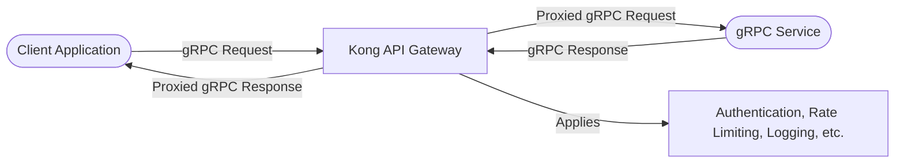
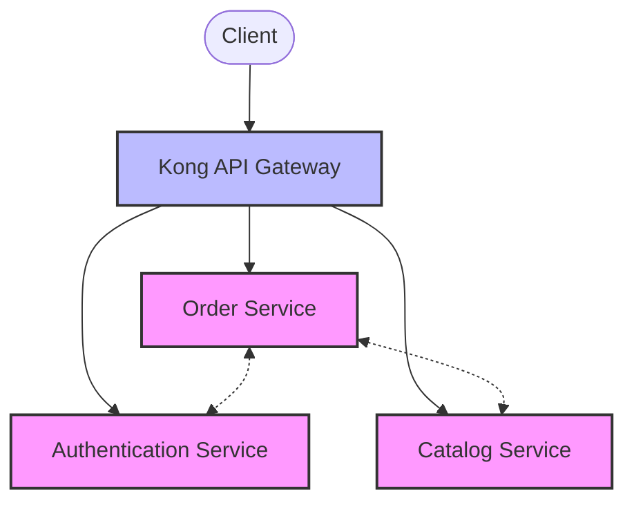

# Kong gRPC

## Introduction

gRPC is a high-performance, open-source Remote Procedure Call (RPC) framework developed by Google. It's designed for modern, distributed systems and enables client and server applications to communicate transparently across different languages and environments. Kong Gateway, a popular API gateway, provides robust support for gRPC services through its gRPC plugin ecosystem.

In this guide, we'll explore how Kong can be used to manage, secure, and optimize your gRPC services, making them more scalable, observable, and easier to integrate with the rest of your infrastructure.

## What is gRPC?

Before diving into Kong's gRPC capabilities, let's briefly understand what gRPC is:

gRPC is built on HTTP/2, enabling features like:
- Bidirectional streaming
- Flow control
- Header compression
- Multiplexing requests over a single connection

It uses Protocol Buffers (protobuf) as the Interface Definition Language (IDL) for describing both the service interface and the structure of the payload messages.



## Setting Up Kong for gRPC

### Prerequisites

Before we begin, ensure you have:
- Kong Gateway installed (2.0 or higher recommended for best gRPC support)
- A basic understanding of Kong concepts (Services, Routes, etc.)
- A gRPC service to proxy

### Step 1: Create a Kong Service for gRPC

First, we need to create a Kong Service that points to our gRPC server:

```bash
curl -X POST http://localhost:8001/services \
  --data name=grpc-service \
  --data protocol=grpc \
  --data host=my-grpc-server \
  --data port=50051
```

This command creates a Kong Service named `grpc-service` that points to a gRPC server at `my-grpc-server:50051`.

### Step 2: Create a Route for the gRPC Service

Next, we need to create a Route to expose our gRPC Service:

```bash
curl -X POST http://localhost:8001/services/grpc-service/routes \
  --data name=grpc-route \
  --data protocols=grpc \
  --data paths=/my-grpc-service
```

This creates a Route that will match gRPC requests sent to the path `/my-grpc-service`.

## Kong gRPC Plugins

Kong offers several plugins specifically designed for gRPC services:

### 1. gRPC Gateway

The gRPC Gateway plugin allows RESTful JSON API clients to access your gRPC services through Kong, acting as a translator between HTTP/1.1 and gRPC.

#### Installation

```bash
curl -X POST http://localhost:8001/services/grpc-service/plugins \
  --data name=grpc-gateway
```

#### Example

Let's say you have a simple gRPC service defined with this proto file:

```protobuf
syntax = "proto3";

package hello;

service Greeter {
  rpc SayHello (HelloRequest) returns (HelloResponse) {}
}

message HelloRequest {
  string name = 1;
}

message HelloResponse {
  string message = 1;
}
```

With the gRPC Gateway plugin enabled, clients can call this service using a standard HTTP request:

```bash
curl -X POST http://kong:8000/my-grpc-service/hello.Greeter/SayHello \
  -H "Content-Type: application/json" \
  -d '{"name": "Kong"}'
```

Response:
```json
{
  "message": "Hello Kong"
}
```

### 2. gRPC Web

The gRPC-Web plugin enables browser clients to access your gRPC services by translating between gRPC-Web and gRPC protocols.

#### Installation

```bash
curl -X POST http://localhost:8001/services/grpc-service/plugins \
  --data name=grpc-web
```

#### Example

With gRPC-Web enabled, you can use the gRPC-Web client library in your browser JavaScript:

```javascript
const {HelloRequest} = require('./hello_pb.js');
const {GreeterClient} = require('./hello_grpc_web_pb.js');

// Create the client
const client = new GreeterClient('http://kong:8000/my-grpc-service');

// Create request
const request = new HelloRequest();
request.setName('Kong');

// Make the call
client.sayHello(request, {}, (err, response) => {
  if (err) {
    console.error('Error:', err);
    return;
  }
  console.log('Greeting:', response.getMessage());
});
```

Output in console:
```
Greeting: Hello Kong
```

### 3. Authentication Plugins

Kong's authentication plugins work with gRPC services, adding security to your APIs:

#### Example: Setting up Key Authentication

```bash
curl -X POST http://localhost:8001/services/grpc-service/plugins \
  --data name=key-auth
```

To access the authenticated gRPC service:

```bash
grpcurl -H "apikey: your-api-key" \
  -proto hello.proto \
  -d '{"name": "Kong"}' \
  kong:8443 hello.Greeter/SayHello
```

Response:
```
{
  "message": "Hello Kong"
}
```

## Real-World Applications

### Case Study: Microservices Communication

In a microservices architecture, services often need to communicate with each other efficiently. gRPC is an excellent choice for this internal communication due to its performance and type safety.



Implementation:

1. Set up Kong to route external HTTP traffic to appropriate services
2. Configure internal services to communicate via gRPC
3. Use Kong plugins to handle cross-cutting concerns like authentication and monitoring

### Example Configuration for a Microservices Setup

For the Order Service:

```bash
# Create the gRPC service
curl -X POST http://localhost:8001/services \
  --data name=order-service \
  --data protocol=grpc \
  --data host=order-service \
  --data port=50051

# Create a route
curl -X POST http://localhost:8001/services/order-service/routes \
  --data name=order-route \
  --data protocols=grpc,grpcs \
  --data paths=/orders

# Add JWT authentication
curl -X POST http://localhost:8001/services/order-service/plugins \
  --data name=jwt
```

## Advanced Configurations

### Mutual TLS (mTLS) for gRPC

For additional security, you can configure mutual TLS authentication:

```bash
# Enable mTLS plugin
curl -X POST http://localhost:8001/services/grpc-service/plugins \
  --data name=mtls \
  --data config.ca_certificates=ca_cert_id \
  --data config.skip_consumer_lookup=true
```

### Canary Deployments with gRPC

You can implement canary deployments for gRPC services using Kong's traffic control plugins:

```bash
# Add canary deployment using the traffic-split plugin
curl -X POST http://localhost:8001/services/grpc-service/plugins \
  --data name=traffic-split \
  --data config.splits[1].service=grpc-service-v2 \
  --data config.splits[1].weight=20 \
  --data config.splits[2].service=grpc-service \
  --data config.splits[2].weight=80
```

This configuration sends 20% of the traffic to version 2 of the service and 80% to the original service.

## Troubleshooting Kong gRPC

### Common Issues and Solutions

1. **Connection Refused**
   - Ensure your gRPC server is running and reachable from Kong
   - Check that the protocol, host, and port are correctly configured

2. **Authentication Failures**
   - Verify that credentials are being correctly passed in the metadata
   - Check Kong logs for authentication plugin errors

3. **Debugging gRPC Calls**
   - Use the `grpcurl` tool to test gRPC services directly:
   
   ```bash
   grpcurl -plaintext -proto hello.proto \
     -d '{"name": "Test"}' \
     localhost:50051 hello.Greeter/SayHello
   ```

### Logging gRPC Traffic

Enable the HTTP Log plugin to capture gRPC traffic details:

```bash
curl -X POST http://localhost:8001/services/grpc-service/plugins \
  --data name=http-log \
  --data config.http_endpoint=http://logger:8080
```

## Performance Considerations

gRPC is designed for high performance, but there are aspects to consider when using it with Kong:

1. **Connection Pooling**: Configure appropriate connection pooling settings for gRPC upstream
2. **Timeouts**: Set appropriate timeouts for your gRPC calls
3. **Rate Limiting**: Consider applying rate limiting to protect your gRPC services

Example rate limiting configuration:

```bash
curl -X POST http://localhost:8001/services/grpc-service/plugins \
  --data name=rate-limiting \
  --data config.second=5 \
  --data config.hour=1000
```

## Summary

Kong's gRPC support provides powerful capabilities for managing gRPC services in your API infrastructure. With Kong, you can:

- Proxy gRPC traffic efficiently
- Translate between REST and gRPC with gRPC Gateway
- Enable browser access with gRPC-Web
- Apply authentication, rate limiting, and other Kong plugins to gRPC services
- Monitor and log gRPC traffic
- Implement advanced deployment patterns like canary releases

By leveraging Kong's gRPC features, you can integrate gRPC services into your existing API infrastructure while maintaining security, observability, and control.

## Additional Resources

- [Kong gRPC Documentation](https://docs.konghq.com/gateway/latest/reference/grpc/)
- [gRPC Official Website](https://grpc.io/)
- [Protocol Buffers Documentation](https://developers.google.com/protocol-buffers)

## Exercises

1. Set up a basic gRPC service and proxy it through Kong
2. Configure the gRPC Gateway plugin to translate between REST and gRPC
3. Apply authentication to your gRPC service using Kong plugins
4. Implement logging and monitoring for your gRPC services
5. Try implementing a canary deployment for a gRPC service using Kong's traffic control plugins