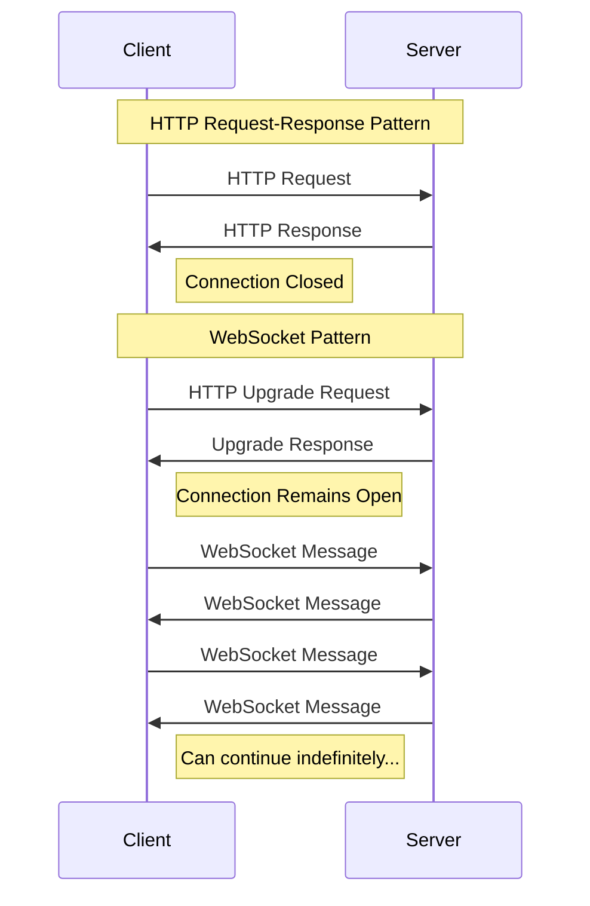
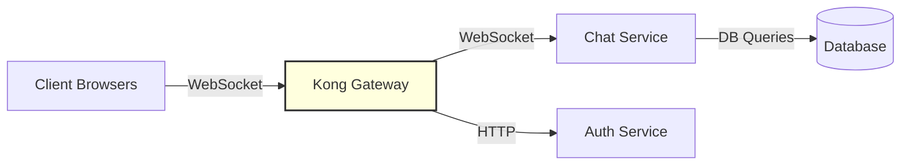

# Kong WebSockets

## Introduction

WebSockets provide a persistent connection between a client and server, allowing for real-time, bidirectional communication. Unlike traditional HTTP requests which follow a request-response pattern, WebSockets maintain an open connection, making them ideal for applications requiring instant updates like chat applications, live dashboards, or online games.

Kong Gateway, a popular API gateway, provides excellent support for WebSocket connections. This guide will walk you through how to configure Kong to handle WebSockets, common use cases, and best practices for implementation.

## Understanding WebSockets

Before diving into Kong's WebSocket capabilities, let's understand what WebSockets are and how they differ from traditional HTTP.

### HTTP vs WebSockets

Traditional HTTP follows a request-response pattern:
1. Client sends a request
2. Server processes the request
3. Server sends a response
4. Connection closes

WebSockets, on the other hand:
1. Start with an HTTP handshake that upgrades to a WebSocket connection
2. Maintain a persistent, full-duplex connection
3. Allow both client and server to send messages at any time
4. Remain open until explicitly closed by either party



## Kong WebSocket Support

Kong Gateway supports WebSockets out of the box. When a client initiates a WebSocket connection, Kong proxies the initial HTTP upgrade request to the upstream service. After the upgrade is complete, Kong maintains the connection open and forwards messages between the client and the upstream service.

### Key Benefits of Using Kong with WebSockets

- **Load Balancing**: Distribute WebSocket connections across multiple backend servers
- **Authentication**: Secure WebSocket endpoints using Kong's authentication plugins
- **Rate Limiting**: Protect WebSocket services from excessive connections
- **Logging & Monitoring**: Track WebSocket usage and performance
- **Transformations**: Modify WebSocket messages as they pass through Kong

## Configuring Kong for WebSockets

Let's look at how to set up Kong to proxy WebSocket connections.

### Basic WebSocket Configuration

To configure a Kong service to handle WebSockets, you'll need to define a service and route as you would for regular HTTP endpoints:

```bash
# Create a service pointing to your WebSocket backend
curl -X POST http://localhost:8001/services \
  --data name=websocket-service \
  --data url='ws://websocket-backend:8000'

# Create a route for the WebSocket service
curl -X POST http://localhost:8001/services/websocket-service/routes \
  --data name=websocket-route \
  --data protocols=http,https \
  --data paths=/ws
```

Note the use of the `ws://` protocol in the service URL. Kong will automatically handle the protocol upgrade.

### Using the Declarative Configuration (DB-less mode)

If you're using Kong in DB-less mode with declarative configuration, your `kong.yml` might look like this:

```yaml
_format_version: "2.1"
services:
  - name: websocket-service
    url: ws://websocket-backend:8000
    routes:
    - name: websocket-route
      protocols:
      - http
      - https
      paths:
      - /ws
```

## WebSocket Security with Kong

Like any API endpoint, WebSocket connections should be secured. Kong provides several plugins to enhance WebSocket security.

### Authentication for WebSockets

You can use Kong's authentication plugins with WebSockets. For example, to add JWT authentication:

```bash
curl -X POST http://localhost:8001/services/websocket-service/plugins \
  --data name=jwt
```

Clients would then need to include the JWT token in the WebSocket connection request, typically in the query parameters or headers:

```javascript
// Client-side example with JWT authentication
const token = "your-jwt-token";
const socket = new WebSocket(`wss://api.example.com/ws?token=${token}`);
```

### Rate Limiting WebSocket Connections

Protect your WebSocket services from excessive connections with rate limiting:

```bash
curl -X POST http://localhost:8001/services/websocket-service/plugins \
  --data name=rate-limiting \
  --data config.minute=10 \
  --data config.policy=local
```

This configuration limits each client to 10 WebSocket connection attempts per minute.

## Practical Example: Chat Application

Let's examine a practical example of using Kong to proxy WebSocket connections for a chat application.

### Architecture Overview



### Kong Configuration

```yaml
_format_version: "2.1"
services:
  - name: chat-websocket-service
    url: ws://chat-backend:8000/socket
    routes:
    - name: chat-websocket-route
      protocols:
      - http
      - https
      paths:
      - /chat/ws
    plugins:
    - name: jwt
    - name: rate-limiting
      config:
        minute: 60
        policy: local
  
  - name: chat-http-service
    url: http://chat-backend:8000
    routes:
    - name: chat-http-route
      protocols:
      - http
      - https
      paths:
      - /chat/api
```

### Client-Side Implementation

Here's how to connect to our WebSocket service through Kong from a JavaScript client:

```javascript
// Get JWT token first (typically from an authentication endpoint)
async function connectToChat() {
  // Assume we have a JWT token from previous authentication
  const token = localStorage.getItem('jwt_token');
  
  if (!token) {
    console.error('Not authenticated');
    return;
  }
  
  // Connect to WebSocket through Kong
  const socket = new WebSocket(`wss://api.example.com/chat/ws?token=${token}`);
  
  socket.onopen = () => {
    console.log('Connected to chat service');
    
    // Send a message once connected
    socket.send(JSON.stringify({
      type: 'message',
      room: 'general',
      content: 'Hello, everyone!'
    }));
  };
  
  socket.onmessage = (event) => {
    const message = JSON.parse(event.data);
    console.log('Received message:', message);
    // Update UI with the new message
  };
  
  socket.onerror = (error) => {
    console.error('WebSocket error:', error);
  };
  
  socket.onclose = (event) => {
    console.log('Connection closed:', event.code, event.reason);
  };
  
  return socket;
}
```

### Server-Side Implementation (Node.js Example)

Here's a simple Node.js WebSocket server that could be your backend:

```javascript
const WebSocket = require('ws');
const server = new WebSocket.Server({ port: 8000 });

// Store connected clients
const clients = new Map();

server.on('connection', (socket) => {
  const clientId = generateUniqueId();
  clients.set(clientId, socket);
  
  console.log(`Client connected: ${clientId}`);
  
  // Send welcome message
  socket.send(JSON.stringify({
    type: 'system',
    content: 'Welcome to the chat!'
  }));
  
  socket.on('message', (messageData) => {
    try {
      const message = JSON.parse(messageData);
      
      // Add sender information
      message.sender = clientId;
      message.timestamp = new Date().toISOString();
      
      // Broadcast to all clients
      broadcastMessage(message);
      
      // Save message to database (implementation not shown)
      saveMessageToDatabase(message);
    } catch (error) {
      console.error('Error processing message:', error);
    }
  });
  
  socket.on('close', () => {
    console.log(`Client disconnected: ${clientId}`);
    clients.delete(clientId);
  });
});

function broadcastMessage(message) {
  const messageStr = JSON.stringify(message);
  clients.forEach((socket) => {
    if (socket.readyState === WebSocket.OPEN) {
      socket.send(messageStr);
    }
  });
}

function generateUniqueId() {
  return Math.random().toString(36).substring(2, 15);
}

function saveMessageToDatabase(message) {
  // Implementation would depend on your database choice
  console.log('Saving message to database:', message);
}

console.log('WebSocket server started on port 8000');
```

## Best Practices for Kong WebSockets

When working with WebSockets through Kong, consider these best practices:

### Connection Management

1. **Implement heartbeats**: To detect failed connections, implement a ping/pong mechanism
2. **Graceful reconnection**: Clients should implement exponential backoff for reconnection attempts
3. **Connection limits**: Set appropriate connection limits to prevent resource exhaustion

### Performance Considerations

1. **Connection pooling**: For backends that support it, enable connection pooling
2. **Message size**: Keep message sizes small to improve throughput
3. **Scaling**: Deploy multiple WebSocket backend instances and use Kong's load balancing

### Security Guidelines

1. **Always use WSS (WebSocket Secure)**: Encrypt all WebSocket traffic
2. **Authentication**: Validate connection requests before upgrading to WebSocket
3. **Origin validation**: Use the Kong CORS plugin to restrict allowed origins
4. **Message validation**: Validate all incoming WebSocket messages

## Troubleshooting Kong WebSockets

Here are some common issues and their solutions:

### Connection Upgrade Failures

If WebSocket connections fail to establish:

1. Check that your Kong service is using the `ws://` or `wss://` protocol
2. Verify that your backend service properly handles the WebSocket upgrade
3. Examine Kong logs for any upgrade-related errors
4. Ensure no intermediate proxies are blocking WebSocket upgrades

### Error Codes

Common WebSocket close codes and their meanings:

- 1000: Normal closure
- 1001: Going away (server shutdown or browser navigation)
- 1002: Protocol error
- 1008: Policy violation (often authentication failure)
- 1011: Server error

### Kong Plugin Compatibility

Not all Kong plugins work seamlessly with WebSockets. In particular:

- Response transformation plugins may not work with WebSocket messages
- Some logging plugins may only log the initial connection, not individual messages
- Rate limiting typically applies to connection attempts, not messages

## Summary

Kong provides robust support for WebSocket connections, making it an excellent choice for managing real-time applications. By leveraging Kong's plugin ecosystem, you can add authentication, rate limiting, and other security features to your WebSocket services.

WebSockets open up possibilities for creating responsive, real-time applications. When combined with Kong's management capabilities, you can ensure these applications are secure, monitored, and performant.

## Additional Resources

- Kong's official [Proxy Reference](https://docs.konghq.com/gateway/latest/reference/proxy/) covers WebSocket proxying
- [WebSocket API](https://developer.mozilla.org/en-US/docs/Web/API/WebSockets_API) on MDN
- Libraries for WebSocket server implementation:
  - Node.js: [ws](https://github.com/websockets/ws)
  - Python: [websockets](https://websockets.readthedocs.io/)
  - Java: [Spring WebSocket](https://docs.spring.io/spring-framework/docs/current/reference/html/web.html#websocket)

## Exercises

1. Set up a basic Kong service and route for a WebSocket endpoint.
2. Add JWT authentication to your WebSocket service.
3. Implement a simple chat application that uses Kong to proxy WebSocket connections.
4. Extend your chat application to include presence detection (who is online).
5. Implement rate limiting to protect your WebSocket service from abuse.