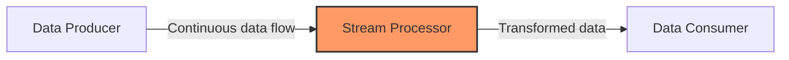

# Kong Streaming

## Introduction

Kong Streaming is a powerful feature in Kong API Gateway that enables the processing of data in real-time streams rather than in traditional request-response cycles. This approach is particularly valuable for applications requiring high throughput, real-time updates, or handling of long-lived connections.

In today's digital landscape, many modern applications rely on streaming data—from chat applications and collaborative tools to IoT sensors and financial market feeds. Kong Streaming provides the infrastructure to efficiently manage these data flows while maintaining Kong's robust security, monitoring, and routing capabilities.

## Understanding Kong Streaming

### What is Data Streaming?

Before diving into Kong's implementation, let's understand what data streaming entails:



In traditional REST APIs, clients make discrete requests and wait for complete responses. Streaming, however, establishes a persistent connection where data flows continuously between servers and clients.

### Kong Streaming Core Concepts

Kong Streaming builds on several fundamental concepts:

1. **WebSockets**: A protocol providing full-duplex communication channels over a single TCP connection
2. **Server-Sent Events (SSE)**: A standard allowing servers to push updates to clients
3. **gRPC Streams**: Bidirectional streaming capabilities within the gRPC protocol
4. **Kafka Integration**: Connectivity with Apache Kafka for high-throughput messaging

## Getting Started with Kong Streaming

### Prerequisites

To follow along with this tutorial, you'll need:

- Kong Gateway installed (version 2.7 or later)
- Basic familiarity with Kong configuration
- A development environment for testing

### Basic Configuration

Let's start by configuring Kong to handle WebSocket connections, one of the most common streaming protocols:

```bash
# Create a service pointing to your WebSocket backend
$ curl -i -X POST http://localhost:8001/services \
  --data name=websocket-service \
  --data url=ws://echo.websocket.org

# Create a route for the WebSocket service
$ curl -i -X POST http://localhost:8001/services/websocket-service/routes \
  --data name=websocket-route \
  --data protocols=http,https \
  --data paths=/ws
```

With this configuration, Kong will properly route WebSocket connections to your backend service while allowing you to apply plugins for security, monitoring, and transformation.

## WebSocket Streaming with Kong

WebSockets enable bidirectional communication, making them ideal for chat applications, live dashboards, and interactive games.

### Example: Building a Chat Application

Let's build a simple chat application frontend that connects through Kong:

```javascript
// Client-side WebSocket connection through Kong
const socket = new WebSocket('ws://kong-gateway-address/ws');

// Handle connection opening
socket.addEventListener('open', (event) => {
  console.log('Connected to the chat server');
  socket.send(JSON.stringify({ type: 'join', username: 'user123' }));
});

// Handle incoming messages
socket.addEventListener('message', (event) => {
  const message = JSON.parse(event.data);
  console.log(`Received: ${message.text} from ${message.username}`);
  
  // Add message to the chat UI
  addMessageToChat(message);
});

// Function to send a new message
function sendMessage(text) {
  if (socket.readyState === WebSocket.OPEN) {
    socket.send(JSON.stringify({
      type: 'message',
      text: text,
      username: 'user123'
    }));
  }
}
```

### Monitoring WebSocket Connections

Kong provides tools to monitor your WebSocket connections:

```bash
# Get metrics about WebSocket connections
$ curl -i http://localhost:8001/status

# Sample output (abbreviated)
{
  "connections": {
    "active": 42,
    "reading": 10,
    "writing": 30,
    "waiting": 2
  },
  "server": {
    "connections_accepted": 1024,
    "connections_handled": 1024
  }
}
```

## Server-Sent Events (SSE) with Kong

Server-Sent Events allow servers to push updates to clients over HTTP connections. They're perfect for scenarios like:

- Real-time notifications
- Live sports scores
- Stock ticker updates
- Social media feeds

### Configuring Kong for SSE

First, set up Kong to proxy to your SSE backend:

```bash
# Create a service for the SSE backend
$ curl -i -X POST http://localhost:8001/services \
  --data name=sse-service \
  --data url=http://your-sse-backend.com

# Create a route
$ curl -i -X POST http://localhost:8001/services/sse-service/routes \
  --data name=events-route \
  --data paths=/events
```

### Example: Real-time Market Data Feed

Here's how to implement a simple stock ticker using SSE:

```javascript
// Client-side SSE connection through Kong
const eventSource = new EventSource('http://kong-gateway-address/events');

// Handle connection opening
eventSource.onopen = (event) => {
  console.log('Connected to market data feed');
};

// Handle incoming stock updates
eventSource.addEventListener('stock-update', (event) => {
  const stockData = JSON.parse(event.data);
  
  console.log(`${stockData.symbol}: $${stockData.price} (${stockData.change}%)`);
  updateStockDisplay(stockData);
});

// Handle errors
eventSource.onerror = (event) => {
  console.error('EventSource failed:', event);
  eventSource.close();
};
```

On the server side, your application would send events in this format:

```
event: stock-update
data: {"symbol":"AAPL","price":182.63,"change":1.24}

event: stock-update
data: {"symbol":"GOOGL","price":142.38,"change":-0.87}
```

## Advanced Streaming with gRPC

gRPC, a high-performance RPC framework, offers powerful bidirectional streaming capabilities that Kong can proxy and manage.

### Setting Up Kong for gRPC Streaming

Configure Kong to handle gRPC traffic:

```bash
# Create a service for gRPC
$ curl -i -X POST http://localhost:8001/services \
  --data name=grpc-stream-service \
  --data url=grpc://grpc-backend.com:50051

# Create a route
$ curl -i -X POST http://localhost:8001/services/grpc-stream-service/routes \
  --data name=grpc-stream-route \
  --data protocols=grpc,grpcs \
  --data paths=/sensor.DataService
```

### Example: IoT Sensor Data Processing

Here's a simple gRPC service definition for IoT sensor streaming:

```protobuf
syntax = "proto3";

package sensor;

service DataService {
  // Bidirectional streaming RPC
  rpc StreamSensorData (stream SensorRequest) returns (stream SensorResponse) {}
}

message SensorRequest {
  string sensor_id = 1;
  double temperature = 2;
  double humidity = 3;
  string location = 4;
  int64 timestamp = 5;
}

message SensorResponse {
  string sensor_id = 1;
  string status = 2;
  string alert_message = 3;
  int64 timestamp = 4;
}
```

Client implementation (using gRPC-Web through Kong):

```javascript
const { DataServiceClient } = require('./sensor_grpc_web_pb');
const { SensorRequest } = require('./sensor_pb');

// Create client connecting through Kong
const client = new DataServiceClient('https://kong-gateway-address');

// Create bidirectional stream
const stream = client.streamSensorData();

// Handle incoming responses
stream.on('data', function(response) {
  console.log('Got response:', response.getStatus());
  
  if (response.getAlertMessage()) {
    displayAlert(response.getSensorId(), response.getAlertMessage());
  }
});

// Handle end of stream
stream.on('end', function() {
  console.log('Stream ended');
});

// Function to send sensor data
function sendSensorReading(sensorId, temperature, humidity, location) {
  const request = new SensorRequest();
  request.setSensorId(sensorId);
  request.setTemperature(temperature);
  request.setHumidity(humidity);
  request.setLocation(location);
  request.setTimestamp(Date.now());
  
  stream.write(request);
}
```

## Kafka Integration with Kong

For high-volume streaming applications, Kong can integrate with Apache Kafka, enabling:

- Massive scalability for streaming applications
- Reliable message persistence
- Stream processing capabilities

### Configuring Kong with Kafka

First, install the Kong Kafka plugin:

```bash
# Install Kong Kafka plugin
$ luarocks install kong-plugin-kafka-upstream

# Enable the plugin in your Kong configuration
$ echo "plugins = bundled,kafka-upstream" >> /etc/kong/kong.conf
$ kong restart
```

Configure a service to use Kafka:

```bash
# Create a Kafka-backed service
$ curl -i -X POST http://localhost:8001/services \
  --data name=analytics-service
  
# Add the Kafka plugin to the service
$ curl -i -X POST http://localhost:8001/services/analytics-service/plugins \
  --data name=kafka-upstream \
  --data config.bootstrap_servers=kafka:9092 \
  --data config.topic=user-events \
  --data config.timeout=10000 \
  --data config.keepalive=60000
  
# Create a route
$ curl -i -X POST http://localhost:8001/services/analytics-service/routes \
  --data name=analytics-route \
  --data paths=/analytics
```

### Example: Real-time Analytics Pipeline

When clients send requests to the `/analytics` endpoint, Kong will forward the data to Kafka:

```javascript
// Client code sending analytics events
async function trackUserEvent(eventType, userId, eventData) {
  try {
    const response = await fetch('https://kong-gateway-address/analytics', {
      method: 'POST',
      headers: {
        'Content-Type': 'application/json',
      },
      body: JSON.stringify({
        event_type: eventType,
        user_id: userId,
        timestamp: Date.now(),
        data: eventData
      })
    });
    
    if (response.ok) {
      console.log('Event tracked successfully');
    }
  } catch (error) {
    console.error('Failed to track event:', error);
  }
}

// Track a page view
trackUserEvent('page_view', 'user-123', {
  page: '/products',
  referrer: 'google.com',
  session_duration: 120
});
```

On the backend, a Kafka consumer would process these events:

```javascript
const { Kafka } = require('kafkajs');

const kafka = new Kafka({
  clientId: 'analytics-processor',
  brokers: ['kafka:9092']
});

const consumer = kafka.consumer({ groupId: 'analytics-group' });

async function runConsumer() {
  await consumer.connect();
  await consumer.subscribe({ topic: 'user-events', fromBeginning: false });
  
  await consumer.run({
    eachMessage: async ({ topic, partition, message }) => {
      const eventData = JSON.parse(message.value.toString());
      
      console.log(`Processing ${eventData.event_type} for user ${eventData.user_id}`);
      
      // Store in database, update dashboards, trigger alerts, etc.
      await processAnalyticsEvent(eventData);
    },
  });
}

runConsumer().catch(console.error);
```

## Performance Considerations

When implementing streaming in Kong, consider these performance factors:

1. **Connection Limits**: Configure appropriate connection limits to prevent resource exhaustion:

```bash
# Update Kong configuration
$ echo "nginx_http_max_connections = 16384" >> /etc/kong/kong.conf
$ kong reload
```

2. **Timeouts**: Adjust timeouts for long-lived connections:

```bash
# Update upstream timeouts for a service
$ curl -i -X PATCH http://localhost:8001/services/websocket-service \
  --data read_timeout=3600000 \
  --data write_timeout=3600000
```

3. **Load Balancing**: Configure load balancing for streaming services:

```bash
# Create an upstream with WebSocket-friendly settings
$ curl -i -X POST http://localhost:8001/upstreams \
  --data name=streaming-upstream \
  --data hash_on=ip \
  --data hash_fallback=none \
  --data healthchecks.active.timeout=5 \
  --data healthchecks.active.concurrency=10 \
  --data healthchecks.active.http_path=/health

# Add targets to the upstream
$ curl -i -X POST http://localhost:8001/upstreams/streaming-upstream/targets \
  --data target=streaming-backend-1:8000 \
  --data weight=100

$ curl -i -X POST http://localhost:8001/upstreams/streaming-upstream/targets \
  --data target=streaming-backend-2:8000 \
  --data weight=100
```

## Security Considerations

Securing streaming connections is crucial. Here are some essential security measures:

1. **Authentication**: Apply JWT or OAuth2 plugins to authenticate streaming connections:

```bash
# Add JWT authentication to a streaming route
$ curl -i -X POST http://localhost:8001/routes/websocket-route/plugins \
  --data name=jwt \
  --data config.claims_to_verify=exp
```

2. **Rate Limiting**: Prevent abuse with rate limiting:

```bash
# Add rate limiting to a streaming route
$ curl -i -X POST http://localhost:8001/routes/events-route/plugins \
  --data name=rate-limiting \
  --data config.second=5 \
  --data config.hour=10000
```

3. **IP Restriction**: Limit access to trusted IP addresses:

```bash
# Restrict streaming to specific IPs
$ curl -i -X POST http://localhost:8001/routes/grpc-stream-route/plugins \
  --data name=ip-restriction \
  --data config.allow=["192.168.1.0/24", "10.0.0.0/8"]
```

## Monitoring Kong Streaming

Monitoring is essential for maintaining reliable streaming services:

1. **Prometheus Integration**:

```bash
# Add Prometheus plugin to collect metrics
$ curl -i -X POST http://localhost:8001/plugins \
  --data name=prometheus
```

2. **Log Streaming Events**:

```bash
# Add HTTP log plugin to track streaming events
$ curl -i -X POST http://localhost:8001/routes/websocket-route/plugins \
  --data name=http-log \
  --data config.http_endpoint=http://logging-service:8080/logs \
  --data config.custom_fields_by_lua.connection_type='"websocket"' \
  --data config.custom_fields_by_lua.upgrade='kong.request.get_header("Upgrade")' \
  --data config.custom_fields_by_lua.duration='os.time() - ngx.req.start_time()'
```

## Troubleshooting Common Issues

Here are solutions to common problems you might encounter:

1. **Connection Resets**

```bash
# Increase proxy buffer size for larger frames
$ echo "nginx_proxy_proxy_buffer_size = 128k" >> /etc/kong/kong.conf
$ echo "nginx_proxy_proxy_buffers = 4 256k" >> /etc/kong/kong.conf
$ kong reload
```

2. **WebSocket Handshake Failures**

```bash
# Check logs for details
$ tail -f /usr/local/kong/logs/error.log | grep websocket

# Ensure correct headers are being passed
$ curl -i -X GET http://localhost:8001/routes/websocket-route \
  --data config.strip_path=true \
  --data config.preserve_host=false
```

3. **Timeouts During Streaming**

```bash
# Adjust idle timeout for streaming connections
$ echo "nginx_proxy_proxy_read_timeout = 3600s" >> /etc/kong/kong.conf
$ kong reload
```

## Summary

Kong Streaming provides powerful capabilities for building real-time, high-throughput applications. In this guide, we covered:

- The fundamentals of data streaming and Kong's approach
- Implementation of WebSockets, SSE, gRPC streams, and Kafka integration
- Performance optimization techniques
- Security best practices for streaming connections
- Monitoring and troubleshooting strategies

By leveraging Kong's streaming features, you can build scalable, secure, and efficient real-time applications while maintaining the benefits of Kong's API gateway ecosystem.

## Additional Resources

- Practice building a real-time dashboard using Kong and WebSockets
- Experiment with creating a chat application that scales to thousands of users
- Try implementing a sensor data processing pipeline using gRPC streaming

## Exercises

1. Configure Kong to proxy WebSocket connections to a simple echo server.
2. Implement rate limiting on a streaming endpoint to prevent abuse.
3. Create a simple chat application that connects through Kong.
4. Set up monitoring for your streaming services using the Prometheus plugin.
5. Design a high-throughput event processing system using Kong and Kafka.